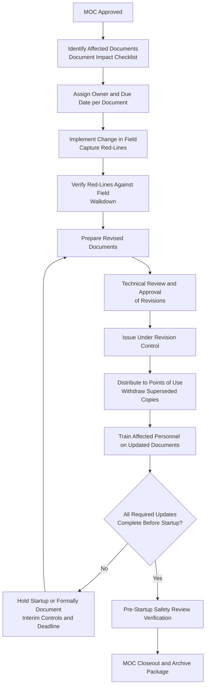
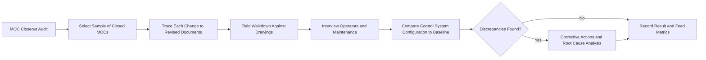

## Updating Documentation After a Change

### Purpose and Regulatory Context

Management of Change (MOC) does not end when a modification is physically complete. A change is only fully managed when the **documented picture of the facility matches the physical and operational reality**. Every process safety activity downstream of the change (hazard analysis, mechanical integrity, operator training, emergency response, future modifications) depends on documentation being accurate. If documentation is not updated, the facility operates on false information: operators follow superseded procedures, maintenance planners isolate equipment using outdated P&IDs, and future hazard analyses evaluate a process that no longer exists.

The principal references are:

- **OSHA 29 CFR 1910.119(l)(4)**: requires that employees operating the process, and maintenance and contract employees whose job tasks will be affected by a change, be informed of and trained in the change prior to start-up. **1910.119(l)(5)** requires that if a change results in a change in the process safety information required by paragraph (d), such information be updated accordingly. **1910.119(l)(6)** requires that operating procedures or practices required by paragraph (f) be updated as necessary.
- **EPA 40 CFR 68.75(d)–(f)**: parallel Risk Management Program requirements for informing and training employees, updating process safety information, and updating operating procedures.
- **OSHA 29 CFR 1910.119(i)**: pre-startup safety review, which confirms that documentation updates (PSI, procedures) are complete for modified facilities before highly hazardous chemicals are introduced.
- **CCPS Risk Based Process Safety (RBPS)**: *Process Knowledge Management*, *Management of Change*, and *Operational Readiness* elements address document control and change closeout.
- **ISO 45001 and ISO 9001-type document control principles**: general requirements for controlled documents, revision control, and availability at points of use.

**Key Points**

- Documentation update is a **regulatory obligation**, not administrative housekeeping.
- Updates must be complete **before startup** of the changed process, not afterward, for those documents that operators and maintenance personnel rely on to operate safely.
- Specific timing allowances (for example, for lower-priority drawings), retention periods, and document classes vary by jurisdiction and company standard and should be confirmed against the governing MOC procedure.

### Fundamental Definitions

| Term | Definition |
| --- | --- |
| **Process Safety Information (PSI)** | Written information on chemical hazards, process technology, and process equipment, compiled before conducting a PHA |
| **Controlled Document** | A document whose issue, revision, distribution, and withdrawal are managed under a formal document control procedure |
| **As-Built Documentation** | Drawings and records that reflect the facility as actually constructed or modified, including field deviations from design |
| **Red-Line (Mark-Up)** | A marked copy of a drawing or document showing changes, used as the interim record and the source for formal revision |
| **Revision Control** | System of identifying document versions, tracking revision history, and ensuring only the current version is in use |
| **Point of Use** | The location where a document is actually consulted (control room, maintenance shop, field, lab) |
| **Superseded Document** | A previously valid document replaced by a newer revision, to be withdrawn from use |
| **Document Closeout** | Confirmation that all required documents affected by a change have been updated, verified, distributed, and old versions withdrawn |
| **Management of Change Package** | The complete record of a change: request, technical basis, hazard evaluation, approvals, updated documents, training records, and closeout verification |
| **Configuration Management** | Discipline of keeping design documents, physical facility, and operating practice consistent with one another |

### Why Documentation Updates Fail

Documentation lag is one of the most frequently cited findings in MOC audits and incident investigations.

**Common root causes**

- Updates are treated as low priority once the physical work is complete and the project team disbands
- No named owner for each affected document
- Drawings are updated only for the "main" change, missing knock-on effects on other documents
- Red-lines remain in field files and never reach formal revision
- Document update is scheduled after startup and then deferred indefinitely
- Fragmented document systems (drawings, procedures, alarm databases, and training records each in separate systems with no cross-reference)
- Contractor-generated as-builts are not reviewed against the field
- Multiple concurrent changes to the same drawing without coordination of revisions

**Key Points**

- Every undocumented change makes the next change evaluation less reliable because the baseline it is measured against is wrong.
- Outdated P&IDs are a recurrent contributing factor in isolation and line-breaking incidents, because personnel identify isolation points from drawings that do not match the field.

### The Documentation Update Workflow

### Document Impact Identification

Identifying **which documents are affected** is the step most often done incompletely. A structured **document impact checklist** attached to the MOC form prompts the originator and reviewers to consider each document class.

#### Process Safety Information (PSI)

**Chemical hazard information**

- Safety data sheets (SDS) for new or changed materials
- Toxicity, permissible exposure limits, physical data, reactivity and corrosivity data
- Thermal and chemical stability data
- Hazardous effects of inadvertent mixing of materials

**Process technology information**

- Block flow diagrams or simplified process flow diagrams
- Process chemistry
- Maximum intended inventory
- Safe upper and lower limits for temperatures, pressures, flows, and compositions
- Consequences of deviations, including those affecting safety and health

**Process equipment information**

- Materials of construction
- Piping and instrument diagrams (P&IDs)
- Electrical classification drawings
- Relief system design and design basis
- Ventilation system design
- Design codes and standards employed
- Material and energy balances (for processes built after May 26, 1992, under OSHA PSM)
- Safety systems (interlocks, detection, suppression)
- Documentation that equipment complies with recognized and generally accepted good engineering practices (RAGAGEP)

#### Engineering and Design Documents

- Equipment datasheets and specifications
- Piping specifications, line lists, and isometrics
- Instrument index, loop diagrams, and hookup drawings
- Cause-and-effect matrices and safety requirement specifications for safety instrumented functions
- Control system logic, functional descriptions, and configuration files (DCS, PLC, SIS)
- Plot plans, layout drawings, and area classification drawings
- Structural and civil drawings (for supports, foundations, and dikes)
- Electrical single-line diagrams, load lists, and protection settings
- Relief and flare system load summaries

#### Operating and Maintenance Documents

- Operating procedures (startup, normal operation, shutdown, emergency operations, temporary operations)
- Operating limits and consequences-of-deviation tables
- Safe work practices and permit templates (where affected)
- Maintenance procedures and equipment-specific work instructions
- Inspection, test, and preventive maintenance plans (mechanical integrity program)
- Spare parts lists and material specifications
- Sampling and laboratory methods

#### Safety and Emergency Documents

- Process hazard analysis records and the revalidation schedule input
- Alarm and trip setpoint registers, alarm rationalization records, and bypass procedures
- Emergency response plans, evacuation routes, and muster point maps
- Fire protection and gas detection layouts and cause-and-effect documents
- Facility siting and occupied building risk assessments
- Environmental permits and regulatory notifications where affected

#### Training and Organizational Records

- Training materials and competency assessments
- Job descriptions, staffing plans, and role responsibilities (for organizational changes)
- Contractor information packages and orientation materials

### Document Impact Matrix by Change Type

| Type of Change | Commonly Affected Documents |
| --- | --- |
| New or changed chemical | SDS, PSI chemical data, compatibility matrix, storage and handling procedures, emergency response information, PHA input, labeling |
| Throughput or condition change | Process flow diagrams, material and energy balance, safe operating limits, relief basis, equipment datasheets, operating procedures, alarm setpoints |
| Equipment modification | P&IDs, datasheets, piping specs, isometrics, inspection plans, spare parts lists, electrical drawings, mechanical integrity records |
| Instrumentation and control change | Instrument index, loop drawings, cause-and-effect matrix, control logic documentation, alarm database, SIF proof-test procedures, SRS |
| Procedure change | Controlled procedures, training materials, checklists, permit forms, consequence-of-deviation tables |
| Facility or siting change | Plot plan, hazardous area drawings, occupied building assessment, emergency response plan, evacuation maps, fire protection drawings |
| Organizational change | Organization charts, responsibility matrices, staffing basis, training and competency records, emergency response roles |
| Temporary change | Marked-up drawings or overlays, temporary procedure, bypass or temporary change register, expiry tracking |

### Red-Lines, As-Builts, and Formal Revision

**Red-lines** capture changes as they occur; **as-builts** capture the final verified configuration; **formal revisions** incorporate the changes into the controlled drawing set.

**Best practice sequence**

1. **Pre-implementation mark-up**: the proposed change is marked on the current controlled drawings and attached to the MOC package.
2. **Construction/implementation capture**: any deviations made in the field are red-lined by the person who made them, at the time they are made.
3. **Field verification (walkdown)**: a competent person verifies that the red-lined drawings match the physical installation.
4. **Formal revision**: red-lines are converted into a new revision of the controlled document, technically reviewed and approved.
5. **Issue and withdrawal**: the new revision is distributed, and superseded copies are withdrawn or clearly marked obsolete.

**Key Points**

- Red-lines should not be treated as a permanent substitute for revised drawings. Where they are used for interim control (for example, during a phased project or a temporary change), the interim status should be visible and time-limited.
- Walkdown verification is the control that links documentation to reality. Without it, drawings can be formally revised yet still be wrong.

### Timing: What Must Be Done Before Startup

Not all documents carry the same urgency. A risk-based prioritization is common practice.

| Priority (Illustrative) | Document Examples | Typical Timing Expectation |
| --- | --- | --- |
| Critical to safe operation | Operating procedures, safe operating limits, alarm and trip setpoints, emergency procedures, P&IDs for affected systems, SIF documentation | Complete and issued **before startup** |
| Required for safe maintenance and integrity | Inspection plans, maintenance procedures, spare parts data, isolation drawings | Complete before startup or before first use of the affected item |
| Supporting engineering records | Isometrics, detailed datasheets, non-critical drawings | Completed within a defined, short period after startup with tracked action |
| Historical and archival | Final compiled project records | Completed at project closeout |

[Inference] The tiers and time limits above are illustrative. Regulations require that PSI and operating procedure updates reflect the change and that affected personnel are trained before startup; how a facility classifies lower-priority documents and the deadlines it sets for them are governed by its own procedure and should be confirmed.

**Key Points**

- Any document deferred past startup should be recorded as an **open action item** with an owner, due date, and escalation path, and should be visible in the MOC closeout tracking.
- Deferral should never apply to documents that operators and maintenance personnel rely on to perform the changed task safely.

### Updating Specific Document Classes

#### Piping and Instrumentation Diagrams (P&IDs)

- Reflect all equipment, lines, valves, instruments, and safeguards added, removed, or altered
- Update line numbers, sizes, specifications, and insulation or tracing information where relevant
- Update instrument tag numbers, functions, alarm and trip designations, and fail positions
- Update relief device tags, set pressures, and discharge destinations
- Maintain consistency across all P&IDs that show the same equipment or line
- Verify by field walkdown, including checking valve positions, blinds, and drains that the drawing depicts

#### Operating Procedures

- Revise steps, cautions, limits, and consequences-of-deviation statements affected by the change
- Update startup, shutdown, and emergency sections, not only normal operation
- Ensure new hazards and new safeguards are reflected in warnings and precautions
- Route revised procedures through operations, engineering, and safety review
- Confirm that field copies and control room copies are the same revision
- Use a revision history table that explains what changed and why

#### Safety Instrumented System and Alarm Documentation

- Update safety requirements specifications, cause-and-effect matrices, and SIL verification calculations
- Update proof-test procedures and intervals
- Update the alarm register (setpoint, priority, consequence, operator response)
- Record software and configuration version numbers, and retain backups of the configuration as loaded
- Record any bypass or override authority changes

#### Process Hazard Analysis Records

- Attach the change's hazard evaluation to the PHA record so that the next revalidation includes it
- Update PHA node drawings and safeguards lists where the change alters them
- For major changes, determine whether a partial or full PHA update is required immediately rather than at the next scheduled revalidation

#### Mechanical Integrity Records

- Add new equipment to the equipment register and inspection schedule
- Update inspection and test frequencies, methods, and acceptance criteria
- Update materials records and corrosion monitoring locations
- Retire records for removed equipment with a clear disposition note

#### Emergency Response Documentation

- Update release scenarios, response actions, and notification thresholds
- Update maps, evacuation routes, and muster points affected by facility changes
- Communicate changes to emergency responders and external agencies where applicable

### Training and Communication of Updated Documentation

Updated documents are only effective if the people who use them know about the changes.

- **Who is trained**: operators, maintenance personnel, contractors whose tasks are affected, and supervisors.
- **What is covered**: what changed, why, new hazards and safeguards, revised procedure steps, and what to do differently.
- **When**: before startup of the changed process for personnel operating or maintaining it.
- **How verified**: sign-off, competency check, or practical demonstration proportional to risk.
- **Records**: training records linked to the MOC package.

**Key Points**

- Shift crews absent during the initial training (leave, rotation) need a defined catch-up mechanism, with a gate that prevents them from working on the changed process until briefed.
- Contractors are frequently overlooked; contractor orientation material must reflect the changed process.

### Document Control Requirements

A sound document control system supports the update workflow.

- **Unique identification** of each document, including number, title, and revision
- **Revision history** showing what changed, who authorized it, and when
- **Approval evidence** from appropriate technical and management authorities
- **Distribution control**: defined distribution list; electronic access to the current revision at points of use
- **Withdrawal of superseded documents**: physical copies retrieved or marked "Superseded"; electronic systems prevent access to obsolete versions in the operating context
- **Change history and audit trail**, particularly for electronic systems
- **Retention**: records kept for the periods required by regulation and company policy [Unverified] Retention periods differ across jurisdictions and record types, so the applicable period should be confirmed rather than assumed.
- **Backup and disaster recovery** for electronic documents and control system configurations

### Electronic Documents and Control System Configurations

Modern facilities depend on software and electronic configuration as part of the process definition.

- Control system logic (DCS, PLC, safety PLC), HMI graphics, alarm databases, and historian tags are **configuration documents**. Changes must be versioned, backed up, and reconciled with functional design documents.
- A discrepancy between the running configuration and the approved design documentation is a documentation failure even if the process works.
- Periodic **configuration audits** comparing the running system to the approved baseline help detect unauthorized or undocumented modifications.
- Access control and change logging on control systems support document integrity. Cybersecurity practices intersect here, since unauthorized configuration change is both a documentation and a security concern.

### Closeout Verification

The closeout step confirms that documentation is complete and accurate.

**Closeout checklist**

- All items on the document impact checklist are marked updated, not applicable (with reason), or open (with owner and date)
- Field walkdown completed and red-lines verified
- Revised documents approved and issued under revision control
- Superseded copies withdrawn
- Operating procedures updated and personnel trained
- PSI updated and the changes reflected in PHA records
- Mechanical integrity, alarm, and SIF records updated
- Emergency response information updated where relevant
- Training records attached to the MOC package
- Pre-startup safety review confirms documentation readiness where applicable
- MOC package assembled, indexed, and archived

**Closeout authority**

An individual independent of the change originator, such as a process safety coordinator or MOC administrator, typically confirms closeout. Independence reduces the chance of premature closure.

### Illustration

<svg xmlns="http://www.w3.org/2000/svg" viewBox="0 0 780 380" width="780" height="380" role="img" aria-label="Documentation alignment between physical plant, documents, and people">
<title>Documentation Alignment After a Change (svg_diagram)</title>
<rect x="0" y="0" width="780" height="380" fill="#f7f9fb" stroke="#c5ced8" />
<text x="390" y="28" text-anchor="middle" font-family="Arial, sans-serif" font-size="16" font-weight="bold" fill="#1f2d3d">Documentation Alignment After a Change (svg_diagram)</text>
<rect x="290" y="60" width="200" height="56" rx="10" fill="#1f5f99" stroke="#123b61" />
<text x="390" y="84" text-anchor="middle" font-family="Arial, sans-serif" font-size="14" fill="#ffffff">Physical Plant</text>
<text x="390" y="102" text-anchor="middle" font-family="Arial, sans-serif" font-size="12" fill="#ffffff">(as modified)</text>
<rect x="40" y="220" width="200" height="56" rx="10" fill="#e8f1fa" stroke="#1f5f99" />
<text x="140" y="244" text-anchor="middle" font-family="Arial, sans-serif" font-size="14" fill="#1f2d3d">Documents</text>
<text x="140" y="262" text-anchor="middle" font-family="Arial, sans-serif" font-size="12" fill="#1f2d3d">PSI, P&amp;IDs, Procedures</text>
<rect x="540" y="220" width="200" height="56" rx="10" fill="#e8f1fa" stroke="#1f5f99" />
<text x="640" y="244" text-anchor="middle" font-family="Arial, sans-serif" font-size="14" fill="#1f2d3d">People</text>
<text x="640" y="262" text-anchor="middle" font-family="Arial, sans-serif" font-size="12" fill="#1f2d3d">Trained, Competent, Informed</text>
<line x1="340" y1="116" x2="180" y2="220" stroke="#2e7d32" stroke-width="2" />
<text x="215" y="158" font-family="Arial, sans-serif" font-size="11" fill="#2e7d32">Walkdown verification</text>
<line x1="440" y1="116" x2="600" y2="220" stroke="#2e7d32" stroke-width="2" />
<text x="520" y="158" font-family="Arial, sans-serif" font-size="11" fill="#2e7d32">Training on the change</text>
<line x1="240" y1="248" x2="540" y2="248" stroke="#2e7d32" stroke-width="2" />
<text x="390" y="240" text-anchor="middle" font-family="Arial, sans-serif" font-size="11" fill="#2e7d32">Documents available at point of use</text>
<text x="390" y="330" text-anchor="middle" font-family="Arial, sans-serif" font-size="12" fill="#b32d2d">Failure mode: any one of the three drifts out of alignment with the others</text>
<text x="390" y="352" text-anchor="middle" font-family="Arial, sans-serif" font-size="12" fill="#b32d2d">(plant modified, documents unrevised, or people untrained)</text>
</svg>

### Worked Example: Relocating an Isolation Valve and Adding a Transmitter

**Scenario**

During a modification to a solvent transfer line, a manual isolation valve is relocated 3 m downstream to improve access, and a new pressure transmitter with a high-pressure alarm is added upstream of the valve. The MOC is approved, and the physical work is completed during a shutdown.

**Step 1: Identify affected documents**

| Document | Affected? | Required Action |
| --- | --- | --- |
| P&ID for the transfer line | Yes | Show relocated valve, new transmitter, tag number, alarm designation |
| Line list and piping isometric | Yes | Update valve location and new instrument tap |
| Instrument index and loop drawing | Yes | Add transmitter, range, and wiring |
| Alarm register | Yes | Add high-pressure alarm setpoint, priority, consequence, operator response |
| DCS configuration and HMI graphic | Yes | Add tag, alarm, and display; version and back up configuration |
| Operating procedure for solvent transfer | Yes | Update startup line-up, isolation location, and alarm response step |
| Isolation and lockout/tagout procedure | Yes | Update isolation point location |
| Mechanical integrity plan | Yes | Add transmitter to calibration schedule |
| Relief basis | Check | Confirm no change to relief case; document the conclusion |
| Emergency response plan | Check | Likely no change; record the review |
| Training material | Yes | Brief operators and maintenance on new isolation point and alarm |

**Step 2: Capture and verify**

The construction team red-lines the P&ID and isometric as work proceeds. After completion, an engineer and an operator walk the line, confirming valve position, transmitter tag, and drain and vent locations against the red-lines.

**Step 3: Revise and approve**

The P&ID, isometric, instrument index, loop drawing, and alarm register are revised and technically reviewed. The DCS configuration is updated, tested, versioned, and backed up.

**Step 4: Update procedures and train**

The operating procedure and isolation procedure are revised and issued. All operators and maintenance personnel on the affected unit are briefed on the changes before startup; a sign-off sheet is retained.

**Step 5: Withdraw superseded copies**

Old P&ID copies in the control room and maintenance shop are removed and replaced with the new revision.

**Step 6: Closeout**

The MOC coordinator confirms that all items are complete, that the isometric update, classified as lower priority, is scheduled with an owner and a two-week due date, and archives the MOC package.

**Conclusion of the example**

Even a small modification touched at least ten document classes. Without a structured impact checklist, it is common for one or more, such as the isolation procedure or the alarm register, to be missed.

### Common Failure Modes in Documentation Update

- **Incomplete impact identification**: only the primary drawing is updated
- **Red-line limbo**: mark-ups never converted to formal revisions
- **No walkdown**: revised drawings not verified against the field
- **Superseded copies in circulation**: old revisions still available at points of use
- **Startup before documentation**: deferral of critical documents until after startup
- **Procedure-drawing mismatch**: procedures reference tags or valve locations that no longer exist
- **Configuration drift**: control system logic changed without updating functional documents
- **Fragmented ownership**: each discipline updates its own documents without cross-checking consistency
- **Contractor as-builts accepted without review**
- **Premature closeout**: MOC closed on the basis of promised future updates that are never tracked
- **Unrecorded temporary revert**: documents updated for a temporary change and not restored after removal
- **Training gap**: documents updated but affected personnel not informed

### Metrics and Auditing

**Leading and lagging indicators**

- Percentage of MOCs closed with all document updates complete at startup
- Number of overdue document updates and average age of overdue items
- Number of open red-lines older than a defined threshold
- Audit findings on drawing-to-field discrepancies from walkdown sampling
- Percentage of MOCs with a completed document impact checklist
- Frequency of superseded documents found at points of use during audits
- Configuration audit discrepancies between running control systems and approved baselines

**Audit approach**

- Sample completed MOCs and trace each identified change through to revised documents
- Perform field-to-drawing walkdowns on recently modified systems
- Interview operators on whether they have been trained on recent changes and can locate the current procedure
- Compare running control system configurations to the approved baseline

### Practical Guidance for Program Design

- Include a **document impact checklist** in the MOC form so no document class is overlooked.
- Assign a **named owner and due date** for each affected document.
- Make **field walkdown verification** a required step before drawing revision approval.
- Link **document closeout to pre-startup safety review** so startup is gated on documentation readiness.
- Define which documents are **startup-critical** and which may follow with tracked deadlines.
- Integrate document management so that a revision in one system prompts review of related documents in others.
- Maintain a **single source of truth** for each document type to prevent divergent copies.
- Retain the complete **MOC package** together so the reasoning, approvals, and resulting documents can be traced by future users.

**Conclusion**

Updating documentation after a change is the step that converts an approved modification into a lasting, accurate baseline. It requires systematic identification of every affected document, verified capture of the as-modified condition, controlled revision and issue, withdrawal of superseded copies, and training of the people who use the documents, all before startup for anything operators and maintenance personnel depend on. Independent closeout verification and periodic audits protect against the gradual drift that turns undocumented changes into latent hazards. The exact document classes, prioritization, deadlines, and retention periods depend on the applicable regulations and each facility's own MOC and document control procedures and should be confirmed against those sources.

### Related Topics

- Process Safety Information Management and Configuration Control
- Pre-Startup Safety Review and Documentation Readiness
- Training and Communication of Changes to Affected Personnel
- Operating Procedure Development and Revision
- Management of Change for Control System Software and Configuration
- Alarm Management and Alarm Register Maintenance
- Field Walkdowns and As-Built Verification
- MOC Closeout, Records Retention, and Archival
- Auditing MOC Effectiveness and Documentation Quality
- PHA Revalidation Inputs from Completed Changes
- Case Studies: Incidents Linked to Outdated Drawings and Procedures