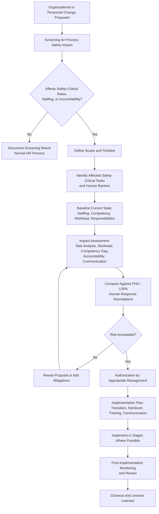

## Organizational and Personnel Change Considerations

### Purpose and Regulatory Context

Process safety depends on two kinds of barriers: engineered barriers (relief devices, interlocks, containment) and **human and organizational barriers** (operators who detect and respond to abnormal conditions, supervisors who authorize work, engineers who review changes, managers who allocate resources and hold accountability). A plant whose equipment is untouched can still become significantly less safe if the people and structures that operate, maintain, and oversee it are changed without evaluation. Organizational and personnel change management applies MOC discipline to this second class of barriers.

The regulatory and consensus landscape is less prescriptive here than for physical changes, which is itself a reason the topic is frequently neglected:

- **OSHA 29 CFR 1910.119(l)** (U.S. PSM) names changes to process chemicals, technology, equipment, and procedures, and to facilities affecting a covered process. Organizational and staffing changes are not listed explicitly in the standard text, but OSHA has treated them as changes needing evaluation where they affect the safe operation of a covered process. [Inference] Enforcement interpretation and scope may vary, so the applicable guidance should be verified.
- **CCPS Risk Based Process Safety (RBPS)**: the *Management of Change* element explicitly extends to organizational changes, and the *Workforce Involvement*, *Training and Performance Assurance*, *Operational Readiness*, and *Conduct of Operations* elements address the competency and staffing dimensions.
- **UK HSE guidance** (including HSG48 on human factors and guidance on **organizational change and major accident hazards**, sometimes referred to as OCMAH-related material): sets out expectations that organizational change be assessed for impact on major hazard control.
- **EU Seveso III Directive**: requires the safety management system to address organization and personnel, including the identification of training needs and management of modifications.
- **ISO 45001**: requires management of change affecting the occupational health and safety management system, including changes to organizational structure, staffing, and competence.
- **API RP 75, API RP 754**: address management system elements and process safety performance indicators relevant to organizational change.

**Key Points**

- Organizational change is a legitimate MOC trigger even when no equipment, chemical, or procedure text changes.
- Its effects are typically **delayed and diffuse**: degraded performance may not appear until an upset exposes the weakened barrier, often months after the change.
- Because regulatory text is less prescriptive, the facility's own MOC procedure must explicitly define which organizational changes require review. Exact triggers, thresholds, and documentation vary by jurisdiction and company standard and should be confirmed against the governing documents.

### Fundamental Definitions

| Term | Definition |
| --- | --- |
| **Organizational Change** | A modification to structure, roles, reporting lines, staffing levels, resource allocation, responsibilities, or work arrangements that could affect the control of process hazards |
| **Personnel Change** | Movement, loss, addition, or reassignment of individuals in roles that carry process safety responsibility |
| **Safety-Critical Role (Task)** | A role or task whose failure or absence could lead to or fail to prevent a major incident (for example, control room operator, shift supervisor, authorizer of permits, relief system engineer) |
| **Competency** | The combination of knowledge, skills, experience, and behaviors needed to perform a task safely and effectively |
| **Minimum Staffing (Minimum Crew)** | The smallest number and mix of qualified personnel required on shift to operate the process safely under normal, abnormal, and emergency conditions |
| **Span of Control** | The number of people or units a supervisor or manager is responsible for |
| **Organizational Memory** | The accumulated knowledge of process hazards, past incidents, design intent, and operating experience held by a workforce and its records |
| **Corporate (Organizational) Amnesia** | Loss of organizational memory through turnover, restructuring, or retirement without knowledge transfer |
| **Handover** | The transfer of information, responsibility, and status between shifts or between incoming and outgoing role holders |
| **Human Barrier** | A safeguard that depends on a person detecting, deciding, or acting correctly |
| **Fatigue Risk** | The risk that reduced alertness from long hours, night work, or insufficient rest degrades performance |

### Why Organizational Change Deserves Formal Review

Major incident investigations repeatedly identify organizational factors: reductions in staffing, loss of experienced personnel, reorganization that diluted accountability, and cost reductions that eroded maintenance and inspection capacity. Typical mechanisms include:

- **Loss of competence**: experienced staff leave and replacements lack equivalent process knowledge.
- **Diluted accountability**: reorganization leaves ambiguous ownership of safety-critical duties.
- **Workload overload**: fewer people perform the same tasks, increasing error probability and reducing response time.
- **Broken communication paths**: changed reporting lines disrupt information flow about hazards and near misses.
- **Erosion of independence**: safety or technical authority is subordinated to production.
- **Loss of organizational memory**: lessons learned are no longer held by anyone.
- **Change overload**: multiple simultaneous changes exceed the organization's capacity to absorb them.

**Key Points**

- The consequence of an organizational change is often a **reduction in the reliability of a human barrier** that the PHA assumed to be present.
- Because PHAs and LOPA studies credit operator response, alarm handling, and supervisory checks, a staffing or competence change can invalidate risk assumptions without any hardware modification.

### Types of Organizational and Personnel Change Requiring Review

#### 1. Staffing Level Changes

- Reducing the number of operators, maintenance technicians, or supervisors
- Changing minimum crew composition or shift structure
- Consolidating control rooms or combining units under fewer operators
- Reducing on-call, emergency response, or contractor support levels
- Increasing responsibilities without increasing resources

#### 2. Restructuring and Role Changes

- Merging or splitting departments or operating units
- Changing reporting lines for operations, maintenance, engineering, or safety functions
- Removing or combining safety-critical roles
- Changing the seniority or independence of process safety and technical authority roles
- Reassigning responsibilities (for example, transferring alarm management or permit authorization to a different group)

#### 3. Outsourcing and Contractor Transitions

- Transferring maintenance, inspection, operation, or emergency response to contractors
- Changing contractor companies or contract scope
- Changing contractor supervision arrangements
- Shifting from long-term to short-term or rotating contractor workforces

#### 4. Loss or Reassignment of Key Personnel

- Retirement, resignation, or transfer of subject-matter experts
- Vacancies in safety-critical roles filled temporarily by less experienced staff
- Rapid workforce turnover (for example, a large early-retirement program)
- Temporary "acting" appointments beyond a defined period

#### 5. Work Pattern and Fatigue-Related Changes

- Changes to shift patterns, shift length, rotation, or overtime policy
- Extended overtime during turnarounds or high-demand periods
- Introduction of remote or reduced-supervision working
- Changes to break arrangements or handover time

#### 6. Management System and Governance Changes

- Changes to committees, review boards, or approval authorities
- Changes to audit, inspection, or performance-monitoring arrangements
- Changes to the resources or budget of safety-critical functions such as inspection and maintenance
- Mergers, acquisitions, divestments, and site ownership changes

#### 7. Competency and Training System Changes

- Changes to training programs, qualification standards, or assessment methods
- Reduction in training time or reliance on on-the-job training only
- Introduction of new technology that changes required skills
- Changes in language, literacy, or cultural composition of the workforce affecting communication of safety information

### Screening Questions for Organizational Change

Analogous to the physical-change screening checklist, a screening tool for organizational change prompts consideration of effects on safety-critical functions. If any answer is "yes" or "uncertain," the change proceeds to formal review.

1. Does the change affect the number of people available to operate, monitor, maintain, or respond to emergencies?
2. Does it affect a role or task identified as safety-critical?
3. Does it change who is accountable for a process safety decision or duty?
4. Does it alter reporting lines or communication paths for hazard information, incidents, or near misses?
5. Does it reduce the experience or competency level of those performing safety-critical tasks?
6. Does it change working hours, shift patterns, or fatigue exposure?
7. Does it transfer any safety-critical duty to a different organization or team?
8. Does it invalidate any staffing or human-response assumption in the current PHA, LOPA, or emergency plan?
9. Does it affect the resources (time, budget, personnel) of inspection, maintenance, training, or safety functions?
10. Is it occurring at the same time as other significant changes on the same unit?

### Workflow for Organizational Change Review

### Impact Assessment Methods

A structured assessment converts a general concern ("fewer people") into evaluated risk.

#### Baseline of the Current Situation

- Current organization chart and role descriptions for safety-critical functions
- Current staffing by shift, including normal, abnormal, and emergency demands
- Current competency and qualification records for holders of safety-critical roles
- Current workload measures (alarm rates, task lists, permit volume, maintenance backlog)
- Current assumptions about human response recorded in PHA, LOPA, and emergency response plans

#### Task-Based Analysis

- Identify safety-critical tasks (for example, responding to a high-level alarm, isolating equipment for maintenance, executing an emergency shutdown)
- For each, identify who performs it, what resources and time are required, and what happens if it is not performed
- Analyze whether the proposed organization can still perform all safety-critical tasks simultaneously under credible upset scenarios, not only under normal conditions

#### Workload and Staffing Analysis

Workload can be expressed as a utilization ratio:

$$U = \frac{T_{required}}{T_{available}}$$

where $T_{required}$ is the time needed to complete assigned tasks (including concurrent tasks in an upset) and $T_{available}$ is the time window available given staffing. A value of $U$ approaching or exceeding 1 indicates an overloaded condition. [Inference] Organizations often set an internal utilization threshold well below 1 to preserve margin for the unexpected, but the appropriate value is context-specific and should not be treated as a universal standard.

**Example**

If a control room operator has a 10-minute window to respond to a specific upset, and the required response involves 8 minutes of tasks under the current three-operator arrangement, $U = 0.8$. If reducing staffing to two operators pushes the same tasks onto fewer people such that the required time for the remaining operator rises to 12 minutes within the same 10-minute window, then $U = 1.2$, indicating the response cannot be completed in time. This example uses hypothetical numbers for illustration only.

#### Competency Gap Analysis

- Compare required competencies for each safety-critical role against the qualifications of incoming or remaining personnel
- Identify gaps in process knowledge, emergency response, equipment-specific experience, or regulatory understanding
- Define training, mentoring, or supervision measures to close gaps before the change takes effect

#### Accountability and Communication Review

- Confirm that each process safety duty has a clearly named accountable role after the change
- Confirm that hazard information, incident reports, near misses, and audit findings still reach decision-makers
- Confirm that technical and safety authorities retain independence and the ability to stop work

#### Human Factors Review

- Effects on alarm load, workload distribution, and situational awareness
- Fatigue risk from shift and overtime changes
- Effects on supervision, peer checking, and second-person verification practices
- Effects of reduced staffing on the ability to perform simultaneous tasks (for example, monitoring while responding to an alarm and coordinating a permit)

#### Link to Hazard Analysis

- Identify each PHA, LOPA, and emergency scenario that credits a human action or a specific staffing level
- Determine whether the change affects the probability of that action being successful within the available time
- Where it does, re-evaluate the scenario. A degraded human barrier may require an added engineered safeguard, revised alarm priority, or restored staffing

### Illustration

<svg xmlns="http://www.w3.org/2000/svg" viewBox="0 0 780 380" width="780" height="380" role="img" aria-label="Organizational change effects on human barriers">
<title>Organizational Change and Human Barriers (svg_diagram)</title>
<rect x="0" y="0" width="780" height="380" fill="#f7f9fb" stroke="#c5ced8" />
<text x="390" y="28" text-anchor="middle" font-family="Arial, sans-serif" font-size="16" font-weight="bold" fill="#1f2d3d">Organizational Change and Human Barriers (svg_diagram)</text>
<rect x="290" y="56" width="200" height="50" rx="10" fill="#1f5f99" stroke="#123b61" />
<text x="390" y="86" text-anchor="middle" font-family="Arial, sans-serif" font-size="14" fill="#ffffff">Organizational Change</text>
<rect x="30" y="160" width="150" height="50" rx="8" fill="#e8f1fa" stroke="#1f5f99" />
<text x="105" y="190" text-anchor="middle" font-family="Arial, sans-serif" font-size="12" fill="#1f2d3d">Staffing Level</text>
<rect x="200" y="160" width="150" height="50" rx="8" fill="#e8f1fa" stroke="#1f5f99" />
<text x="275" y="190" text-anchor="middle" font-family="Arial, sans-serif" font-size="12" fill="#1f2d3d">Competency</text>
<rect x="370" y="160" width="150" height="50" rx="8" fill="#e8f1fa" stroke="#1f5f99" />
<text x="445" y="190" text-anchor="middle" font-family="Arial, sans-serif" font-size="12" fill="#1f2d3d">Accountability</text>
<rect x="540" y="160" width="150" height="50" rx="8" fill="#e8f1fa" stroke="#1f5f99" />
<text x="615" y="190" text-anchor="middle" font-family="Arial, sans-serif" font-size="12" fill="#1f2d3d">Communication and Fatigue</text>
<line x1="340" y1="106" x2="105" y2="160" stroke="#1f5f99" stroke-width="1.5" />
<line x1="365" y1="106" x2="275" y2="160" stroke="#1f5f99" stroke-width="1.5" />
<line x1="415" y1="106" x2="445" y2="160" stroke="#1f5f99" stroke-width="1.5" />
<line x1="440" y1="106" x2="615" y2="160" stroke="#1f5f99" stroke-width="1.5" />
<rect x="200" y="258" width="380" height="50" rx="10" fill="#fff4e0" stroke="#c77700" />
<text x="390" y="280" text-anchor="middle" font-family="Arial, sans-serif" font-size="13" fill="#1f2d3d">Human Barrier Reliability</text>
<text x="390" y="298" text-anchor="middle" font-family="Arial, sans-serif" font-size="11" fill="#1f2d3d">(detect, decide, respond, authorize, verify)</text>
<line x1="105" y1="210" x2="260" y2="258" stroke="#c77700" stroke-width="1.5" />
<line x1="275" y1="210" x2="320" y2="258" stroke="#c77700" stroke-width="1.5" />
<line x1="445" y1="210" x2="440" y2="258" stroke="#c77700" stroke-width="1.5" />
<line x1="615" y1="210" x2="520" y2="258" stroke="#c77700" stroke-width="1.5" />
<text x="390" y="340" text-anchor="middle" font-family="Arial, sans-serif" font-size="12" fill="#b32d2d">Effect: PHA and LOPA credits for human action may no longer hold</text>
</svg>

### Specific Change Scenarios and Key Considerations

#### Staffing Reductions

- Evaluate the **worst credible concurrent demand**, not the average. A control room may be adequately staffed for normal operation but not for a simultaneous alarm flood, permit issue, and emergency call.
- Identify tasks that would need to be dropped, delayed, or shed during an upset, and whether any are safety-critical.
- Consider effects on peer checking, second-person verification, and supervision, which typically diminish first.
- Consider out-of-hours coverage, holiday periods, and absences for leave and illness, since minimum crew must be sustainable, not just nominal.
- Define **minimum staffing rules** with clear authority to stop or reduce operation when staffing falls below the minimum.

#### Restructuring and Reporting Line Changes

- Confirm that process safety accountability remains explicit and assigned to a role with authority and resources.
- Protect the **independence** of safety, technical authority, and audit functions from production pressure.
- Assess whether information flows (incident reporting, alarm performance, inspection findings, MOC status) still reach those who need them.
- Map the transition period, since the handover phase is often the highest-risk window.

#### Outsourcing and Contractor Transitions

- Define which safety-critical responsibilities are transferred and which remain with the operator (many regulators and standards expect the operator to retain accountability for process safety).
- Verify contractor competence, supervision, and familiarity with site hazards and procedures before work begins.
- Ensure contractors have access to current PSI, procedures, and emergency arrangements.
- Provide clear interfaces: who authorizes work, who oversees, who responds in an emergency.
- Plan for knowledge transfer from outgoing to incoming contractors.

#### Loss of Key Personnel and Succession

- Identify **critical knowledge holders** for each unit and safety-critical function.
- Use succession planning and structured **knowledge capture** (documented rationale, lessons learned, decision histories) before departures.
- Provide overlap periods for handover where possible.
- Where a role is filled temporarily by a less experienced person, define enhanced supervision and a time limit, and treat it in the same manner as a temporary change with an expiry date.

#### Shift Pattern, Overtime, and Fatigue Changes

- Assess fatigue risk from shift length, night work, consecutive shifts, and cumulative overtime.
- Apply fatigue risk management practices, including limits on working hours, minimum rest periods, and monitoring.
- Recognize that high-demand periods such as turnarounds concentrate overtime and often coincide with heightened hazard.
- Preserve adequate handover time between shifts, since compressed handover degrades communication of plant status.

#### Mergers, Acquisitions, and Site Ownership Changes

- Evaluate integration of management systems, safety cultures, and standards.
- Identify gaps in process safety knowledge or documentation transferred between owners.
- Confirm that regulatory responsibilities (for example, RMP or PSM compliance registrations, permit holders) are clearly transferred.
- Recognize the increased risk during periods of uncertainty, when key staff may leave and attention may shift away from safety-critical duties.

### Transition Management

The **transition period** between the old and new organization is a risk phase in itself.

**Transition controls**

- Staged or phased implementation with checkpoints, rather than a single abrupt cutover where feasible
- Defined **handover procedures** and overlap between outgoing and incoming role holders
- Interim accountability statements clarifying who is responsible for each safety-critical duty during the transition
- Enhanced monitoring of process safety performance indicators during and after the transition
- Communication to the workforce explaining what is changing, why, and how safety-critical duties will continue to be covered
- Defined criteria for pausing or reversing the change if warning signs appear
- Avoidance of scheduling major organizational change concurrently with turnarounds, startups, or other high-risk activities where possible

### Monitoring and Post-Implementation Review

The effect of an organizational change may be gradual, so verification should continue after implementation.

**Monitoring indicators (examples)**

- Alarm rates per operator and alarm response times
- Overdue safety-critical maintenance, inspection, and proof-test tasks
- Overdue MOC closeouts, PHA actions, and audit actions
- Near-miss and incident reporting rates and quality
- Overtime hours and fatigue-related indicators
- Vacancy rates and the duration of temporary appointments in safety-critical roles
- Training completion and competency assessment results
- Frequency of minimum staffing being breached
- Workforce survey results on safety concerns, workload, and reporting confidence
- Process safety performance indicators such as loss of primary containment events and demands on safety systems (aligned with frameworks like API RP 754 or CCPS metrics)

**Review approach**

- Set a defined review point (for example, after a specified period following implementation) to compare actual performance against assumptions in the impact assessment.
- Investigate deviations and adjust staffing, training, or structure if warning signs appear.
- Feed findings into the next PHA revalidation and MOC program review.

**Key Points**

- A **lagging indicator** such as an incident may appear only long after the organizational change; **leading indicators** (overdue actions, overtime, vacancies) give earlier warning.
- Because indicators can be influenced by reporting behavior, they should be interpreted alongside qualitative evidence such as interviews and observations.

### Worked Example: Night-Shift Staffing Reduction

**Scenario**

A processing site proposes reducing night-shift staffing at a distillation and storage area from three operators (one control room operator and two field operators) to two (one control room operator and one field operator) to control labor costs. The unit handles flammable liquids, and the PHA credits a field operator response to a tank overfill alarm as an independent protection layer.

**Screening**

- Affects number of people operating the process: **yes**
- Affects a safety-critical role/task (field operator response, permit support, emergency response): **yes**
- Invalidates a PHA assumption: **potentially yes**

The change proceeds to formal review.

**Impact assessment**

| Element | Findings (Illustrative) |
| --- | --- |
| Baseline | Three operators at night; field response to overfill alarm credited in PHA within 15 minutes |
| Task analysis | The single remaining field operator is also responsible for rounds, sampling, and permit-related isolations |
| Concurrent demand | During a transfer operation, a maintenance permit and an alarm may coincide, leaving one field operator with competing safety-critical tasks |
| Workload | Concurrent task time exceeds the credited response window for the overfill scenario |
| Competency | The remaining field operator is qualified; no competency gap identified |
| Emergency response | Reduced number of trained first responders on night shift; emergency plan assumes a minimum of two field responders |
| Fatigue | No change in shift length, but rounds coverage per person increases |

**Outcome**

The assessment shows that the credit for field operator response to the overfill alarm is no longer valid at the proposed staffing. Options include:

- Restoring the third operator on nights during transfer operations
- Adding an independent high-high level trip with automatic shutoff so the scenario no longer relies on human response
- Restricting hazardous transfers and permit work on nights
- Revising the emergency plan to add remote or on-call resources with defined response times

The approver selects an engineered safeguard plus a restriction on hazardous transfers at night, records the decision and its rationale, updates the PHA and emergency plan, and sets a six-month post-implementation review.

**Conclusion of the example**

The saving from reduced staffing is conditional on preserving the risk control the human barrier provided. Without formal organizational MOC, the loss of the credited response would likely have gone unrecognized until an incident.

### Common Failure Modes

- **Not recognized as a change**: organizational decisions handled entirely as human resources or cost-management matters with no process safety input
- **Assessing only normal operations**: ignoring upset, emergency, and concurrent-task scenarios
- **Assuming interchangeability of people**: treating staffing as headcount without regard to competence and experience
- **Ignoring knowledge loss**: no plan to capture the expertise of departing personnel
- **Diffuse accountability**: responsibilities assigned to committees or roles without clear individual ownership
- **Reorganization by stealth**: incremental changes that individually seem minor but cumulatively transform the organization
- **Change overload**: too many simultaneous changes on the same unit or workforce
- **Contractor accountability gaps**: assuming responsibility transfers with the work
- **No post-implementation review**: assumptions never tested against actual performance
- **Independence eroded**: safety or technical authority subordinated to production reporting lines
- **Financial pressure overriding assessment**: predetermined outcome with the assessment used as formality
- **Temporary arrangements becoming permanent**: acting appointments or interim staffing continuing without review

### Roles and Responsibilities in Organizational MOC

| Role | Contribution |
| --- | --- |
| Change sponsor (management) | Defines objectives, provides resources, and accepts accountability for the decision |
| Process safety specialist | Screens for process safety impact, leads or supports impact assessment |
| Operations and maintenance representatives | Provide realistic task and workload input |
| Human factors or HR specialist | Supports competency, fatigue, and workforce analysis |
| Independent reviewer | Provides objective challenge on assumptions and conclusions |
| Workforce representatives and safety committee | Provide input on practical impacts; supports workforce involvement requirements |
| Approving authority | Authorizes the change after reviewing risk and mitigations |
| MOC coordinator | Tracks the change, actions, and closeout |

**Key Points**

- **Workforce involvement** is a consistent theme: the people who perform the tasks are best placed to identify what a proposed change will make harder or impossible.
- The approver should be at a level commensurate with the risk and should not be solely the person whose budget benefits from the change.

### Documentation Expectations

- Description and rationale of the organizational change
- Screening record and determination
- Baseline and proposed organization charts and staffing tables
- Identification of safety-critical tasks and roles affected
- Impact assessment and its supporting analysis (workload, competency, accountability)
- Reference to affected PHA, LOPA, emergency plans, and procedures, and any revisions
- Mitigation actions with owners and due dates
- Approval records
- Transition plan, communication records, and training records
- Post-implementation review plan and results
- Updates to organization charts, role descriptions, responsibility matrices, and staffing basis documents

**Conclusion**

Organizational and personnel changes alter the reliability of the human and organizational barriers that process safety depends on, even when no physical change occurs. Effective management requires that such changes be recognized as MOC triggers, screened against safety-critical roles and tasks, assessed for workload, competency, accountability, communication, and fatigue effects, and traced to the human-response assumptions in hazard analyses and emergency plans. Transition should be controlled, and performance monitored after implementation because degradation is often gradual and delayed. The specific triggers, assessment depth, and approval levels depend on applicable regulations and each facility's own MOC procedure and should be confirmed against those sources.

### Related Topics

- Human Factors in Process Safety and Human Reliability Analysis
- Safety-Critical Task and Role Identification
- Minimum Staffing and Control Room Manning Studies
- Competency Assurance and Training Program Management
- Fatigue Risk Management and Working Hours Control
- Contractor Management and Contractor Safety Performance
- Shift Handover and Communication Practices
- Succession Planning and Organizational Knowledge Retention
- Workforce Involvement in Process Safety
- Process Safety Leading and Lagging Indicators
- Alarm Management and Operator Workload
- Case Studies: Incidents Linked to Staffing Reductions and Organizational Change