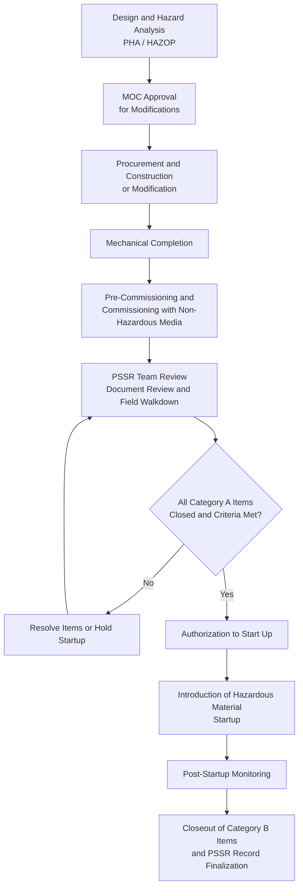
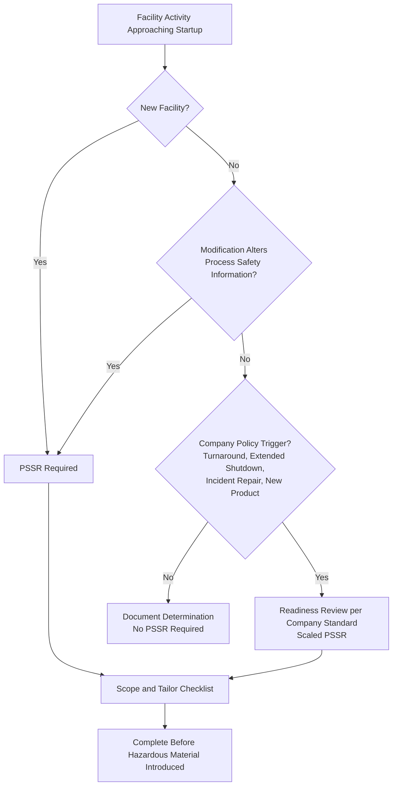

## Purpose and Timing of Pre-Startup Safety Review

### Purpose and Regulatory Context

A Pre-Startup Safety Review (PSSR) is a formal, documented verification, performed **before highly hazardous chemicals are introduced** into a new or modified process, that the facility is physically, procedurally, and organizationally ready to operate safely. It is the last structured barrier between the design and construction effort and the introduction of hazardous material. Earlier elements of process safety management (process safety information, hazard analysis, management of change, mechanical integrity, training) each generate requirements. The PSSR is the point at which a competent team confirms, by inspection and record verification, that those requirements were actually carried through into the field.

The PSSR addresses a recurring failure pattern: a design that was sound on paper is commissioned with an unclosed hazard analysis recommendation, an untested safety system, an unrevised procedure, or an untrained crew. Because construction and modification work is often completed under schedule pressure, the PSSR provides a deliberate checkpoint at which startup can be **held** if readiness is not demonstrated.

The principal references are:

- **OSHA 29 CFR 1910.119(i)** (U.S. Process Safety Management standard): requires a PSSR for new facilities and for modified facilities when the modification is significant enough to require a change in process safety information.
- **EPA 40 CFR 68.77**: parallel Risk Management Program requirement for pre-startup review.
- **OSHA 29 CFR 1910.119(l)**: Management of Change, which feeds the PSSR determination for modified facilities.
- **CCPS Risk Based Process Safety (RBPS)**, *Operational Readiness* element: extends the PSSR concept to broader readiness activities including startup after turnaround and after extended shutdown.
- **UK HSE and EU Seveso III**: expect verification of safe readiness before commissioning of new or modified installations, although the terminology differs (for example, "commissioning" and "readiness" reviews).
- **Company and industry standards**: many operators define PSSR scope, checklist content, and team composition in internal standards that go beyond regulatory minimums.

**Key Points**

- The PSSR is a **verification** activity, not a design review. It confirms that what was designed, analyzed, and approved has actually been built, documented, and made operational.
- Its defining feature is **timing**: it occurs after construction or modification is substantially complete and before hazardous material is introduced.
- Exact triggers, documentation requirements, and terminology vary by jurisdiction and company standard and should be confirmed against the governing procedure.

### Fundamental Definitions

| Term | Definition |
| --- | --- |
| **Pre-Startup Safety Review (PSSR)** | A documented review confirming that a new or modified facility is ready for the introduction of highly hazardous chemicals |
| **Startup** | The introduction of process chemicals, energy, or hazardous material into equipment for the first time or after a change or shutdown |
| **New Facility** | A newly constructed process, unit, or installation not previously operated |
| **Modified Facility** | An existing facility that has undergone a change that alters process safety information |
| **Mechanical Completion** | The state in which construction is complete and equipment is installed per design, before commissioning and operations |
| **Commissioning** | Activities to test and prepare equipment for operation, often using inert or non-hazardous media |
| **Introduction of Hazardous Material** | The point at which highly hazardous chemicals or hazardous energy enter the equipment, which is the deadline for PSSR completion |
| **Punch List** | A list of outstanding items identified during inspection, classified by criticality |
| **Category A Item (Pre-Startup Item)** | An outstanding item that must be closed before startup |
| **Category B Item (Post-Startup Item)** | An outstanding item that may be closed after startup within a defined, tracked timeframe |
| **Hold Point** | A defined stage at which work cannot proceed until specified conditions are verified |
| **Readiness Criteria** | The set of conditions that must be satisfied for authorization to start up |
| **Authorization to Start Up** | Formal approval by a designated authority that the PSSR is complete and startup may proceed |

### Purpose of the PSSR

The PSSR serves several distinct but related purposes.

**1. Confirm construction and equipment conform to design specifications**

- Equipment is installed as designed, including materials of construction, ratings, orientations, and supports
- Piping, instrumentation, and electrical work matches the approved drawings
- Deviations from design have been identified, evaluated, and approved through MOC

**2. Confirm that safety, operating, maintenance, and emergency procedures are in place and adequate**

- Operating procedures are written, reviewed, approved, and available
- Maintenance and inspection procedures cover the new or modified equipment
- Emergency procedures reflect the changed hazards and equipment

**3. Confirm that a process hazard analysis has been performed for new facilities and that recommendations are resolved or implemented before startup**

- For new facilities, a PHA has been completed and recommendations addressed
- For modified facilities, the MOC has addressed hazards of the change and any actions have been closed or formally deferred with justification

**4. Confirm that training has been completed for affected employees**

- Operators, maintenance personnel, and contractors whose tasks are affected have been trained on the new or modified process
- Competency has been verified where required

**5. Confirm that safety systems and mechanical integrity requirements are satisfied**

- Safety instrumented systems, alarms, interlocks, relief devices, detection, and protection systems have been installed, tested, and verified functional
- Inspection and testing of equipment has been completed and documented
- Mechanical integrity program includes the new equipment

**6. Provide a formal decision gate**

- The PSSR ends with a decision: proceed, proceed with conditions, or hold
- Accountability for the startup decision is documented

**Key Points**

- The PSSR is a **layer of protection for the project lifecycle**: it is designed to catch errors that earlier checks missed or that arose during construction.
- A PSSR is only effective if it has real authority to delay startup. A review that cannot stop a startup is a formality.

### Position of the PSSR in the Project and Change Lifecycle

### Timing of the PSSR

#### The Regulatory Deadline

The defining timing requirement is that the PSSR must be **completed prior to the introduction of highly hazardous chemicals** to the process. This is a firm boundary. Activities that do not involve hazardous material, such as leak testing with air or water, can proceed before PSSR completion, though many organizations review readiness at multiple stages.

#### Recommended Sequence

| Stage | Typical Activity | PSSR Relationship |
| --- | --- | --- |
| Design and MOC approval | Hazard evaluation; design documentation | Provides the requirements the PSSR will verify |
| Construction or modification | Installation, fabrication, inspection | PSSR planning starts; checklist tailored to project |
| Mechanical completion | Construction complete against design | Trigger for detailed PSSR walkdown |
| Pre-commissioning and commissioning | Flushing, pressure testing, loop checks, functional tests with inert media | Generates test evidence reviewed by PSSR |
| **PSSR completion** | Document verification, field walkdown, item classification, authorization | **Must be complete before hazardous material is introduced** |
| Startup | Introduction of process chemicals | Begins only after authorization |
| Post-startup | Monitoring, closeout of Category B items | PSSR record finalized |

#### Starting Early, Finishing Before Startup

Although the PSSR *concludes* just before startup, effective programs **begin planning early**.

- **Early planning**: The PSSR team is identified and the checklist is drafted during project design, so that readiness criteria are known to the project team from the start.
- **Progressive verification**: Portions of the review (document verification, training, procedure approval) proceed in parallel with construction rather than compressed into a final rush.
- **Final walkdown**: The physical inspection occurs after mechanical completion so that it reflects the as-built state.
- **Final decision**: The authorization is made once all pre-startup items are closed, with a timing buffer that avoids pressure to accept incomplete readiness.

**Key Points**

- A PSSR performed **too early** may verify a state that later changes; a PSSR performed **too late** compresses review under schedule pressure and invites shortcuts.
- Deferring the final authorization until immediately before startup is appropriate, but the *preparation* should not be deferred.

### When a PSSR Is Required

The regulatory triggers distinguish new facilities from modified facilities.

#### New Facilities

A PSSR is required for **all new facilities** covered by the applicable regulation, prior to startup. This includes new units, new process lines, and new installations that handle highly hazardous chemicals.

#### Modified Facilities

For existing facilities, OSHA 1910.119(i)(1) requires a PSSR when the modification is **significant enough to require a change in the process safety information**. In practice, this means that if a change in the MOC process results in an update to PSI (for example, revised P&IDs, changed relief basis, new safe operating limits, new equipment), a PSSR is triggered.

**Illustrative determination**

| Modification | Changes PSI? | PSSR Typically Required? |
| --- | --- | --- |
| Replacement in kind | No | No |
| Adding a new pump with different specification and updated P&ID | Yes | Yes |
| Raising throughput with revised safe operating limits and relief basis | Yes | Yes |
| Changing an alarm setpoint recorded in PSI and safe limits | Yes | Yes |
| Editing an operating procedure wording only, with no PSI change | Typically No | Often not formally required by the regulatory trigger, though facility policy may still require verification |
| Short-duration temporary change with revised process configuration | Depends | Depends on scope and company policy |

[Inference] Many organizations apply a **scaled PSSR**, using the same structure with a shorter checklist for small modifications and a comprehensive review for major projects, rather than treating the PSSR as a binary trigger. The exact criteria are set in each company's MOC and PSSR procedures.

#### Beyond the Regulatory Minimum: Other Common Triggers

Company standards and RBPS guidance frequently apply readiness review to situations not strictly required by the regulation:

- Startup after a **major turnaround or shutdown** involving significant work
- Startup after an **extended idle period** or mothballing
- Restart after an **incident** involving damage or significant repair
- Introduction of a **new product or campaign** in multipurpose facilities
- Return to service after **temporary change** removal where the process configuration was substantially altered
- Startup following **organizational or staffing changes** affecting readiness (in some programs)

**Key Points**

- The regulatory PSSR trigger is a **minimum**. Good practice is to apply a risk-based readiness review wherever the risk of an unverified startup is meaningful.
- The PSSR determination should be made as part of MOC screening so it is not missed.

### Determining Whether a PSSR Is Required: Decision Logic

### The Timing Relationship with Related Elements

The PSSR depends on the outputs of other process safety elements and must be scheduled to align with their completion.

| Related Element | What the PSSR Confirms | Timing Dependency |
| --- | --- | --- |
| Process Safety Information | PSI complete and accurate for the new or modified process | PSI updates must be finished before or during PSSR |
| Process Hazard Analysis / MOC hazard evaluation | Recommendations resolved before startup | Action closure tracked to PSSR |
| Operating procedures | Written, approved, and available | Procedures issued before startup |
| Training | Affected personnel trained | Training completed before startup |
| Mechanical integrity | Inspection, testing, and quality assurance of equipment completed | Inspection and testing records available at review |
| Safe work practices | Applicable permits and practices adapted | Ready prior to introduction of hazardous material |
| Emergency planning | Emergency plan reflects the new or modified facility | Updated before startup |
| Contractor management | Contractor personnel informed and trained | Completed before startup |

**Key Points**

- Because the PSSR *verifies* rather than *creates*, its schedule is constrained by the slowest upstream element. A late procedure, incomplete training, or unresolved hazard action delays PSSR completion and therefore startup.
- Project schedules should treat PSSR readiness items as **critical-path** elements, not administrative tasks at the end.

### Illustration

<svg xmlns="http://www.w3.org/2000/svg" viewBox="0 0 800 340" width="800" height="340" role="img" aria-label="PSSR timing relative to project phases and introduction of hazardous material">
<title>PSSR Timing Relative to Startup (svg_diagram)</title>
<rect x="0" y="0" width="800" height="340" fill="#f7f9fb" stroke="#c5ced8" />
<text x="400" y="28" text-anchor="middle" font-family="Arial, sans-serif" font-size="16" font-weight="bold" fill="#1f2d3d">PSSR Timing Relative to Startup (svg_diagram)</text>
<line x1="40" y1="170" x2="760" y2="170" stroke="#1f2d3d" stroke-width="2" />
<rect x="40" y="130" width="130" height="36" rx="6" fill="#e8f1fa" stroke="#1f5f99" />
<text x="105" y="153" text-anchor="middle" font-family="Arial, sans-serif" font-size="12" fill="#1f2d3d">Design / MOC</text>
<rect x="180" y="130" width="140" height="36" rx="6" fill="#e8f1fa" stroke="#1f5f99" />
<text x="250" y="153" text-anchor="middle" font-family="Arial, sans-serif" font-size="12" fill="#1f2d3d">Construction</text>
<rect x="330" y="130" width="130" height="36" rx="6" fill="#e8f1fa" stroke="#1f5f99" />
<text x="395" y="153" text-anchor="middle" font-family="Arial, sans-serif" font-size="12" fill="#1f2d3d">Commissioning</text>
<rect x="470" y="130" width="130" height="36" rx="6" fill="#fff4e0" stroke="#c77700" />
<text x="535" y="153" text-anchor="middle" font-family="Arial, sans-serif" font-size="12" fill="#1f2d3d">PSSR Completion</text>
<line x1="615" y1="110" x2="615" y2="200" stroke="#b32d2d" stroke-width="3" />
<text x="615" y="100" text-anchor="middle" font-family="Arial, sans-serif" font-size="12" fill="#b32d2d">Hazardous material introduced</text>
<rect x="630" y="130" width="130" height="36" rx="6" fill="#e9f5ea" stroke="#2e7d32" />
<text x="695" y="153" text-anchor="middle" font-family="Arial, sans-serif" font-size="12" fill="#1f2d3d">Startup / Operation</text>
<line x1="180" y1="230" x2="600" y2="230" stroke="#c77700" stroke-width="2" stroke-dasharray="6,4" />
<text x="390" y="252" text-anchor="middle" font-family="Arial, sans-serif" font-size="12" fill="#c77700">PSSR planning and progressive verification (begins early)</text>
<line x1="470" y1="270" x2="600" y2="270" stroke="#c77700" stroke-width="4" />
<text x="535" y="292" text-anchor="middle" font-family="Arial, sans-serif" font-size="12" fill="#c77700">Final walkdown and authorization</text>
<text x="400" y="326" text-anchor="middle" font-family="Arial, sans-serif" font-size="12" fill="#b32d2d">Deadline: PSSR must be complete before hazardous material is introduced</text>
</svg>

### Categorizing Outstanding Items and Their Timing

A practical feature of the PSSR is classifying outstanding items by whether they must be closed before startup.

| Category | Description | Timing |
| --- | --- | --- |
| **Category A (Pre-startup)** | Items essential to safe startup: safety systems not tested, procedures not issued, critical hazard actions not closed, training not complete | Must be closed **before** hazardous material is introduced |
| **Category B (Post-startup)** | Items that do not affect safe startup: cosmetic items, non-critical documentation, minor labeling | May be closed after startup within a defined time, with owner and due date |
| **Category C (Improvement / Deferred)** | Non-safety enhancements | Tracked through normal work management |

**Key Points**

- **Reclassification of a Category A item as Category B to meet a schedule** is a well-recognized warning sign. Classification should follow defined criteria, and downgrading should require independent approval.
- Category B items need **tracking and escalation** so they are actually closed; otherwise they accumulate as latent deficiencies.
- Some standards prohibit deferring specific items (for example, testing of safety instrumented functions or relief devices) regardless of schedule.

### Who Participates and Who Authorizes

Timing is linked to who must be available and empowered.

**Typical review team composition**

- Operations representative (someone familiar with running the process)
- Engineering representative (process and discipline engineers as needed)
- Maintenance and inspection representative
- Safety or process safety specialist
- Project representative
- Instrument and electrical specialists for control and safety systems
- At least one person with appropriate knowledge of the process, and where required, an employee representative involved in the review

**Authorization**

- A designated manager with authority over the facility signs the authorization to start up.
- Authorization should follow confirmation that Category A items are closed and readiness criteria are satisfied.
- The authorizing person should not be under sole pressure from project schedule; the authority to say "not ready" should be explicit and supported by management.

### Illustrative Worked Example: Timing Decision for a Modified Unit

**Scenario**

A plant modifies a solvent recovery unit by adding a new heat exchanger, revising the P&ID, changing a high-temperature alarm setpoint, and raising the allowable throughput. The MOC has been approved. Mechanical completion is achieved on a Friday, and the operations team wants to introduce solvent on Sunday to meet a customer order.

**Step 1: Is a PSSR required?**

The modification changes PSI (P&ID, safe operating limits, alarm setpoint, relief basis), so a PSSR is required before hazardous material is introduced.

**Step 2: Timing planning**

- The PSSR checklist was drafted during construction and progressive verification of procedures and training has been ongoing.
- The final walkdown is scheduled for Saturday after mechanical completion.

**Step 3: Review findings (illustrative)**

| Item | Finding | Category |
| --- | --- | --- |
| New heat exchanger installed per design | Verified in walkdown | Closed |
| Relief valve setpoint tag and certification | Verified against relief basis | Closed |
| High-temperature alarm loop test | Not yet performed | **A** (safety system function must be tested before startup) |
| Revised operating procedure issued | Issued and available in control room | Closed |
| Night-shift operator training on revised procedure | Two of six operators not yet trained | **A** (affected personnel must be trained before startup) |
| Insulation cladding incomplete on a non-hot section | Minor | B |
| Drawing revision issue for one non-critical isometric | Pending | B, with owner and due date |
| PHA action to add local temperature indication | Open | **A** or formally deferred with justification; here judged A |

**Step 4: Decision**

Because three Category A items remain open, the reviewer recommends **holding** startup. The loop test is performed Saturday afternoon and passes. The two operators are trained Saturday evening. The local temperature indicator is installed and verified Sunday morning. The authorizing manager reviews the closed items and signs the authorization on Sunday afternoon, and solvent is introduced afterward.

**Conclusion of the example**

The PSSR functioned as a decision gate that delayed the planned startup by hours rather than allowing hazardous material to enter a facility with an untested alarm, untrained operators, and an open hazard action. The Category B items were tracked with owners and due dates, not ignored.

### Common Failure Modes Related to Purpose and Timing

- **PSSR treated as a paperwork exercise**: checklist signed without field verification
- **PSSR started too late**: compressed into hours before a scheduled startup, inviting shortcuts
- **Hazardous material introduced before completion**: for example, "commissioning" activities that use process chemicals before authorization
- **Blurred boundary between commissioning and startup**: introducing hazardous material during commissioning without recognizing it as the startup event
- **Category A items downgraded to meet schedule**
- **Missing PSSR determination**: modification not recognized as PSI-changing, so no review triggered
- **Verification of documents only**: no physical walkdown to confirm field conditions match drawings
- **Team lacks operational knowledge or independence**: review performed only by the project team that has an interest in completion
- **No authority to hold**: reviewers unable to stop startup
- **Category B items never closed**: no tracking or escalation
- **Restart after turnaround assumed exempt**: significant work performed without readiness review
- **Late scope changes**: changes made after the PSSR without re-verification

### Documentation of the PSSR

- Identification of the facility, project, and MOC references
- Scope and basis for determining a PSSR was required
- Checklist used and completion status of each item
- Names, roles, and dates of team members and reviewers
- Punch list with categorization and closure evidence
- References to supporting records (inspection reports, test records, training records, approved procedures, updated PSI, hazard analysis action closure)
- Record of deferred items, with justification, owner, due date, and interim risk controls
- Authorization signature, date, and time, with reference to the point at which hazardous material was introduced
- Retention according to regulatory and company requirements [Unverified] Retention periods vary and should be confirmed against the applicable rules.

### Metrics and Auditing

**Indicators**

- Percentage of startups preceded by a completed and authorized PSSR
- Number of Category A items found at final walkdown (a high number may indicate weak earlier verification)
- Number of Category B items open beyond their due dates
- Number of startups delayed because of PSSR findings (evidence that the gate has authority)
- Number of reclassifications from A to B and the approval level
- Post-startup incidents or deviations traced to items that should have been caught in the PSSR

**Audit approach**

- Sample completed PSSRs and verify that evidence supports each checklist item
- Compare the recorded authorization time with the record of first introduction of hazardous material
- Confirm that Category B items were closed on time
- Interview operators on whether they were trained and had procedures available before startup

### Practical Guidance for Program Design

- Define in the procedure the **triggers** for a PSSR and the process for determining scope, and link the determination to MOC screening.
- Define the **deadline** clearly: completion before introduction of hazardous material, with a clear definition of what counts as hazardous material introduction.
- Begin planning and progressive verification early; reserve the final walkdown and authorization for the readiness point.
- Provide **checklists tailored** to the project and scalable to its size.
- Define **Category A and B criteria** and control reclassification.
- Give the authorizing manager explicit authority and support to delay startup.
- Track deferred items to closure with escalation.
- Include the PSSR on the project **critical path** so readiness is planned rather than rushed.

**Conclusion**

The purpose of the Pre-Startup Safety Review is to verify, before hazardous material enters the process, that construction conforms to design, that safety, operating, maintenance, and emergency procedures are in place, that hazard analysis recommendations are resolved, that safety systems and mechanical integrity requirements are satisfied, and that affected personnel are trained. Its timing is defined by a firm boundary: completion before the introduction of highly hazardous chemicals, with planning and progressive verification beginning early and the final walkdown and authorization occurring at the readiness point. It applies to all new facilities and to modified facilities where the change alters process safety information, and good practice extends readiness review to other high-risk restarts. The exact triggers, checklists, item classifications, and authorization levels depend on the applicable regulations and each facility's own procedures and should be confirmed against those sources.

### Related Topics

- PSSR Team Composition and Independence
- PSSR Checklists and Scope Tailoring
- Construction and Equipment Verification Against Design
- Verification of Safety Systems and Instrumented Functions
- Operating Procedure Readiness and Operator Training Verification
- Closure of Process Hazard Analysis Recommendations Before Startup
- Punch List Management and Category A/B Classification
- Startup Authorization and Management Accountability
- Turnaround and Restart Readiness Reviews
- Operational Readiness and Commissioning Management
- Post-Startup Monitoring and Closeout
- Case Studies: Incidents Following Startup Without Adequate Readiness Review