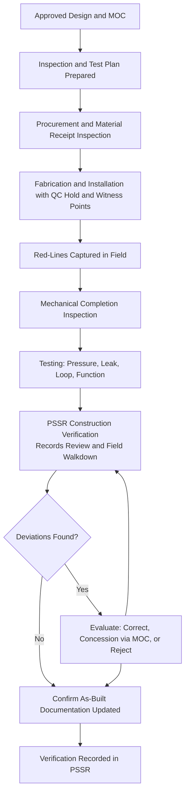
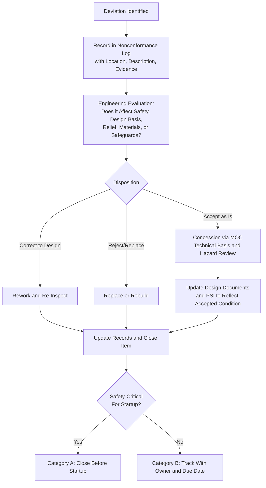

## Verification of Construction Against Design

### Purpose and Regulatory Context

Verification of construction against design is the element of the Pre-Startup Safety Review (PSSR) that answers a single, fundamental question: **was the facility built, installed, or modified the way it was designed and analyzed?** Every hazard analysis, relief calculation, safeguard credit, and operating limit rests on the assumption that the physical plant matches the design documents. Construction is a human activity carried out under cost and schedule pressure, involving many parties, field conditions that differ from drawings, material substitutions, and last-minute fixes. Deviations are therefore normal, and the risk lies not in their existence but in their going **undetected, unevaluated, or undocumented**.

The verification step exists to close the gap between three states that must be consistent before hazardous material is introduced:

1. **The design intent** (what was specified, calculated, and hazard-analyzed)
2. **The as-built condition** (what actually exists in the field)
3. **The documentation** (what operators, maintenance staff, and future analysts will rely on)

The principal references are:

- **OSHA 29 CFR 1910.119(i)(2)(i)** (U.S. PSM standard): requires that the PSSR confirm that **construction and equipment is in accordance with design specifications**.
- **OSHA 29 CFR 1910.119(j)(6)**: quality assurance requirements under the mechanical integrity element, including that equipment as it is fabricated is suitable for the process application and that appropriate checks and inspections are performed to ensure it is installed properly and consistent with design specifications and the manufacturer's instructions.
- **EPA 40 CFR 68.77(b)(1)** and **68.73(d)(5)**: parallel Risk Management Program requirements.
- **OSHA 29 CFR 1910.119(d)(3)(ii)**: requires documentation that equipment complies with recognized and generally accepted good engineering practices (RAGAGEP).
- **CCPS Risk Based Process Safety (RBPS)**: *Asset Integrity and Reliability*, *Operational Readiness*, and *Process Knowledge Management* elements address quality assurance and construction verification.
- **Consensus codes and standards** that define construction, fabrication, and inspection requirements, such as ASME Boiler and Pressure Vessel Code, ASME B31.3 (Process Piping), API standards, NFPA codes, and NEC/IEC electrical standards.
- **UK HSE and EU Seveso III**: expect verification that installations are constructed and commissioned as designed before operation.

**Key Points**

- The verification confirms conformance to the **approved design**, including approved deviations. It does not re-open the design; where a deviation is discovered, it is routed back through evaluation and management of change.
- Verification is evidence-based: it combines **records review** (what was documented during construction) with **physical inspection** (what the reviewers can see and check in the field).
- Specific inspection scopes, hold points, acceptance criteria, and documentation formats depend on the applicable codes, jurisdiction, and company standards and should be confirmed against the governing project and PSSR procedures.

### Fundamental Definitions

| Term | Definition |
| --- | --- |
| **Design Specification** | The documented requirements defining what is to be built, including drawings, datasheets, codes, materials, and performance requirements |
| **As-Built** | The documented configuration reflecting the facility as actually constructed, including approved field changes |
| **Deviation (Nonconformance)** | Any difference between the constructed condition and the design specification |
| **Concession (Waiver)** | Formal acceptance of a nonconforming item after engineering evaluation, with documented justification |
| **Quality Assurance (QA)** | Planned and systematic activities that provide confidence requirements will be met |
| **Quality Control (QC)** | Inspection, testing, and examination activities that verify conformance |
| **Inspection and Test Plan (ITP)** | A document defining inspection and test activities, acceptance criteria, responsible parties, and hold/witness points |
| **Hold Point** | A stage at which work may not proceed until a specified party has inspected and released the work |
| **Witness Point** | A stage at which a party is notified and may attend, but work may proceed if they do not |
| **Positive Material Identification (PMI)** | Testing that verifies the alloy composition of installed materials |
| **Material Test Report (MTR / Mill Certificate)** | A certificate documenting the chemical and mechanical properties of a material heat or lot |
| **Traceability** | The ability to trace an installed component back to its material certificates, fabrication records, and inspection records |
| **Mechanical Completion** | The state in which construction is complete against design and ready for commissioning |
| **Punch List** | A list of outstanding items identified during inspection, classified by criticality |
| **Red-Line** | Field mark-up of drawings recording changes made during construction |
| **Walkdown** | A physical inspection of installed equipment against drawings and checklists |
| **Fit-for-Service** | Engineering assessment that an item with a deviation or defect can continue to operate safely |
| **RAGAGEP** | Recognized and generally accepted good engineering practices |

### Place of Verification in the Construction and Readiness Sequence

### What Must Be Verified: Scope by Discipline

Verification must cover every element whose deviation could change a hazard or a safeguard. The following sections describe typical scope by discipline.

#### 1. Process Equipment (Vessels, Reactors, Columns, Tanks, Exchangers)

**Verification points**

- Correct equipment tag, model, and serial number against the equipment list and datasheet
- Materials of construction match the specification, supported by material test reports and, where required, PMI
- Design pressure, design temperature, and rating as stamped on nameplate match the datasheet and relief basis
- Nozzle sizes, ratings, locations, and orientations match the drawings
- Internals (trays, packing, baffles, distributors, agitators, coils) installed as designed
- Code stamp, data report, and manufacturer documentation available and acceptable
- Foundations, supports, anchor bolts, and grounding installed correctly
- Insulation, tracing, and cladding as specified
- Lifting attachments, platforms, and access provisions as designed
- Corrosion allowance, linings, and coatings as specified

**Typical deviations**

- Substitution of a different alloy or grade because of availability
- Nozzle relocated for fit-up without re-evaluation of loading
- Missing or incorrectly installed internals
- Nameplate data not matching datasheet

#### 2. Piping and Valves

**Verification points**

- Piping installed per the P&ID, isometrics, and piping specification (pipe class)
- Correct line size, schedule, material, and rating for each line
- Valves of correct type, rating, trim material, and **fail position** installed in correct orientation and location
- Gaskets, bolting, and flange facings per specification
- Check valves installed in correct flow direction
- Slope, drainage, low points, and high-point vents as designed
- Dead legs, sample points, and drain/vent valves as designed, including plugs or caps
- Pipe supports, guides, and expansion provisions installed per design
- Welding qualified per procedure and inspection records (radiography or other NDE) complete to the required extent
- Line numbers, flow direction arrows, and identification labeling installed
- Hydrostatic or pneumatic test records reviewed
- Spectacle blinds, spades, and isolation points installed as designed
- Correct **specialty items** (strainers, flame arresters, expansion joints, flexible hoses) installed as specified

**Typical deviations**

- Wrong gasket or bolting material
- Valve installed backward or with wrong fail action
- Substitution of a different pipe schedule or material for a spool
- Missing weld inspection records
- Unauthorized branch connection or added instrument tap

#### 3. Relief and Venting Systems

Relief system verification is critical because these are the last mechanical defenses against overpressure.

**Verification points**

- Relief device (valve, rupture disk, vent) matches specified type, size, orifice, set pressure, and material
- Certification and calibration/test tag present and set pressure verified against relief basis
- **Inlet and outlet piping** conform to the design: pressure drop within allowable limits, no unintended block valves (or if present, locked/car-sealed in correct position per design)
- Discharge routed to the designed destination (atmosphere, flare, scrubber, catch tank) with correct sizing
- Rupture disk orientation and holder installed correctly
- Relief device installed in the correct location and orientation, with supports
- Flare and vent header connections and knockout drums as designed
- Drainage provisions for discharge piping as designed

**Typical deviations**

- Incorrect set pressure or wrong orifice designation
- Inlet line longer or with more fittings than calculated
- Isolation valve left closed or not locked open
- Rupture disk installed upside down

#### 4. Instrumentation, Controls, and Safety Instrumented Systems

**Verification points**

- Instruments installed at the correct location and elevation, with correct tag, range, and type
- Impulse lines, seals, and purges installed as designed
- Correct materials for wetted parts
- Control valve type, fail action, and actuator sizing as specified
- Loop checks completed from field device to control system display, with alarm and trip setpoints verified
- Safety instrumented functions: sensors, logic solvers, and final elements installed per safety requirements specification (SRS), with independence and separation as designed
- Alarm and trip setpoints entered in the control system match the alarm register and safe operating limits
- Cause-and-effect logic implemented and tested against the approved matrix
- Bypass, override, and inhibit provisions as designed, with access controls
- Software and configuration versions match the approved baseline, with backups retained
- Emergency shutdown devices and manual initiators installed, labeled, and protected as designed
- Cabling, junction boxes, and segregation of safety and control cables as designed

**Typical deviations**

- Transmitter range differing from datasheet
- Wrong fail-safe position on a final element
- Alarm setpoint in DCS different from documented setpoint
- Safety function sensors sharing a common process tap contrary to the independence requirement
- Undocumented software patch

#### 5. Electrical Systems and Hazardous Area Classification

**Verification points**

- Electrical equipment suitable for the classified area (Zone/Division, gas group, temperature class) installed per area classification drawings
- Enclosures, conduit seals, glands, and cable types per design
- Grounding, bonding, and lightning protection installed as designed
- Motor ratings, protection settings, and emergency power (UPS, generators) as specified
- Emergency stop circuits, lockable isolators, and local disconnects as designed
- Static electricity controls (bonding of transfer connections, grounding of vessels) as designed

**Typical deviations**

- Non-rated fitting or junction box installed in a hazardous area
- Missing conduit seal
- Incorrect protection relay setting

#### 6. Fire Protection, Detection, and Emergency Systems

**Verification points**

- Fire and gas detectors located per the layout and detection philosophy, with correct type and coverage
- Fire water, deluge, sprinkler, and foam systems installed and tested to design
- Fireproofing applied to specified structures and supports
- Emergency isolation valves, remotely operated shutoff valves, and drainage designed for fire water containment installed as designed
- Alarm and notification systems, emergency lighting, eyewash and safety showers installed and tested
- Access, egress, and muster points as designed

#### 7. Civil, Structural, and Containment

**Verification points**

- Foundations, structural steel, and platforms as designed
- Secondary containment (dikes, bunds, sumps, drainage) installed with correct capacity, slope, and materials
- Segregation and spacing as per plot plan and siting evaluation
- Building construction, blast-resistant features, and ventilation as designed for occupied buildings
- Access and maintenance clearances as designed

#### 8. Utilities and Services

- Instrument air, nitrogen, cooling water, steam, and power systems installed per design and capacity assumptions
- Utility connections to process equipment as designed, including check valves and isolation to prevent backflow or cross-connection
- Correct labeling of utility lines and hose connections to avoid misconnection

### Verification Methods: Records Review and Physical Inspection

Effective verification uses **both** methods, because each catches errors the other misses.

#### Records Review

| Record Type | What It Confirms |
| --- | --- |
| Approved design drawings and datasheets | The specification being verified against |
| Material test reports and certificates of conformance | Materials meet specification |
| PMI records | Alloy identity confirmed in the field |
| Welding procedure specifications, welder qualification, and NDE reports | Welds meet code |
| Pressure test and leak test records | Integrity demonstrated |
| Vendor documentation and manufacturer data reports | Equipment fabricated to code and specification |
| Calibration certificates | Instruments accurate within tolerance |
| Loop check and function test records | Control and safety functions verified |
| Inspection and test plan sign-offs | Hold and witness points completed |
| Nonconformance reports and concession approvals | Deviations recorded and resolved |
| Red-lined drawings and as-built revisions | Field changes captured |
| MOC records for any design changes during construction | Changes evaluated and approved |
| Code compliance documentation (RAGAGEP) | Conformance with recognized standards |

**Records review checks**

- Records are complete, legible, signed, and dated by qualified persons
- Records are traceable to specific equipment tags and line numbers
- No unresolved nonconformances or open hold points
- Certificate data matches specification (for example, correct grade, heat treatment, and test values)
- Sampling audit of records against physical items to confirm authenticity and traceability

#### Physical Inspection (Field Walkdown)

**Walkdown principles**

- Walk **systems**, not just individual items, tracing each line and instrument from source to destination against the P&ID
- Use the **as-issued design drawings and red-lines** as the reference, and mark discrepancies
- Check what is *actually installed*, not what records say. For example, read the relief valve nameplate and tag rather than relying on the datasheet
- Verify the presence of items easily forgotten: blinds, plugs, drains, vents, locks, labels, supports
- Include operators and maintenance personnel in the walkdown, since they see the plant from the perspective of those who will use and maintain it
- Look for **conditions not shown on drawings**: temporary supports left in place, construction debris, unlabeled lines, unapproved additions
- Verify **accessibility and operability**: can valves be reached, are instruments readable, can equipment be safely isolated and maintained

**Sampling versus 100% verification**

- Safety-critical items (relief devices, SIF components, emergency isolation valves, high-pressure piping) are typically verified **100%**.
- Lower-risk items may be verified by risk-based sampling, with escalation to 100% if the sample reveals a defect rate above a defined threshold.

**Key Points**

- Records confirm what was *documented*; walkdown confirms what *exists*. Neither alone is sufficient.
- A walkdown performed only against **the same drawings that the construction team worked from** may miss errors present in those drawings. Where risk warrants, verification should trace back to the design intent and hazard analysis basis, not only to the construction drawings.

### Illustration

<svg xmlns="http://www.w3.org/2000/svg" viewBox="0 0 800 380" width="800" height="380" role="img" aria-label="Three-way consistency between design, field, and documentation">
<title>Design, Field, and Documentation Consistency (svg_diagram)</title>
<rect x="0" y="0" width="800" height="380" fill="#f7f9fb" stroke="#c5ced8" />
<text x="400" y="28" text-anchor="middle" font-family="Arial, sans-serif" font-size="16" font-weight="bold" fill="#1f2d3d">Design, Field, and Documentation Consistency (svg_diagram)</text>
<rect x="300" y="60" width="200" height="60" rx="10" fill="#1f5f99" stroke="#123b61" />
<text x="400" y="86" text-anchor="middle" font-family="Arial, sans-serif" font-size="14" fill="#ffffff">Design Specification</text>
<text x="400" y="106" text-anchor="middle" font-family="Arial, sans-serif" font-size="11" fill="#ffffff">(hazard-analyzed intent)</text>
<rect x="60" y="250" width="200" height="60" rx="10" fill="#e8f1fa" stroke="#1f5f99" />
<text x="160" y="276" text-anchor="middle" font-family="Arial, sans-serif" font-size="14" fill="#1f2d3d">As-Built Field Condition</text>
<text x="160" y="296" text-anchor="middle" font-family="Arial, sans-serif" font-size="11" fill="#1f2d3d">(what is physically installed)</text>
<rect x="540" y="250" width="200" height="60" rx="10" fill="#e8f1fa" stroke="#1f5f99" />
<text x="640" y="276" text-anchor="middle" font-family="Arial, sans-serif" font-size="14" fill="#1f2d3d">As-Built Documentation</text>
<text x="640" y="296" text-anchor="middle" font-family="Arial, sans-serif" font-size="11" fill="#1f2d3d">(drawings, records, PSI)</text>
<line x1="350" y1="120" x2="200" y2="250" stroke="#2e7d32" stroke-width="2" />
<text x="228" y="178" font-family="Arial, sans-serif" font-size="11" fill="#2e7d32">Walkdown</text>
<text x="228" y="192" font-family="Arial, sans-serif" font-size="11" fill="#2e7d32">verification</text>
<line x1="450" y1="120" x2="600" y2="250" stroke="#2e7d32" stroke-width="2" />
<text x="530" y="178" font-family="Arial, sans-serif" font-size="11" fill="#2e7d32">Records</text>
<text x="530" y="192" font-family="Arial, sans-serif" font-size="11" fill="#2e7d32">review</text>
<line x1="260" y1="280" x2="540" y2="280" stroke="#2e7d32" stroke-width="2" />
<text x="400" y="272" text-anchor="middle" font-family="Arial, sans-serif" font-size="11" fill="#2e7d32">Red-lines and as-built revision</text>
<text x="400" y="350" text-anchor="middle" font-family="Arial, sans-serif" font-size="12" fill="#b32d2d">Verification succeeds only when all three agree, or every difference is evaluated and approved</text>
</svg>

### Handling Deviations Discovered During Verification

A discovered deviation is not automatically a failure of the review; it is the review doing its job. What matters is how it is dispositioned.

**Disposition options**

| Disposition | Description | Requirements |
| --- | --- | --- |
| **Correct to design** | Rework the installation to conform | Re-inspection and updated records |
| **Accept as is (concession)** | Engineering determines the deviation is acceptable | Managed through MOC with a technical basis, hazard evaluation, approval, and update of design documents and PSI to reflect the as-built condition |
| **Reject and replace** | Remove nonconforming item and install conforming one | Full verification of the replacement |
| **Repair** | Repair to an approved procedure | Approved repair procedure, inspection, and records |

**Key Points**

- **Accepting a deviation is a change** and must be evaluated as one. "It's close enough" is not a technical basis.
- Deviations affecting relief devices, safety functions, pressure boundary materials, and hazardous area equipment generally should be **Category A** and resolved before startup.
- Where drawings are updated to reflect an accepted deviation, the hazard analysis and safeguard basis should be checked to confirm they remain valid.

### Examples of Verification Findings and Their Significance

| Finding | Potential Consequence if Undetected | Appropriate Response |
| --- | --- | --- |
| Carbon steel spool installed where stainless steel was specified | Rapid corrosion and loss of containment | Replace or perform engineering evaluation of fitness for service; PMI on adjacent items |
| Relief valve installed with incorrect set pressure | Vessel overpressure or premature lifting | Correct; verify others in the same batch |
| Check valve installed backward | Reverse flow, contamination, or overpressure of upstream equipment | Correct; verify all check valves |
| Fail-open control valve installed where fail-closed specified | Loss of containment or uncontrolled flow on air loss | Replace actuator or valve; recheck all final elements |
| Block valve on relief inlet left closed | No overpressure protection | Correct; implement lock and verification |
| Non-rated junction box in classified area | Ignition source | Replace with certified equipment |
| Alarm setpoint in DCS differs from register | Reduced operator response time | Correct configuration; audit other setpoints |
| Missing high-point vent or low-point drain | Inability to purge or drain safely | Install per design |
| Spectacle blind missing at isolation point | Inability to achieve positive isolation for maintenance | Install per design |

### Worked Example: Verification of a New Storage Tank Transfer System

**Scenario**

A plant has installed a new atmospheric storage tank for a flammable solvent, with a transfer pump, associated piping, a high-high level trip on the tank, a pressure/vacuum relief vent, a dike, and a grounding system. Mechanical completion has been declared. The PSSR team performs construction verification.

**Records review (illustrative findings)**

- Tank data report and nameplate details available and consistent with datasheet
- Material test reports for piping present; PMI records not available for two stainless steel spools
- Welding NDE records available for 100% of specified welds
- Hydrotest records complete
- Loop check for the level transmitter complete; high-high trip function test not yet recorded

**Field walkdown (illustrative findings)**

| Item | Finding | Category |
| --- | --- | --- |
| Tank nozzle orientations and sizes | Match drawing | Closed |
| P/V vent installed | Set pressures differ from datasheet (vacuum setting incorrect) | **A** |
| Transfer line check valve | Installed with flow arrow opposite to flow direction | **A** |
| Level trip final element (shutoff valve) | Fail position is fail-open; specification requires fail-closed | **A** |
| Spectacle blind at tank outlet | Not installed | **A** (isolation for maintenance) |
| Pump baseplate grounding | Bonding strap missing | **A** (static ignition hazard) |
| Dike drain valve | Installed and locked closed as designed | Closed |
| Stainless steel spools without PMI records | PMI performed in field; one spool is a lower grade | **A** (replace) |
| Labeling on two lines | Incomplete | B |
| As-built drawing revision for supports | Pending | B with owner and due date |

**Disposition**

- The P/V vent is reset and recertified; the check valve is reversed; the shutoff valve actuator is replaced with a fail-closed type; the spectacle blind and bonding strap are installed; the lower-grade spool is replaced. All corrections are re-inspected.
- Because the wrong valve actuator was found, the team **extended the check** to all other final elements on the new system, treating one error as an indicator of a possible systemic problem, and found no further errors.
- The high-high trip is function tested end to end and the result recorded.
- Category B items are logged with owners and due dates.

**Conclusion of the example**

The verification found five safety-relevant deviations that records alone would not have revealed (reversed check valve, wrong fail position, missing blind, missing bond, incorrect vent setting) and one material discrepancy that records were silent about. Extending the check after a systemic-looking finding is a good practice: a single error frequently signals a process weakness rather than an isolated mistake.

### Verification of Modified (Brownfield) Facilities

Modifications to existing plants present distinct verification challenges.

- **Interface points**: tie-ins between new and existing systems are high-risk locations. Verify isolation, blinds, valve positions, and material compatibility at each tie-in.
- **Existing condition uncertainty**: the existing plant may not match its drawings. Verification of the modified portion should include confirming the condition of the interface with existing equipment.
- **Demolition and removal**: verify that removed equipment is properly isolated, drained, capped, and that abandoned lines are either removed or securely blanked and labeled.
- **Concurrent operations**: for work in operating plants, verify that temporary supports, scaffolding, and construction aids have been removed and that operating equipment was not affected inadvertently.
- **Partial-scope PSSR**: scale the checklist to the modification but ensure any element touching safeguards or relief basis is covered fully.

### Quality Assurance Throughout Construction

Effective verification at the end depends on a QA program during construction. The PSSR is a **final check**, not a substitute for inspection during the work.

- Define an **Inspection and Test Plan** for the project identifying hold and witness points for critical activities, such as welding, pressure testing, material receipt, and instrument calibration.
- Perform **receiving inspection** of materials and equipment, including checking certificates against orders and verifying identification.
- Maintain **material traceability** for pressure-boundary and safety-critical items.
- Require **contractor QA plans** and audit adherence.
- Control **field changes** through a formal process: no deviation from design without approval and documentation.
- Maintain **red-line discipline** so that changes are recorded when made.
- Perform **progressive inspections** and walkdowns during construction, not only at the end, to correct errors early and reduce the volume of end-of-project punch list items.

**Key Points**

- Discovering many Category A items at the final PSSR walkdown is a sign that upstream QA was weak. It also puts pressure on schedule, raising the risk of compromised decisions.
- Independent inspection, meaning a party without an interest in schedule or cost completion, strengthens the reliability of QC.

### Independence and Competence of Verifiers

- The verification team should include persons **independent of the construction execution** where feasible, to avoid self-checking bias.
- Verifiers must be **competent** in the disciplines they inspect: a person unfamiliar with instrumentation cannot reliably verify safety function installation.
- Include **operations and maintenance personnel** so that operability and maintainability are assessed from the user's perspective.
- Provide verifiers with **current design documents, checklists, and hazard analysis outputs** to check against, and adequate time to perform the walkdown without schedule pressure.

### Documentation of Construction Verification

- Reference to the design basis and drawings version verified against
- Checklists completed by discipline, with reviewer names, dates, and findings
- Record of records reviewed and any sampling approach used
- Deviation and nonconformance log, with dispositions, MOC references for concessions, and closure evidence
- Category A and B classification of open items with owners and due dates
- Confirmation that red-lines have been converted or are scheduled to be converted to as-built revisions
- Confirmation that PSI reflects the as-built condition
- Retention of the verification package with the PSSR record and project files [Unverified] Retention periods vary by jurisdiction and record type and should be confirmed against the applicable requirements.

### Common Failure Modes

- **Documents-only verification**: checking records without a physical walkdown
- **Walkdown against wrong reference**: using construction drawings that themselves contain errors, rather than the approved design basis
- **Sampling too thin for safety-critical items**: not verifying 100% of relief devices, SIF components, and emergency isolation
- **Treating one finding as isolated**: not extending inspection when a deviation suggests a systemic issue
- **Undocumented field changes**: modifications made during construction without MOC or red-lines
- **Accepting deviations without engineering evaluation**
- **Missing "invisible" items**: blinds, plugs, locks, supports, labels, and vents overlooked
- **Reliance on vendor or contractor sign-off without verification**
- **Incomplete PMI or traceability**: material errors that cannot be detected visually
- **Schedule pressure downgrading findings**
- **Verifiers lacking competence or independence**
- **Punch list overload**: so many open items that critical ones are lost among minor ones
- **As-built drawings not updated**: leaving the documentation inconsistent with the field even after the physical work is correct
- **Instrument and software configuration not verified**: functions assumed to match design because hardware is correct

### Metrics and Auditing

**Indicators**

- Number and severity of Category A deviations found at PSSR walkdown per project (a leading indicator of upstream QA quality)
- Percentage of safety-critical items verified 100%
- Percentage of deviations resolved with documented engineering evaluation and MOC where accepted as is
- Time to close Category A and B items
- Number of drawing-to-field discrepancies found in post-startup audits of recently commissioned systems
- Rate of material verification failures (PMI mismatches)
- Number of incidents or near misses traced to construction errors that passed verification

**Audit approach**

- Sample completed PSSR verification packages and independently walk selected systems to check whether reported findings and closures are accurate
- Compare as-built drawings issued after project completion to the field
- Review whether concessions had proper technical basis and MOC
- Interview verifiers about time available, independence, and access to design documents

### Practical Guidance for Program Design

- Define **verification scope by discipline** with checklists tailored to the project, covering the items listed in this section.
- Require **both records review and physical walkdown**, and specify 100% verification for safety-critical elements.
- Establish the **Inspection and Test Plan** early so hold points are planned and construction QA supports the PSSR.
- Provide a **formal process for deviations**: log, evaluate, disposition, and route accepted deviations through MOC.
- Provide the verification team with **independence, competence, time, and authority**.
- Ensure **as-built documentation** and PSI are updated and that closure is tracked.
- Extend checks when a finding suggests a **systemic** cause.
- Feed lessons from verification findings back to design standards, contractor selection, and construction QA.

**Conclusion**

Verification of construction against design is the PSSR element that confirms, through records review and physical inspection, that the facility as built matches the design that was analyzed and approved. It covers process equipment, piping, relief systems, instrumentation and safety functions, electrical and hazardous area equipment, fire protection, containment, and utilities. Deviations are expected; the requirement is that each is identified, evaluated, and either corrected or formally accepted through management of change, with documentation updated to reflect the final condition. Verification is strongest when it builds on quality assurance during construction, uses independent and competent verifiers, verifies safety-critical items completely, and treats systemic-looking findings as reasons to widen the inspection. The exact inspection scope, acceptance criteria, sampling rules, and documentation requirements depend on applicable codes, regulations, and each facility's own procedures and should be confirmed against those sources.

### Related Topics

- Inspection and Test Plans, Hold Points, and Witness Points
- Positive Material Identification and Material Traceability
- Relief System Installation Verification
- Loop Checks and Safety Instrumented Function Proof Testing at Commissioning
- Hazardous Area Classification and Electrical Installation Verification
- Punch List Management and Category A/B Classification
- Deviation, Nonconformance, and Concession Management
- As-Built Documentation and Red-Line Control
- Mechanical Integrity Quality Assurance for New Equipment
- Contractor Quality Assurance and Construction Oversight
- Verification of Tie-Ins and Brownfield Modifications
- Case Studies: Incidents Caused by Construction Deviations and Misinstalled Components