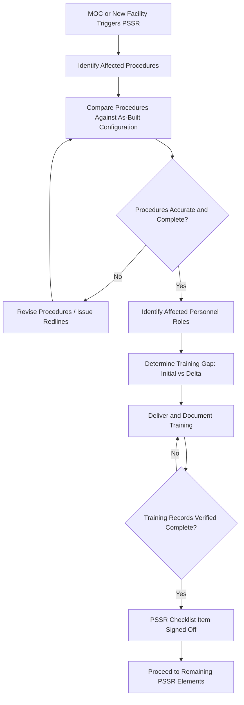
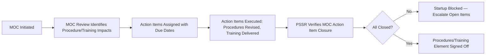

## Confirming Procedures and Training Are in Place

### Overview and Regulatory Basis

Within Pre-Startup Safety Review (PSSR), confirming that procedures and training are in place is one of the four mandatory elements specified under **29 CFR 1910.119(i)** — the OSHA PSM standard's PSSR requirement. The standard requires that prior to introducing highly hazardous chemicals (HHCs) to a process, the employer confirm:

1. Construction and equipment is in accordance with design specifications
2. Safety, operating, maintenance, and emergency procedures are in place and are adequate
3. A process hazard analysis has been performed for new facilities, and recommendations have been resolved or implemented before startup; modified facilities meet the management of change requirements
4. Training of each employee involved in operating the process has been completed

Element 2 and Element 4 together form the "procedures and training" confirmation, and they are treated jointly because a procedure with no corresponding trained workforce is operationally meaningless — the PSSR gate is not satisfied by the mere existence of a document in a binder.

### Why This Element Exists as a Distinct Gate

PSSR sits at the final chokepoint before hazardous materials are introduced to a system. Design review and PHA closure (Elements 1 and 3) confirm the *system* is safe; procedures and training confirmation (Elements 2 and 4) confirm the *humans operating the system* are prepared to run it safely under normal, abnormal, and emergency conditions. A process can be mechanically complete and PHA-clean and still be unsafe to start if operators are working from procedures that don't reflect as-built conditions, or if new/reassigned personnel have not been trained on the actual configuration they will operate.

### Scope of "Procedures" to Confirm

| Procedure Category | Confirmation Focus |
| --- | --- |
| Operating Procedures (1910.119(f)) | Steps for initial startup, normal operations, temporary operations, emergency shutdown, emergency operations, normal shutdown, and startup following a turnaround or emergency shutdown |
| Safe Work Practices | Control of hazardous energy (LOTO), confined space entry, hot work, line-breaking, opening process equipment |
| Maintenance Procedures (1910.119(j)) | Preventive/predictive maintenance tasks specific to new or modified equipment |
| Emergency Procedures | Evacuation routes, emergency shutdown sequences, spill/release response specific to the as-built configuration |
| Permit-to-Work Documents | Updated permit templates reflecting new equipment tags, isolation points, hazard classifications |

For each category, the PSSR review must verify two distinct things, which are often conflated but should be checked separately:

- **Existence**: Does a written procedure exist covering this equipment/process configuration?
- **Adequacy**: Does the procedure accurately reflect the as-built, as-commissioned state of the process — including field changes made during construction that may not yet be reflected in engineering documents?

The second check is where most PSSR procedural gaps originate. Construction and commissioning frequently introduce field deviations (routing changes, valve substitutions, instrument relocations) that are captured in redline drawings but not yet propagated into operating procedures.

### Scope of "Training" to Confirm

Training confirmation under Element 4 applies to every employee whose job function touches the process, not solely control room operators:

| Role Category | Training Confirmation Focus |
| --- | --- |
| Process Operators | Task-specific competency on the actual DCS/control logic, new equipment operation, updated alarm response |
| Maintenance Technicians | Mechanical integrity procedures for new equipment types, isolation procedures for new energy sources |
| Contractors (if applicable) | Site-specific hazard awareness, applicable PSM elements, emergency response integration |
| Shift Supervisors | Escalation criteria, abnormal situation management specific to the modified process |
| Emergency Responders | Updated process-specific hazard information (HHC inventory, new relief/vent points) |

Training confirmation should distinguish between **initial training** (new employees or newly assigned personnel receiving full-scope training) and **refresher/delta training** (existing trained personnel receiving training specifically on what changed). A common PSSR failure mode is verifying that operators hold a general "process training complete" record without confirming they received training specific to the modification being started up.

### PSSR Procedures/Training Confirmation Workflow

### PSSR Checklist Excerpt — Procedures and Training Section

| Item | Verification Method | Evidence Required | Sign-off |
| --- | --- | --- | --- |
| Operating procedures updated for new/modified equipment | Document review against P&IDs and field walk-down | Revision-controlled procedure with current rev date | Process Engineer |
| Emergency shutdown procedure reflects new safety instrumented functions | Cross-check against SIS logic documentation | Approved ESD procedure | Process Safety Engineer |
| LOTO procedures issued for new isolation points | Field verification of isolation point tags against procedure | Equipment-specific LOTO procedure | Maintenance Supervisor |
| All assigned operators trained on modified process | Training record audit | Signed training completion records, competency assessment results | Operations Manager |
| Contractors briefed on process-specific hazards (if applicable) | Orientation log review | Contractor orientation sign-in sheet | Site Safety Coordinator |
| Training content reflects PHA recommendations implemented in design | Cross-reference PHA action item closure list against training material | Updated training curriculum | Process Safety Engineer |

### Determining Training Adequacy — Competency vs. Completion

A recurring PSSR quality issue is treating training as satisfied by attendance rather than demonstrated competency. Mature PSM programs require a competency verification step beyond a sign-in sheet:

- **Knowledge check**: Written or verbal assessment confirming comprehension of new procedure content
- **Skills demonstration**: Supervised walkthrough or simulator exercise for high-consequence tasks (e.g., emergency shutdown sequence, new interlock bypass procedure)
- **Sign-off by qualified evaluator**: Someone other than the trainer confirms the trainee can perform the task correctly

[Inference — the specific rigor of competency verification (knowledge check vs. full skills demonstration) is not uniformly specified by OSHA 1910.119 and is typically defined by internal company PSSR procedure or industry guidance such as CCPS Guidelines for Management of Change.]

### Handling Gaps Found During PSSR

When the PSSR review identifies a procedures or training gap, standard practice is to treat it as a **startup-blocking finding** unless a documented risk-based justification supports proceeding with a compensating measure. Compensating measures are not a substitute for closure — they are a temporary bridge with an explicit closure deadline.

| Gap Type | Typical Blocking Determination | Example Compensating Measure (if deferral is risk-justified) |
| --- | --- | --- |
| Missing emergency procedure for new equipment | Always blocking | None acceptable — must be resolved before startup |
| Minor procedure formatting/reference update | May be non-blocking | Redline procedure in use, formal revision tracked with due date |
| Training completed but competency not verified | Typically blocking for high-consequence tasks | Direct supervision by qualified operator during initial startup runs, formal assessment scheduled within defined window |
| Contractor orientation pending for non-critical-path personnel | May be non-blocking | Restrict contractor access to affected areas until orientation complete |

### Relationship to Management of Change (MOC)

For modified (as opposed to new) facilities, the procedures and training confirmation in PSSR functions as a closure check on MOC-generated action items. The MOC process should have already identified which procedures require revision and which personnel require training as a consequence of the change; PSSR verifies that this MOC-identified scope was actually completed, not merely scheduled.

A common audit finding is a disconnect where MOC action items are marked "complete" in a tracking system without PSSR independently verifying the underlying procedure or training artifact — treating MOC closure as sufficient evidence without direct PSSR confirmation defeats the purpose of maintaining it as a separate, independent gate.

### Documentation Retention

Per PSM recordkeeping expectations, PSSR checklist completion (including the procedures/training sub-element) should be retained as part of the process safety information package, with training records cross-referenced per 1910.119(g)(3), which requires documentation of the identity of the employee, the date of training, and the means used to verify understanding.

**Related Topics**

- Pre-Startup Safety Review: Equipment and Construction Verification
- Management of Change (MOC) Procedures and Action Item Tracking
- Operating Procedures Development per 29 CFR 1910.119(f)
- Training Program Design and Competency Assessment for PSM-Covered Processes
- Process Hazard Analysis Recommendation Closure Tracking
- Contractor Safety Management under PSM
- Emergency Shutdown Procedure Development
- Mechanical Integrity Program Requirements (1910.119(j))