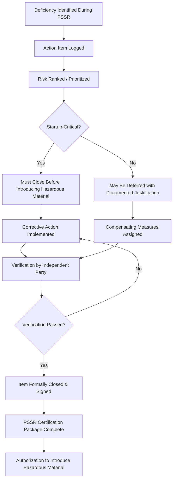
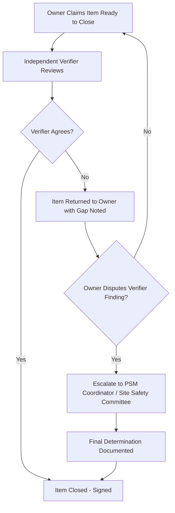

## Closing Out Pre-Startup Action Items

### Overview

Closing out Pre-Startup Safety Review (PSSR) action items is the final control gate before a process unit, modified equipment, or new installation is authorized to introduce hazardous materials or energy. OSHA's Process Safety Management standard (29 CFR 1910.119(i)) requires a PSSR for new facilities and for modified facilities when the modification is significant enough to require a change in the process safety information. The regulation is explicit that three conditions must be confirmed before startup, and outstanding action items are the mechanism by which gaps identified during the PSSR are tracked to resolution.

A PSSR that identifies deficiencies but has no disciplined closure process is functionally equivalent to not having done the review at all — the hazard is documented but not controlled.

### Regulatory Basis

29 CFR 1910.119(i) requires that prior to introducing a highly hazardous chemical into a process:

- Construction and equipment must be in accordance with design specifications
- Safety, operating, maintenance, and emergency procedures must be in place and adequate
- For new facilities, a process hazard analysis must be performed and recommendations resolved or implemented before startup, and modified facilities must meet the requirements of management of change (1910.119(l))
- Training of each employee involved in the process must be completed

**Key Points**

- The standard does not prescribe a specific closure workflow — it establishes the outcome (confirmed compliance) that a site's closure procedure must achieve.
- [Inference] Most enforcement citations in this area (per publicly available OSHA citation history) relate to sites conducting the PSSR checklist walk-through but failing to demonstrate documented closure of identified gaps, rather than failing to hold the review at all.

### The Action Item Lifecycle

A pre-startup action item moves through a defined lifecycle. Treating closure as a single step ("check the box") rather than a lifecycle is the most common source of PSM audit findings.

### Classifying Action Items for Closure

Not every item found during a PSSR carries the same startup risk. A defensible closure program classifies items so that reviewers and management understand which items are true "startup blockers" versus which can be tracked to closure on a post-startup schedule with compensating measures.

| Classification | Definition | Startup Impact |
| --- | --- | --- |
| Critical / Startup-Blocking | Directly affects the three regulatory pillars: construction fidelity, procedure adequacy, or training completeness | Must be closed and verified before hazardous material introduction |
| Major / Deferred with Compensating Measures | Deficiency exists but interim controls (e.g., temporary procedure, additional supervision, restricted operating envelope) adequately manage the risk | Startup permitted only if compensating measure is itself documented, implemented, and time-bound |
| Minor / Housekeeping | Administrative, cosmetic, or non-safety-critical (e.g., missing equipment label, non-critical documentation formatting) | Does not block startup; tracked in standard punch-list system |

**Example**

- Critical: A relief valve installed is not the one specified in the design package (wrong set pressure). This is a construction-fidelity gap directly tied to 1910.119(i)(1) and blocks startup outright.
- Major/Deferred: The final version of an emergency shutdown procedure is in a draft/redline state pending one signature, but the operating team has been trained on the substantive content and a temporary controlled copy is issued with a 5-business-day closure deadline.
- Minor: A P&ID revision tag on a posted drawing in the control room reflects an outdated revision letter, though the underlying document control system has the correct current revision.

### Verification: The Core of "Closing Out"

Closing an action item requires verification distinct from the person who performed the corrective action. This mirrors the independent-verification principle found throughout PSM elements (e.g., mechanical integrity inspections, MOC reviews).

**Verification methods commonly used:**

- **Field walk-down** — physically confirming installed equipment/configuration matches the corrective action description and the underlying design package
- **Document review** — confirming the revised procedure, drawing, or training record exists, is approved, and is distributed to the correct document control locations
- **Functional/operational test** — confirming an instrument, interlock, or safety device performs to specification (e.g., a bypass loop test after wiring correction)
- **Training verification** — confirming attendance records, competency assessments, or sign-off sheets exist for all employees who will operate the affected process

[Unverified] Whether a given site requires verification by a role distinct from operations (e.g., PSM coordinator, independent engineer) is determined by internal procedure rather than the OSHA standard itself, which does not name a specific verifier role.

### Documentation Requirements for Closure

A defensible PSSR closure package typically includes:

1. **The original PSSR checklist/report** with each item numbered and cross-referenced
2. **Action item log** showing: item description, classification/risk ranking, assigned owner, target closure date, actual closure date
3. **Evidence of closure** for each item (photos, revised procedure with approval signature, training roster, test results)
4. **Verifier sign-off** — name, role, date, and method of verification for each item
5. **Compensating measure documentation** for any item deferred past startup, including the time-bound expiration of that measure
6. **Final authorization signature** from the accountable manager (commonly the plant/unit manager or PSM-designated authority) explicitly stating hazardous material introduction is authorized

**Key Points**

- Signature authority for final closure should be defined in the site's written PSM program, not improvised at the time of startup.
- Compensating measures must have their own closure date; an "interim" measure with no expiration effectively becomes a permanent, undocumented deviation from the intended safeguard.

### Common Failure Modes in Action Item Closeout

- **Verbal closure** — an item marked "closed" based on a verbal assurance from a contractor or engineer with no physical or documentary verification
- **Self-verification** — the same individual who performed the corrective action also signs off on its verification
- **Scope creep on deferrals** — an item initially deferred with a compensating measure is repeatedly re-deferred past its original expiration without re-evaluation
- **Orphaned minor items** — minor/housekeeping items placed in a general punch list that has no forcing function, so they are never actually completed
- **Disconnected from MOC** — a PSSR reveals that the as-built condition differs from the design package, but the discrepancy is corrected in the field without a retroactive Management of Change record, leaving the process safety information permanently out of sync with reality

[Inference] Disconnection between PSSR closure and MOC records is a plausible contributor to process safety information drift over a facility's life cycle, based on how the two PSM elements interact procedurally, though the extent varies by site.

### Action Item Closure Checklist (Practical Template)

```mermaid
flowchart LR
    subgraph Item Record
    A1[Item ID]
    A2[Description]
    A3[Source: PSSR / PHA / MOC]
    A4[Classification: Critical/Major/Minor]
    end
    subgraph Ownership
    B1[Assigned Owner]
    B2[Target Date]
    end
    subgraph Closure Evidence
    C1[Corrective Action Description]
    C2[Verification Method Used]
    C3[Verifier Name/Role - Independent of Owner]
    C4[Evidence Attached: Photo/Doc/Test Result]
    end
    subgraph Authorization
    D1[Compensating Measure - if deferred]
    D2[Expiration Date of Measure]
    D3[Final Sign-off - Accountable Manager]
    end
    A1 --> A2 --> A3 --> A4 --> B1 --> B2 --> C1 --> C2 --> C3 --> C4 --> D1 --> D2 --> D3
```

### Relationship to Other PSM Elements

Closing PSSR action items does not occur in isolation — it interfaces directly with:

- **Management of Change (1910.119(l))** — if a corrective action changes the process from its original design intent (rather than restoring it to design intent), it may itself require an MOC
- **Process Hazard Analysis (1910.119(e))** — for new facilities, PHA recommendations must be resolved or implemented before startup; PSSR closure often absorbs and re-verifies PHA action item status
- **Training (1910.119(g))** — the PSSR's training-completeness pillar depends on training records being current, which ties closure verification to the training element's documentation system
- **Mechanical Integrity (1910.119(j))** — construction-fidelity verification during PSSR closure frequently draws on MI inspection and test records for the newly installed or modified equipment

### Sample Escalation Path for Contested Closures

**Related Topics**

- Pre-Startup Safety Review: Scope and Applicability Criteria
- Management of Change Integration with PSSR
- Process Hazard Analysis Recommendation Tracking
- Mechanical Integrity Inspection Records as PSSR Evidence
- Written Program Requirements for PSM Element Interfaces
- Root Cause Analysis for Recurring PSSR Deficiencies
- Contractor Safety and PSSR Responsibilities on Turnaround Projects