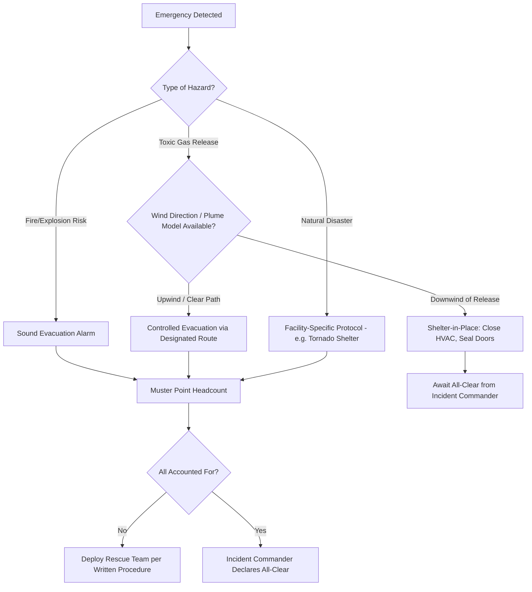
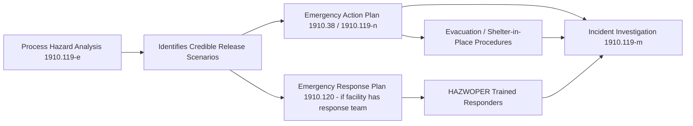

## Emergency Action Plans


### Overview

An Emergency Action Plan (EAP) is a written document required under 29 CFR 1910.38 that establishes the procedures employees must follow in the event of a fire or other emergency. It is distinct from an Emergency Response Plan under 1910.120 (HAZWOPER) — the EAP is fundamentally an evacuation and employee-protection document, not a hazardous materials response document. Understanding this distinction is the starting point for correctly scoping an EAP within a broader PSM/emergency planning program under 1910.119(n).

### Regulatory Basis and Scope

29 CFR 1910.38 requires a written EAP whenever an EAP is required by a particular OSHA standard (fixed extinguishing systems, process safety management, etc.) or where an employer chooses to have one. Under 1910.119(n), facilities covered by PSM must establish and implement an emergency action plan in accordance with 1910.38.

**Key Points**

- An EAP may be communicated orally only in workplaces with 10 or fewer employees; PSM-covered facilities are effectively always required to keep it in writing given plan complexity and headcount.
- The EAP must be reviewed with each employee when the plan is developed, when the employee's responsibilities change, and when the plan itself changes.
- 1910.38 does not require fighting fires; an EAP that assumes total evacuation on alarm (rather than incipient-stage firefighting by trained employees) is a valid and common compliance strategy.

### Minimum Required Elements (1910.38(c))

| Element | Requirement |
| --- | --- |
| Reporting procedures | Means for reporting fires and other emergencies |
| Evacuation procedures | Procedures and emergency escape route assignments |
| Critical operations | Procedures for employees who remain to operate critical plant operations before evacuating |
| Accountability | Procedures to account for all employees after evacuation |
| Rescue and medical duties | Procedures for employees performing rescue or medical duties |
| Employee identification | Preferred means for reporting fires/emergencies |
| Contact person | Name/job title of persons who can be contacted for further information |

### The EAP Development Workflow

```mermaid
flowchart TD
    A[Identify Credible Emergency Scenarios] --> B[Fire, Chemical Release, Explosion, Natural Disaster, Medical]
    B --> C[Define Evacuation Routes and Exits]
    C --> D[Establish Alarm Systems and Notification Methods]
    D --> E[Assign Roles: Wardens, Coordinators, Rescue/Medical Teams]
    E --> F[Define Accountability / Headcount Method]
    F --> G[Define Critical Operations Shutdown Procedures]
    G --> H[Integrate with Fire Prevention Plan]
    H --> I[Write the Document per 1910.38(c)]
    I --> J[Train All Employees on Plan]
    J --> K[Conduct Drills]
    K --> L[Review Annually or After Significant Change]
    L --> A
```

### Emergency Scenario Identification

A defensible EAP begins from a documented hazard/scenario assessment rather than a generic template. For a PSM-covered facility, this scenario list should draw directly from the Process Hazard Analysis (1910.119(e)) rather than being developed independently.

**Example scenario categories for a chemical process facility:**

- Toxic or flammable gas release inside a process unit
- Fire involving process equipment or storage tanks
- Explosion / vapor cloud ignition
- Natural disaster affecting facility integrity (earthquake, hurricane, flood — regionally dependent)
- Medical emergency involving chemical exposure
- Utility failure creating a hazardous condition (loss of cooling, loss of containment on power failure)

[Inference] Facilities that build their EAP scenario list directly from PHA "what-if"/HAZOP findings tend to produce evacuation routes and shelter-in-place criteria that are more specific to actual site hazards than templated generic plans, though this is a program-design observation rather than an explicit regulatory requirement.

### Evacuation vs. Shelter-in-Place Decision Logic

Not all emergencies at a chemical facility call for full-site evacuation. A toxic gas release, for example, may make shelter-in-place safer than moving people through an unknown plume path. The EAP should specify decision criteria, not just "evacuate on alarm."



### Roles and Responsibilities

| Role | Typical Responsibility |
| --- | --- |
| Emergency Coordinator | Overall authority to declare an emergency, direct response, and give the all-clear |
| Floor/Area Wardens | Sweep assigned areas, direct evacuation, report status to Coordinator |
| Accountability Officer | Maintain and execute headcount procedure at muster points |
| Rescue/Medical Team (if designated) | Perform rescue or first-aid duties per 1910.38(c)(1)(v) — must be specifically trained, not assumed of general staff |
| Critical Operations Personnel | Execute shutdown of designated equipment before evacuating, per a written, sequenced procedure |

**Key Points**

- Personnel assigned to remain behind for critical operations shutdown must have a written, specific procedure and a hard time/condition limit at which they too must evacuate — an open-ended "stay until it's handled" assignment is a common audit finding and a genuine life-safety risk.
- Designating employees for rescue/medical duty pulls in additional training obligations (e.g., first aid/CPR, or HAZWOPER awareness-level training if the "rescue" could involve hazardous material exposure).

### Alarm and Notification Systems

The EAP must specify how employees are notified. Common methods:

- Audible alarms (distinct tone for evacuate vs. shelter-in-place, ideally per NFPA 72 or equivalent)
- Visual alarms for hearing-impaired employees or high-noise areas
- Public address / mass notification systems
- Two-way radio for response teams

[Unverified] Whether a specific facility's alarm system meets applicable NFPA signaling code requirements is a facility-specific engineering determination, not something documented by the EAP itself.

### Training Requirements

1910.38 requires the employer to review the plan with each employee:

- When the plan is developed or the employee is assigned initially
- When the employee's responsibilities under the plan change
- When the plan is changed

**Example training program structure:**

1. General employee EAP orientation (evacuation routes, alarm meanings, muster point) — all employees
2. Role-specific training (wardens, accountability officers) — assigned personnel
3. Drills — practical exercise of the plan, discussed below
4. Refresher training — tied to plan revision or role change, not a fixed calendar interval under 1910.38 itself

### Drills and Plan Evaluation

While 1910.38 does not mandate a specific drill frequency, drills are the primary mechanism for validating that a paper plan actually functions.

**Key Points**

- A drill should test the entire chain: detection/alarm, evacuation/shelter decision, route usability, accountability, and all-clear communication — not just "people walked outside."
- Post-drill critique should feed back into plan revision; a drill that reveals a bottlenecked exit or a muster point too close to a hazard should trigger a documented plan update.
- [Inference] Facilities integrated with PSM programs often align drill frequency with other PSM-driven periodic activities (e.g., annual PHA revalidation cycles), though this is a program design choice rather than an explicit 1910.38 requirement.

### Integration with the Fire Prevention Plan

1910.39 requires a companion Fire Prevention Plan (FPP) wherever an EAP is required by a specific standard. The FPP addresses fire hazard sources, housekeeping, and control of ignition sources — it is a prevention document, while the EAP is a response document. The two are commonly combined into a single written program but must each independently satisfy their respective element list.

### Integration with PSM Emergency Response (1910.119(n))

For PSM-covered processes, the EAP interfaces with the broader emergency response obligations:



**Key Points**

- A facility that relies entirely on outside emergency responders (municipal fire/hazmat) and does not have its own response team needs only the EAP (1910.38) integrated with 1910.119(n) — not a full 1910.120 HAZWOPER Emergency Response Plan.
- A facility that maintains its own hazmat response team takes on the additional, more extensive training and program requirements of 1910.120(q).

### Common Compliance Gaps

- EAP written generically (purchased template) without site-specific evacuation routes, muster points, or hazard scenarios
- No documented review of the plan with new employees at time of assignment
- Rescue/medical duty assigned informally to staff without documented training
- Critical-operations shutdown procedures exist informally ("ask the shift supervisor") rather than as a written, specific, time-bound procedure
- Muster points located too close to credible hazard zones (e.g., within potential vapor cloud or blast radius identified in the PHA)
- No mechanism to verify all personnel — including contractors and visitors — are included in the accountability count

### Documentation and Recordkeeping

A defensible EAP program file typically includes:

1. The written plan itself, current revision
2. Training records showing plan review per the required triggers
3. Drill records (date, scenario, participants, deficiencies noted, corrective actions)
4. Evidence of employee/role-specific training for wardens, rescue/medical personnel
5. Revision history tied to facility changes (new construction, changed process, staffing changes)

**Related Topics**

- Fire Prevention Plans (1910.39) and Their Relationship to the EAP
- Emergency Response Plans and HAZWOPER (1910.120) Applicability Thresholds
- Incident Investigation Procedures Following an Emergency Activation
- PHA-Derived Emergency Scenario Identification
- Mass Notification and Alarm System Design Considerations
- Accountability Systems for Contractors and Transient Personnel During Evacuation