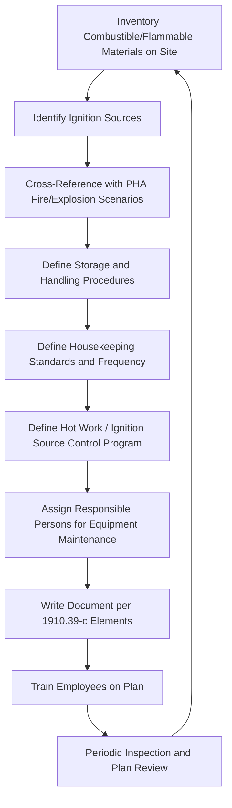
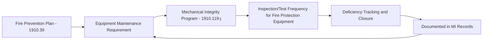
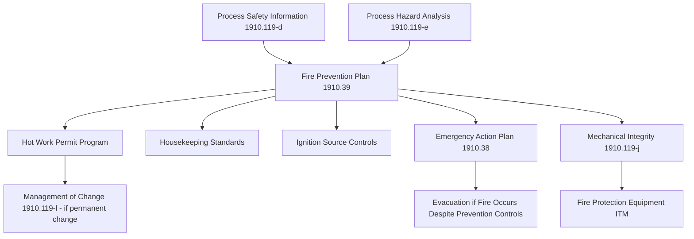

## Fire Prevention Planning

### Overview

A Fire Prevention Plan (FPP) is a written program required under 29 CFR 1910.39 wherever an OSHA standard requires an accompanying Emergency Action Plan (1910.38) — which includes PSM-covered facilities under 1910.119(n). The FPP and EAP are complementary but distinct: the EAP governs what employees do *during* an emergency (evacuation, accountability, shelter-in-place); the FPP governs *preventing* fires from starting and controlling fuel/ignition sources before an emergency occurs.

### Regulatory Basis and Scope

29 CFR 1910.39 requires a written fire prevention plan whenever a particular OSHA standard requires one. Like the EAP, it may be communicated orally only in workplaces with 10 or fewer employees — effectively meaning PSM-covered facilities must maintain it in writing.

**Key Points**

- The FPP is a prevention document; it does not replace the EAP's evacuation/response procedures, nor does it substitute for a full 1910.120 Emergency Response Plan if the facility maintains its own fire brigade.
- The FPP must be reviewed with employees upon initial assignment to a job and whenever the plan changes.

### Minimum Required Elements (1910.39(c))

| Element | Requirement |
| --- | --- |
| Major fire hazards | List of major workplace fire hazards, proper handling and storage procedures for hazardous materials, potential ignition sources and their control, and the type of fire protection equipment necessary to control each hazard |
| Housekeeping procedures | Procedures to control accumulation of flammable/combustible waste materials |
| Ignition source control | Procedures for controlling ignition sources such as smoking, welding, and open flames |
| Equipment maintenance | Procedures for regular maintenance of safeguards installed on heat-producing equipment |
| Responsible personnel | Names or job titles of persons responsible for maintaining equipment to prevent/control ignition or fire, and for control of fuel source hazards |

### The FPP Development Workflow

### Identifying Major Fire Hazards

A defensible FPP begins with a specific, site-derived hazard inventory rather than a generic list. For PSM-covered facilities, this inventory should draw from Process Safety Information (1910.119(d)) — particularly material safety data and process chemistry — as well as PHA findings related to fire and explosion scenarios.

**Example hazard categories for a chemical process facility:**

- Flammable liquid storage tanks and transfer operations
- Combustible dust accumulation (if applicable to the process)
- Flammable/combustible gas piping and connections
- Oxidizer storage in proximity to fuels
- Electrical equipment in classified (hazardous) areas
- Hot work locations (welding, cutting, grinding) near flammable atmospheres

**Example**

A facility storing flammable solvents in a warehouse adjacent to a process unit would document: the solvent's flash point and quantity, the storage configuration (drums vs. tanks, spacing, secondary containment), nearby ignition sources (forklift traffic, electrical panels), and the specific fire protection equipment provided (foam suppression, portable extinguishers rated for Class B fires).

### Ignition Source Control

| Source Category | Typical Controls |
| --- | --- |
| Hot work (welding, cutting, grinding) | Hot work permit system, fire watch, combustible material clearance distance |
| Smoking | Designated smoking areas only, prohibition in classified/hazardous areas |
| Electrical equipment | Area classification (per NEC/NFPA 70) compliance, intrinsically safe equipment where required |
| Static electricity | Bonding and grounding procedures for flammable liquid transfer |
| Open flames | Prohibition or strict permit control near flammable storage/process areas |
| Friction/mechanical sparking | Maintenance program for rotating equipment, non-sparking tools in classified areas |

**Key Points**

- Hot work permitting is frequently the single highest-value control in an FPP because it forces a documented, time-bound risk assessment (combustible removal, fire watch assignment, atmospheric monitoring) at the exact moment an ignition source is introduced into a variable-risk environment.
- [Inference] Facilities that integrate hot work permitting with their Management of Change or Permit-to-Work systems tend to have more consistent enforcement than those relying on a standalone hot work form, though this is a program-design observation rather than a specific regulatory mandate.

### Housekeeping Procedures

The FPP must address control of accumulated combustible waste. This is often underweighted relative to its actual fire-load contribution.

**Example housekeeping standard structure:**

1. Combustible waste (packaging, rags, paper) removed from process areas at a defined frequency (e.g., end of each shift)
2. Oily rags stored in covered, self-closing metal containers pending disposal
3. Flammable liquid spill response and immediate cleanup procedure
4. Regular inspection of dust accumulation on horizontal surfaces where combustible dust is present, per applicable dust hazard analysis
5. Clear egress paths and unobstructed access to fire protection equipment (extinguishers, hose stations, sprinkler risers) maintained at all times

### Equipment Maintenance Program

1910.39(c) requires procedures for regular maintenance of safeguards installed on heat-producing equipment (furnaces, ovens, boilers, etc.) to prevent accidental ignition of combustible materials. This element links directly to the Mechanical Integrity element (1910.119(j)) for PSM-covered equipment.

**Key Points**

- Fire protection equipment itself (sprinkler systems, fixed suppression, fire pumps, detection systems) typically falls under NFPA inspection/test/maintenance standards (e.g., NFPA 25 for water-based systems) referenced by the facility's MI program, not solely by the FPP document.
- [Unverified] The specific NFPA edition and inspection frequency applicable to a given facility's fire protection systems depends on the authority having jurisdiction and insurance carrier requirements, which vary by location and are not fixed by 1910.39 itself.

### Responsible Personnel Designation

The FPP must name (by name or job title) the persons responsible for:

- Maintaining equipment to prevent or control ignition sources
- Controlling fuel source hazards

**Example designation structure:**

| Responsibility | Designated Role |
| --- | --- |
| Hot work permit issuance and oversight | Area Supervisor / Safety Coordinator |
| Fire protection equipment inspection | Maintenance Department Lead |
| Housekeeping standard enforcement | Shift Supervisor |
| Flammable/combustible material storage compliance | EHS Manager |

### Training Requirements

1910.39 requires the FPP be reviewed with each employee upon initial assignment and whenever the plan changes.

**Example training program structure:**

1. General employee orientation covering major fire hazards in their work area and basic prevention responsibilities (housekeeping, no unauthorized ignition sources)
2. Hot work permit training for personnel who issue or perform hot work
3. Fire extinguisher use training (tied separately to 1910.157 if portable extinguishers are provided for employee use)
4. Refresher training tied to plan revision, process change, or new hazard introduction

### Integration with Broader PSM Elements

### Common Compliance Gaps

- FPP written as a generic template without site-specific fire hazard inventory
- Hot work permits issued without documented fire watch or post-work monitoring period
- Housekeeping standards exist on paper but are not enforced or inspected on a defined schedule
- Responsible persons named by title only, with no evidence the named role actually performs the assigned maintenance/control function
- No linkage between FPP ignition source controls and area electrical classification documentation
- Fire protection equipment maintenance records maintained separately from the FPP with no cross-reference, making it difficult to demonstrate the FPP's maintenance requirement is actually being executed

### Documentation and Recordkeeping

A defensible FPP program file typically includes:

1. The written plan itself, current revision, containing all 1910.39(c) elements
2. Fire hazard inventory with cross-reference to PSI/PHA source documents
3. Hot work permit records
4. Housekeeping inspection records
5. Fire protection equipment inspection/test/maintenance records (or cross-reference to the MI program's records)
6. Employee training records showing initial review and any plan-change refreshers

**Related Topics**

- Emergency Action Plans (1910.38) and Their Relationship to the FPP
- Hot Work Permit Systems and Fire Watch Requirements
- Combustible Dust Hazard Analysis
- Area Electrical Classification (NEC/NFPA 70) for Ignition Source Control
- Mechanical Integrity Program Integration for Fire Protection Equipment (NFPA 25)
- Flammable and Combustible Liquid Storage Requirements (NFPA 30)