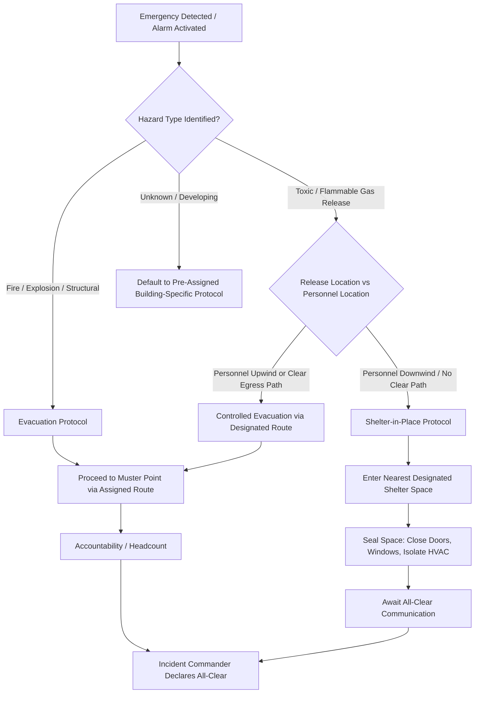
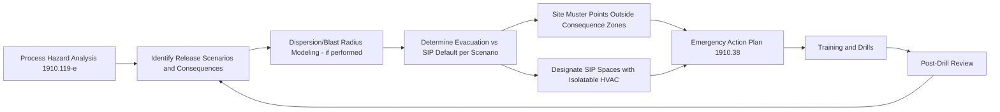

## Evacuation and Shelter in Place Procedures

### Overview

Evacuation and shelter-in-place (SIP) are the two fundamental protective action strategies available when an emergency occurs at a chemical process facility. Neither is universally correct — the appropriate choice depends on the nature of the hazard, its location relative to personnel, and how it is expected to develop over time. A mature emergency planning program builds explicit decision logic into the Emergency Action Plan (1910.38) rather than defaulting to "evacuate on any alarm," because for certain releases evacuation can move people directly into a hazard rather than away from it.

### Regulatory and Standards Context

- 29 CFR 1910.38 requires evacuation procedures and escape route assignments as part of the EAP but does not itself mandate shelter-in-place as an alternative — SIP protocols are typically a facility-level design decision informed by hazard analysis.
- 1910.119(n) requires PSM-covered facilities to establish an emergency action plan per 1910.38, informed by the process hazards identified during the PHA (1910.119(e)).
- [Unverified] Community-level shelter-in-place guidance (e.g., from EPA's Risk Management Program rule, 40 CFR Part 68, or local Local Emergency Planning Committee protocols) may impose additional or complementary requirements depending on the facility's regulatory classification; applicability is facility- and jurisdiction-specific.

### Evacuation vs. Shelter-in-Place: Core Decision Criteria

| Factor | Favors Evacuation | Favors Shelter-in-Place |
| --- | --- | --- |
| Hazard type | Fire, explosion risk, structural collapse | Toxic gas/vapor cloud release |
| Release duration | Long-duration or escalating (e.g., structural fire) | Short-duration, expected to dissipate |
| Plume/dispersion behavior | N/A — hazard doesn't require plume modeling | Wind carrying hazard directly toward personnel path |
| Building integrity | Structure compromised or at risk | Structure sound, HVAC can be isolated |
| Route safety | Clear path away from hazard exists | No safe path exists without crossing plume |
| Time to affect personnel | Immediate threat requiring egress | Time available to seal spaces before exposure |

**Key Points**

- The distinguishing factor most often driving the SIP decision at a chemical facility is a toxic or flammable vapor release where the outdoor plume presents greater risk to personnel than remaining indoors with HVAC isolated.
- A single facility should have pre-established, hazard-specific default actions (not a case-by-case judgment call made under stress) for its highest-consequence scenarios identified in the PHA.

### Decision Logic Flow

### Evacuation Procedures

**Core components:**

1. **Alarm recognition** — distinct audible/visual signal specifically meaning "evacuate," differentiated from any SIP-specific alarm tone
2. **Designated routes** — primary and at least one alternate route per area, posted and known to occupants, verified clear of obstruction through routine inspection
3. **Muster points** — locations outside the facility, positioned outside credible hazard zones identified in the PHA (blast radius, vapor cloud dispersion distance), with adequate separation from the facility and from vehicle/emergency response staging areas
4. **Accountability** — a defined method (roll call sheet, badge scan, headcount by supervisor) executed at each muster point, including contractors and visitors
5. **Assistance for employees needing help** — a specific, pre-assigned plan for employees who cannot self-evacuate unassisted (mobility limitations, etc.)
6. **Critical operations shutdown** — a written, sequenced, time-bound procedure for any personnel who must remain briefly to shut down equipment before evacuating

**Example**

A control room operator on a shift near a reactor that must be brought to a safe shutdown state before the operator evacuates should follow a written procedure specifying the exact valve/interlock sequence and a hard time limit (e.g., "complete within 3 minutes of alarm or evacuate regardless of shutdown state"), not an open-ended instruction to "shut it down safely first."

### Muster Point Placement Considerations

Muster point siting is a common area of weakness in facility EAPs. Placement should be informed by the same consequence modeling used in the PHA and, where applicable, offsite consequence analysis.

**Key Points**

- A muster point positioned within the vapor dispersion distance or blast overpressure radius of a credible release scenario defeats its own purpose.
- Multiple muster points (primary plus at least one alternate, positioned in different directions relative to the facility) allow flexibility when wind direction or release location makes the primary point unsafe.
- [Inference] Facilities that periodically re-validate muster point placement against updated PHA consequence data (rather than fixing muster points once at facility construction) are better positioned to catch siting problems introduced by later plant expansions, though this is a program-design inference rather than an explicit standard requirement.

### Shelter-in-Place Procedures

**Core components:**

1. **Alarm recognition** — a distinct tone/signal meaning "shelter, do not evacuate," clearly differentiated from the evacuation alarm
2. **Designated shelter spaces** — interior rooms/areas identified in advance, ideally with minimal exterior wall/window exposure and HVAC that can be readily isolated
3. **Sealing procedures** — closing and, where provided, sealing doors, windows, and vents; shutting down HVAC systems serving the space; using door/window seals (wet towels, tape) if provided and trained upon
4. **Communication during shelter** — a means for personnel inside the shelter space to receive updates (radio, PA system, phone) without needing to exit to get information
5. **Duration and all-clear** — SIP is a temporary measure; the plan must specify how personnel will be told when it is safe to exit, and by whom (typically the Incident Commander or Emergency Coordinator)

**Example**

A control room adjacent to a process unit handling a toxic gas may be pre-designated as a SIP location with a dedicated, isolatable HVAC damper and a positive-pressure air supply, specifically because control room personnel need to remain in place to monitor and potentially intervene in the process even during a nearby release — a scenario where evacuation is neither desired nor safe.

### Alarm Differentiation

Because evacuation and SIP require opposite physical actions, the EAP must ensure personnel can unambiguously distinguish between the two alarm conditions.

| Alarm Type | Typical Signal Pattern | Required Employee Action |
| --- | --- | --- |
| Evacuation | Continuous horn/siren | Proceed to muster point via designated route |
| Shelter-in-Place | Distinct intermittent/pulsed tone, often paired with PA announcement | Move to nearest designated shelter space, seal, await instruction |
| All-Clear | Verbal PA announcement or a third distinct tone | Resume normal activity or follow further instruction |

[Unverified] The specific tone patterns used to differentiate evacuation from SIP alarms are facility-specific engineering and procedural decisions; no single OSHA-mandated tone pattern exists, though NFPA 72 and similar consensus standards provide design guidance commonly referenced by facilities.

### Training and Drills

- General employee training must cover both protocols, including how to distinguish the alarms and the physical actions required for each
- [Inference] Facilities benefit from drilling both evacuation and SIP scenarios separately, since the two require opposite instinctive actions (leaving vs. staying) and personnel default to whichever they last practiced under stress — this reflects general human-factors reasoning about emergency response rather than a specific regulatory citation
- Drill debriefs should specifically test whether personnel correctly identified which protocol applied to the simulated scenario, not just whether they executed either action correctly

### Integration with PHA and Consequence Analysis

### Common Compliance Gaps

- Single alarm tone used for all emergencies, forcing personnel to guess whether to evacuate or shelter
- Muster points sited without reference to PHA consequence distances
- No designated SIP spaces identified in advance — employees left to select an arbitrary room during an actual event
- SIP spaces lack HVAC isolation capability, undermining the protective value of sheltering
- Critical operations shutdown assigned informally with no hard time limit
- Accountability procedures that omit contractors, visitors, or personnel in remote areas of a large site
- Drills that exercise only evacuation, leaving SIP procedures untested

### Documentation and Recordkeeping

A defensible evacuation/SIP program file typically includes:

1. Written procedures for both protocols within the EAP, including decision criteria
2. Site maps showing evacuation routes, muster points, and designated SIP spaces
3. PHA cross-reference showing how consequence modeling informed muster point and SIP space siting
4. Training records for general employees and any specially assigned roles
5. Drill records covering both evacuation and SIP scenarios, with debrief findings and corrective actions
6. Alarm system documentation confirming distinct, tested signal patterns for each protocol

**Related Topics**

- Emergency Action Plans (1910.38) — Full Program Requirements
- PHA-Derived Consequence Modeling for Muster Point and Shelter Siting
- HVAC Isolation Design for Shelter-in-Place Spaces
- Alarm and Mass Notification System Design (NFPA 72)
- Accountability Systems for Contractors and Visitors
- Community Emergency Planning Coordination (LEPC / EPA RMP Interfaces)