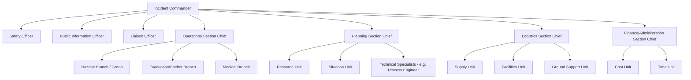
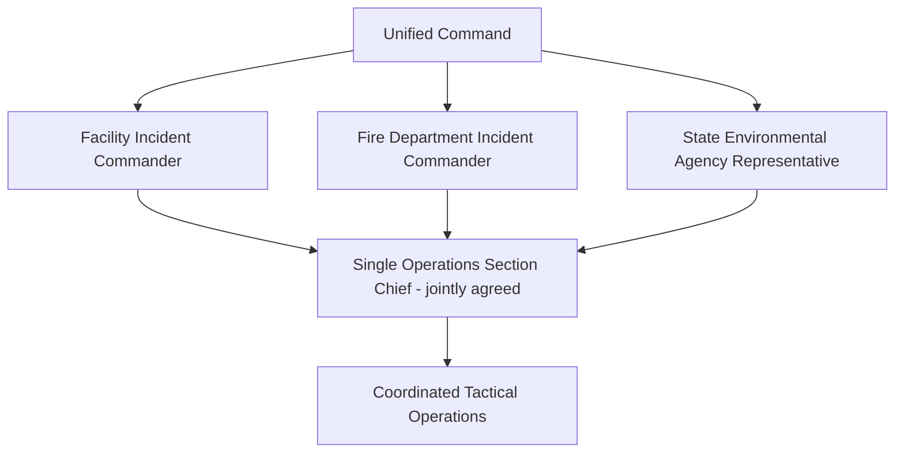
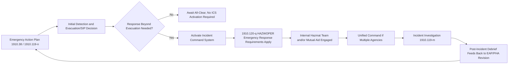

## Incident Command System

### Overview

The Incident Command System (ICS) is a standardized, on-scene management structure for organizing personnel, facilities, equipment, and communications during an emergency response. Originally developed for wildland firefighting, ICS was formalized nationally under the National Incident Management System (NIMS) and is the management framework OSHA references in 1910.120(q) for hazardous materials emergency response operations. For a PSM-covered facility, ICS is the organizational backbone that coordinates the Emergency Action Plan's evacuation/shelter procedures with any active hazardous materials response, whether performed by an internal team or arriving mutual aid/municipal responders.

### Regulatory and Standards Basis

- 29 CFR 1910.120(q)(3) requires that "the senior emergency response official responding to an emergency shall become the individual in charge of a site-specific Incident Command System (ICS)," applicable to facilities engaged in emergency response to releases of hazardous substances.
- NIMS (established under Homeland Security Presidential Directive 5) designates ICS as the standardized on-scene incident management approach used across U.S. emergency response disciplines, enabling interoperability between facility response teams and public sector responders (fire, hazmat, law enforcement).
- 1910.119(n) ties PSM emergency planning to 1910.38, and where a facility's own response extends into active hazmat mitigation (not just evacuation), 1910.120(q) and its ICS requirement become applicable.

**Key Points**

- ICS applicability is triggered by the scope of *response* activity, not merely by having an EAP. A facility that evacuates and waits for outside responders may never need to activate its own ICS structure; a facility with an internal hazmat response team must.
- [Unverified] The precise threshold at which a facility's internal actions constitute "emergency response" under 1910.120(q) versus permissible incidental release control under 1910.120(a)(3) is a fact-specific determination; site programs should document this boundary explicitly rather than leaving it implicit.

### Core ICS Principles

| Principle | Description |
| --- | --- |
| Unity of command | Each individual reports to only one designated supervisor |
| Chain of command | Clear, orderly line of authority within the organization |
| Common terminology | Standardized position titles and terms across organizations, avoiding jargon that varies by agency |
| Manageable span of control | Typically 3–7 subordinates per supervisor, with 5 as an optimal target |
| Modular organization | Structure expands or contracts based on incident size/complexity — not all positions are staffed for every incident |
| Management by objectives | Response driven by specific, measurable incident objectives set for each operational period |
| Integrated communications | Common communications plan and interoperable equipment/frequencies |
| Comprehensive resource management | Standardized process to order, track, and account for resources |

### The ICS Organizational Structure

**Key Points**

- The four command staff positions (Safety, Public Information, Liaison) report directly to the Incident Commander and exist to support command, not to manage tactical operations.
- The Safety Officer has authority to stop or alter unsafe operations independent of the chain of command below the Incident Commander — this override authority is a defining and load-bearing feature of ICS, particularly relevant to PSM-covered hazmat incidents.
- Modularity means a small incident may be run entirely by an Incident Commander with no other positions activated; the full structure above only expands as incident complexity requires.

### The Incident Commander Role

The Incident Commander (IC) holds overall authority and responsibility for the incident. Under 1910.120(q)(3), the senior emergency response official responding becomes the IC, though command may transfer as more qualified or senior personnel arrive.

**Command transfer principles:**

- Command should transfer formally, with an explicit briefing from the outgoing to incoming IC covering incident status, objectives, resources committed, and safety concerns
- The transferring IC should confirm the receiving IC accepts command before stepping back
- [Inference] For facility incidents that begin under an internal emergency coordinator and escalate to require municipal hazmat response, a pre-established unified command or command-transfer protocol (agreed in advance with local responders) reduces confusion at the point of transfer, though the specific mechanism is a site/mutual-aid agreement matter rather than a fixed regulatory template.

### Unified Command

When an incident involves multiple jurisdictions or agencies with overlapping authority (e.g., the facility's own response team, the municipal fire department, and a state environmental agency), Unified Command allows these entities to jointly establish incident objectives and strategies without relinquishing individual agency authority or accountability.

**Key Points**

- Unified Command produces a single, coordinated set of incident objectives and a single Operations Section, even though each participating agency retains its own legal authority and reporting obligations.
- This structure is particularly relevant for chemical releases with both on-site (facility) and off-site (community, environmental) consequences.

### Application to a PSM Emergency

**Example incident progression:**

1. A relief valve lifts, releasing a flammable vapor cloud near a process unit — detected by gas detection system, alarm activates
2. The on-shift Emergency Coordinator (per the EAP) becomes the initial Incident Commander and directs evacuation of the immediate area per the EAP's decision logic
3. Facility hazmat response team (if one exists) is mobilized; if the release exceeds the team's trained capability, mutual aid/municipal hazmat is requested
4. Upon arrival, command transfers (or Unified Command is established) between the facility IC and the arriving agency's senior official, following the site's pre-arranged protocol
5. A Planning Section Technical Specialist (e.g., a process engineer familiar with the specific unit) is brought in to advise the Operations Section on safe isolation points and process-specific hazards
6. Incident objectives are set for the operational period (e.g., "isolate release source," "establish exclusion zone," "protect adjacent storage"), and resources are assigned against those objectives
7. Once the release is controlled, a transition to recovery operations occurs under continued ICS structure until stand-down

### Integration with Facility Emergency Planning

**Key Points**

- Not every EAP activation requires ICS — ICS activation is triggered specifically by the shift from "protect personnel via evacuation/shelter" into "actively manage a response operation."
- Facilities should pre-define, in writing, the trigger conditions and the individual(s) authorized to formally declare ICS activation, rather than leaving this as an ad hoc determination during the event itself.

### Training Requirements

ICS training obligations depend on an individual's role in the response structure:

| Role | Typical Training Reference |
| --- | --- |
| General employees (evacuate only) | EAP training per 1910.38; ICS awareness not required |
| First responder awareness level | Basic ICS familiarity per 1910.120(q)(6)(i) |
| First responder operations level | ICS role-specific training per 1910.120(q)(6)(ii) |
| Hazmat technician / specialist | More extensive ICS and technical training per 1910.120(q)(6)(iii)-(iv) |
| On-scene incident commander | Incident command training per 1910.120(q)(6)(v), specifically addressing the IC's role, authority, and interagency coordination |

[Unverified] The specific ICS course curricula (e.g., FEMA's ICS-100/200/300/400 series) referenced by a given facility's training program are a facility/program design choice; OSHA's 1910.120(q)(6) specifies training content areas and hours by responder level rather than mandating a specific named course.

### Common Compliance Gaps

- Facility has an EAP but no defined ICS structure or trigger for activating it, leaving response organization to be improvised during an actual event
- No pre-arranged command-transfer or Unified Command protocol with local mutual aid/municipal responders, discovered for the first time during an actual joint response
- Safety Officer role not designated or not empowered with actual stop-work authority
- Technical specialists (process engineers, PSM subject matter experts) not identified in advance for rapid activation into the Planning Section during a process-related incident
- ICS training provided only to a designated response team, with facility Emergency Coordinators who may become initial ICs left untrained on ICS structure and their transfer-of-command obligations

### Documentation and Recordkeeping

A defensible ICS program file typically includes:

1. Written ICS activation criteria and designation of who may declare activation
2. Pre-incident mutual aid agreements addressing command transfer/Unified Command protocols
3. ICS training records by role, consistent with 1910.120(q)(6) level requirements
4. Incident Action Plans (IAPs) generated during actual activations or drills
5. After-action reports/debriefs from ICS activations and exercises, with corrective actions tracked to closure
6. Pre-identified technical specialist roster for process-specific incidents

**Related Topics**

- HAZWOPER Emergency Response Requirements (1910.120(q)) by Training Level
- Emergency Action Plans (1910.38) — Trigger Point for ICS Activation
- Unified Command Agreements with Mutual Aid and Municipal Responders
- Incident Investigation (1910.119(m)) Following ICS-Managed Events
- NIMS/FEMA ICS Training Course Structure (ICS-100 through ICS-400)
- Technical Specialist Integration into the Planning Section for Process Incidents