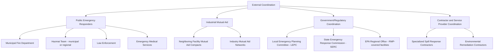
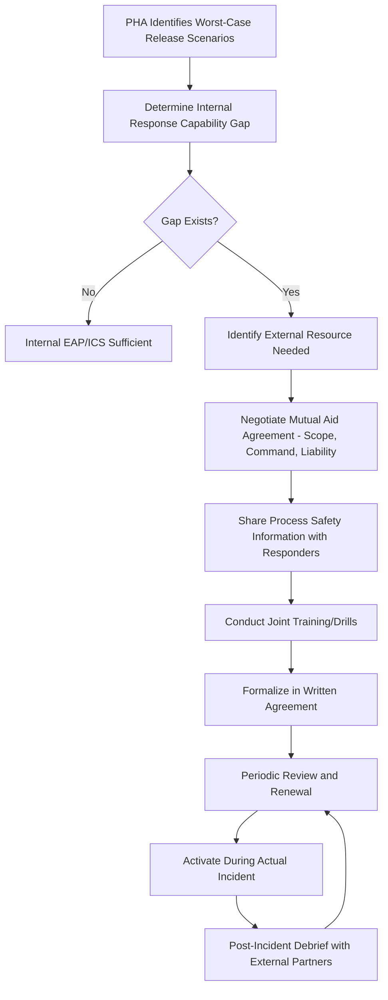

## Mutual Aid Agreements and External Coordination

### Overview

Mutual aid agreements and external coordination establish the pre-arranged relationships, resource-sharing commitments, and communication channels between a chemical facility and outside entities — municipal fire/hazmat departments, neighboring facilities, contractors, and government agencies — that are activated during an emergency. Where the Incident Command System provides the *internal* organizational structure for managing a response, mutual aid and external coordination determine whether the facility can actually access the resources and authority that structure depends on when an incident exceeds internal capability.

### Regulatory and Standards Basis

- 1910.119(n) requires PSM-covered facilities to establish an emergency action plan per 1910.38; coordination with outside responders is not itself a numbered EAP element but is functionally necessary wherever a facility's internal response capability is insufficient for credible worst-case scenarios identified in the PHA.
- 1910.120(q) governs emergency response operations for releases of hazardous substances and establishes the framework (ICS, training levels, IC designation) that mutual aid responders must integrate into upon arrival.
- The EPA's Risk Management Program rule (40 CFR Part 68), where applicable, requires coordination with local emergency planning and response organizations, and facilities subject to Program 2 or 3 requirements typically have direct engagement obligations with their Local Emergency Planning Committee (LEPC).
- The Emergency Planning and Community Right-to-Know Act (EPCRA) establishes LEPCs as the formal community-level coordination body for facilities storing reportable quantities of extremely hazardous substances.

**Key Points**

- [Unverified] The specific triggering thresholds and reporting obligations under EPCRA/RMP are chemical- and quantity-specific; applicability to a given facility depends on its actual chemical inventory and is not addressed generically here.
- Mutual aid coordination is best understood as extending the facility's own emergency response capability rather than as a separate, independent program — it should be designed against the same PHA-derived worst-case scenarios that drive the EAP and ICS design.

### Categories of External Coordination

### Elements of a Mutual Aid Agreement

A defensible mutual aid agreement addresses more than "they will come help us." It should specify capability, authority, and logistics in enough detail that the relationship functions correctly the first time it is invoked — which is often during an actual emergency, not a drill.

| Element | Purpose |
| --- | --- |
| Scope of assistance | What resources/capabilities each party will provide (personnel, equipment, expertise) |
| Activation procedure | How the agreement is invoked — who calls whom, through what communication channel |
| Command relationship | Whether responding party operates under the facility's ICS, establishes Unified Command, or takes independent command per its own authority |
| Resource typing | Standardized description of equipment/personnel capability (e.g., NIMS resource typing) so requesting parties know what they are asking for |
| Liability and cost allocation | Which party bears cost/liability for provided resources, injuries, or equipment damage during mutual aid response |
| Training and interoperability | Confirmation that responding personnel are trained to a compatible ICS/HAZWOPER level and that communications equipment is interoperable |
| Duration and renewal | Agreement term and review/renewal cycle |

**Key Points**

- Command relationship is frequently the least well-defined element in practice and the most consequential during an actual event — an agreement that is silent on whether the facility IC retains command or transfers it to the arriving hazmat team invites confusion exactly when clarity is most needed.
- [Inference] Facilities that conduct joint training exercises with mutual aid partners (rather than relying solely on the written agreement) tend to identify command-relationship ambiguities and equipment-interoperability gaps before an actual incident, though this is a program-design observation rather than a specific regulatory requirement.

### Coordination with Public Emergency Responders

**Pre-incident coordination activities:**

1. **Facility familiarization tours** — allowing fire/hazmat personnel to walk the site, view process units, and understand hazard locations before an incident occurs
2. **Sharing of process safety information** — providing responders with relevant hazard data (chemical inventories, SDS, site plans, hazard area maps) in advance, consistent with what would otherwise need to be communicated urgently during a live event
3. **Joint drills** — full-scale or tabletop exercises exercising the transition from facility-internal response to public responder involvement, including command transfer or Unified Command establishment
4. **Pre-incident planning documents** — a formal document (often maintained by the responding fire department per NFPA 1620 guidance) capturing site-specific hazards, water supply, access points, and staging areas

**Example**

A facility with a large ammonia refrigeration system might provide the local fire department's hazmat team with the specific quantity, refrigerant type, PPE requirements, and isolation valve locations in advance, and conduct an annual joint tabletop exercise walking through a simulated ammonia release — so that on the day of an actual release, responders are not seeing the facility's hazard profile for the first time.

### Coordination with Neighboring Facilities

Industrial mutual aid — sometimes formalized through regional Community Awareness and Emergency Response (CAER)-style groups or informal facility-to-facility agreements — allows nearby facilities to share specialized equipment (foam trucks, specific PPE, technical expertise) that neither facility could economically maintain alone.

**Key Points**

- Industrial mutual aid agreements should specify the same command-relationship and liability elements as agreements with public responders; an informal handshake arrangement between plant managers does not survive personnel turnover or provide the clarity needed during an actual event.
- [Unverified] Whether a specific facility's insurance carrier or corporate risk management policy places restrictions on informal mutual aid arrangements (e.g., requiring specific liability waivers) is a facility- and carrier-specific matter.

### Coordination with Local Emergency Planning Committees (LEPC)

For facilities with reportable quantities of extremely hazardous substances under EPCRA, the LEPC is the formal community coordination body responsible for developing the community emergency response plan.

**Typical facility obligations/engagement:**

- Providing facility representative participation in LEPC meetings
- Submitting required chemical inventory reporting (Tier II reports) that informs community planning
- Participating in community-wide emergency response exercises coordinated by the LEPC
- Sharing facility-specific hazard information that the LEPC incorporates into its area-wide emergency response plan

[Unverified] The specific reporting thresholds, exercise participation requirements, and LEPC engagement expectations vary by state implementation of EPCRA and by facility chemical inventory; a facility should confirm its specific obligations against its actual regulated substance inventory rather than assuming a generic obligation set.

### External Coordination Workflow

### Communication Protocols During Activation

A mutual aid agreement's value is realized only if activation actually occurs smoothly under stress. This depends on clear, tested communication protocols.

**Example activation sequence:**

1. Facility Emergency Coordinator determines internal response capability is or will be exceeded
2. Coordinator (or designated alternate) contacts the pre-arranged emergency dispatch number for the mutual aid partner, using a scripted notification format (facility name, hazard type, location, known quantities, current actions taken)
3. Facility maintains a designated liaison point (physically at a pre-arranged staging area or rendezvous point) to meet and brief arriving responders
4. Facility provides responders with current site status, hazard map, and any process safety information not already shared in advance
5. Command transfer or Unified Command is established per the pre-arranged protocol
6. Facility Liaison Officer (per ICS structure) maintains ongoing coordination between facility and outside agency needs for the duration of the response

**Key Points**

- A scripted notification format reduces the risk of critical information (exact location, hazard identity, quantity) being omitted during a high-stress initial call.
- Designating a physical rendezvous/staging point in advance materially reduces the time responders spend locating the correct entry point and hazard area upon arrival, particularly at larger or more complex sites.

### Common Compliance Gaps

- Mutual aid relationships exist informally (personal relationships between individuals) with no written agreement, creating risk when personnel change roles or leave
- Written agreements exist but are silent on command relationship, leading to confusion or conflict during an actual joint response
- Process safety information is not proactively shared with responders in advance, forcing critical hazard communication to happen for the first time during the emergency itself
- No joint drills conducted with mutual aid partners — the relationship is tested for the first time during a real incident
- LEPC engagement treated as a one-time reporting exercise rather than ongoing participation, leaving the facility disconnected from evolving community response planning
- Rendezvous/staging points not pre-identified, resulting in responders searching for the correct facility entry point during time-critical response phases

### Documentation and Recordkeeping

A defensible mutual aid and external coordination program file typically includes:

1. Written mutual aid agreements addressing scope, command relationship, liability, and resource typing
2. Records of process safety information shared with responders (facility tours, hazard data packages)
3. Joint drill/exercise records with public and industrial mutual aid partners, including debrief findings
4. LEPC engagement records (meeting participation, Tier II submissions, community exercise participation)
5. Current contact list and activation procedure for each external coordination partner, reviewed and updated on a defined cycle
6. Pre-incident planning documents shared with or developed jointly with the local fire department

**Related Topics**

- Incident Command System — Command Transfer and Unified Command Protocols
- EPCRA and Local Emergency Planning Committee Obligations
- EPA Risk Management Program (40 CFR Part 68) Coordination Requirements
- Pre-Incident Planning Documentation (NFPA 1620) for Responder Familiarization
- Process Safety Information Sharing with External Responders
- Joint Emergency Response Drills and Tabletop Exercise Design