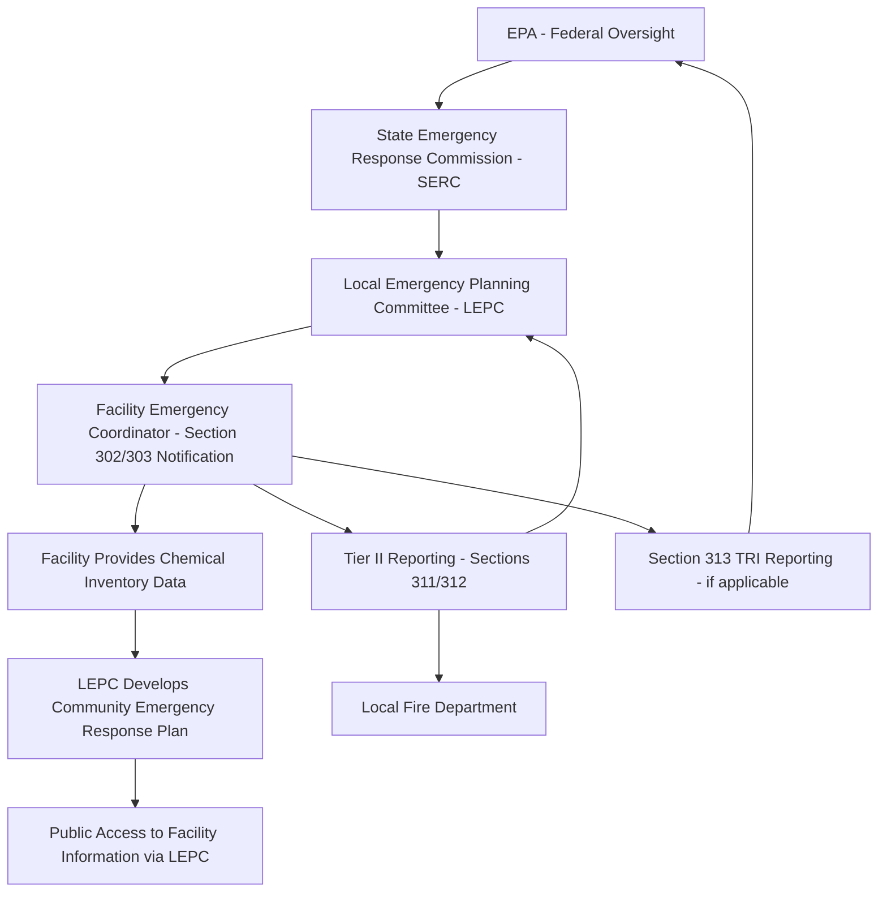
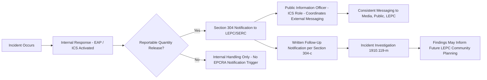

## Community Right to Know and Public Communication

### Overview

Community Right-to-Know establishes the legal framework requiring facilities that handle hazardous chemicals to disclose chemical inventory and release information to the public, emergency planners, and government agencies. It is codified primarily in the Emergency Planning and Community Right-to-Know Act (EPCRA), enacted in 1986 following the Bhopal disaster, and operates alongside — but separately from — OSHA's PSM standard. Where PSM (1910.119) focuses on preventing catastrophic releases through internal process safety controls, EPCRA focuses on ensuring that surrounding communities and their emergency responders have the information needed to plan for and respond to a release if one occurs.

### Regulatory Structure of EPCRA

EPCRA is organized into four主要 (four primary) subtitles, each imposing distinct reporting obligations:

| Section | Requirement | Trigger |
| --- | --- | --- |
| Section 302/303 | Emergency planning notification | Facility possesses an Extremely Hazardous Substance (EHS) above its Threshold Planning Quantity (TPQ) |
| Section 304 | Emergency release notification | A reportable quantity release of a CERCLA hazardous substance or EPCRA EHS occurs |
| Sections 311/312 | Hazardous chemical inventory reporting (Tier I/Tier II) | Facility stores hazardous chemicals above threshold quantities (per OSHA Hazard Communication Standard classification) |
| Section 313 | Toxic Release Inventory (TRI) reporting | Facility manufactures, processes, or otherwise uses listed toxic chemicals above threshold, and meets NAICS code/employee count criteria |

**Key Points**

- EPCRA reporting obligations are separate from, and in addition to, OSHA PSM requirements — a facility can be fully PSM-compliant and still have distinct, independent EPCRA reporting obligations tied to chemical inventory and release thresholds.
- [Unverified] The specific chemicals, threshold planning quantities, and reportable quantities applicable to a given facility depend on that facility's actual chemical inventory as matched against EPA's EHS list and CERCLA hazardous substance list; applicability is chemical- and quantity-specific and not addressed generically here.

### The Local Emergency Planning Committee (LEPC) System

LEPCs are composed of representatives from local government, emergency services, industry, media, and the public, and are responsible for developing and maintaining a community emergency response plan that incorporates facility-specific hazard information.

**Key Points**

- A facility with an EHS above its TPQ must designate a facility emergency coordinator and provide that information to the LEPC under Section 302/303 — this is the entry point that establishes the facility's ongoing relationship with the LEPC.
- The community emergency response plan the LEPC develops is meant to incorporate the same hazard scenarios a facility would identify through its own PHA, creating a natural (though often underused) opportunity for facility PSM data to directly inform community response planning.

### Tier I / Tier II Reporting

Sections 311 and 312 require facilities storing hazardous chemicals above threshold quantities to submit inventory reports to the LEPC, SERC, and local fire department.

- **Tier I** reports provide chemical information by hazard category (aggregate estimates)
- **Tier II** reports provide chemical-specific information, including maximum daily amount, average daily amount, and storage location — Tier II is now the standard form used by virtually all reporting facilities

**Example Tier II data elements:**

- Chemical name and CAS number
- Physical and health hazard categories (per OSHA HazCom classification)
- Maximum amount present at the facility during the reporting year
- Storage location(s) within the facility
- Storage type (e.g., aboveground tank, cylinder, drum)

[Unverified] The specific submission deadline (commonly March 1 annually for the prior calendar year, though this should be confirmed against current EPA/state guidance) and electronic reporting platform requirements vary somewhat by state implementation.

### Emergency Release Notification (Section 304)

When a reportable quantity of a listed substance is released, the facility must immediately notify the LEPC and SERC, followed by a written follow-up notification.

**Example release notification content:**

1. Chemical name and whether it is an EHS
2. Estimated quantity released
3. Time and duration of the release
4. Medium of release (air, water, land)
5. Known or anticipated acute or chronic health risks
6. Precautions taken, including evacuation, if applicable
7. Name and telephone number of a facility contact

**Key Points**

- This notification requirement operates independently of, and in parallel with, any internal incident investigation obligation under 1910.119(m) — the release notification serves the community's immediate need to know, not the facility's internal root-cause analysis.
- [Unverified] Overlap and coordination between EPCRA Section 304 notification and any separate obligations under CERCLA Section 103 (release reporting to the National Response Center) depends on the specific substance and quantity involved, and both may apply to the same release event.

### Toxic Release Inventory (TRI) Reporting

Section 313 requires annual reporting of releases and other waste management quantities for listed toxic chemicals, applicable to facilities meeting specific NAICS industry codes, employee thresholds, and chemical activity thresholds. TRI data is made publicly available and is a primary source for community and researcher understanding of facility-level chemical releases over time.

[Unverified] TRI applicability to a specific facility depends on its NAICS classification, employee count, and the specific listed chemicals it manufactures, processes, or otherwise uses above threshold — this determination is facility-specific.

### Public Communication Beyond Regulatory Minimums

Compliance with EPCRA's reporting requirements establishes a regulatory floor, not necessarily an effective public communication program. Facilities — particularly those with credible worst-case release scenarios affecting surrounding populations — often develop proactive communication practices beyond the minimum filings.

**Example proactive communication practices:**

- Community advisory panels providing ongoing dialogue between facility management and neighboring residents
- Published facility fact sheets summarizing chemical hazards in accessible, non-technical language
- Participation in Community Awareness and Emergency Response (CAER)-style regional industry coordination
- Pre-established public notification systems (reverse 911, mass text alerts) coordinated with local emergency management for use during an actual release
- Open house events or facility tours for community members and local officials

**Key Points**

- [Inference] Facilities that maintain ongoing, proactive community relationships tend to experience a different public and media response during an actual incident compared to facilities whose only community contact is passive regulatory filing — this reflects general risk communication and crisis management principles rather than a specific EPCRA requirement.
- Proactive public communication is a risk management and community relations practice; it does not substitute for satisfying the specific, mandatory content and timing requirements of EPCRA Section 304 emergency notifications.

### Coordination with the Emergency Action Plan and Incident Command

**Key Points**

- The ICS Public Information Officer role is the natural organizational point for coordinating the facility's external public and media communications during an active incident, ensuring EPCRA notification content and broader public messaging remain consistent.
- Confusing or inconsistent messaging between the facility's regulatory notification and its public-facing statements during an incident is a common source of community distrust independent of the actual technical severity of the release.

### Common Compliance Gaps

- Tier II reporting treated as a purely administrative annual filing with no connection to the facility's actual PHA-identified hazard scenarios
- Facility Emergency Coordinator designated on paper but not actually integrated into the ICS structure or the EAP's activation procedures
- No pre-established relationship with the LEPC beyond the minimum required annual filing, leaving the facility without established community contacts when an actual incident requires rapid public communication
- Section 304 notification content prepared ad hoc during an actual event rather than using a pre-built notification template with all required elements
- Inconsistency between technical incident investigation findings (1910.119(m)) and the facility's public statements about root cause, undermining community trust
- TRI and Tier II data treated as separate compliance silos with no internal cross-check against current process chemical inventory, risking under- or over-reporting

### Documentation and Recordkeeping

A defensible community right-to-know program file typically includes:

1. Current facility chemical inventory cross-referenced against EHS list, TPQ, and CERCLA reportable quantity thresholds
2. Section 302/303 facility emergency coordinator designation and LEPC notification records
3. Annual Tier II submissions with supporting inventory calculations
4. TRI submissions, if applicable, with supporting release/waste management calculations
5. Section 304 release notification templates, pre-populated with facility-specific content where possible
6. Records of LEPC meeting participation and any joint community exercises
7. Any proactive community communication materials and records of community engagement activities

**Related Topics**

- EPA Risk Management Program (40 CFR Part 68) and Its Relationship to EPCRA
- Local Emergency Planning Committee Engagement and Community Response Plan Integration
- Incident Command System Public Information Officer Responsibilities
- Incident Investigation (1910.119(m)) Coordination with External Notification Timelines
- CERCLA Section 103 Federal Release Reporting Requirements
- Risk Communication Principles for Chemical Facility Community Relations