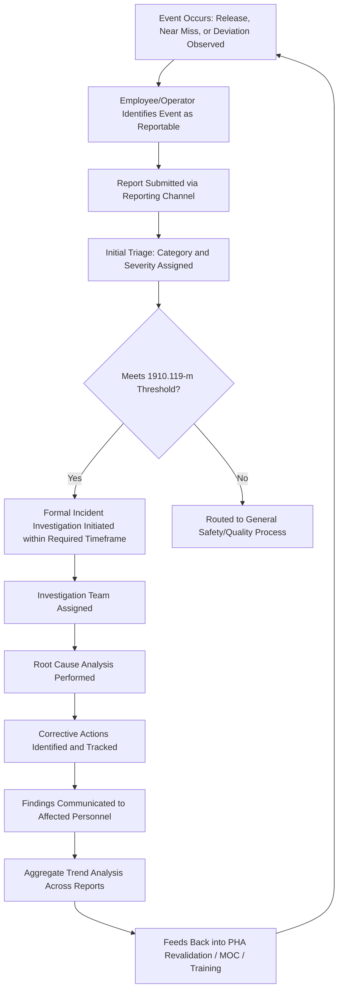
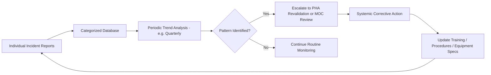

## Near Miss and Incident Reporting Systems

### Overview

A near miss and incident reporting system is the organizational infrastructure that captures, categorizes, and routes safety-relevant events for investigation — including events that did *not* result in injury, release, or property damage but had the potential to do so. Within a PSM program, this system is the primary input mechanism to 1910.119(m) (Incident Investigation) and serves as leading-indicator data that a mature program uses to identify systemic weaknesses before they produce a catastrophic outcome. A facility that investigates only actual releases while ignoring near misses is, in effect, waiting for the accumulation of failed layers of protection to become visible only after one has already failed catastrophically.

### Regulatory Basis and Scope

29 CFR 1910.119(m) requires investigation of incidents which resulted in, or could reasonably have resulted in, a catastrophic release of a highly hazardous chemical. The phrase "could reasonably have resulted in" is the regulatory hook that brings near misses within PSM's investigation obligation — it is not limited to events where hazardous material actually escaped containment.

**Key Points**

- The regulation's threshold is potential consequence, not actual consequence. An event where a safety interlock functioned correctly and prevented a release still qualifies for investigation if, absent that interlock functioning, a catastrophic release could reasonably have occurred.
- [Inference] Facilities that interpret "could reasonably have resulted in" narrowly (investigating only events that came very close to release) capture materially less leading-indicator data than facilities that interpret it broadly (investigating any credible precursor, including single-barrier failures within a layered protection scheme), though the appropriate threshold is a documented program design decision rather than one fixed explicitly by the standard's text.

### Categorizing Reportable Events

A functioning reporting system needs a consistent taxonomy so that events are captured, triaged, and routed appropriately rather than left to individual judgment about what "counts."

| Category | Definition | Example |
| --- | --- | --- |
| Catastrophic release | Actual uncontrolled release of a highly hazardous chemical with potential for serious harm | Relief valve fails open, releasing flammable vapor to atmosphere |
| Near miss (high potential) | No release occurred, but a critical safeguard was the only barrier that prevented one | High-level interlock trips and prevents overfill; investigation shows the interlock was the last remaining functional layer of protection |
| Near miss (precursor) | A deviation or failure occurred that reduced the margin of safety without immediately threatening a release | A single pressure transmitter reads erratically but redundant transmitters and operator vigilance maintain safe operation |
| Non-PSM safety event | Injury or hazard unrelated to a highly hazardous chemical process | Slip/trip/fall in a non-process area |

**Key Points**

- Non-PSM safety events (the fourth category) still matter for overall occupational safety but do not by themselves trigger the 1910.119(m) investigation obligation; a program should route them to the appropriate general safety incident process rather than diluting PSM investigation resources with unrelated events.
- Distinguishing "near miss (high potential)" from "near miss (precursor)" is essential for prioritization — both are reportable, but a high-potential event where a single remaining safeguard prevented catastrophe warrants materially faster and deeper investigation than a low-consequence precursor deviation.

### Reporting System Workflow

### Reporting Channels and Accessibility

A reporting system's effectiveness is directly proportional to how easy and low-friction it is for the person who observed the event to actually submit a report. Systems that require excessive documentation, only accept reports through a supervisor, or lack anonymity options tend to suppress reporting of exactly the marginal, ambiguous events that carry the most leading-indicator value.

**Example reporting channel structure:**

1. **Direct verbal report** to shift supervisor for immediate operational events requiring urgent attention
2. **Written/electronic report form** for formal documentation, accessible from control room terminals and mobile devices
3. **Anonymous reporting option** (paper drop box, third-party hotline, or anonymous electronic submission) for events where the reporter fears blame or reprisal
4. **Automated system-generated triggers** — e.g., a safety instrumented system trip, a relief valve lift, or an emergency shutdown activation automatically generates a report requiring investigation, removing reliance on a human deciding to report

**Key Points**

- Automated triggers tied to safety system activations (SIS trips, ESD activations, relief device lifts) close a significant gap: they capture high-potential near misses even when no individual identifies the event as worth reporting, and they are not subject to reporting reluctance or normalization of deviance.
- [Inference] A reporting system that relies solely on voluntary human-initiated reports is vulnerable to underreporting of routine or frequently recurring near misses that personnel have come to see as "normal," a phenomenon commonly discussed in high-reliability organization literature as normalization of deviance — though the degree to which this affects any specific site's data is not something that can be verified without examining that site's actual reporting patterns.

### Blame-Free (Just Culture) Reporting Principles

The single largest determinant of reporting system effectiveness is whether personnel believe they can report an event — including one involving their own error — without facing punitive consequences for the act of reporting itself.

| Culture Model | Approach | Effect on Reporting Volume |
| --- | --- | --- |
| Punitive culture | Errors and near misses result in disciplinary action regardless of cause | Suppresses reporting; personnel conceal events |
| Blanket blame-free culture | No consequences for any reported event regardless of cause | Maximizes reporting volume but may fail to address genuine reckless or willful violations |
| Just culture | Consequences distinguish between honest error, at-risk behavior, and reckless/willful violation | Balances reporting volume with accountability for genuinely culpable conduct |

**Key Points**

- Just culture frameworks (distinguishing human error, at-risk behavior, and reckless conduct) are widely used in high-reliability industries specifically because a purely punitive model suppresses the very data an organization needs to prevent recurrence, while a purely blame-free model can fail to address willful disregard for procedures.
- [Inference] Where an organization's stated reporting policy is blame-free but individual events are, in practice, followed by disciplinary action, personnel tend to recalibrate their reporting behavior based on observed outcomes rather than the written policy — a general organizational-behavior pattern rather than a specific measured finding about any particular facility.

### Investigation Timeliness Requirements

1910.119(m) requires that an incident investigation be initiated as promptly as possible, but not later than 48 hours following the incident. This timeliness requirement applies once an event has been identified as meeting the "resulted in or could reasonably have resulted in" threshold.

**Key Points**

- The 48-hour clock begins upon identification of a reportable incident, which is precisely why triage speed (how quickly a submitted report is categorized against the 1910.119(m) threshold) matters — a report that sits unreviewed for days before triage risks the facility being out of compliance with the 48-hour requirement before the investigation has even formally started.
- A reporting system's triage step should therefore have its own internal service-level expectation (e.g., triage within a defined number of hours of report submission) that is faster than the regulatory investigation-initiation deadline, to leave adequate margin.

### Trend Analysis and Aggregate Review

Individual incident investigations address the specific event investigated. A reporting *system* additionally provides value through aggregate analysis across many reports over time, surfacing systemic patterns that no single investigation would reveal.

**Example trend analysis outputs:**

- Repeated near misses involving the same equipment type across different units, suggesting a design or specification issue rather than an isolated failure
- Clustering of near misses around shift changes, suggesting a handoff communication gap
- Recurring precursor events involving a specific safeguard (e.g., repeated erratic readings from a particular instrument model), suggesting a mechanical integrity or specification issue warranting broader investigation
- Increasing near-miss frequency in a specific process area following a recent Management of Change, suggesting the change introduced an unanticipated risk

### Integration with Other PSM Elements

- **Process Hazard Analysis (1910.119(e))** — near-miss trend data is a primary input to PHA revalidation, since it reveals scenarios or failure modes that may not have been anticipated in the original hazard analysis
- **Management of Change (1910.119(l))** — a spike in near misses following a change is a leading indicator that the MOC's hazard review may have been incomplete
- **Mechanical Integrity (1910.119(j))** — recurring near misses tied to a specific equipment type or instrument model should feed back into inspection frequency or specification decisions
- **Training (1910.119(g))** — near-miss patterns tied to specific tasks or shifts can reveal training gaps not visible through standard training completion metrics

### Common Compliance Gaps

- Near misses are informally discussed among shift personnel but never formally reported or investigated, leaving no documented record and no aggregate trend visibility
- Reporting system technically exists but requires cumbersome paperwork routed only through a supervisor, suppressing marginal or ambiguous event reporting
- No automated triggers tied to safety system activations, relying entirely on human initiative to report even high-potential events like SIS trips or relief valve lifts
- Stated "blame-free" policy contradicted by actual disciplinary practice, leading to underreporting despite the written program
- Reports triaged slowly, causing the facility to miss the 1910.119(m) 48-hour investigation-initiation window for events later determined to meet the threshold
- Trend analysis not performed at a program level — each incident investigated in isolation with no mechanism connecting related events across time or process units

### Documentation and Recordkeeping

A defensible near-miss and incident reporting program file typically includes:

1. Written reporting procedure defining categories, channels, and triage criteria
2. Documented just-culture policy defining how honest error, at-risk behavior, and reckless conduct are each handled
3. Individual incident investigation records for all events meeting the 1910.119(m) threshold, including near misses
4. Aggregate trend analysis reports and their resulting escalations to PHA, MOC, or MI review
5. Records demonstrating triage timeliness and adherence to the 48-hour investigation-initiation requirement
6. Evidence of corrective action closure tied to both individual investigations and systemic trend findings

**Related Topics**

- Incident Investigation Methodology and the 48-Hour Initiation Requirement (1910.119(m))
- Root Cause Analysis Techniques for Process Safety Events
- Just Culture Frameworks and Their Application to Process Safety Reporting
- Leading vs. Lagging Indicators in Process Safety Performance Measurement
- PHA Revalidation Triggered by Near-Miss Trend Data
- Safety Instrumented System Trip Logging and Automated Event Capture