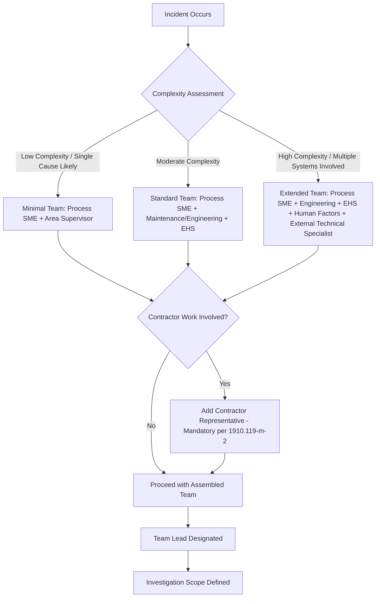
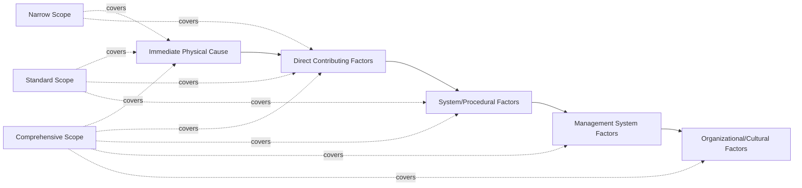
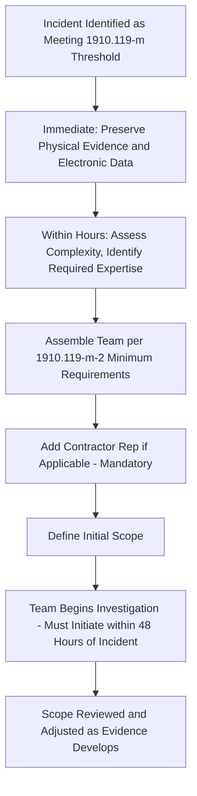

## Investigation Team Formation and Scope

### Overview

Investigation team formation and scope definition are the structural decisions made at the outset of an incident investigation that determine whether the resulting analysis will identify genuine root causes or merely document surface-level findings. Under 29 CFR 1910.119(m), the composition of the investigation team is not left to informal discretion — the standard specifies minimum team composition, and getting this step wrong (wrong people, wrong scope boundaries) is one of the most common reasons an otherwise well-intentioned investigation fails to prevent recurrence.

### Regulatory Requirements for Team Composition

29 CFR 1910.119(m)(2) requires that an investigation team be established consisting of at least one person knowledgeable in the process involved, including a contract employee if the incident involved the work of a contractor, and other persons with appropriate knowledge and experience to thoroughly investigate and analyze the incident.

**Key Points**

- The regulation establishes a floor, not a template: "at least one person knowledgeable in the process" is a minimum, and the "other persons with appropriate knowledge and experience" clause is intentionally open-ended to accommodate investigations of varying complexity.
- The contractor-inclusion requirement is not discretionary when a contractor's work was involved in the incident — omitting contractor representation from the team in such cases is a direct compliance gap, not merely a best-practice consideration.
- [Unverified] The specific interpretation of "involved the work of a contractor" (e.g., whether it requires the contractor's direct action to have contributed to the incident, versus mere presence in the affected area) is a fact-specific determination not further defined in the regulatory text itself.

### Team Composition by Investigation Complexity

**Key Points**

- Complexity assessment should occur at triage, before team assembly — assembling a minimal two-person team and later discovering the investigation requires human factors or metallurgical expertise wastes the critical early hours when evidence is freshest and most perishable.
- [Inference] A team assembled entirely from personnel within the immediate operating unit under investigation, with no representation from outside that unit's reporting chain, is more susceptible to confirmation bias toward explanations that do not implicate the unit's own management or supervisory practices — this is a general investigation-design consideration rather than a claim about any specific team's actual conduct.

### Roles Within the Investigation Team

| Role | Responsibility |
| --- | --- |
| Investigation Team Lead | Overall coordination, ensures methodology is followed, manages timeline, produces final report |
| Process Subject Matter Expert | Provides process-specific technical knowledge (chemistry, operating parameters, design intent) — the mandatory minimum role under 1910.119(m)(2) |
| Contractor Representative | Provides contractor-specific knowledge when contractor work is involved — mandatory when applicable |
| Maintenance/Engineering Representative | Provides equipment design, maintenance history, and mechanical integrity context |
| EHS/PSM Coordinator | Ensures investigation methodology meets 1910.119(m) requirements, coordinates documentation and closure tracking |
| Human Factors Specialist (as needed) | Provides expertise on procedure design, workload, fatigue, and human-system interaction factors |
| External Technical Specialist (as needed) | Provides specialized expertise not available internally (e.g., metallurgical failure analysis, control system forensics) |
| Employee/Operator Representative | Provides first-hand operational perspective, particularly valuable for surfacing normalized workarounds or informal practices not visible in written procedures |

**Key Points**

- Including an operator/employee representative who was not personally involved in the incident (rather than only interviewing involved personnel after the fact) can surface routine workarounds and informal practices that the formal procedure documentation does not reflect — these are often exactly the conditions that contributed to the incident.
- The Team Lead role should generally not be filled by someone with direct supervisory authority over personnel involved in the incident, to reduce the structural incentive to reach findings that minimize supervisory or personal accountability.

### Independence and Objectivity Considerations

A recurring theme in investigation quality is the degree of independence the team has from the operations or management structure being investigated.

| Independence Level | Description | Appropriate For |
| --- | --- | --- |
| Internal, same-unit team | Team drawn entirely from the affected unit | Low-complexity, low-consequence events with clear, uncontested causation |
| Internal, cross-functional team | Team includes personnel from outside the affected unit (different area, corporate EHS, engineering) | Standard PSM-reportable incidents |
| Internal team with external technical support | Cross-functional internal team supplemented by external specialists for specific technical questions | Complex incidents requiring specialized expertise |
| Fully independent/third-party investigation | Investigation led or conducted by parties entirely outside the facility's management structure | Fatality, major catastrophic release, or events with significant regulatory/legal exposure |

[Inference] The appropriate independence level scales with incident severity and the degree to which management practices (rather than a discrete equipment failure) may be implicated as a causal factor, though the specific threshold for escalating to third-party investigation is a corporate risk management and, in some jurisdictions, a legal determination rather than one fixed by 1910.119(m) itself.

### Defining Investigation Scope

Scope definition determines the boundaries of what the investigation will examine — both the physical/technical boundary (which equipment, which time window) and the causal boundary (how far back in the causal chain the investigation will trace contributing factors).

**Example scope-definition questions:**

1. What is the precise start and end point of the sequence of events being investigated?
2. Which systems, equipment, and procedures fall within the investigation's technical boundary?
3. Does the scope include only the immediate physical cause, or does it extend to management system factors (training program design, MOC process adequacy, staffing decisions) that may have contributed?
4. Are there related prior incidents or near misses that should be examined for common causal threads?
5. What time period of historical data (maintenance records, previous near-miss reports, MOC history for the affected equipment) is relevant to review?

**Key Points**

- A scope that stops at "system/procedural factors" without extending into management system factors will frequently identify a proximate technical fix (replace a failed part, revise a procedure step) while leaving in place the underlying organizational conditions (inadequate MOC rigor, insufficient training program depth, understaffing) that allowed the technical failure to occur and that will likely produce a similar incident again in a different form.
- Scope should be documented explicitly at the outset and revisited if evidence uncovered during the investigation suggests the initial boundary was too narrow — an investigation team should have a defined process for requesting scope expansion rather than working around, or artificially fitting findings within, an initially inadequate boundary.

### Resourcing and Authority

For an investigation team to function effectively, it needs institutional authority and resources independent of its individual members' normal organizational standing.

**Key Points**

- The team should have documented authority to access relevant records (maintenance history, MOC files, training records, prior incident reports), interview any relevant personnel, and — critically — to sequester or preserve physical evidence and data (control system historian data, SIS trip logs) before it is lost or overwritten by normal operations.
- [Inference] Facilities that do not have a written policy establishing investigation team authority in advance risk delay or resistance when a team requests evidence or interview access during an actual investigation, since the request may then depend on ad hoc negotiation with the affected unit's management rather than a pre-established right.
- Data preservation timing is particularly time-sensitive: control system historians, SIS trip logs, and CCTV footage often have limited retention windows that can expire before a slower-forming investigation team gets around to requesting them.

### Team Formation Timeline

**Key Points**

- Evidence preservation should begin immediately upon incident identification, in parallel with — not sequentially after — team assembly, since perishable evidence does not wait for the team formation process to complete.
- The 48-hour investigation-initiation requirement under 1910.119(m)(1) applies to the investigation starting, which in practice means the team must be assembled and beginning work well within that window, not merely notified of the incident.

### Common Compliance Gaps

- Investigation team assembled without a process subject matter expert, relying instead on general EHS staff without process-specific technical knowledge
- Contractor representative omitted from the team despite contractor work being directly involved in the incident
- Team composed entirely of personnel with direct supervisory or operational responsibility for the affected unit, with no independent or cross-functional representation
- Scope implicitly limited to the immediate physical cause with no documented decision to exclude management system factors, rather than an explicit, deliberate scoping decision
- No pre-established institutional authority for the investigation team, causing delay in evidence access or interview scheduling during the actual investigation
- Perishable electronic data (historian trends, SIS logs) not preserved immediately, resulting in data loss before the team can request it

### Documentation and Recordkeeping

A defensible investigation team formation and scoping record typically includes:

1. Team roster documenting each member's role and qualification, demonstrating compliance with the 1910.119(m)(2) minimum composition requirement
2. Documented rationale for team composition relative to incident complexity
3. Written scope statement defining the technical and causal boundaries of the investigation, including any subsequent scope revisions and the evidence that triggered them
4. Evidence preservation log documenting what was preserved, when, and by whom
5. Documentation of the team's institutional authority (access to records, interview authority) as established by facility policy

**Related Topics**

- Root Cause Analysis Methodologies (5-Whys, Fault Tree, Causal Factor Charting)
- Evidence Preservation and Chain of Custody for Process Safety Investigations
- Near Miss and Incident Reporting Systems as Investigation Triggers
- Human Factors Analysis in Incident Investigation
- Management System Factors vs. Proximate Cause in Root Cause Determination
- Contractor Safety Management and Investigation Participation Requirements