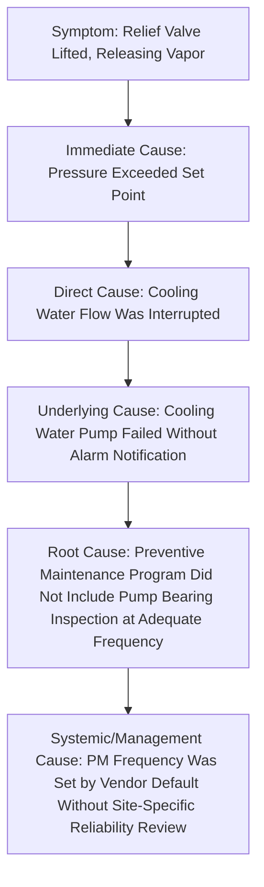
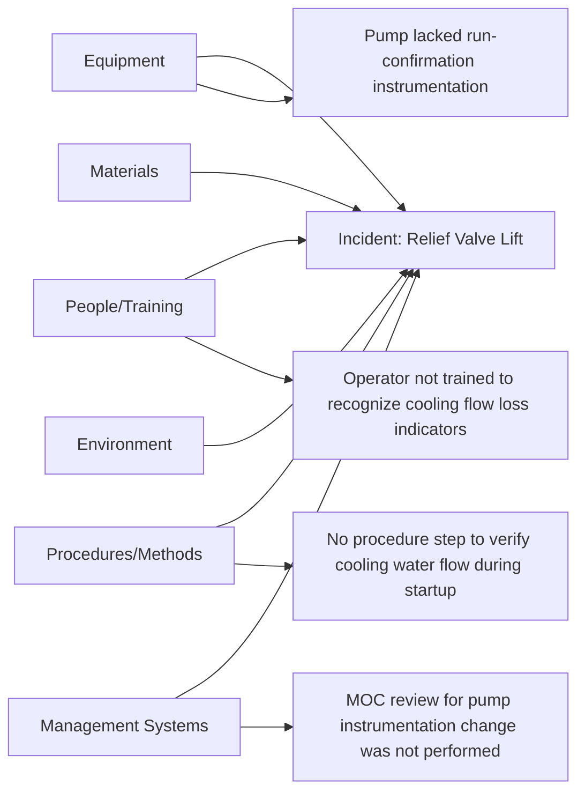
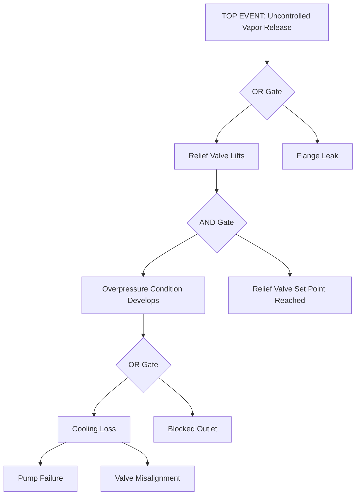
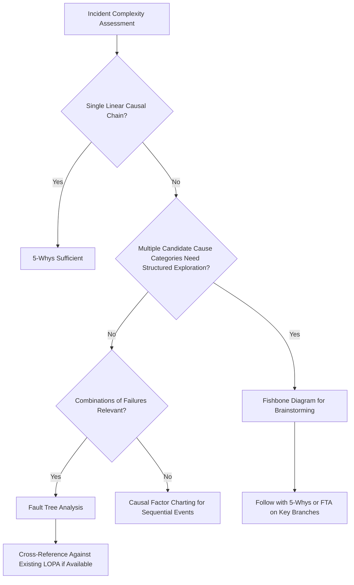

## Root Cause Analysis Techniques

### Overview

Root cause analysis (RCA) techniques are the structured methodologies an investigation team applies to move from an observed incident back through its causal chain to the underlying conditions that, if corrected, would prevent recurrence. 29 CFR 1910.119(m) requires that an investigation team establish the facts, determine the root cause(s), and develop recommendations — but the standard does not mandate a specific methodology. Choosing an appropriate technique, and applying it rigorously rather than stopping at the first plausible-sounding explanation, is what separates a defensible investigation from one that merely documents what happened without explaining why.

### Regulatory Basis and Scope

29 CFR 1910.119(m)(3) requires that a report be prepared at the conclusion of the investigation, addressing the date of the incident, the date the investigation began, a description of the incident, the factors that contributed to the incident, and recommendations resulting from the investigation.

**Key Points**

- "Factors that contributed to the incident" is the regulatory language corresponding to root cause — the standard requires identification of contributing factors, not merely a narrative description of the sequence of events.
- The absence of a mandated methodology means facilities have latitude to select a technique appropriate to incident complexity, but this latitude also means a facility's chosen method and its consistent application are matters the facility itself must be prepared to defend as adequate.

### Distinguishing Levels of Cause

A recurring failure mode in incident investigation is stopping at an intermediate level of causation that feels satisfying but does not actually explain why the failure occurred.

**Key Points**

- Stopping at "cooling water pump failed" (an underlying cause) and simply replacing the pump addresses the immediate symptom but leaves the maintenance program gap in place, virtually guaranteeing a similar failure on a different piece of equipment maintained under the same inadequate program.
- The deepest level reached in the diagram — a systemic/management cause — is often the most valuable finding precisely because a corrective action at that level (revising PM frequency-setting methodology across the facility) prevents an entire class of future failures rather than just the one investigated.

### Common RCA Methodologies

| Technique | Best Suited For | Core Approach |
| --- | --- | --- |
| 5-Whys | Simple to moderate complexity, single dominant causal chain | Repeatedly asking "why" to a cause until reaching a root, typically 5 iterations as a guideline rather than a fixed rule |
| Fishbone/Ishikawa Diagram | Brainstorming across multiple potential causal categories | Organizes potential causes into categories (equipment, people, methods, materials, environment, management) to ensure broad consideration before narrowing |
| Fault Tree Analysis (FTA) | Complex incidents with multiple potential contributing paths, especially where combinations of failures are relevant | Top-down logic diagram using AND/OR gates to show how combinations of lower-level failures could produce the top event |
| Causal Factor Charting / Events and Causal Factors Analysis | Complex incidents with multiple parallel or sequential events | Timeline-based diagram mapping the sequence of events alongside identified causal factors at each point |
| Barrier/Layer of Protection Analysis | Incidents where multiple safeguards existed | Examines which layers of protection were present, which failed, and why each failure occurred |
| TapRooT, Kepner-Tregoe, or other proprietary/structured RCA frameworks | Organizations with a standardized enterprise-wide methodology | Structured, often software-supported methodologies combining several of the above approaches with standardized root cause taxonomies |

[Unverified] The relative effectiveness of these methodologies for any specific incident type is not something that can be generalized without reference to the specific investigation; methodology selection should be matched to incident complexity and the investigation team's familiarity with the technique.

### The 5-Whys Technique

**Example application:**

1. **Why** did the relief valve lift? — Because process pressure exceeded the valve's set point.
2. **Why** did pressure exceed the set point? — Because cooling water flow to the reactor jacket stopped.
3. **Why** did cooling water flow stop? — Because the cooling water pump tripped on a mechanical fault.
4. **Why** did the pump trip without an operator response before pressure built? — Because there was no alarm configured for pump failure, only for downstream high pressure.
5. **Why** was there no pump-failure alarm? — Because the original instrumentation specification during the process design did not include a pump-run confirmation signal, and no subsequent MOC review identified this as a gap.

**Key Points**

- 5-Whys is a guideline, not a fixed rule — some causal chains reach a genuine root cause in three iterations, others require more than five; stopping arbitrarily at exactly five whys regardless of whether a true root has been reached defeats the technique's purpose.
- The technique is vulnerable to following a single linear chain when the actual causation involves multiple contributing factors; it works best for genuinely single-threaded causal chains and is a weaker choice for incidents with multiple independent or interacting contributing factors.

### Fishbone (Ishikawa) Diagram

**Key Points**

- The fishbone diagram's primary value is ensuring the investigation team deliberately considers each category (equipment, people, procedures, materials, environment, management systems) rather than fixating on the first plausible cause identified, which is typically an equipment or immediate-cause explanation.
- Fishbone diagrams are a brainstorming and organization tool rather than a root-cause determination tool on their own — they typically need to be followed by further "why" analysis on the specific branches identified to reach an actual root cause rather than stopping at a listed contributing factor.

### Fault Tree Analysis

Fault Tree Analysis is a deductive, top-down technique particularly suited to incidents where the top event could result from combinations of lower-level failures, expressed through Boolean logic gates.

**Key Points**

- FTA is particularly valuable for identifying whether a single-point failure or a combination of failures (requiring an AND gate) was necessary to produce the incident — this distinction is directly relevant to Layer of Protection Analysis, since a top event reachable through a single OR-gated path indicates inadequate independent layers of protection.
- [Inference] Facilities that use FTA specifically for high-consequence incidents, where the analysis can be cross-referenced against the facility's existing LOPA studies for the same scenario, gain additional value by validating (or identifying gaps in) the original LOPA assumptions — this is a practical integration point rather than a formal regulatory linkage.

### Barrier / Layer of Protection Analysis in Investigation

Where a facility has an existing LOPA study for the scenario involved, the investigation can examine which specific layers were credited, which were present and functioned, and which failed or were absent.

**Example barrier analysis table:**

| Layer of Protection | Credited in LOPA? | Present During Incident? | Functioned as Intended? |
| --- | --- | --- | --- |
| Basic process control system | Yes | Yes | No — did not alarm on pump failure |
| Independent high-pressure alarm | Yes | Yes | Yes — alarmed, but after relief valve had already lifted |
| Safety instrumented function (ESD) | Yes | Yes | Not challenged — pressure did not reach ESD trip point |
| Relief valve | Yes | Yes | Yes — functioned as the final layer, preventing vessel failure |

**Key Points**

- This analysis reveals that only the final layer (the relief valve itself) actually prevented a more catastrophic outcome — every layer intended to prevent the relief valve from having to lift in the first place either failed or was not challenged early enough, which is a materially different and more concerning finding than "the relief valve worked as designed."
- Barrier analysis is a natural complement to fault tree or causal factor techniques rather than a wholly separate method — it adds a structured cross-check against the facility's own risk assessment assumptions.

### Selecting an Appropriate Technique

**Key Points**

- Technique selection is not mutually exclusive — a common and often more rigorous approach uses a fishbone diagram to broadly identify candidate causal categories, then applies focused 5-Whys or fault tree analysis to the most significant branches identified.
- [Inference] Investigation teams with limited familiarity with a chosen technique tend to apply it superficially (producing a diagram that looks complete but lacks analytical rigor); technique effectiveness depends substantially on team training and facilitation skill, not solely on which methodology is nominally selected.

### Avoiding Common Root Cause Analysis Pitfalls

- **Premature closure** — stopping at the first cause that is sufficient to explain the immediate event, without probing whether that cause itself has an unaddressed underlying explanation
- **Blame attribution masquerading as root cause** — identifying "operator error" as a root cause without asking why the system made that error possible, likely, or undetected (a systemic explanation almost always exists behind an individual error)
- **Single-cause bias** — treating the incident as having one root cause when multiple independent or interacting contributing factors were actually present
- **Confirmation bias toward pre-existing beliefs** — the investigation team unconsciously favoring an explanation consistent with what personnel already believed about the process or equipment before the investigation began
- **Failure to validate findings against physical evidence** — reaching a plausible-sounding causal narrative that is not actually cross-checked against instrumentation data, physical inspection findings, or witness statements

**Key Points**

- "Operator error" as a terminal root cause finding is a near-universal red flag in RCA quality review — a rigorous investigation should be able to explain why the operator's action was reasonable given the information, training, procedures, and workload conditions actually present at the time, which typically surfaces a systemic contributing factor that is more actionable than a disciplinary response to the individual.

### Documentation of the RCA Process

A defensible RCA record should show the analytical work, not merely the conclusion:

1. The methodology selected and rationale for that selection given incident complexity
2. The actual diagram or structured analysis artifact produced (fishbone, fault tree, causal factor chart, 5-Whys chain)
3. Evidence cited in support of each causal link, not just an assertion that the link exists
4. All root causes identified, where multiple independent causes are present, rather than a single cause selected for simplicity
5. Explicit linkage from each identified root cause to a corresponding recommendation in the final investigation report per 1910.119(m)(3)

### Common Compliance Gaps

- Investigation report describes the sequence of events in detail but does not clearly identify contributing factors distinct from a narrative description, falling short of 1910.119(m)(3)'s explicit requirement
- Root cause analysis stops at "operator error" or "equipment failure" without further probing into system-level contributing factors
- Chosen methodology applied inconsistently or superficially, with no diagram or structured artifact retained to demonstrate the analytical process
- Multiple contributing factors exist but only the most convenient single cause is documented, understating the corrective action scope needed
- No cross-reference to existing LOPA or PHA documentation for the scenario, missing an opportunity to validate or correct the facility's existing risk assessment assumptions

**Related Topics**

- Investigation Team Formation and Scope (1910.119(m)(2))
- Layer of Protection Analysis (LOPA) Methodology and Its Relationship to Investigation Findings
- Human Factors Analysis and Avoiding "Operator Error" as a Terminal Finding
- Corrective Action Development, Tracking, and Closure Following Investigation
- PHA Revalidation Triggered by Investigation Findings
- Investigation Report Content Requirements per 1910.119(m)(3)