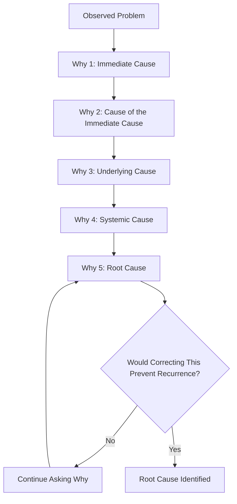
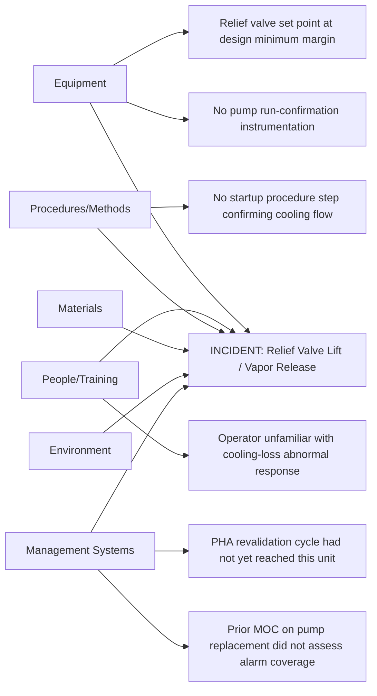
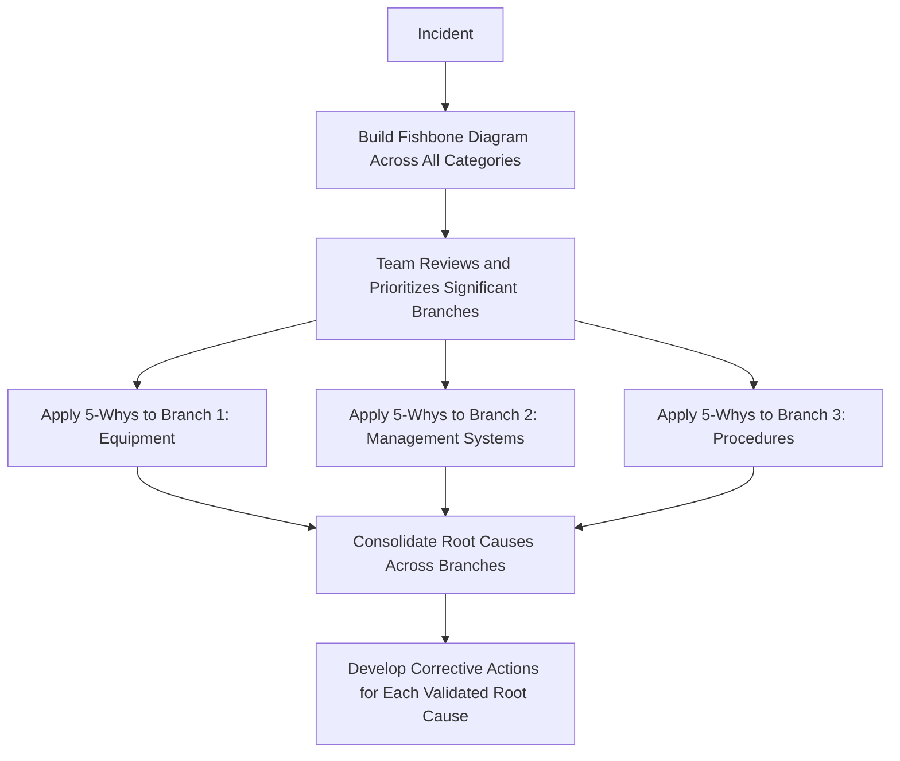

## Five Whys and Fishbone Diagrams

### Overview

The 5-Whys technique and the Fishbone (Ishikawa) diagram are the two most widely used entry-level root cause analysis tools in process safety investigation. Both are simple enough to be facilitated without specialized software or extensive training, which makes them the default starting point for most 1910.119(m) investigations — but that same simplicity means their value depends heavily on disciplined, honest application rather than on the technique itself. This section examines each method in depth, including where each is prone to failure and how they are frequently combined.

### The 5-Whys Technique in Detail

5-Whys is an iterative interrogative technique: starting from an observed problem, the investigator repeatedly asks "why did this happen?" against each answer given, following a single causal thread deeper until reaching a cause that, if corrected, would prevent recurrence.

**Key Points**

- Five is a conventional guideline, not a mandatory count — the technique is complete when the causal chain reaches a cause that is both actionable and, if corrected, would plausibly prevent recurrence, whether that takes three iterations or eight.
- Each "why" answer must be a *cause*, not a restatement of the previous answer in different words or a value judgment ("poor safety culture") that cannot itself be traced to a specific, correctable condition.

### Worked Example: 5-Whys

**Problem statement:** A pressure relief valve lifted, releasing flammable vapor to atmosphere.

1. **Why did the relief valve lift?**

   Because reactor pressure exceeded the valve's set point.
2. **Why did reactor pressure exceed the set point?**

   Because the reactor's cooling water flow was interrupted during the exothermic reaction phase.
3. **Why was cooling water flow interrupted?**

   Because the cooling water circulation pump tripped on a bearing fault.
4. **Why did the pump trip go unnoticed until pressure had already risen significantly?**

   Because the control system had no alarm configured specifically for loss of pump run-status; the only related alarm was the downstream high-pressure alarm, which activated after the fact.
5. **Why was there no pump run-status alarm?**

   Because the original instrument specification for this pump, developed during initial process design, did not include a run-confirmation signal, and no subsequent equipment change or periodic hazard review identified this as a gap.

**Root cause reached:** Instrumentation specification practice does not systematically require run-confirmation alarms on safety-critical rotating equipment, and no review mechanism (PHA revalidation, MOC, or periodic instrumentation audit) has historically caught this class of gap.

**Key Points**

- Note that the fifth "why" reached a cause at the level of a specification *practice*, not merely "this one pump lacked an alarm" — that distinction determines whether the resulting corrective action fixes one pump or prevents a whole class of similar gaps across the facility.
- If the investigation had stopped at Why 3 ("the pump had a bearing fault"), the corrective action would likely have been "replace the pump," which does nothing to prevent the same undetected-failure pattern from recurring on a different piece of equipment.

### Common 5-Whys Failure Modes

| Failure Mode | Description | Example |
| --- | --- | --- |
| Premature stopping | Halting at an unsatisfying but sufficient-sounding cause | Stopping at "pump failed" without asking why the failure went undetected |
| Restating rather than explaining | The "why" answer just rephrases the prior statement | "Why did the pump fail?" → "Because the pump broke" (no new causal information) |
| Branching ignored | A single linear chain is followed when the actual causation has multiple contributing paths | Only pursuing the mechanical failure thread while ignoring a parallel procedural gap that also contributed |
| Blame substitution | The chain terminates at "operator error" without probing the systemic conditions that made the error possible | "Why did the release occur? Because the operator didn't respond in time" — with no further why on training, alarm design, or workload |
| Solution-jumping | The investigator proposes a fix mid-chain instead of continuing to ask why, truncating the analysis | "Why did pressure build? Because there's no alarm — let's add one" — stopping before asking why the alarm gap existed in the first place |

**Key Points**

- Branching is the most consequential limitation of pure 5-Whys: real incidents frequently have more than one necessary contributing cause, and a strictly linear technique structurally cannot represent two parallel causal threads without either combining them awkwardly or arbitrarily choosing one to follow.
- This branching limitation is precisely why 5-Whys is often paired with a fishbone diagram — the fishbone identifies the multiple candidate branches first, and 5-Whys is then applied separately to each significant branch.

### The Fishbone (Ishikawa) Diagram in Detail

The fishbone diagram organizes potential contributing causes into predefined categories, radiating from a central "spine" that points to the effect (the incident) being analyzed. Its primary purpose is ensuring broad, structured consideration of cause categories before the investigation team narrows toward specific causal chains.

**Standard category sets** (adapted from manufacturing's classic "6 Ms," commonly modified for process safety use):

| Category | Process Safety Adaptation | Example Contributing Factors |
| --- | --- | --- |
| Equipment | Mechanical/instrumentation condition and design | Lack of run-confirmation instrumentation, undersized relief device |
| People/Training | Competency, staffing, fatigue | Operator not trained on abnormal situation response for this specific scenario |
| Procedures/Methods | Written procedure adequacy and accessibility | No procedure step verifying cooling flow confirmation during startup |
| Materials | Process chemistry, raw material variability | Off-spec feedstock altering reaction exotherm rate |
| Environment | Physical/ambient conditions | Extreme ambient temperature affecting cooling system capacity |
| Management Systems | MOC, PHA, mechanical integrity program adequacy | MOC review for a prior pump replacement did not evaluate alarm adequacy |

### Worked Example: Fishbone Diagram

**Key Points**

- Each branch tip identified in a fishbone diagram is a *candidate* contributing factor, not yet a validated root cause — the diagram's job is to ensure nothing significant is overlooked, and the validation/depth work happens afterward.
- A fishbone diagram with contributing factors listed only under "Equipment" and "People" — none under "Management Systems" — is itself a signal worth questioning: management system gaps are frequently present but require more deliberate probing to surface than equipment or human-action explanations, which tend to be more visible and are often identified first.

### Combining the Two Techniques

The two methods address complementary weaknesses: the fishbone diagram's strength (breadth across categories) compensates for 5-Whys' weakness (narrow, linear focus), while 5-Whys' strength (depth to an actionable root) compensates for the fishbone diagram's weakness (it identifies candidate causes but does not by itself validate or deepen them).

**Example combined application:**

Using the fishbone diagram above, the team identifies three branches warranting deeper 5-Whys analysis: the equipment branch (no run-confirmation alarm), the management systems branch (MOC gap), and the procedures branch (no startup verification step). Applying 5-Whys separately to each may reveal that all three trace back to a single higher-level root cause — an MOC procedure that does not require alarm/instrumentation adequacy review for equipment replacements — or may reveal three genuinely independent root causes each requiring its own corrective action. Only by pursuing each branch to sufficient depth can the team determine which is the case.

**Key Points**

- [Inference] Multiple fishbone branches that trace back to the same underlying management system cause when independently pursued through 5-Whys is a pattern that, when it occurs, tends to indicate a high-leverage systemic corrective action opportunity — fixing one management system gap addresses multiple contributing factors simultaneously. Whether this pattern is present in any given investigation depends entirely on that investigation's actual findings.

### Facilitation Considerations

- **Team composition matters more than technique choice** — both methods are facilitation-dependent; a skilled facilitator using either technique will produce more rigorous results than an unskilled facilitator using either, or a more sophisticated method
- **Ground rules should be set explicitly**, particularly a norm against stopping at "operator error" or another individual-blame explanation without at least one further "why" or fishbone branch into the systemic conditions behind it
- **Physical evidence should validate each causal link**, not merely team consensus or plausibility — an answer to "why" that sounds reasonable but is not checked against instrumentation data, maintenance records, or physical inspection risks embedding an unverified assumption into the official investigation record
- **Documentation should preserve the actual diagram or chain**, not just a prose summary of the conclusion, so that the analytical reasoning remains auditable

### Common Compliance Gaps

- 5-Whys chain terminates at "operator error" or "equipment failure" without a documented further why into systemic conditions
- Fishbone diagram produced but no follow-up depth analysis performed on any branch, leaving the investigation with a list of candidate causes but no validated root cause
- Only equipment and human-action branches populated on the fishbone diagram, with management system causes never seriously explored
- Diagrams referenced in the investigation report narrative but the actual diagram artifact not retained in the investigation file, leaving no auditable record of the analytical process
- Causal links accepted based on team consensus alone, without cross-checking against historian data, maintenance records, or physical evidence

### Documentation Requirements

A defensible record of 5-Whys/fishbone analysis retained in the investigation file should include:

1. The complete fishbone diagram as produced by the team, showing all categories considered
2. The full 5-Whys chain(s) for each branch pursued to depth, not merely the final root cause statement
3. Evidence citations supporting each causal link in the chain
4. Explicit documentation of which candidate branches were pursued further and which were assessed and ruled out, with rationale
5. Clear linkage from each validated root cause to a specific corrective action in the final 1910.119(m)(3) report

**Related Topics**

- Root Cause Analysis Techniques — Fault Tree Analysis and Barrier/LOPA-Based Methods
- Investigation Team Formation and Scope (1910.119(m)(2))
- Avoiding "Operator Error" as a Terminal Root Cause Finding
- Corrective Action Development and Tracking Following Investigation
- Management System Factors in Root Cause Determination
- Investigation Report Content Requirements per 1910.119(m)(3)