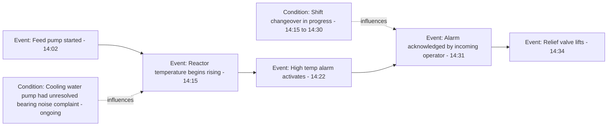
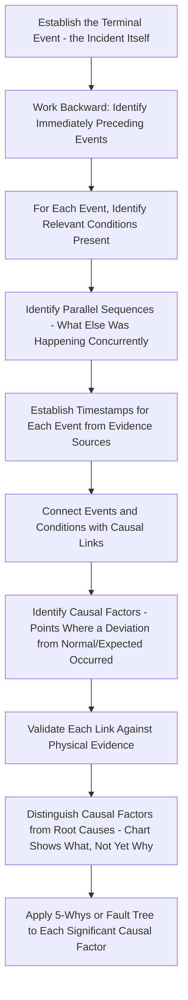
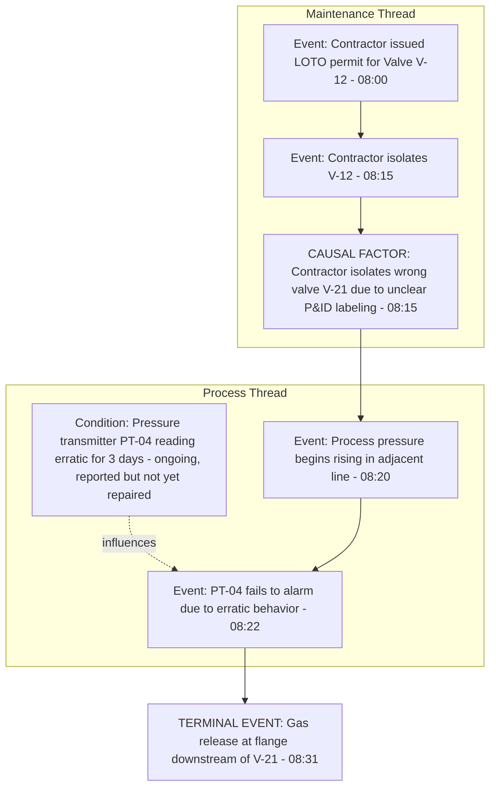
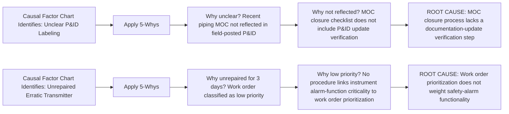

## Timeline and Causal Factor Charting

### Overview

Timeline and Causal Factor Charting (also known as Events and Causal Factors Analysis, or ECFA) is a structured incident investigation methodology that maps the chronological sequence of events leading to an incident alongside the conditions and causal factors present at each point in that sequence. Where 5-Whys is suited to a single linear causal thread and fishbone diagrams are suited to categorical brainstorming, causal factor charting is specifically designed for incidents involving multiple parallel event sequences, timing-dependent interactions, or complex sequences where the order and simultaneity of events matters to understanding causation.

### When Causal Factor Charting Is the Appropriate Technique

Causal factor charting adds the most value over simpler techniques when an incident cannot be adequately represented as a single chain of "why" questions because multiple things were happening concurrently, or because the specific timing and sequencing between events is itself part of what needs to be understood and explained.

| Incident Characteristic | Technique Fit |
| --- | --- |
| Single, clear linear cause-effect chain | 5-Whys sufficient; causal factor charting adds unneeded overhead |
| Multiple simultaneous or interacting event sequences (e.g., a process upset coinciding with a shift change and a contractor activity) | Causal factor charting well suited |
| Timing/sequencing itself is causally significant (e.g., an alarm was correct but arrived too late relative to another event) | Causal factor charting well suited |
| Long incident duration with many discrete decision points | Causal factor charting well suited |
| Need to distinguish "events" (things that happened) from "conditions" (states that existed) | Causal factor charting explicitly designed for this distinction |

**Key Points**

- The defining strength of causal factor charting relative to 5-Whys is its ability to represent branching and parallel sequences graphically, rather than forcing a genuinely non-linear incident into an artificially linear narrative.
- [Inference] Incidents involving human factors and organizational timing — such as a shift handover occurring at the same time an abnormal condition was developing — are frequently better served by causal factor charting than by 5-Whys, because the technique's timeline structure naturally surfaces "was this information available to the right person at the right time" questions that a linear why-chain tends to obscure.

### Core Building Blocks: Events vs. Conditions

Causal factor charting distinguishes between two types of chart elements:

- **Events** — discrete occurrences with a specific point in time (a valve opened, an alarm activated, an operator left the control room)
- **Conditions** — states or circumstances that existed over a span of time and influenced how events unfolded (an instrument was out of calibration, a procedure was outdated, staffing was below normal levels)

**Key Points**

- Representing conditions as separate elements that *influence* events (rather than folding them into the event sequence itself) is what allows the chart to show why an event unfolded the way it did, not merely that it occurred — the nine-minute gap between alarm activation and acknowledgment in the example above is explained by the shift-changeover condition, which would be lost in a simple linear timeline.
- Each event and condition on the chart should be supported by evidence (historian data timestamps, interview statements, log entries) — an event placed on the chart without a cited evidentiary source is an assumption, not a finding.

### Constructing a Causal Factor Chart

**Key Points**

- Construction typically works backward from the terminal event (the incident) rather than forward from an arbitrary starting point, because working backward ensures every element included on the chart has a demonstrated causal relevance to the outcome being investigated, rather than including tangential events that occurred but did not contribute.
- A causal factor chart, once built, identifies *where* deviations from normal or expected conditions occurred (the causal factors) — it does not by itself explain *why* those deviations occurred. This is a critical distinction: causal factor charting maps the sequence and identifies branch points worth investigating further, but reaching an actual root cause typically requires applying 5-Whys or fault tree analysis to the specific causal factors the chart identifies.

### Worked Example: Multi-Threaded Incident

**Scenario:** A toxic gas release occurred during a maintenance activity, involving a parallel sequence of a contractor isolation error and a simultaneous, unrelated instrument malfunction.

**Key Points**

- This chart makes visible that the incident required the *intersection* of two independent causal factors — a valve identification error and a pre-existing, unrepaired instrument condition — neither of which alone would necessarily have produced the release. A linear 5-Whys analysis following only the maintenance thread would have missed the instrumentation condition's contribution entirely.
- The chart identifies two distinct causal factors (unclear P&ID labeling, unrepaired erratic transmitter) that each warrant their own further root-cause depth analysis — the chart's job ends at identifying these branch points, not at explaining the organizational reasons behind either one.

### Causal Factors vs. Root Causes: Completing the Analysis

**Key Points**

- Completing the analysis this way reveals two independent root causes — an MOC documentation gap and a maintenance work-order prioritization gap — each requiring its own distinct corrective action; treating this as a single root cause would understate the corrective action scope needed.

### Comparison with Other Techniques

| Aspect | 5-Whys | Fishbone | Causal Factor Charting |
| --- | --- | --- | --- |
| Structure | Linear chain | Categorical branches | Chronological, multi-threaded |
| Handles parallel/simultaneous events | Poorly | Not designed for this | Well suited |
| Handles timing/sequencing significance | Not represented | Not represented | Explicitly represented |
| Distinguishes events from conditions | No | No | Yes |
| Reaches root cause on its own | Can, for simple chains | No — identifies candidates only | No — identifies causal factors only, requires follow-on analysis |
| Complexity/effort to construct | Low | Low-moderate | Moderate-high |

**Key Points**

- Causal factor charting is frequently the highest-effort of the common techniques, which is precisely why it is best reserved for incidents with genuine multi-threaded complexity rather than applied by default to every investigation — using it for a simple, single-cause incident adds construction effort without proportional analytical benefit.

### Data Sources for Chart Construction

Accurate timestamps and event sequencing depend on cross-referencing multiple evidence sources:

- Process historian trend data (providing precise, second-level timestamps for process variable changes)
- Alarm and event logs from the control system
- Safety instrumented system trip logs
- Permit-to-work and LOTO documentation with recorded times
- Radio/communication logs, if recorded
- Witness/interview statements, cross-checked against the above rather than relied upon alone for timing precision
- CCTV footage timestamps, where available and retained

**Key Points**

- Witness recollection of timing is frequently imprecise under the stress of an actual incident; wherever an instrumented data source (historian, alarm log) is available for a given event, it should take precedence over witness-estimated timing, with witness statements used primarily to establish context, decision-making, and actions rather than precise timestamps.

### Common Compliance Gaps

- Complex, multi-threaded incidents forced into a single linear 5-Whys narrative, obscuring parallel contributing sequences
- Chart events and conditions asserted without citation to a specific evidence source
- Chart construction stops at identifying causal factors (the "what and when") without proceeding to root cause analysis on each significant factor (the "why")
- Timeline built primarily from witness recollection without cross-referencing available historian or alarm log data
- Only one causal thread investigated to root cause depth while a parallel thread identified on the chart is left unaddressed in the final corrective action list

### Documentation Requirements

A defensible causal factor charting record retained in the investigation file should include:

1. The complete chart showing all events, conditions, and their connections, with timestamps
2. Citation of the evidence source supporting each event and condition placed on the chart
3. Identification of which chart elements are classified as causal factors (points of deviation from normal/expected)
4. Follow-on root cause analysis (5-Whys, fault tree) applied to each significant causal factor identified
5. Explicit linkage from each root cause back to a specific corrective action in the final 1910.119(m)(3) report

**Related Topics**

- Five Whys and Fishbone Diagrams — Complementary Techniques for Single-Thread Analysis
- Fault Tree Analysis and Barrier/LOPA-Based Investigation Methods
- Investigation Team Formation and Scope (1910.119(m)(2))
- Evidence Preservation for Historian, Alarm, and SIS Trip Log Data
- Human Factors and Shift Handover Analysis in Complex Incidents
- Corrective Action Development for Multi-Causal Investigation Findings