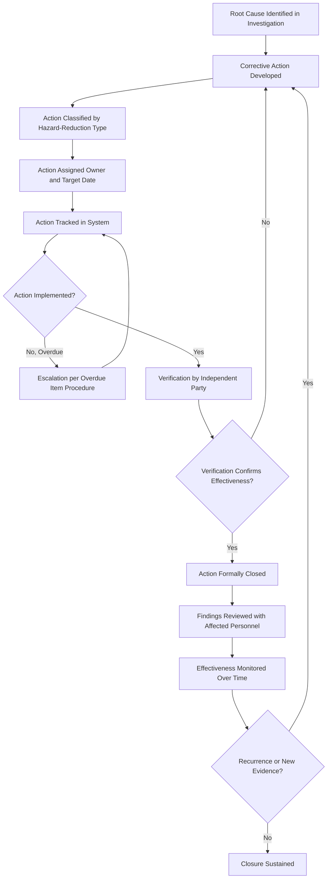
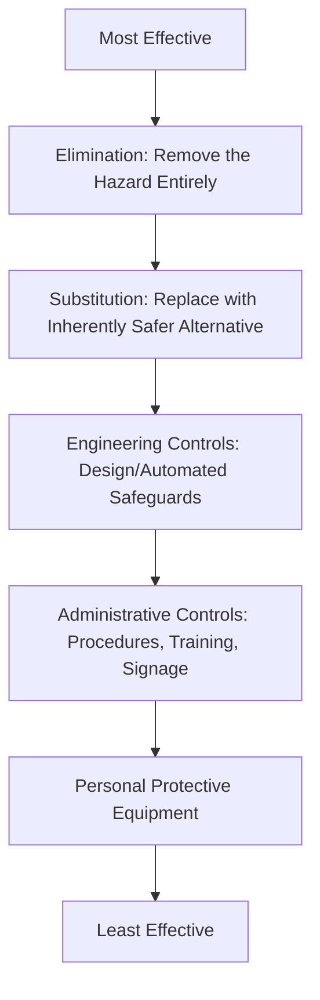
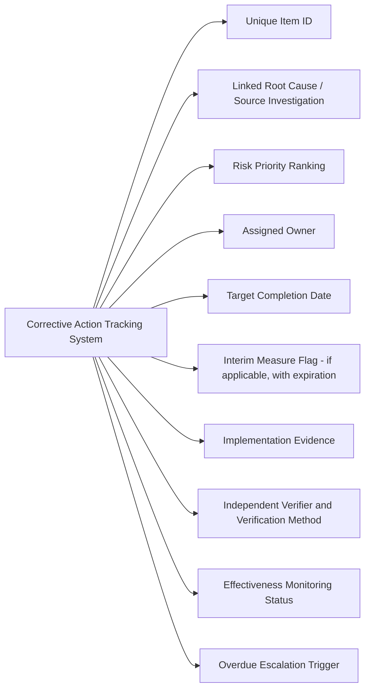

## Corrective Action Development and Tracking

### Overview

Corrective action development and tracking is the phase of incident investigation where identified root causes are converted into specific, assigned, and time-bound remedial actions — and where those actions are monitored through to verified completion. 29 CFR 1910.119(m) requires not only that recommendations result from an investigation, but that a system exist to promptly address and resolve them. An investigation that produces excellent root cause analysis but has no disciplined closure system is, from a compliance and risk-reduction standpoint, largely equivalent to not having investigated at all — the hazard has been documented but not controlled.

### Regulatory Requirements

29 CFR 1910.119(m)(4) requires the employer to establish a system to promptly address and resolve the incident report findings and recommendations. Resolutions and corrective actions must be documented, and the resolution and corrective actions must be reviewed with all affected personnel whose job tasks are relevant to the incident findings. Additionally, findings must be reviewed with, at minimum, operating, maintenance, and other personnel whose job tasks are affected by the findings, and the report must be retained for five years.

**Key Points**

- "Promptly address and resolve" is the operative regulatory standard — the requirement is not satisfied by simply generating a list of recommendations; there must be a functioning system that drives those recommendations to actual resolution within a reasonable timeframe.
- The requirement to review findings with affected personnel (not just the investigation team) is a distinct obligation from documenting the corrective actions themselves — a corrective action tracking system that closes items without ever communicating the underlying findings to the operators and maintenance personnel who need to know them has not fully satisfied 1910.119(m).

### The Corrective Action Lifecycle

### From Root Cause to Corrective Action: Maintaining Traceability

Every corrective action should trace explicitly back to a specific root cause identified during the investigation. A corrective action list that cannot be mapped one-to-one (or more precisely, many-to-many, since one root cause may require multiple actions and one action may address multiple causes) back to the investigation's root cause findings is a sign the closure process has become disconnected from the analysis that was supposed to drive it.

**Example traceability table:**

| Root Cause | Corrective Action | Owner | Target Date |
| --- | --- | --- | --- |
| MOC closure checklist does not include P&ID update verification | Add mandatory P&ID revision confirmation step to MOC closure checklist | MOC Program Owner | 30 days |
| Work order prioritization does not weight safety-alarm functionality | Revise work order priority matrix to elevate any work order tagged as affecting a safety-critical alarm | Maintenance Planning Manager | 45 days |
| Instrumentation specification practice does not require run-confirmation alarms on safety-critical rotating equipment | Conduct a facility-wide audit of safety-critical rotating equipment for run-confirmation instrumentation gaps | Reliability Engineering | 90 days |

**Key Points**

- The third example above illustrates a corrective action scoped beyond the single piece of equipment investigated — the root cause was a specification *practice* gap, so the action addresses the practice's effect across the facility, not merely the one pump involved in the incident.

### Hierarchy of Corrective Action Effectiveness

Not all corrective actions carry equal reliability. A defensible corrective action program favors higher-reliability controls over lower-reliability ones wherever practical, consistent with the same hierarchy of controls logic used in hazard mitigation generally.

**Example applying the hierarchy:**

For the run-confirmation alarm gap identified above, the corrective actions available (in descending reliability) might include:

- **Engineering control**: Install run-confirmation instrumentation with an automated alarm on all safety-critical rotating equipment (higher reliability)
- **Administrative control**: Add a shift-based manual check of pump status to the operator rounds procedure (lower reliability — depends on consistent human execution)

**Key Points**

- [Inference] A corrective action program that defaults to administrative controls (revised procedures, additional training, added checklist items) for the majority of its findings — rather than engineering controls where technically and economically feasible — tends to produce a pattern of recurring, similar incidents over time, because administrative controls are inherently more susceptible to degradation through workload pressure, turnover, and normalization of deviance. Whether this pattern manifests at any specific facility depends on that facility's actual corrective action history.
- Selecting a lower-reliability control (e.g., administrative rather than engineering) is not automatically wrong — cost, schedule, and technical feasibility are legitimate considerations — but the selection and its rationale should be documented explicitly rather than defaulting to the easiest-to-implement option without considering higher-reliability alternatives.

### Interim/Compensating Measures for Actions Requiring Extended Timelines

Some corrective actions — particularly engineering controls requiring capital project execution — cannot be completed quickly. A defensible program distinguishes between the final corrective action and any interim compensating measure needed to manage risk while the final action is pending.

**Key Points**

- An interim compensating measure (e.g., increased manual monitoring frequency, a temporary procedural restriction) must itself be documented, assigned, and — critically — have its own expiration or review date; an "interim" measure with no forcing function to complete the final action tends to become a permanent, undocumented substitute for the control that was actually recommended.
- Tracking systems should flag interim measures distinctly from final corrective actions so that management review can see, at a glance, how much of the facility's outstanding risk reduction is currently being carried by temporary rather than permanent controls.

### Prioritization and Risk Ranking

Corrective actions should be prioritized based on the risk reduction they provide, not simply in the order they appear in the investigation report or by ease of implementation.

| Priority Tier | Criteria | Target Timeline |
| --- | --- | --- |
| Critical | Addresses a root cause with direct potential for catastrophic release recurrence | Immediate/days |
| High | Addresses a significant contributing factor with meaningful risk reduction | Weeks |
| Medium | Addresses a systemic or programmatic gap with broader but less acute risk | 1-3 months |
| Low | Addresses a minor or administrative finding | 3-6 months |

**Key Points**

- [Inference] Facilities that risk-rank corrective actions independently of the order or emphasis given in the investigation report narrative tend to allocate resources more effectively than those that implicitly prioritize based on which finding appears first or is discussed at greatest length — narrative emphasis in a report does not necessarily correlate with actual risk magnitude.

### Verification of Corrective Action Effectiveness

Closing a corrective action requires verification distinct from the person who implemented it, mirroring the independent-verification principle used elsewhere in PSM (mechanical integrity inspections, PSSR closure, MOC review).

**Verification methods:**

- **Field verification** — physically confirming an engineering control was installed as specified
- **Document verification** — confirming a revised procedure or checklist exists, is approved, and is distributed to the correct locations
- **Functional testing** — confirming a new alarm, interlock, or instrument performs as intended
- **Training verification** — confirming affected personnel have received and understood revised procedures or new equipment training
- **Effectiveness monitoring** — for corrective actions addressing a recurring problem (e.g., a revised work order prioritization scheme), tracking whether the underlying metric (near-miss frequency, similar finding recurrence) actually improves over a defined post-implementation period

**Key Points**

- Effectiveness monitoring is a distinct and often-omitted step beyond simple implementation verification — confirming a corrective action was implemented as specified answers "did we do what we said," while effectiveness monitoring answers the more important question, "did it actually work."
- A corrective action verified as implemented but never checked for actual effectiveness risks a false sense of closure if the underlying root cause was misdiagnosed or the action was insufficient to address it.

### Tracking System Requirements

**Key Points**

- An overdue escalation trigger — automatically flagging items that pass their target date without closure to a defined level of management — is what makes "promptly address and resolve" an operational reality rather than an aspirational statement; without automatic escalation, overdue items tend to persist indefinitely without visibility.
- The tracking system should be a single, auditable source spanning corrective actions from all sources (incident investigations, PHA recommendations, audit findings, near-miss trend analysis) rather than a separate, siloed list per source, since a facility's overall risk picture depends on visibility across all open items, not just those from incident investigations specifically.

### Communication of Findings to Affected Personnel

1910.119(m) explicitly requires review of findings with affected personnel, separate from the corrective action tracking itself.

**Example communication approach:**

1. A summary of the incident, root causes, and corrective actions (appropriately redacted of any information not relevant to the audience) is prepared for operator and maintenance shift briefings
2. Affected personnel are given the opportunity to ask questions and provide input, particularly where a procedural or behavioral corrective action will affect their daily work
3. Attendance/acknowledgment of the briefing is documented
4. Where the incident and findings have broader relevance (e.g., similar equipment exists elsewhere in the facility), communication is extended beyond the immediately affected unit

**Key Points**

- Communicating findings to affected personnel serves a purpose beyond regulatory compliance — personnel who understand *why* a new procedure step or equipment modification was introduced are more likely to follow it consistently than personnel who are simply told a new rule exists without context.

### Common Compliance Gaps

- Corrective actions listed in the investigation report but with no formal tracking system driving them to closure — the report becomes the endpoint rather than the start of a resolution process
- No traceability maintained between root causes and corrective actions, making it impossible to confirm every identified root cause was actually addressed
- Interim/compensating measures implemented with no expiration date, becoming de facto permanent substitutes for the intended final corrective action
- Corrective actions closed based on implementation alone, with no effectiveness monitoring to confirm the underlying problem was actually resolved
- No overdue escalation mechanism, allowing corrective actions to remain open indefinitely without management visibility
- Findings communicated only to the investigation team and management, without the required review with operating and maintenance personnel whose tasks are affected
- Corrective action prioritization based on report narrative order or ease of implementation rather than documented risk ranking

### Documentation and Recordkeeping

A defensible corrective action program file typically includes:

1. Full traceability records linking each root cause to its corresponding corrective action(s)
2. Risk-ranking documentation for each action's prioritization
3. Interim compensating measure records, including expiration/review dates
4. Implementation evidence and independent verification records for each closed action
5. Effectiveness monitoring results for actions addressing recurring or systemic problems
6. Records of findings review with affected operating and maintenance personnel, per 1910.119(m)
7. The investigation report itself, retained for a minimum of five years per 1910.119(m)(5)

**Related Topics**

- Root Cause Analysis Techniques and Their Linkage to Corrective Action Scope
- Management of Change Integration for Engineering Control Corrective Actions
- Pre-Startup Safety Review Closure Processes as a Parallel Tracking Model
- Hierarchy of Controls Application in Process Safety Corrective Actions
- Investigation Report Content and Retention Requirements (1910.119(m)(3)-(5))
- Leading Indicator Metrics for Corrective Action Program Health