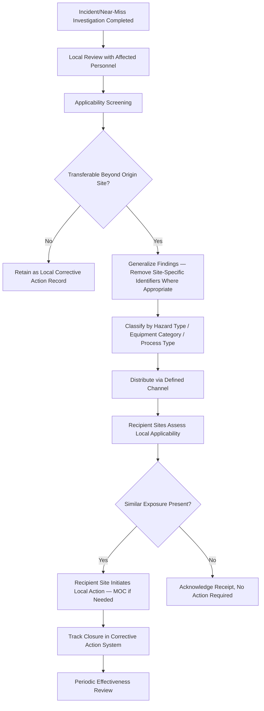
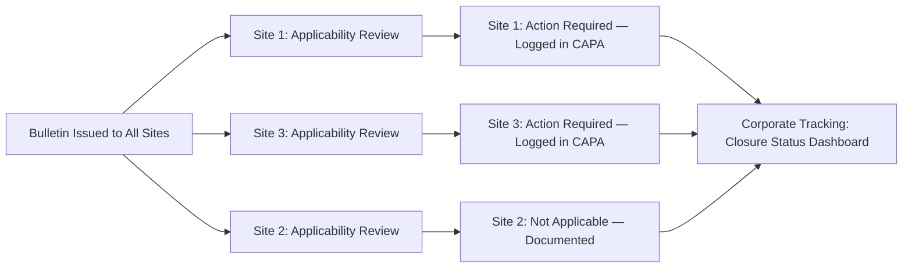

## Sharing Lessons Learned Across an Organization

### Overview and Purpose

Sharing lessons learned is the dissemination phase of the incident investigation lifecycle — the mechanism by which findings from a single incident, near-miss, or audit are converted into organization-wide risk reduction rather than remaining confined to the site or unit where the event occurred. Under **29 CFR 1910.119(m)**, OSHA requires that incident investigation findings be reviewed with all affected personnel whose job tasks relate to the incident, and this review requirement is the regulatory floor that lessons-learned programs are built on top of. CCPS and API RP 754 guidance extend this concept further, treating cross-organizational sharing as a core element of a functioning process safety management system rather than a discretionary communications activity.

The distinction between "affected personnel review" (regulatory minimum) and "lessons learned sharing" (mature PSM practice) is one of scope and reach:

| Dimension | Affected Personnel Review (1910.119(m)) | Organization-Wide Lessons Learned |
| --- | --- | --- |
| Audience | Employees whose job tasks are relevant to the incident findings | All units, sites, or business lines with similar equipment, processes, or task exposure |
| Trigger | Mandatory for every PSM-covered incident investigation | Mandatory for the originating site; extended sharing is risk-based |
| Timing | Documented review upon investigation completion | May include periodic aggregation (quarterly bulletins, annual summaries) |
| Content | Full investigation findings relevant to the local task | Distilled, generalized findings applicable beyond the specific equipment/location |

### Why Sharing Fails to Occur Without Deliberate Process Design

Left to informal channels, lessons learned rarely propagate beyond the originating site, for structural reasons:

- **Organizational silos**: Sites or business units investigating independently have no default channel to a peer site with similar equipment
- **Incentive misalignment**: Sites may be reluctant to publicize their own incidents, especially where performance metrics are visible across the organization
- **Signal-to-noise degradation**: Without curation, high volumes of investigation reports overwhelm recipients, causing genuinely transferable lessons to be ignored alongside site-specific trivia
- **Loss of urgency over distance**: A lesson with high perceived relevance at the originating site is often perceived as low relevance elsewhere unless the applicability is explicitly translated

A lessons-learned program exists specifically to counter these structural failure modes through defined processes, ownership, and distribution mechanisms.

### Lessons Learned Program Architecture

### Step 1: Applicability Screening

Not every incident generates a transferable lesson, and treating every investigation report as organization-wide content dilutes the program's credibility. Screening criteria typically include:

| Criterion | Screening Question |
| --- | --- |
| Equipment commonality | Do other sites operate the same or similar equipment type? |
| Process commonality | Is the underlying process chemistry or operation replicated elsewhere? |
| Root cause generality | Is the root cause a systemic/programmatic gap (e.g., procedure design flaw) rather than a purely local anomaly? |
| Consequence severity | Would a recurrence elsewhere plausibly result in comparable or greater severity? |
| Barrier/safeguard relevance | Did a safeguard fail in a way that depends on design assumptions used elsewhere? |

Incidents with root causes tied to generic human factors issues (e.g., procedure ambiguity, alarm management design flaws, inadequate MOC screening) tend to have the highest cross-organizational transferability, since these failure modes are rarely unique to one site's specific equipment configuration.

### Step 2: Generalization and Content Design

Effective lessons-learned content separates the specific incident narrative from the generalizable safety message. A well-constructed lessons-learned bulletin typically follows a structured format:

**Example**

**Lessons Learned Bulletin Structure:**

1. **What Happened** — Brief, de-identified narrative sufficient to convey mechanism (2-4 sentences)
2. **Why It Happened** — Root and contributing causes stated at a systemic level
3. **What Made It Worse / What Limited It** — Barrier performance (what failed, what worked)
4. **Where This Could Apply** — Explicit statement of equipment types, process conditions, or task categories at risk elsewhere
5. **Recommended Actions** — Specific, verifiable actions recipient sites should take (e.g., "verify relief valve set pressure against current process conditions," not "review safety systems")
6. **Questions for Local Discussion** — Prompts for toolbox talks or safety meetings to drive local engagement rather than passive reading

This structure intentionally separates fact (what happened) from generalized transferable insight (where this could apply), which prevents recipients from dismissing the bulletin as "not applicable to us" due to superficial differences in the originating incident's specifics.

### Step 3: Distribution Channels

| Channel | Use Case | Typical Cadence |
| --- | --- | --- |
| Safety Alert / Flash Bulletin | High-severity or high-transferability findings requiring immediate awareness | As-needed, within days of investigation completion |
| Toolbox Talk / Pre-Shift Briefing Content | Front-line operator and technician awareness | Weekly or as bulletins are issued |
| Corporate PSM Council / Cross-Site Review Meeting | Aggregated trend review across multiple incidents | Monthly or quarterly |
| Centralized Lessons Learned Database | Searchable historical record for MOC, design, and PHA teams | Continuously updated, referenced on-demand |
| Annual Process Safety Performance Report | Organization-wide trend summary for leadership and all sites | Annual |

A tiered distribution approach — flash bulletins for urgent, high-transferability findings and periodic aggregated reviews for lower-urgency systemic trends — prevents both under-communication of critical findings and alert fatigue from excessive low-value distribution.

### Step 4: Requiring Local Action, Not Just Awareness

A lessons-learned program that only achieves "awareness" (recipients read the bulletin) without a **closed-loop applicability determination** at each recipient site has limited risk-reduction value. Mature programs require each receiving site or unit to formally document:

- Whether the described hazard/failure mode is present in their process
- If present, what action (if any) is being taken, tracked through the corrective/preventive action (CAPA) system
- If not present, an explicit "not applicable" determination with brief justification (avoids the ambiguity of silent non-response)

### Metrics for Program Effectiveness

| Metric | What It Measures |
| --- | --- |
| Time from incident closure to bulletin issuance | Speed of dissemination |
| Percentage of sites with documented applicability determination | Completeness of closed-loop response |
| Percentage of applicable findings resulting in tracked corrective action | Conversion of awareness into action |
| Recurrence rate of similar incident types across sites | Ultimate effectiveness — whether sharing actually prevented repeat events |
| Time to closure of cross-site corrective actions | Program follow-through |

The recurrence rate metric is the most meaningful long-term indicator, but it requires multi-year trend data and reliable incident classification/taxonomy across sites to be statistically meaningful. [Inference — reliably attributing a recurrence reduction specifically to a lessons-learned program, as opposed to other concurrent PSM improvements, is generally difficult without controlled comparison, and this limitation is not always acknowledged in program effectiveness reporting.]

### Common Program Failure Modes

- **One-way broadcast without acknowledgment tracking**: Bulletins sent via email with no requirement for recipient confirmation, making it impossible to verify reach or engagement
- **Over-genericization**: Removing so much specific detail during "sanitization" that recipients cannot determine actual applicability to their operation
- **No linkage to MOC**: Recipient sites read a bulletin, agree it's applicable, but the resulting change (e.g., a relief valve set-pressure revision) is implemented outside the Management of Change process, bypassing the review the original process safety information was subject to
- **Database without curation**: A searchable lessons-learned repository that has become a passive archive nobody proactively queries, rather than being actively pushed during PHA revalidation, MOC review, and new project design phases
- **Cross-site knowledge stopping at investigation, not extending to positive learning**: Programs that only share failure-based lessons and never capture what safeguards performed as designed, missing an opportunity to reinforce and replicate effective controls

### Integration with Other PSM Elements

Lessons learned sharing is most effective when it is explicitly wired into other PSM processes rather than existing as a standalone communications function:

| PSM Element | Integration Point |
| --- | --- |
| Process Hazard Analysis (PHA) | PHA revalidation teams review relevant lessons-learned database entries as input to scenario identification |
| Management of Change (MOC) | New MOC requests are screened against relevant lessons learned for similar past changes |
| Training | Lessons-learned content incorporated into refresher training curricula |
| Mechanical Integrity | Equipment-specific lessons feed into inspection interval and failure mode review |
| Auditing | PSM audits verify the lessons-learned program's closed-loop tracking, not merely its existence |

**Related Topics**

- Incident Investigation Methodology: Root Cause Analysis Techniques (5 Whys, Fault Tree, TapRooT, ICAM)
- Near-Miss Reporting Program Design
- Corrective and Preventive Action (CAPA) Tracking Systems
- Process Hazard Analysis Revalidation Using Historical Incident Data
- Process Safety Performance Indicators (Leading and Lagging) per API RP 754
- Management of Change (MOC) Screening Criteria
- Human Factors in Incident Root Causes
- Cross-Site Process Safety Governance Structures