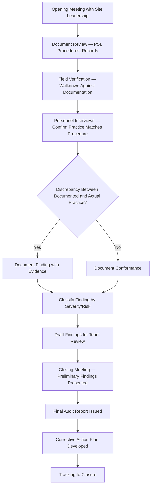
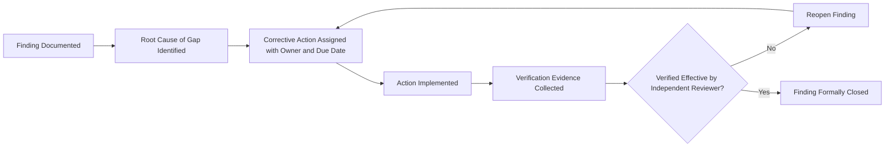

## Internal Audit Planning and Execution

### Overview and Regulatory Basis

Internal audit planning and execution within Process Safety Management (PSM) is governed primarily by **29 CFR 1910.119(o)**, which requires employers to certify that they have evaluated compliance with PSM provisions at least every three years to verify that procedures and practices are adequate and are being followed. This is a compliance-focused, system-verification activity distinct from incident investigation (reactive, event-triggered) and PHA (hazard-scenario-focused) — the audit asks not "what could go wrong" but "is what we said we would do actually happening."

Beyond the three-year regulatory minimum, mature PSM programs layer internal audits at multiple frequencies and scopes, since a triennial audit alone is insufficient to catch programmatic drift in the interim. CCPS guidance and API RP 754 both frame auditing as a continuous verification discipline rather than a periodic compliance event.

### Audit Program Architecture — Types and Frequency

| Audit Type | Scope | Typical Frequency | Primary Purpose |
| --- | --- | --- | --- |
| Compliance Audit (1910.119(o)) | Full PSM element-by-element verification against regulatory text | Every 3 years (regulatory minimum) | Regulatory certification |
| Element-Focused Audit | Deep dive on a single PSM element (e.g., Mechanical Integrity only) | Annual or per internal schedule | Targeted risk reduction on historically weak elements |
| Self-Assessment | Site-led, less formal review using internal checklist | Annual or semi-annual | Early detection between formal audits |
| Management System Audit | Verification that governing procedures and management systems function as designed, not just document existence | Aligned with compliance audit or separate cycle | System-level assurance |
| Follow-up / Closure Verification Audit | Confirms prior audit findings were actually closed, not just marked closed | After corrective action due dates | Closes the audit loop |

Relying solely on the 3-year cycle without interim self-assessment creates a structural blind spot: a program can drift out of compliance for up to three years before the next formal audit detects it. Interim self-assessments are the primary mechanism for catching drift earlier.

### Audit Planning Phase

#### Step 1: Scope Definition

Scope definition establishes the boundary of what the audit will examine and should be documented before fieldwork begins:

- Which PSM elements are in scope (all 14 elements for a full compliance audit; a subset for element-focused audits)
- Which facilities, units, or process areas are in scope
- The audit period being reviewed (e.g., records and practices since the prior audit)
- Applicable regulatory citations, internal standards, and any incorporated industry codes (API, NFPA, ASME) that the site has committed to follow

#### Step 2: Audit Team Composition and Independence

**29 CFR 1910.119(o)(2)** requires that the audit be conducted by at least one person knowledgeable in the process. Beyond this regulatory floor, audit team composition should balance process knowledge against independence:

| Team Composition Principle | Rationale |
| --- | --- |
| At least one member with process-specific technical knowledge | Required by regulation; ensures findings are technically grounded |
| At least one member independent of the audited unit's day-to-day operations | Reduces confirmation bias and blind spots from familiarity |
| Cross-functional representation (operations, maintenance, engineering, EHS) | Captures element interactions a single-discipline reviewer would miss |
| Lead auditor with formal audit methodology training | Ensures consistent evidence-gathering and documentation standards |

A common program weakness is staffing audits entirely with personnel from the audited site itself — while this satisfies the "knowledgeable in the process" requirement, it undermines independence, since auditors may be reviewing procedures and practices they themselves authored or normalized over time.

#### Step 3: Protocol and Checklist Development

Audit protocols translate each in-scope PSM element into specific, verifiable audit questions with defined evidence requirements. Protocols should avoid yes/no checklist superficiality and instead specify what evidence constitutes a "yes."

| PSM Element | Example Audit Question | Evidence Required |
| --- | --- | --- |
| Process Safety Information | Is PSI current and accessible to those who need it? | Sampled comparison of PSI documents against field-verified as-built conditions |
| Operating Procedures | Are procedures reviewed/certified annually per 1910.119(f)(3)? | Revision control log showing annual certification dates for a sample of procedures |
| MOC | Are all field-observed equipment/process deviations traceable to an approved MOC? | Field walkdown cross-referenced against MOC log; sample of recent MOCs reviewed for completeness |
| Mechanical Integrity | Are inspection/test intervals being met for safety-critical equipment? | Inspection records sampled against the MI schedule; overdue item tracking |
| Training | Is training documented with verification of understanding? | Sampled training records checked for date, content, and assessment method |

#### Step 4: Sampling Strategy

Given the volume of records in a mature PSM program, audits rely on statistically or risk-informed sampling rather than 100% record review. Sampling approach should be documented and defensible:

- **Risk-based sampling**: Weighting sample selection toward higher-consequence equipment, processes, or task types
- **Random sampling**: Reducing selection bias for baseline compliance verification
- **Targeted sampling**: Following up on areas flagged by prior audits, incidents, or near-misses

A sampling plan that consistently selects the same "easy" records (e.g., always the most recently completed MOCs, which are freshest in reviewers' minds and least likely to have degraded) will systematically understate actual compliance gaps.

### Audit Execution Phase

#### Document Review vs. Field Verification vs. Interview — The Triangulation Principle

A defensible audit finding is triangulated across at least two of these three evidence sources, rather than relying on any single source:

| Evidence Source | What It Confirms | Limitation if Used Alone |
| --- | --- | --- |
| Document Review | What the organization says it does | Does not confirm actual field practice |
| Field Verification (Walkdown) | Physical/as-built condition | Snapshot in time; does not confirm consistent practice |
| Personnel Interview | What personnel believe they should do and understand | Subject to interviewee's individual knowledge gaps or desire to give the "correct" answer |

For example, confirming a LOTO procedure exists (document review) and matches the physical isolation points observed in the field (walkdown) but finding that the technician interviewed could not correctly describe the verification step (interview) surfaces a training gap that document review alone would have missed entirely.

#### Interview Technique Considerations

Effective audit interviews avoid leading questions that telegraph the expected answer. "Do you always verify zero energy state before starting work?" invites a rote affirmative; "Walk me through what you did the last time you isolated this equipment" surfaces actual practice. Interviewing personnel across shifts and experience levels — not only day-shift senior operators — reduces the risk of the audit capturing only the most institutionally polished practice.

### Finding Classification

Findings are typically classified by severity to drive appropriate corrective action prioritization and resourcing:

| Classification | Definition | Example | Typical Closure Timeline |
| --- | --- | --- | --- |
| Critical / Regulatory Non-Compliance | Direct violation of a regulatory requirement with significant risk implication | PHA recommendations not resolved within required timeframe | Immediate to 30 days |
| Major | Systemic gap affecting multiple instances or a programmatic control | Training records show a pattern of missing competency verification across multiple operators | 30-90 days |
| Minor | Isolated, low-consequence gap | Single procedure past its annual certification date by a short margin | 90-180 days |
| Observation / Opportunity for Improvement | Not a compliance gap but a recommendation for program enhancement | Suggest consolidating duplicate procedure references across documents | Discretionary |

Consistent classification criteria across audit cycles is important for trend analysis — if severity classification drifts between audit teams or cycles, apparent improvement or degradation trends become unreliable.

### Audit Report Structure

**Example**

**Standard Internal PSM Audit Report Sections:**

1. **Executive Summary** — Overall compliance status, critical findings count, comparison to prior audit
2. **Scope and Methodology** — Elements/facilities audited, team composition, sampling approach
3. **Findings by PSM Element** — Organized by element, each finding with evidence citation and classification
4. **Positive Practices Identified** — Notable strengths worth replicating elsewhere (often omitted, but valuable for organizational learning)
5. **Trend Comparison to Prior Audits** — Recurring findings, closure rate of previous corrective actions
6. **Corrective Action Recommendations** — Specific, verifiable, assigned-ownership recommendations
7. **Appendices** — Detailed evidence logs, interview lists, document sample lists

### Corrective Action Tracking and Closure Verification

A finding is not resolved when a corrective action is logged as "complete" in a tracking system — closure requires verification that the action actually addressed the root cause of the finding, not merely that an activity was performed.

A recurring audit program weakness is closing findings based on the responsible party's self-attestation without independent verification — this is functionally equivalent to skipping the closure verification step entirely and tends to produce recurring findings across successive audit cycles.

### Audit Trend Analysis

Tracking findings across multiple audit cycles reveals systemic patterns that a single audit cannot surface:

| Trend Signal | Interpretation |
| --- | --- |
| Same element repeatedly generates findings across cycles | Indicates a systemic (not isolated) weakness requiring management-level intervention, not just local corrective action |
| Finding count decreasing but severity increasing | May indicate superficial issues are being resolved while root systemic issues persist |
| Findings cluster around a specific site/unit vs. organization-wide | Distinguishes local management system failure from corporate-level program design gap |
| Corrective action closure timeliness degrading over cycles | Early warning of resourcing or management attention erosion |

### Common Audit Program Failure Modes

- **Auditing to the checklist, not the process**: Confirming documents exist without genuinely testing whether the underlying management system functions as intended
- **Insufficient field time**: Audits weighted disproportionately toward document/record review in a conference room rather than field verification and interviews
- **Finding fatigue leading to under-reporting**: Auditors softening classification of findings to reduce corrective action burden on the audited site, particularly when audit teams have ongoing working relationships with site personnel
- **No linkage to incident/near-miss history**: Audit scope developed without reviewing the site's own incident trends, missing an opportunity to weight sampling toward areas of known elevated risk
- **Closure without effectiveness verification**: As above — administrative closure substituting for confirmed remediation

### Relationship to Management Review

Audit findings and trend data are a primary input to PSM management review (a distinct activity from the audit itself, typically involving senior leadership assessment of overall program health). Audit results that surface recurring or systemic findings should escalate beyond corrective action tracking into a management review discussion of resourcing, program design, or organizational priority — an audit program that generates findings but never triggers management-level program adjustment has limited long-term risk-reduction value regardless of how rigorously individual audits are executed.

**Related Topics**

- Management Review of Process Safety Performance
- Corrective and Preventive Action (CAPA) System Design
- Process Safety Performance Indicators per API RP 754
- Management of Change (MOC) Program Auditing
- Mechanical Integrity Inspection and Test Interval Compliance
- Third-Party / External PSM Compliance Audits
- Root Cause Analysis for Systemic Audit Findings
- Regulatory Citation Response and OSHA PSM Enforcement Trends