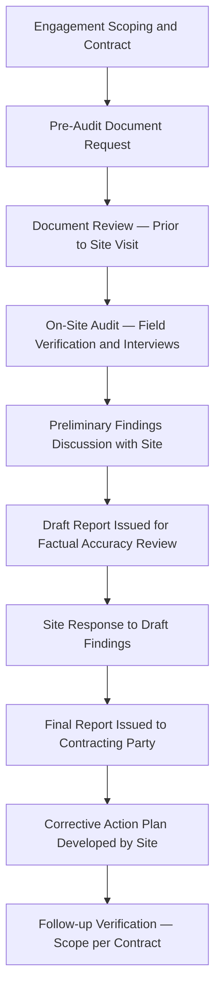
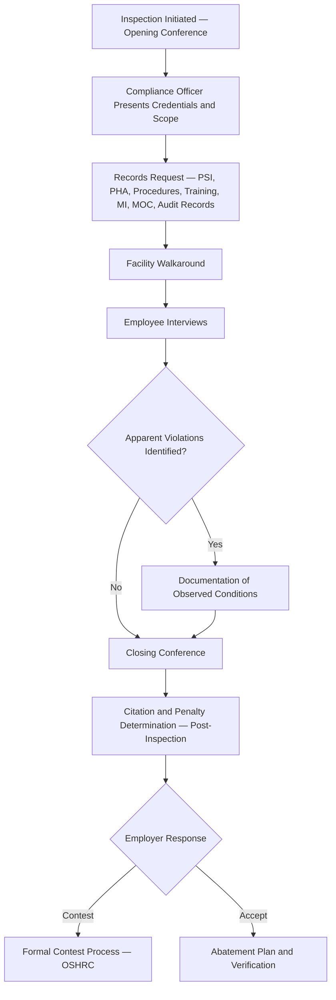

## Third Party and Regulatory Audits


### Overview and Distinction from Internal Audits

Third party and regulatory audits are external verification activities that differ from internal audits (covered separately) primarily in the source of authority, the independence of the reviewing party, and the consequences of adverse findings. Where internal audits are a self-imposed compliance verification exercise under **29 CFR 1910.119(o)**, third party and regulatory audits are conducted by parties external to the organization's management chain, carrying distinct legal, insurance, or certification implications.

| Dimension | Internal Audit | Third Party Audit | Regulatory Audit/Inspection |
| --- | --- | --- | --- |
| Conducting Party | Employee(s) knowledgeable in the process | Independent contracted auditor/consultant or certification body | Government agency (OSHA, EPA, state equivalent) |
| Primary Driver | 1910.119(o) triennial requirement | Insurance requirement, certification (e.g., ISO 45001), corporate assurance, client requirement | Statutory authority (OSH Act, Clean Air Act Section 112(r)) |
| Authority Over Findings | Advisory to site/corporate management | Advisory, but may affect insurability or certification status | Legally enforceable — can result in citations, penalties, consent decrees |
| Typical Trigger | Scheduled cycle | Scheduled cycle, insurer requirement, M&A due diligence | Programmed inspection, complaint, referral, incident-triggered |
| Confidentiality/Privilege Considerations | Internal work product, may be more freely shared | Contractual confidentiality terms apply | Findings often become part of public enforcement record |

### Third Party Audits

#### Purpose and Common Drivers

Third party audits are typically initiated for one or more of the following reasons:

- **Insurance underwriting**: Property/casualty and specialty process safety insurers frequently require or incentivize independent PSM audits as a condition of coverage or premium terms
- **Certification maintenance**: ISO 45001, ISO 14001, or industry-specific certifications (e.g., Responsible Care®) require periodic external audits by accredited bodies
- **Corporate assurance**: Multi-site organizations use third party auditors to obtain an independent, cross-site-comparable view of PSM maturity, free of the potential bias of site-affiliated internal auditors
- **Mergers and acquisitions due diligence**: Prospective buyers commission independent PSM audits to quantify latent compliance liability before a transaction closes
- **Post-incident independent review**: Following a significant incident, an organization may commission an external audit to demonstrate independence and rigor beyond what an internal investigation alone would provide

#### Third Party Audit Team Independence Requirements

Unlike internal audits, which permit (and require) at least one team member knowledgeable in the specific process, third party audits are structured to maximize independence from the audited organization:

- No current or recent employment relationship with the audited site
- No involvement in the design, approval, or implementation of the systems being audited
- Contractual or professional certification body requirements often mandate auditor rotation to prevent familiarity bias developing over successive audit cycles

#### Third Party Audit Process



A key procedural difference from internal audits is the **draft-for-factual-accuracy-review step**: because third party findings often carry external consequences (insurance terms, certification status), the audited organization is typically given a formal opportunity to contest factual inaccuracies before the report is finalized — though this is limited to factual correction, not negotiation of the auditor's judgment or classification.

#### Handling Third Party Findings

Third party audit findings, particularly those tied to insurance or certification, often carry externally-imposed closure deadlines with consequences for non-closure (e.g., premium increases, coverage conditions, certification suspension) that differ from the internally-set deadlines typical of internal audit corrective actions. Programs should track third party findings with the same rigor as internal findings, but with explicit attention to any externally imposed deadline and the specific party (insurer, certification body) to whom closure evidence must be reported.

### Regulatory Audits and Inspections

#### OSHA PSM Inspection Authority and Triggers

OSHA conducts PSM compliance inspections under authority of the OSH Act, using the **PSM National Emphasis Program (NEP)** and related enforcement initiatives as the primary vehicle for programmed (non-complaint-driven) inspections at covered facilities. Common inspection triggers:

| Trigger Type | Description |
| --- | --- |
| Programmed/Planned Inspection | Facility selected under NEP targeting criteria (e.g., SIC/NAICS code, chemical inventory thresholds) |
| Complaint-Driven | Employee or third-party complaint alleging a hazardous condition |
| Referral | Referral from another agency (e.g., EPA following a Clean Air Act Section 112(r) incident) |
| Incident-Triggered | Catastrophic incident, fatality, or multiple hospitalization triggers mandatory investigation |
| Follow-up Inspection | Verification of abatement from a prior citation |

#### OSHA PSM Inspection Scope — The 14 Elements

A full-scope PSM inspection systematically examines compliance across all PSM elements, though inspection depth and element emphasis vary by trigger type (an incident-triggered inspection will typically concentrate scrutiny on elements most proximate to the incident's causal chain):

1. Employee Participation
2. Process Safety Information
3. Process Hazard Analysis
4. Operating Procedures
5. Training
6. Contractors
7. Pre-Startup Safety Review
8. Mechanical Integrity
9. Hot Work Permit
10. Management of Change
11. Incident Investigation
12. Emergency Planning and Response
13. Compliance Audits
14. Trade Secrets

#### Regulatory Inspection Process



#### Citation Classification

| Classification | Definition | Typical Consequence |
| --- | --- | --- |
| De Minimis | Technical violation with no direct/immediate relationship to safety or health | No penalty; notation only |
| Other-Than-Serious | Violation with direct relationship to safety/health but unlikely to cause death/serious harm | Penalty possible, generally lower |
| Serious | Substantial probability that death or serious physical harm could result | Mandatory penalty |
| Willful | Employer knowingly violated the requirement or showed plain indifference | Significantly elevated penalty, potential criminal referral for willful violations resulting in death |
| Repeat | Substantially similar violation cited previously within the look-back period | Elevated penalty, multiplier applied |
| Failure to Abate | Previously cited condition not corrected by abatement deadline | Additional per-day penalty accrual |

[Inference — specific penalty amounts and look-back periods for repeat classification are subject to periodic regulatory adjustment and should be verified against current OSHA penalty schedules rather than treated as static figures.]

#### Employer Rights and Obligations During Inspection

- **Right to accompaniment**: Employer representative (and employee representative) may accompany the compliance officer during the walkaround
- **Right to limit scope for trade secret protection**: Trade secret information can be protected per PSM Element 14, though this does not exempt the underlying process from inspection
- **Obligation to provide requested records**: Refusal or delay in producing PSM records is itself a basis for citation
- **Right to a closing conference**: Discussion of apparent violations before the compliance officer leaves the site, though final citation determination occurs afterward through the area office review process

#### Managing the Inspection — Internal Coordination

Organizations with mature PSM programs typically maintain a documented inspection response protocol to ensure consistent, legally sound conduct during a regulatory visit:

**Example**

**Regulatory Inspection Response Protocol — Key Elements:**

1. Designated points of contact notified immediately upon compliance officer arrival (EHS lead, legal counsel, site management)
2. Credentials verification and documented scope of inspection authority
3. Single designated escort/note-taker accompanies the compliance officer at all times
4. All document requests logged, with copies retained of everything provided
5. Employee interviews — employees informed of their right to have a representative present (for interviews conducted as part of a walkaround under a recognized bargaining unit) and their right to speak candidly
6. No spontaneous admissions or speculative statements by accompanying personnel regarding root cause or fault
7. Legal counsel involvement for any incident-triggered inspection given potential for citation or enforcement action

This protocol structure exists to ensure accuracy and legal defensibility, not to obstruct the inspection — obstruction or providing false information to a compliance officer carries independent legal exposure.

### Comparative Summary — When Each Audit Type Applies

```mermaid
flowchart LR
    A[PSM Verification Need] --> B{Internal Regulatory Minimum}
    A --> C{External Assurance Need}
    A --> D{Government Enforcement}
    B --> E[Internal Audit — 1910.119(o), every 3 years]
    C --> F[Third Party Audit — Insurance, Certification, M&A]
    D --> G[Regulatory Inspection — OSHA NEP, Complaint, Incident-Triggered]
    E -.feeds findings into.-> H[Management Review]
    F -.feeds findings into.-> H
    G -.citation response feeds into.-> H
```

### Integration with Overall PSM Program

Findings from third party and regulatory audits should be integrated into the same corrective action tracking and trend analysis infrastructure used for internal audits, rather than managed as a separate parallel process — an organization tracking these three audit types in disconnected systems loses the ability to see whether a regulatory citation reflects a gap that an internal or third party audit had already identified but failed to drive to closure. This pattern — a previously-identified-but-unresolved finding later becoming the basis of a regulatory citation — is a recurring theme in OSHA enforcement history for PSM-covered facilities and represents one of the highest-value cross-checks a mature audit program can perform. [Inference — while this pattern is well-documented in individual OSHA enforcement case narratives, the frequency of this specific failure mode across the full population of PSM-covered facilities is not something a general reference can quantify without site-specific enforcement history review.]

**Related Topics**

- Internal Audit Planning and Execution
- OSHA PSM National Emphasis Program Targeting Criteria
- Citation Contest Process and OSHRC Proceedings
- Clean Air Act Section 112(r) Risk Management Program Interface with PSM
- Corrective and Preventive Action (CAPA) System Design
- Insurance and Risk Engineering Requirements for Process Safety
- ISO 45001 and Responsible Care® Certification Audit Requirements
- Trade Secret Protection During Regulatory Inspections