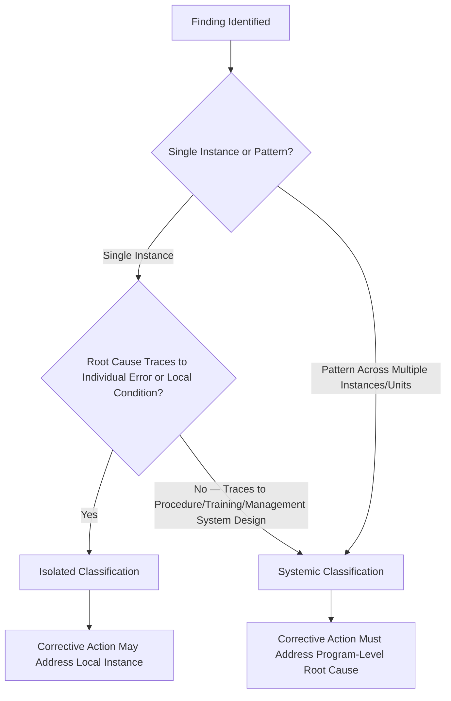
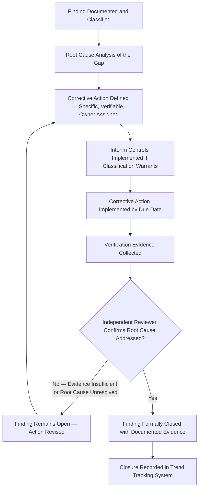
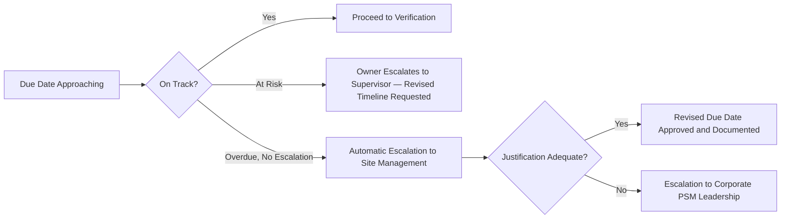

## Audit Finding Classification and Closure

### Overview and Purpose

Audit finding classification and closure is the process by which raw audit observations are converted into prioritized, actionable, and verifiably resolved corrective actions. This function sits downstream of audit execution (internal, third party, or regulatory) and is the mechanism that determines whether an audit program produces actual risk reduction or merely generates a paper trail. A finding that is classified inconsistently or closed without effectiveness verification undermines the value of the audit effort that produced it, regardless of how rigorous the underlying fieldwork was.

Classification and closure are best understood as two distinct disciplines with different failure modes:

| Discipline | Core Question | Primary Failure Mode if Done Poorly |
| --- | --- | --- |
| Classification | How severe/urgent is this gap, and what resourcing/timeline does it warrant? | Inconsistent severity ratings across audits/auditors distort trend analysis and misallocate remediation resources |
| Closure | Has the underlying gap actually been resolved, not just administratively marked complete? | Findings recur across audit cycles because closure was declared without verifying root cause resolution |

### Classification Frameworks

#### Severity-Based Classification

The most common classification approach rates findings by potential consequence and regulatory/systemic significance:

| Classification | Definition | Example | Typical Closure Timeline |
| --- | --- | --- | --- |
| Critical / Regulatory Non-Compliance | Direct violation of a regulatory requirement with significant risk implication; often requires immediate interim controls | PHA recommendation with high-consequence potential left unresolved past required timeframe | Immediate interim action; full closure 30 days |
| Major | Systemic gap affecting multiple instances, locations, or a programmatic control | Training records show a pattern of missing competency verification across multiple operators | 30-90 days |
| Minor | Isolated, low-consequence gap not indicative of a broader systemic issue | Single procedure past its annual certification date by a short margin | 90-180 days |
| Observation / Opportunity for Improvement | Not a compliance gap; a recommendation for program enhancement | Suggest consolidating duplicate procedure references across documents | Discretionary, no mandatory deadline |

#### Risk-Matrix-Based Classification

Some organizations classify audit findings using the same likelihood × severity risk matrix applied to process hazard and task risk assessments, aligning audit finding urgency with the organization's broader risk tolerance framework rather than using a separate audit-specific taxonomy:

$$R_{finding} = L_{recurrence} \times S_{consequence}$$

where $L_{recurrence}$ represents the likelihood the underlying gap results in an actual undesired event, and $S_{consequence}$ represents the severity if it does. This approach has the advantage of producing findings that are directly comparable to PHA and JHA risk rankings, supporting integrated risk prioritization across the PSM program, but requires disciplined calibration to avoid systematically over- or under-rating audit findings relative to scenario-based risk assessments.

#### Systemic vs. Isolated Classification

A second, orthogonal classification dimension distinguishes whether a finding reflects a one-off local lapse or a programmatic/management-system-level gap:

Classifying a finding as isolated when it is in fact systemic is a common source of recurring findings across audit cycles — the corrective action addresses the specific instance found, but the underlying programmatic gap that produced it remains, generating a new instance before the next audit.

### Determining Classification — Practical Criteria

| Criterion | Guiding Question |
| --- | --- |
| Regulatory citation directness | Does this finding correspond to a specific, unambiguous regulatory text requirement? |
| Consequence potential | If this gap were to manifest as an actual failure, what is the plausible severity? |
| Breadth of occurrence | Is this an isolated instance, or does the same root cause appear across multiple equipment items, procedures, or sites? |
| Barrier/safeguard implication | Does the gap affect a safety-critical barrier (e.g., a safety instrumented function, a relief device) or a lower-consequence administrative control? |
| Prior audit history | Has a substantially similar finding been raised in a previous audit cycle? (Recurrence itself is often grounds for escalating classification) |

Recurrence-based escalation deserves explicit mention: a finding rated "Minor" in one audit cycle that reappears, substantially unchanged, in the subsequent cycle should generally be reclassified upward (e.g., to "Major") on the basis that the initial corrective action failed and the underlying management system control is demonstrably weaker than the original classification assumed.

### Closure Process

#### Root Cause Analysis of the Gap Itself

A frequently skipped step is performing root cause analysis on the *audit finding itself*, not merely defining a corrective action that addresses the symptom. A finding such as "three of ten sampled operating procedures were past their annual certification date" can be closed at the symptom level (certify the three procedures) or at the root cause level (determine why the certification tracking system failed to flag them — e.g., a a responsible-person reassignment left tracking ownership unclear). Symptom-level closure resolves the specific instance found; root-cause-level closure prevents the broader pattern from recurring in the next audit's sample.

#### Interim Controls for High-Severity Findings

Critical and Major findings, particularly those with direct safety implication, typically warrant interim risk-reduction measures pending full corrective action closure, rather than allowing the gap to persist unmitigated for the full closure timeline:

**Example**

**Interim Control Scenario:**

Finding: Audit identifies that a pressure relief valve's inspection interval has lapsed by 8 months with no compensating measure in place.

- **Full corrective action** (60-day timeline): Conduct the overdue inspection, update the mechanical integrity schedule, investigate why the interval tracking system failed to generate an alert
- **Interim control** (immediate): Increase operator rounds frequency on the associated vessel, review process conditions against relief scenario assumptions, evaluate whether administrative pressure limits are warranted until inspection is complete

The interim control does not substitute for the full corrective action — it manages risk during the gap between finding identification and verified closure.

#### Verification Standards for Closure

| Verification Method | Appropriate For | Limitation |
| --- | --- | --- |
| Self-Attestation by Responsible Party | Low-severity, easily verifiable administrative findings | Insufficient alone for Major/Critical findings — lacks independence |
| Independent Document Review | Findings where corrective evidence is document-based (e.g., updated procedure, training record) | Confirms document exists; does not confirm field practice changed |
| Independent Field Verification | Findings involving physical/field conditions | Resource-intensive; reserved for higher-severity findings |
| Effectiveness Review After a Defined Interval | Systemic findings where the true test is sustained practice, not a point-in-time fix | Requires a follow-up audit or scheduled re-check, delaying formal closure |

A closure verification standard that relies exclusively on self-attestation for Critical and Major findings is a structural weakness — the same organizational conditions that allowed the original gap to develop (inadequate oversight, resource constraints, unclear ownership) can equally compromise the rigor of a self-reported closure.

### Closure Tracking and Governance

#### Corrective Action Tracking System Requirements

A functioning closure tracking system should capture, at minimum:

- Unique finding identifier, linked to the originating audit
- Classification (severity and systemic/isolated designation)
- Assigned owner and due date
- Root cause of the gap (not just the corrective action description)
- Interim controls, if applicable, with their own tracking
- Verification method and evidence reference
- Independent closure approver, distinct from the action owner
- Escalation trigger if due date is missed

#### Escalation for Overdue Findings

An overdue finding with no escalation mechanism tends to remain perpetually overdue, since the same resourcing or prioritization pressures that caused the delay in the first place will not resolve themselves without an external escalation trigger.

### Trend Analysis Using Classification Data

Consistent classification over multiple audit cycles enables meaningful trend analysis, which is one of the primary value drivers of a disciplined classification system beyond single-audit prioritization:

| Trend Pattern | Interpretation |
| --- | --- |
| Rising proportion of Critical/Major findings over successive audits | Programmatic degradation — may indicate resourcing, turnover, or management attention erosion |
| Falling total finding count but stable/rising severity | Superficial issues resolved while root systemic issues persist — a caution signal, not necessarily genuine improvement |
| Same PSM element or same root cause recurring across cycles | Corrective actions are addressing symptoms rather than root causes |
| Closure timeliness degrading (average days-to-close increasing) | Resourcing or ownership accountability gap in the corrective action process itself |

[Inference — the specific thresholds distinguishing "acceptable" from "concerning" trend patterns are organization-specific and depend on baseline finding rates, audit scope changes between cycles, and risk tolerance; no universal numeric threshold applies across all PSM programs.]

### Common Failure Modes

- **Severity deflation**: Classifying findings at a lower severity than warranted to reduce corrective action burden or avoid triggering interim control requirements
- **Closure without root cause resolution**: Marking findings complete once the specific instance is fixed, without addressing why the management system allowed the gap to occur
- **Self-attestation for high-severity findings**: Bypassing independent verification for findings that carry significant risk implication
- **Disconnected tracking across audit types**: Internal, third party, and regulatory findings tracked in separate systems, preventing detection of a finding previously raised internally later becoming the basis of a regulatory citation
- **No reclassification on recurrence**: Treating a repeat finding as equivalent in severity to its first occurrence, rather than escalating classification to reflect the demonstrated failure of the initial corrective action

### Integration with Management Review

Classification and closure data — particularly trend patterns across cycles — is a primary input to PSM management review. Aggregated closure rates, average time-to-close by severity, and recurrence patterns should be presented to senior leadership as indicators of program health, distinct from the findings of any single audit. A classification and closure system that generates rich data at the individual-finding level but never aggregates that data for leadership visibility fails to convert audit effort into organizational learning at the level where resourcing and priority decisions are actually made.

**Related Topics**

- Internal Audit Planning and Execution
- Third Party and Regulatory Audits
- Root Cause Analysis Techniques for Systemic Findings
- Corrective and Preventive Action (CAPA) System Design
- Management Review of Process Safety Performance
- Process Safety Performance Indicators per API RP 754
- Management of Change (MOC) Linkage to Audit Findings
- Mechanical Integrity Program Interval Compliance Tracking