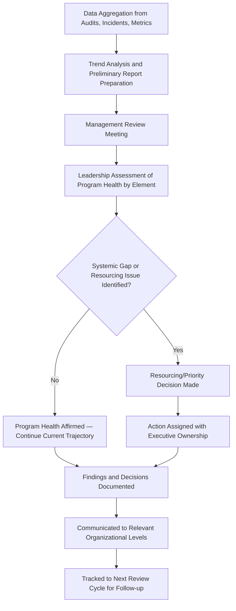
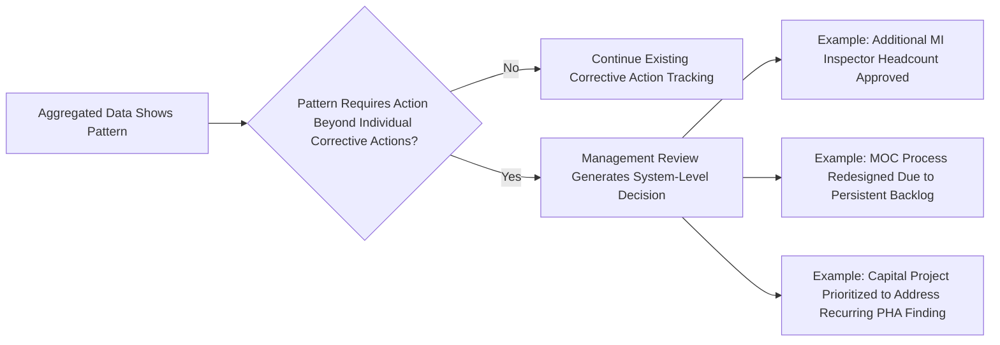

## Management Review of Safety Performance

### Overview and Purpose

Management review of safety performance is the governance activity through which senior leadership formally evaluates the health of the Process Safety Management (PSM) program as a whole, using aggregated data from audits, incidents, metrics, and other program inputs to make resourcing, priority, and system-design decisions. It is distinct from audit execution, finding classification, and corrective action tracking — those are data-generating and data-verifying activities, while management review is the decision-making activity that consumes that data at an organizational level.

Under **29 CFR 1910.119**, no single provision mandates "management review" as a named activity in the way it does for PHA or audits, but the requirement is functionally embedded across multiple elements: audit certification under 1910.119(o) presumes findings are reviewed by someone with authority to direct resources toward closure; PHA recommendation resolution under 1910.119(e)(5) requires documented resolution "in a timely manner," which in practice requires management-level prioritization when recommendations compete for capital or engineering resources. ISO 45001 and CCPS guidance make the management review function explicit, treating it as a required, recurring leadership activity with defined inputs and outputs — this is the framework most mature PSM programs follow even where OSHA does not use the term directly.

### Distinguishing Management Review from Adjacent Activities

| Activity | Primary Question | Typical Participants | Frequency |
| --- | --- | --- | --- |
| Audit Execution | Are we compliant, and is practice matching procedure? | Audit team, site personnel | Per audit cycle (internal: ≤3 years; element-focused: annual) |
| Finding Classification/Closure | Is this specific gap resolved? | Finding owner, independent verifier | Ongoing, per finding |
| Management Review | Is the PSM program, as a system, performing adequately, and where must we direct attention or resources? | Senior site/corporate leadership, PSM/EHS leadership | Quarterly to annual, cadence varies by organization |

Management review sits above individual findings and individual incidents — its unit of analysis is the program's aggregate trend and systemic health, not any single event.

### Inputs to Management Review

A structured management review draws on multiple converging data sources rather than any single input, since over-reliance on one data type (e.g., lagging incident counts alone) produces an incomplete or misleading picture of program health.

| Input Category | Examples |
| --- | --- |
| Lagging Indicators | Incident/near-miss counts and severity, recordable injury rates, process safety events by tier (per API RP 754) |
| Leading Indicators | PHA recommendation closure timeliness, MOC backlog, overdue mechanical integrity inspections, training completion rates |
| Audit and Finding Trends | Internal, third party, and regulatory audit finding counts by severity, recurrence patterns, closure timeliness |
| Compliance Status | Open regulatory citations, permit conditions, consent decree obligations if applicable |
| Personnel and Competency Data | Turnover in safety-critical roles, training program completion, competency assessment results |
| External Benchmarking | Industry incident trends, regulatory enforcement trends, peer performance where available |

#### Leading vs. Lagging Indicators — API RP 754 Framework

API Recommended Practice 754 establishes a tiered framework for process safety event classification widely used as a leading/lagging indicator structure in management review reporting:

| Tier | Definition | Indicator Type |
| --- | --- | --- |
| Tier 1 | Loss of primary containment (LOPC) with significant consequence (injury, fire, explosion, evacuation, exceedance of defined thresholds) | Lagging |
| Tier 2 | LOPC of lesser consequence than Tier 1 but still indicating a challenge to process safety systems | Lagging |
| Tier 3 | Challenges to the safety system (e.g., demands on safety systems, near-misses that did not result in LOPC) | Leading/near-lagging |
| Tier 4 | Operating discipline and management system performance indicators (e.g., PHA action closure rate, training completion, inspection compliance) | Leading |

A management review that relies predominantly on Tier 1/Tier 2 (lagging) data will detect program degradation only after a loss event has already occurred. Tier 3/Tier 4 indicators are intended to surface systemic weakening before it manifests as an actual loss of containment — this is the core rationale for including leading indicators as a mandatory input rather than a supplementary one.

### Management Review Process Flow

### Structuring the Management Review Meeting

#### Typical Agenda Structure

**Example**

**Quarterly PSM Management Review — Agenda Outline:**

1. **Performance Summary** — Tier 1-4 metrics vs. prior period and vs. targets
2. **Audit and Finding Status** — Open findings by severity, closure timeliness, recurrence patterns across internal/third party/regulatory sources
3. **Significant Incident Review** — Summary of any Tier 1/2 events since last review, root cause themes, cross-site applicability
4. **PHA and MOC Status** — Recommendation backlog, aging analysis, resourcing constraints if applicable
5. **Regulatory and Compliance Status** — Open citations, upcoming regulatory deadlines, inspection activity
6. **Resourcing and Competency Review** — Turnover in safety-critical roles, training program status
7. **Decisions and Actions** — Explicit resourcing, priority, or system-design decisions made during the review
8. **Follow-up from Prior Review** — Status of actions assigned in the previous cycle

Item 8 is frequently the most diagnostically important — a management review process that does not systematically follow up on its own prior decisions tends to degrade into a reporting exercise rather than a governance activity with actual authority.

#### Participant Composition

Effective management review requires participants with actual authority to commit resources, not solely technical/EHS staff presenting information upward without decision-making authority present in the room:

| Role | Contribution |
| --- | --- |
| Site/Plant Manager or equivalent | Resourcing authority at the site level |
| PSM/EHS Leadership | Data aggregation, trend interpretation, technical framing of findings |
| Operations Leadership | Operational context for leading indicator trends |
| Engineering/Maintenance Leadership | Context on mechanical integrity and MOC backlog drivers |
| Corporate PSM Leadership (for multi-site organizations) | Cross-site trend comparison, resource allocation across sites |

A management review conducted without attendees who hold budget or resourcing authority produces recommendations that lack a mechanism for implementation — this is a common structural weakness distinguishing a nominal review process from one with genuine governance function.

### From Data to Decision — The Core Value of Management Review

The distinguishing output of a management review is not the report itself but the **decisions made as a consequence** — resourcing commitments, priority reallocation, or system redesign directives that would not have occurred without the aggregated view the review provides.

**Example**

A site's Tier 4 leading indicators show MOC closure timeliness degrading over three consecutive quarters, alongside a rising count of field-observed deviations not traceable to an approved MOC (identified via internal audit). Individually, each quarter's data might be addressed with incremental corrective actions (remind engineers of deadlines, add a tracking column to a spreadsheet). At management review, the three-quarter trend combined with the audit finding is recognized as evidence of a structural resourcing gap — the MOC engineering review function is understaffed relative to current change volume. The review results in an explicit headcount or process redesign decision, which is a class of action outside the authority or scope of the individual corrective action owners who identified the underlying data points.

### Cross-Site Aggregation for Multi-Site Organizations

For organizations with multiple PSM-covered facilities, corporate-level management review adds a comparative dimension not available at the single-site level:

| Comparative Analysis | Purpose |
| --- | --- |
| Site-to-site metric benchmarking | Identifies outlier sites (positive or negative) for targeted attention or best-practice replication |
| Common root cause identification across sites | Distinguishes site-specific management failures from corporate-level program design gaps |
| Resource allocation across the portfolio | Directs limited corporate PSM resources (engineering support, audit capacity) toward highest-need sites |
| Lessons learned integration verification | Confirms that lessons-learned sharing (a related but distinct process) is actually driving cross-site action, not merely awareness |

A corporate-level review that only aggregates site-reported summary metrics without independent verification of underlying data quality risks amplifying local reporting inconsistencies into apparently significant cross-site trends that do not reflect genuine performance differences. [Inference — the degree of independent data verification performed at the corporate review level varies substantially by organization and is not standardized by regulation or a single industry consensus practice.]

### Documentation and Governance Record

Management review outcomes should be formally documented, distinct from meeting minutes in the administrative sense — the documentation serves as the audit trail demonstrating that leadership exercised its governance function, which is itself sometimes reviewed by third party auditors or regulators as evidence of management commitment (a recurring theme across PSM element requirements, particularly 1910.119(e) PHA resolution and 1910.119(o) audit follow-through).

| Documentation Element | Purpose |
| --- | --- |
| Data reviewed (with version/date) | Establishes what information was available to decision-makers |
| Attendees and their role/authority | Establishes decision-making authority was present |
| Decisions made, with explicit ownership | Creates accountability for follow-through |
| Rationale for decisions (particularly where a recommended action was deferred or declined) | Provides defensible basis if a deferred decision is later scrutinized following an incident |
| Follow-up status from prior review | Demonstrates continuity of governance rather than isolated point-in-time reviews |

### Common Failure Modes

- **Reporting without deciding**: Meetings that present data comprehensively but conclude without explicit resourcing or priority decisions, functioning as a status update rather than a governance activity
- **Lagging-indicator dominance**: Reviews structured primarily around incident counts, missing the leading-indicator trends that would have provided earlier warning
- **No authority present**: Key data presented to an audience without budget or resourcing authority, producing recommendations with no implementation pathway
- **No closed-loop follow-up**: Prior review decisions not systematically revisited, allowing commitments to quietly lapse
- **Site-level isolation**: In multi-site organizations, reviews conducted purely at the site level without corporate aggregation, missing systemic patterns only visible across the portfolio
- **Data quality unverified**: Aggregated metrics accepted without spot-checking against underlying source records, risking decisions based on inaccurate summary data

### Integration Across the PSM Program

Management review functions as the top-level integration point for the entire PSM program — it is the activity where audit findings (internal, third party, regulatory), incident investigation lessons learned, PHA/MOC backlog data, and training/competency status converge into a single leadership-level assessment. A PSM program can execute every individual element competently and still fail to improve systemically if the management review function does not exist or does not translate aggregated data into resourced action — this is the structural reason management review is treated as a distinct, necessary capstone activity rather than a redundant summary of processes already covered elsewhere in the program.

**Related Topics**

- Internal Audit Planning and Execution
- Audit Finding Classification and Closure
- Process Safety Performance Indicators per API RP 754 (Tiered Framework)
- Sharing Lessons Learned Across an Organization
- Management of Change (MOC) Backlog and Resourcing Analysis
- Process Hazard Analysis Recommendation Resolution Timeliness
- Corporate Governance Structures for Multi-Site Process Safety Programs
- Process Safety Culture and Leadership Commitment Assessment