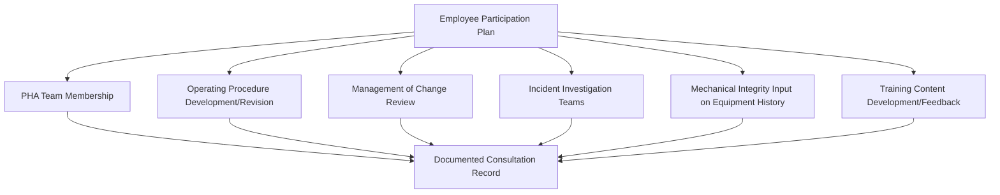

## Employee Participation Requirements Under PSM

### Overview and Regulatory Basis

Employee Participation is the first substantive element listed in OSHA's Process Safety Management standard, codified at **29 CFR 1910.119(c)**, and its placement is not incidental — it establishes the structural expectation that operators, maintenance technicians, and other affected employees are active participants in PSM program design and execution, not passive recipients of procedures and training developed without their input. Of the fourteen PSM elements, Employee Participation is one of the shortest in regulatory text but has outsized influence on the effectiveness of nearly every other element, since PHA quality, procedure accuracy, and incident investigation validity all depend substantially on frontline worker engagement.

The regulatory text of 1910.119(c) contains three specific requirements:

1. **1910.119(c)(1)**: Employers must develop a written plan of action regarding the implementation of employee participation
2. **1910.119(c)(2)**: Employers must consult with employees and their representatives on the conduct and development of process hazard analyses and on the development of the other elements of process safety management
3. **1910.119(c)(3)**: Employers must provide employees and their representatives access to process hazard analyses and to all other information required to be developed under the PSM standard

### The Written Plan of Action Requirement

Unlike some PSM elements that describe an outcome without prescribing documentation form, 1910.119(c)(1) specifically requires a **written plan** describing how employee participation will be implemented. This plan is itself an auditable document — internal and regulatory audits routinely verify not only that participation occurs, but that a written plan exists describing the intended mechanism.

| Written Plan Component | Typical Content |
| --- | --- |
| Participation Mechanisms | How employees will be consulted (e.g., PHA team membership, safety committees, procedure review cycles) |
| Representative Structure | Defined role of union or employee representatives where applicable |
| Access Procedures | How employees obtain access to PSI, PHA results, and other PSM documentation |
| Consultation Points | Which specific activities (PHA, MOC, procedure development, incident investigation) include defined employee consultation steps |
| Communication Channels | Methods for employees to raise process safety concerns outside formal PHA/audit cycles |

A written plan that exists but describes only generic commitments ("employees will be involved in process safety") without specifying concrete mechanisms tied to specific PSM activities is a common audit finding — the regulatory intent is a defined, operational process, not an aspirational statement.

### Consultation Requirement — Scope Across PSM Elements

1910.119(c)(2) explicitly names PHA consultation but extends more broadly to "other elements of process safety management," which OSHA guidance and enforcement history interpret as applying across the program rather than being limited to PHA alone.



| PSM Element | Typical Employee Participation Mechanism |
| --- | --- |
| Process Hazard Analysis | Operators with process-specific experience included as PHA team members, not merely interviewed beforehand |
| Operating Procedures | Draft procedures reviewed by the operators who will execute them before finalization |
| Management of Change | Affected operators/maintenance personnel consulted on operational impact of proposed changes |
| Incident Investigation | Employees involved in or with direct knowledge of the incident included in investigation, per 1910.119(m) overlap |
| Mechanical Integrity | Maintenance technicians provide input on equipment failure history and practical inspection findings |
| Training | Employee feedback solicited on whether training content reflects actual task conditions |

Participation that is limited exclusively to PHA (satisfying only the explicitly named requirement) while other elements are developed without employee input technically under-satisfies the "other elements" language and represents a narrower interpretation than what mature PSM programs typically implement.

### Access to Information Requirement

1910.119(c)(3) requires that employees and their representatives have access to:

- Process Hazard Analyses (results, not merely a summary)
- Process Safety Information
- Other information developed under the PSM standard's requirements

This access requirement intersects with the **Trade Secrets** element (1910.119(l)), which permits employers to require confidentiality agreements as a condition of accessing trade-secret-protected information, but does not permit withholding safety-relevant information from employees on trade secret grounds. The standard's intent is that employees cannot be denied access to information necessary to understand hazards they face, even where that information carries proprietary sensitivity — confidentiality obligations, not access denial, are the permitted mechanism for protecting trade secrets while still satisfying (c)(3).

| Access Scenario | Compliant Approach | Non-Compliant Approach |
| --- | --- | --- |
| PHA contains proprietary process chemistry details | Require confidentiality agreement; provide full access to hazard-relevant findings | Withhold PHA results entirely from employee review |
| PSI includes vendor-proprietary equipment specifications | Provide access with confidentiality terms | Redact safety-relevant specifications citing trade secret protection |

### Role of Employee Representatives

Where a recognized bargaining unit or employee representative structure exists, the representative's role in PSM consultation is distinct from, but complementary to, direct employee participation. The regulation contemplates both individual employee consultation and representative-level consultation, and a participation plan should address how these interact — for example, whether representatives sit on standing PHA revalidation teams, or whether their role is primarily a channel for aggregating individual employee input and concerns.

### Employee Participation vs. Adjacent Concepts — Clarifying Distinctions

| Concept | Distinction from Employee Participation (1910.119(c)) |
| --- | --- |
| Employee Training (1910.119(g)) | Training is a one-directional transfer of knowledge to employees; participation is bidirectional consultation and input |
| Affected Personnel Review of Incident Findings (1910.119(m)) | A specific, narrower requirement triggered by incident investigation; participation is the broader, standing program structure |
| Stop Work Authority | An operational safety culture practice, not itself a PSM regulatory element, though it is often implemented as an extension of a mature participation culture |
| Safety Committees (general industry) | May serve as one *mechanism* for satisfying participation requirements but are not themselves the regulatory requirement — a safety committee focused on general workplace safety topics unrelated to PSM-covered process hazards does not by itself satisfy 1910.119(c) |

### Implementation Architecture

```mermaid
flowchart LR
    A[Written Employee Participation Plan] --> B[Defined Consultation Points Across PSM Elements]
    B --> C[PHA Team Composition Includes Frontline Operators]
    B --> D[Procedure Draft Review Cycle Includes Executing Personnel]
    B --> E[MOC Review Includes Affected Employee Input]
    C --> F[Documented Participation Records]
    D --> F
    E --> F
    F --> G[Audit Verification — 1910.119(o)]
    G --> H{Participation Documented and Substantive?}
    H -->|No| I[Finding: Participation Nominal Only]
    H -->|Yes| J[Element Conformance Confirmed]
```

### Common Implementation Gaps

- **Nominal PHA participation**: Including an operator on the PHA team roster but structuring the session such that the operator's input is not genuinely solicited or incorporated (e.g., the operator attends but the facilitator does not actively draw on their task-specific knowledge)
- **Written plan without operational mechanism**: A participation plan document exists to satisfy audit review but does not correspond to an actual defined process followed in practice
- **Access limited to summary documents**: Providing employees a condensed PHA summary rather than genuine access to the underlying analysis and findings
- **Participation confined to PHA only**: Satisfying the explicitly named PHA consultation requirement while other elements (procedures, MOC, training) are developed without meaningful employee input
- **No feedback loop closure**: Employees provide input during consultation (e.g., procedure review comments) but receive no visibility into whether or how their input was incorporated, which erodes future engagement willingness even where the formal consultation step technically occurred

### Relationship to Process Safety Culture

Employee Participation is frequently identified in CCPS and industry guidance as a foundational element for building broader process safety culture, distinct from but closely related to the specific regulatory requirements of 1910.119(c). Where the regulatory requirement establishes a compliance floor (written plan, PHA consultation, information access), mature organizations extend genuine participation as a cultural practice — front-line workers proactively raising hazards, participating in near-miss reporting without fear of reprisal, and being viewed by leadership as a primary source of hazard identification insight rather than merely a recipient of top-down safety direction. This cultural dimension is not separately regulated but is widely recognized in process safety literature as the practical differentiator between organizations that satisfy 1910.119(c) at a minimum compliance level and those where employee participation measurably improves PHA quality, procedure accuracy, and incident prevention. [Inference — the causal link between participation quality and specific incident rate outcomes is supported by industry consensus and case study literature but is inherently difficult to isolate from other concurrent safety program factors in any single organization's data.]

**Related Topics**

- Process Hazard Analysis Team Composition and Facilitation
- Written Program Documentation Requirements Across PSM Elements
- Trade Secret Protection and Information Access Balance (1910.119(l))
- Management of Change Review Team Composition
- Process Safety Culture Assessment and Leading Indicators
- Incident Investigation Affected Personnel Review (1910.119(m))
- Stop Work Authority Program Design
- Contractor Employee Participation Considerations