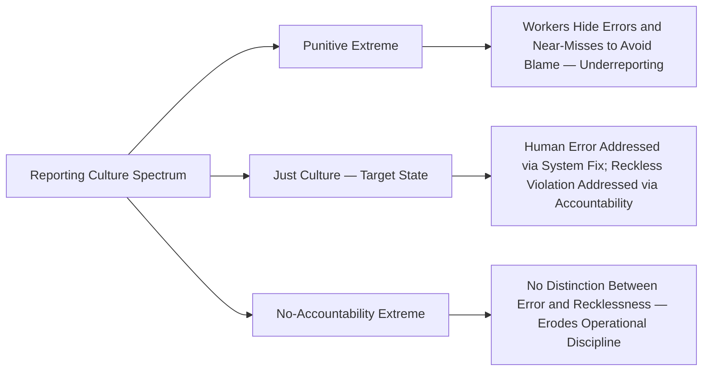

## Building and Sustaining a Positive Safety Culture


### Overview and Conceptual Foundation

Safety culture refers to the shared values, beliefs, attitudes, and behavioral norms that determine how an organization's members perceive and act on safety-relevant information and risk, particularly in the absence of direct supervision or explicit procedural instruction. Unlike most PSM elements, safety culture is not a discrete regulatory requirement with a corresponding citation-generating standard — OSHA's PSM standard does not use the term "safety culture" in its regulatory text. It functions instead as the underlying organizational condition that determines how effectively the fourteen codified PSM elements are actually implemented in practice, as opposed to merely documented on paper. CCPS, the UK HSE, and the CSB (U.S. Chemical Safety Board) have each published extensively on safety culture as a root-cause factor in major process safety incidents, and it is now standard practice to treat culture assessment as a component of mature PSM programs even though it exists outside the formal 14-element regulatory structure.

### Why Culture Matters Independent of Procedural Compliance

An organization can score well on documented procedural compliance — current PSI, timely PHA revalidation, complete training records — while still harboring a weak safety culture that manifests in ways audits and paper-based compliance checks routinely miss:

| Compliance Indicator | What It Measures | What It Can Miss |
| --- | --- | --- |
| Procedure exists and is current | Documentation adequacy | Whether workers follow the procedure when unsupervised, or normalize deviation from it |
| Training completion rate | Attendance/completion | Whether workers feel safe reporting when they don't understand something |
| Audit finding closure rate | Administrative follow-through | Whether closures reflect genuine remediation or expedient box-checking under time pressure |
| Incident reporting rate | Reporting volume | Whether the rate reflects true incident frequency or reporting suppression due to fear of blame |

This gap — between what compliance metrics show and what actually happens on the floor — is the central reason safety culture assessment is treated as a necessary complement to, not a replacement for, procedural PSM compliance verification. Multiple major process safety disasters investigated by the CSB and equivalent international bodies identified a documented, compliant-on-paper PSM program operating alongside a culture that discouraged reporting, normalized deviation from procedure, or deprioritized process safety relative to production pressure. [Inference — while this pattern recurs across multiple well-documented incident investigations, the specific causal weight of culture versus other contributing factors varies by incident and is a matter of investigative judgment rather than a precisely quantifiable attribution in every case.]

### Core Dimensions of Process Safety Culture

CCPS's Guidelines for Risk Based Process Safety and related frameworks commonly identify a set of recurring cultural dimensions relevant to PSM effectiveness:

| Dimension | Description |
| --- | --- |
| Leadership Commitment | Visible, consistent prioritization of process safety by leadership, including when it conflicts with production or schedule pressure |
| Open Reporting / Just Culture | Workers report incidents, near-misses, and concerns without fear of unwarranted blame or retaliation |
| Chronic Unease / Mindful Organizing | Sustained organizational skepticism toward the assumption that "it won't happen here," resisting complacency during long periods without a major incident |
| Operational Discipline | Consistent adherence to procedures and standards, including when no one is directly observing |
| Resource Allocation | Process safety receives resourcing commensurate with risk, not only when convenient relative to other business priorities |
| Continuous Learning | Incidents, near-misses, and audit findings are treated as organizational learning opportunities rather than solely as compliance or disciplinary events |

### The Relationship Between Culture and the "Just Culture" Concept

A central, frequently misunderstood concept is **Just Culture** — a framework distinguishing between human error (which should be addressed through system and design improvement, not punishment) and reckless or willful violation (which may warrant disciplinary response). Organizations that fail to make this distinction tend toward one of two dysfunctional extremes:



| Culture Type | Treatment of Human Error | Treatment of Reckless Violation | Typical Consequence |
| --- | --- | --- | --- |
| Punitive | Blamed and disciplined equivalently to willful violation | Blamed and disciplined | Underreporting; near-misses and errors go undisclosed, eliminating a key leading-indicator data source |
| Just Culture | Investigated as a system/design gap; corrective action targets the system, not the individual | Distinguished from error; addressed through accountability | Reporting volume increases (a leading indicator improvement), while operational discipline is maintained through appropriate accountability for genuine recklessness |
| No-Accountability | Not investigated for system improvement | Also not meaningfully addressed | Operational discipline erodes; normalization of deviation increases over time |

A recurring practical challenge is that Just Culture implementation requires clear, consistently applied criteria for distinguishing error from recklessness — without such criteria, the framework's application can drift toward either extreme depending on individual manager discretion, undermining the consistency that makes the framework effective at sustaining reporting behavior.

### Building Safety Culture — Structural Mechanisms

```mermaid
flowchart TD
    A[Leadership Commitment — Visible and Sustained] --> B[Employee Participation Program — 1910.119(c)]
    B --> C[Near-Miss and Hazard Reporting System]
    C --> D[Just Culture Response Framework]
    D --> E[Reporting Volume Increases — Leading Indicator Data Improves]
    E --> F[Trend Analysis Identifies Systemic Weaknesses]
    F --> G[Corrective Action and Lessons Learned Sharing]
    G --> H[Visible Follow-Through on Reported Concerns]
    H --> I[Reinforces Worker Confidence in Reporting — Reinforcing Loop Back to C]
```

This forms a reinforcing loop: reporting increases confidence in the system only if reported concerns visibly result in action. A reporting system that collects input but produces no observable follow-through will see reporting volume decline over time, regardless of how well the initial reporting mechanism was designed — workers rationally deprioritize an activity with no perceived return.

### Leadership Commitment — Observable Indicators

Leadership commitment is frequently asserted in organizational messaging but is more reliably assessed through observable behavior than through stated policy:

| Observable Indicator | What It Signals |
| --- | --- |
| Leadership stops or delays production/schedule when a genuine process safety concern is raised | Process safety prioritized over competing business pressure in practice, not only in policy statement |
| Leadership visibly participates in safety walkarounds, PHA sessions, or incident reviews | Direct engagement, not delegated-and-forgotten |
| Process safety metrics receive comparable visibility to production/financial metrics in leadership reporting | Relative organizational priority as reflected in what leadership actually tracks and discusses |
| Resourcing decisions (headcount, capital, schedule) demonstrably account for process safety risk, including when this creates cost or schedule tension | Commitment tested under actual tradeoff conditions, not only when cost-free |
| Leadership response to a raised concern is investigative rather than dismissive, even when the concern proves unfounded | Reinforces future willingness to report ambiguous or uncertain observations |

### Measuring Safety Culture

Unlike procedural compliance, culture is inherently difficult to measure directly, and organizations typically rely on a combination of survey-based and behavioral proxy indicators rather than a single definitive metric:

| Measurement Approach | Method | Limitation |
| --- | --- | --- |
| Safety Culture Survey | Structured employee survey assessing perception of reporting safety, leadership commitment, resourcing adequacy | Self-reported perception; subject to response bias, particularly in organizations with weaker culture where honest response itself carries perceived risk |
| Near-Miss/Hazard Reporting Rate Trend | Tracking reporting volume over time as a proxy for psychological safety to report | Confounded by changes in reporting system accessibility, campaign effects, or definitional changes independent of underlying culture |
| Stop-Work Event Frequency and Outcome | Tracking how often workers exercise stop-work authority and how leadership responds | Requires the authority to genuinely exist and be exercised without adverse consequence to be a valid indicator |
| Audit Interview Consistency | Comparing what personnel across different shifts/experience levels report about actual practice during audit interviews | Resource-intensive; only captures a sampled snapshot |
| Behavioral Observation Programs | Structured peer or supervisor observation of at-risk vs. safe behaviors in the field | Requires disciplined, non-punitive implementation to avoid becoming another source of reporting anxiety |

[Inference — no single validated instrument is universally accepted across the industry as the definitive safety culture measurement tool; organizations commonly triangulate across multiple approaches rather than relying on any one method as authoritative.]

### Chronic Unease and Complacency Risk

A distinct and frequently under-addressed cultural risk is complacency arising from prolonged periods without a significant incident. Extended incident-free operation, rather than confirming safety, can paradoxically erode the organizational vigilance that contributed to that safety record — a phenomenon sometimes termed the "safety paradox" or addressed through the concept of **chronic unease** (sustained skepticism that current controls remain adequate, resisting the assumption that past safety performance guarantees future safety performance).

Practices that counter complacency risk include:

- Actively seeking out and amplifying near-miss and weak-signal data rather than treating an absence of major incidents as confirmation that no such signals exist
- Periodic scenario-based drills and tabletop exercises that maintain organizational familiarity with low-frequency, high-consequence scenarios
- Explicit leadership messaging distinguishing "no incidents" from "no risk," reinforced during management review (per the leading-indicator emphasis discussed in that process)
- Rotating fresh perspective into PHA revalidation and audit teams to counter the normalization of long-standing, unaddressed minor deviations becoming "invisible" to personnel accustomed to them

### Sustaining Culture — Avoiding Initiative Fatigue

A common failure pattern is treating safety culture improvement as a discrete, time-bound initiative (a campaign, a training rollout, a survey conducted once) rather than a sustained organizational property requiring continuous reinforcement. Culture-building activities that are not embedded into standing management processes — regular management review, consistent Just Culture application, continuous visible leadership engagement — tend to regress toward prior norms once the initial initiative's visibility fades, particularly under sustained production or cost pressure.

| Sustaining Mechanism | How It Embeds Culture into Standing Process |
| --- | --- |
| Culture metrics included in regular management review agenda | Prevents culture from being treated as separate from core PSM governance |
| Just Culture criteria formally documented and consistently applied by HR/management | Reduces manager-to-manager inconsistency that erodes trust in the framework over time |
| New employee onboarding includes explicit culture and reporting-expectation content | Prevents culture erosion through workforce turnover and new-hire dilution |
| Leadership succession planning includes explicit safety commitment expectations | Prevents culture regression when key committed leaders depart |

### Common Failure Modes

- **Slogan-level commitment**: Leadership messaging emphasizes safety culture without corresponding observable behavior (resourcing, schedule tradeoffs, response to raised concerns)
- **Punitive drift**: Just Culture framework exists on paper but is inconsistently applied, gradually reverting to punitive response and suppressing reporting
- **Survey-only measurement**: Relying solely on periodic survey data without triangulating against behavioral indicators (reporting trends, audit interview consistency)
- **Complacency following strong safety records**: Extended incident-free periods interpreted as confirmation of adequate controls rather than prompting continued vigilance
- **Culture treated as HR-owned rather than PSM-integrated**: Safety culture initiatives managed separately from core process safety governance (management review, audit programs), losing the integration needed to actually influence PSM element execution quality

### Integration with the Broader PSM Program

Safety culture is best understood not as a fifteenth element alongside the regulatory fourteen, but as the organizational substrate that determines how faithfully those fourteen elements are executed in practice. Employee Participation (1910.119(c)) provides the structural mechanism through which culture is built and expressed; incident investigation and lessons learned sharing depend on a reporting culture willing to surface uncomfortable findings; management review depends on leading indicator data that a punitive culture would suppress. A PSM program can be procedurally complete across all fourteen elements and still carry significant residual risk if the underlying culture does not support genuine, sustained operational discipline — this is why mature process safety frameworks increasingly treat culture assessment as a required complement to, rather than an optional addition beyond, procedural compliance verification.

**Related Topics**

- Employee Participation Requirements Under PSM (1910.119(c))
- Just Culture Framework and Accountability Criteria
- Near-Miss and Hazard Reporting System Design
- Management Review of Safety Performance
- Sharing Lessons Learned Across an Organization
- Process Safety Performance Indicators per API RP 754 (Leading/Lagging Framework)
- Chronic Unease and Complacency Risk Management
- Chemical Safety Board (CSB) Incident Investigation Case Studies