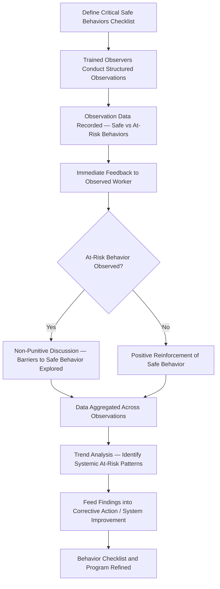

## Behavior Based Safety Programs

### Overview and Conceptual Basis

Behavior Based Safety (BBS) is a structured methodology that applies observational data collection and feedback to influence workplace safety behaviors, grounded in applied behavior analysis principles — the premise that consistently reinforcing safe behaviors and providing constructive feedback on at-risk behaviors changes behavior more durably than reliance on rules, discipline, or awareness campaigns alone. BBS emerged from industrial safety practice in the 1970s-1980s (notably associated with the work of E. Scott Geller and DuPont's STOP program) and remains widely used in process industries as a complement to, not a replacement for, procedural and engineering controls.

Within a PSM framework, BBS is not itself an OSHA-mandated element — 29 CFR 1910.119 does not name BBS specifically. It functions as an implementation mechanism organizations may adopt to strengthen Employee Participation (1910.119(c)) and to generate leading indicator data supporting Management Review, while also serving broader safety culture objectives. Its proper scope and significant limitations require careful understanding, particularly in PSM contexts where the highest-consequence risks are frequently driven by engineering and system design factors rather than individual worker behavior.

### Core Methodology



#### Step 1: Critical Behavior Inventory Development

The foundation of a BBS program is a defined checklist of specific, observable behaviors relevant to the facility's actual hazard profile — developed from incident/near-miss history, JHA findings, and employee input rather than generic industry templates. A checklist item must be behaviorally specific and observable ("worker maintains three points of contact when ascending ladder," not "worker is careful on ladders") to produce reliable observation data.

| Checklist Development Input | Purpose |
| --- | --- |
| Incident and near-miss history | Identifies behaviors statistically associated with past events at this facility |
| JHA/TRA findings | Links checklist items to task-specific hazard assessments already performed |
| Employee input during development | Improves checklist relevance and buy-in; workers often identify behaviorally-specific risk factors supervisors miss |
| Audit findings | Surfaces systemic procedural non-adherence patterns worth behavioral tracking |

#### Step 2: Observer Training and Selection

Observers — frequently peer employees rather than supervisors, a design choice central to BBS methodology — require specific training distinct from general safety training:

- Observation technique (how to observe without altering behavior through observer presence, sometimes termed the "observer effect")
- Non-judgmental, non-punitive feedback delivery
- Data recording consistency across observers (inter-observer reliability)
- Explicit instruction that observation is not a disciplinary or performance evaluation mechanism

The choice of peer observers over supervisory observers is deliberate: peer observation is intended to reduce the defensive or performance-oriented response that observation by a direct supervisor with disciplinary authority can provoke, which in turn is intended to produce more representative behavioral data and to reinforce a collaborative rather than punitive program framing.

#### Step 3: Observation and Immediate Feedback

Observations are conducted using the defined checklist, with feedback delivered immediately and directly to the observed worker — delayed or aggregated feedback substantially reduces the behavioral reinforcement effect that gives BBS its theoretical basis. Feedback for at-risk behavior is structured as an exploratory, non-punitive conversation focused on identifying barriers to safe performance (e.g., inadequate tool availability, time pressure, unclear procedure) rather than as correction or reprimand.

**Example**

**BBS Observation Feedback Conversation Structure:**

1. Observer describes the specific observed behavior neutrally ("I noticed the guard was removed during that adjustment")
2. Observer asks an open question rather than making an accusation ("What made that the easier approach here?")
3. Worker explains context/barrier (e.g., "the guard interferes with this specific adjustment and there's no alternate access point")
4. Observer and worker jointly identify whether this reflects an individual choice, a systemic design gap, or a procedural gap
5. If systemic, observation is flagged for corrective action routing (e.g., engineering review of guard design) rather than treated as a behavioral coaching item alone

This structure is the mechanism by which BBS avoids becoming purely individual-behavior-focused — a well-designed program explicitly routes systemically-caused at-risk behavior to engineering/procedural correction rather than treating every observation as a matter of individual worker choice.

#### Step 4: Data Aggregation and Trend Analysis

Individual observations are aggregated (typically anonymized at the individual level, though this varies by program design) to identify patterns:

| Aggregate Pattern | Interpretation |
| --- | --- |
| Same at-risk behavior recurring across many workers/shifts | Likely systemic (design, procedure, resourcing) rather than individual, warranting engineering/procedural review |
| At-risk behavior concentrated on specific shift/crew | May indicate shift-specific resourcing, supervision, or fatigue factors |
| At-risk behavior clustered around a specific task/equipment | Signals JHA or procedure revision need for that specific task |
| Overall safe-behavior percentage trending over time | Provides a leading indicator trend for management review, though see limitations below |

### Integration with PSM Program Elements

```mermaid
flowchart LR
    A[BBS Observation Program] -.generates data for.-> B[Leading Indicators — Management Review]
    A -.systemic findings route to.-> C[Corrective Action / Engineering Review]
    A -.systemic findings may trigger.-> D[Management of Change]
    A -.reinforces.-> E[Employee Participation — 1910.119(c)]
    A -.checklist informed by.-> F[JHA / Task Risk Assessment]
```

| PSM Element | BBS Integration Point |
| --- | --- |
| Employee Participation | Peer observer model is itself a direct-participation mechanism; observation program design should involve employee input |
| JHA/Task Risk Assessment | Checklist items derived from JHA-identified hazards; recurring at-risk observations may prompt JHA revision |
| Management Review | Aggregated behavioral trend data serves as a leading (Tier 4) indicator input |
| Corrective Action / MOC | Systemic patterns identified through observation should route through standard corrective action or MOC processes, not remain within the BBS program alone |

### Critical Limitations in PSM Context

BBS methodology, while valuable for the categories of risk it addresses, has well-recognized limitations that are particularly consequential in PSM environments, where the highest-severity risks frequently originate from engineering design, equipment integrity, and process chemistry rather than individual worker behavior at the moment of observation.

| Limitation | Explanation |
| --- | --- |
| Behavioral focus can obscure systemic root causes | Observation programs risk framing at-risk behavior as individual choice when the true root cause is inadequate equipment design, procedure gaps, or understaffing — this is the most frequently cited critique of BBS in process safety literature |
| Observable behavior bias | BBS inherently observes visible, moment-in-time actions; it does not directly detect latent equipment degradation, design flaws, or dormant process deviations that constitute major accident hazards in PSM-covered facilities |
| Potential for blame-shifting | Poorly implemented BBS programs can function as a mechanism to attribute incidents to "worker error" rather than surfacing management system or engineering deficiencies, undermining Just Culture principles |
| Metric gaming risk | If observation counts or safe-behavior percentages become performance targets, workers and observers face incentive pressure to report favorably rather than accurately, degrading data validity |
| Not a substitute for engineering/administrative controls | Per the hierarchy of controls, BBS operates primarily as an administrative-level intervention; it cannot compensate for absent higher-order controls (elimination, substitution, engineering) for high-consequence process hazards |

The CSB and multiple major incident investigations have specifically noted, in various post-incident analyses across the process industries, that organizations with active BBS programs and favorable behavioral metrics nonetheless experienced catastrophic process safety events rooted in equipment integrity, design, or management system failures that a behavior-focused observation program was never designed to detect. [Inference — this pattern is documented in multiple individual incident investigation narratives; the general conclusion that BBS success metrics can coexist with catastrophic system-level risk is well supported by these case studies, though the specific programs and incidents referenced vary by source and should be verified against primary CSB or equivalent investigation reports if cited in a specific context.] This does not invalidate BBS as a tool — it clarifies that BBS addresses occupational safety behavior (slips, falls, manual handling, PPE use, at-risk task execution) more directly than it addresses major accident/process safety risk, and treating strong BBS metrics as evidence of overall process safety adequacy is a category error.

### Designing BBS to Avoid Common Failure Modes

| Design Principle | Purpose |
| --- | --- |
| Explicit routing of systemic findings to engineering/MOC review, not only individual coaching | Prevents the program from becoming a blame-shifting mechanism |
| No individual disciplinary action based on BBS observation data | Preserves the non-punitive, data-quality-protecting design intent |
| No production or safety bonus tied directly to observation counts or safe-behavior percentages | Reduces incentive to game observation data |
| Explicit program scope statement distinguishing occupational safety behavior from major accident hazard coverage | Prevents over-reliance on BBS metrics as a proxy for overall PSM program health |
| Periodic review of checklist relevance against updated JHA and incident data | Prevents checklist stagnation and continued observation of behaviors no longer representative of actual risk profile |
| Integration of BBS trend data into, not in place of, the full leading/lagging indicator set used in management review | Ensures BBS data is one input among several (audit findings, MI compliance, PHA closure rates), not a standalone safety performance proxy |

### Comparative Positioning — BBS Relative to Other Culture/Participation Mechanisms

| Mechanism | Primary Focus | Relationship to BBS |
| --- | --- | --- |
| Employee Participation Plan (1910.119(c)) | Structural consultation across PSM elements (PHA, procedures, MOC) | BBS can serve as one participation mechanism among several, not a substitute for PHA-level or procedure-development-level consultation |
| Near-Miss/Hazard Reporting System | Worker-initiated reporting of any observed hazard or close call | Complementary; BBS is observer-initiated and checklist-structured, while near-miss reporting is worker-initiated and open-ended |
| Just Culture Framework | Organizational response to error/violation disclosure | BBS feedback methodology should be designed consistently with Just Culture principles (non-punitive, barrier-focused) to avoid undermining broader reporting culture |
| Safety Culture Survey | Perception-based culture assessment | Provides a different data type (attitudinal/perceptual) than BBS's behavioral/observational data; the two are complementary measurement approaches |

**Related Topics**

- Employee Participation Requirements Under PSM
- Building and Sustaining a Positive Safety Culture
- Just Culture Framework and Accountability Criteria
- Job Hazard Analysis and Task Risk Assessment
- Hierarchy of Controls and Its Application to Behavioral vs. Engineering Interventions
- Near-Miss and Hazard Reporting System Design
- Management Review of Safety Performance
- Chemical Safety Board (CSB) Case Studies on Behavioral vs. Systemic Root Causes