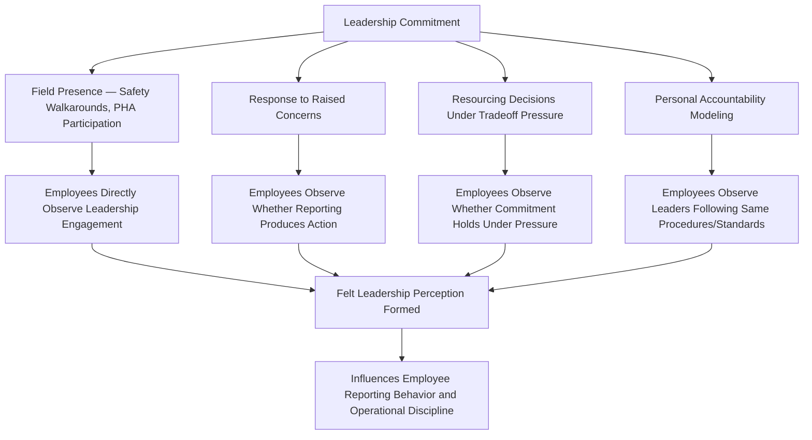
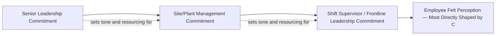

## Leadership Commitment and Visible Felt Leadership

### Overview and Conceptual Basis

Leadership Commitment and Visible Felt Leadership refers to the practice of senior and frontline leaders demonstrating process safety priority through direct, observable, and personally-engaged action — as distinct from policy statements, delegated safety programs, or metrics reviewed only at a remove. "Felt leadership" is the specific term used across process safety and occupational safety literature (originating substantially from DuPont safety practice and widely adopted in CCPS guidance) to describe leadership presence that employees can directly perceive and experience, as opposed to leadership commitment that exists only in organizational messaging or written policy.

Like Safety Culture broadly, Leadership Commitment is not a discrete, separately citable requirement under 29 CFR 1910.119 — no single provision requires "felt leadership" by name. It functions as the foundational precondition for effective execution of Employee Participation (1910.119(c)) and for the PSM program's other elements to operate as designed rather than merely as documented. CCPS explicitly identifies leadership commitment as a foundational pillar in its Risk Based Process Safety framework, and multiple CSB investigations into major process safety incidents have identified insufficient leadership engagement with process safety — as distinct from a formal absence of policy — as a contributing organizational factor.

### Distinguishing Felt Leadership from Stated Commitment

| Dimension | Stated Commitment | Felt Leadership |
| --- | --- | --- |
| Mechanism | Policy documents, mission statements, safety moment scripts | Direct personal presence and observable action |
| Employee Perception | "Leadership says safety is important" | "Leadership showed me safety is important when it mattered" |
| Typical Failure Mode | Present but disconnected from actual resourcing or tradeoff decisions | Absent — commitment exists in policy but is never personally demonstrated by leaders employees actually interact with |
| Test Condition | Rarely tested — statements don't require action | Tested specifically under schedule/cost/production pressure |

The distinction matters because employees calibrate their own safety-related behavior — including willingness to report concerns, willingness to stop work, and willingness to raise ambiguous or uncertain observations — substantially based on felt leadership rather than stated policy. A safety policy that states process safety is the top priority carries limited behavioral influence if employees have not personally observed leadership acting consistently with that statement when it created genuine cost, schedule, or convenience tension.

### Structural Mechanisms for Demonstrating Felt Leadership

#### Field Presence

Direct, non-delegated leadership presence in process areas, PHA sessions, audits, and incident reviews is among the most cited mechanisms for building felt leadership perception. The specific quality of the presence matters as much as its frequency:

| Presence Quality Factor | Positive Indicator | Negative Indicator |
| --- | --- | --- |
| Engagement depth | Leader asks substantive questions, engages with frontline personnel directly | Leader walks through without stopping to converse; presence is symbolic |
| Frequency and consistency | Regular, predictable cadence maintained over time, including during busy periods | Frequent during quiet periods, absent during high-production or schedule-pressure periods |
| Response to observations made during presence | Concerns raised during a walkaround are tracked and followed up | Observations noted verbally but not documented or followed through |
| Hierarchy of engagement | Senior leadership personally participates, not solely delegated to safety staff | Safety function conducts all field engagement; senior leaders remain in office/administrative role |

#### Response to Raised Concerns

How leadership responds when an employee raises a process safety concern — particularly an ambiguous, uncertain, or inconvenient one — is a disproportionately influential signal relative to its frequency, because these moments are specifically remembered and communicated informally among the workforce.

**Example**

**Contrasting Leadership Responses to a Raised Concern:**

*Scenario*: An operator flags a minor abnormal reading during a high-production period, uncertain whether it warrants a process hold.

- **Felt-leadership-reinforcing response**: Leader treats the report as valued regardless of whether the concern proves substantive, thanks the operator for raising it, and ensures the investigation outcome (whatever it is) is communicated back to the operator.
- **Felt-leadership-undermining response**: Leader visibly signals impatience or frustration at the production delay, or the concern is investigated but the operator receives no follow-up, or — most damaging — the concern later proves unfounded and the operator faces any form of informal criticism for having raised it.

The undermining response pattern, even if rare, tends to propagate quickly through informal workforce communication and can suppress future reporting far more than its single-instance frequency would suggest, because it directly contradicts stated commitment in a memorable, personally consequential way.

#### Resourcing Decisions Under Tradeoff Pressure

Because resourcing statements are cost-free when no actual tradeoff exists, felt leadership is most credibly demonstrated at the specific moments where committing to process safety creates a genuine competing cost — schedule delay, budget reallocation, or production loss.

| Tradeoff Scenario | Felt-Leadership-Demonstrating Decision |
| --- | --- |
| Startup schedule pressure vs. incomplete PSSR element | Startup delayed until procedures/training gap genuinely closed, not administratively waived |
| Capital budget constraint vs. PHA-recommended equipment upgrade | Recommendation funded or, if genuinely deferred, deferred through documented risk-based justification with interim controls, not silently dropped |
| Production target vs. stop-work event | Stop-work respected without schedule-pressure-driven pushback on the individual who initiated it |
| Staffing cost vs. identified competency/training gap | Training/competency gap closed before assignment, even where this creates temporary staffing strain |

#### Personal Accountability Modeling

Leaders who visibly follow the same procedures, PPE requirements, and safe work practices expected of the workforce — rather than exempting themselves due to seniority or brief visit duration — reinforce that standards apply universally rather than being enforced selectively on frontline personnel.

### Measuring and Assessing Leadership Commitment

Similar to broader safety culture, leadership commitment is difficult to measure through a single direct metric and is typically assessed through a combination of perception-based and behavioral-proxy data:

| Assessment Approach | Method | What It Captures |
| --- | --- | --- |
| Employee Perception Survey | Structured questions specifically targeting felt leadership perception (distinct from general culture survey items) | Whether employees personally perceive leadership commitment, independent of stated policy |
| Field Presence Tracking | Documented frequency/consistency of leadership participation in walkarounds, PHA sessions, incident reviews | Observable, auditable proxy for engagement frequency |
| Stop-Work Event Outcome Review | Tracking whether stop-work events led to any adverse consequence for the initiating employee | Direct test of whether commitment holds under the specific condition most likely to reveal its absence |
| Resourcing Decision Audit Trail | Reviewing whether PHA/audit recommendations with cost implications were resourced, deferred with justification, or silently dropped | Behavioral evidence of commitment under genuine tradeoff |
| 360-Degree or Upward Feedback Mechanisms | Structured mechanisms for frontline personnel to provide feedback on leadership safety engagement | Direct channel for assessing felt leadership from the perspective that matters most |

[Inference — the relative weight organizations should assign to survey-based versus behavioral-proxy measurement is not standardized across industry guidance, and most mature programs triangulate across several methods rather than relying on any single measurement approach as definitive.]

### Cascading Leadership — Beyond Senior Executives

Felt leadership is not confined to senior/executive leadership — frontline supervisors and shift leads exercise disproportionate influence on day-to-day felt leadership perception because they are the leadership level employees interact with most directly and most frequently.

A common organizational gap is investing heavily in senior leadership visibility (executive site visits, corporate safety messaging) while frontline supervisors — who make the actual moment-to-moment decisions about schedule pressure, procedure adherence enforcement, and response to raised concerns — receive comparatively little explicit development or accountability specifically targeting felt leadership behavior. Since frontline supervisors are structurally closer to the workforce, gaps at this level can substantially undermine the effect of genuine senior leadership commitment, regardless of how strong that senior-level commitment is.

### Common Failure Modes

- **Delegated-only engagement**: Senior leadership delegates all field presence and safety engagement to EHS staff, remaining administratively removed from direct process safety involvement
- **Commitment untested by tradeoff**: Stated commitment that has never been observed by employees under actual cost/schedule pressure, leaving felt leadership perception unformed or unreinforced
- **Inconsistent frontline supervisor behavior**: Senior leadership demonstrates strong commitment while frontline supervisors, closer to daily production pressure, undermine it through schedule-driven pushback on reported concerns or stop-work events
- **Symbolic rather than substantive field presence**: Walkarounds or PHA participation that are procedurally checked off without genuine engagement, which employees typically perceive as performative rather than authentic
- **No feedback loop on raised concerns**: Concerns raised during leadership field engagement are not tracked to resolution, eroding the credibility of the engagement over repeated instances
- **Adverse consequence following stop-work or reporting**: Any instance of informal criticism, schedule-pressure-driven questioning, or career consequence following a good-faith safety report, which disproportionately damages felt leadership perception relative to its frequency

### Integration with Broader Safety Culture and PSM Program

Leadership Commitment functions as a precondition for several other elements to operate effectively rather than as an isolated activity: Employee Participation (1910.119(c)) depends on employees trusting that participation will be genuinely valued, which is substantially shaped by felt leadership; Just Culture implementation requires consistent leadership behavior to be credible; and Management Review's effectiveness as a governance activity depends on the same leaders who conduct the review demonstrating felt commitment in the field, rather than treating management review as a separate administrative exercise disconnected from daily operational engagement. A PSM program with well-designed employee participation mechanisms, a formally adopted Just Culture framework, and a functioning BBS or reporting program can still underperform if leadership commitment is not felt, because each of those mechanisms depends on employee trust that leadership engagement is genuine — trust that is built specifically through the observable, tested behaviors described above rather than through policy statement alone.

**Related Topics**

- Building and Sustaining a Positive Safety Culture
- Employee Participation Requirements Under PSM
- Just Culture Framework and Accountability Criteria
- Behavior Based Safety Programs
- Management Review of Safety Performance
- Stop Work Authority Program Design
- Chronic Unease and Complacency Risk Management
- Process Safety Performance Indicators per API RP 754