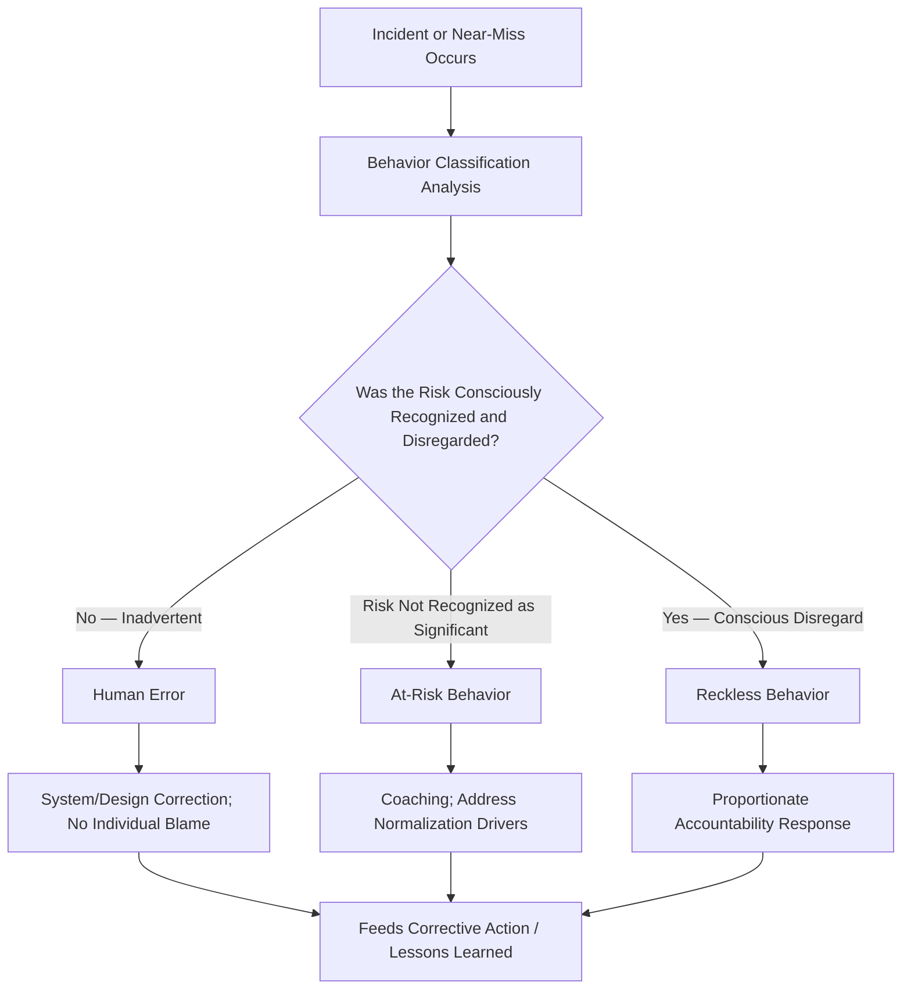
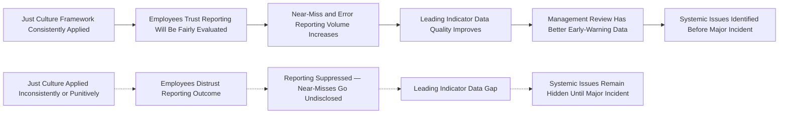

## Just Culture and Non-Punitive Reporting

### Overview and Conceptual Origin

Just Culture is a organizational accountability framework that distinguishes between human error, at-risk behavior, and reckless behavior, applying differentiated organizational responses to each category rather than a single punitive or purely blame-free response applied uniformly. The framework originates substantially from the work of James Reason (system safety theory) and was subsequently formalized and operationalized by David Marx, whose "Just Culture" model is widely adopted across high-consequence industries including aviation, healthcare, and process safety. Within PSM contexts, Just Culture functions as the accountability architecture that makes genuine near-miss and incident reporting possible — without it, reporting systems tend to either suppress disclosure (in punitive cultures) or fail to maintain operational discipline (in no-accountability cultures), as introduced under the broader Safety Culture discussion.

Like Safety Culture generally, Just Culture is not separately codified in 29 CFR 1910.119 by name. It functions as the practical mechanism underlying several regulatory requirements that depend on honest disclosure — incident investigation under 1910.119(m) requires accurate accounts of what occurred, which is substantially harder to obtain in a punitive environment; near-miss reporting, while not itself a named PSM element, is widely recognized as essential leading-indicator data that only a credible Just Culture framework reliably produces.

### The Three-Category Behavioral Model

Just Culture's central analytical tool is a three-way classification of behavior that determines the organizational response:

| Category | Definition | Appropriate Organizational Response |
| --- | --- | --- |
| Human Error | An inadvertent action; a slip, lapse, or mistake with no intent to cause harm and no conscious disregard of risk | Console the individual; investigate and correct the system/design/procedural conditions that made the error possible |
| At-Risk Behavior | A choice made where the risk is not recognized, or is mistakenly believed to be justified or insignificant (often reflecting drift or normalization of deviation) | Coach the individual; understand why the risk was not perceived as significant; address any systemic factors normalizing the behavior |
| Reckless Behavior | A conscious disregard of a substantial and unjustifiable risk | Apply appropriate disciplinary or corrective action, proportionate to the disregard demonstrated |

The critical design feature is that classification must occur through a **consistent, documented process** applied by trained evaluators — not through ad hoc supervisory judgment applied inconsistently across incidents, shifts, or individuals. Inconsistent application is the single most common cause of Just Culture framework failure, because employees calibrate their trust in the system based on observed outcomes across multiple cases, not on the framework's stated design.

### Distinguishing Human Error from At-Risk Behavior — Practical Application

The boundary between these two categories is frequently the most analytically difficult distinction to apply consistently, and deserves specific attention:

| Factor | Points Toward Human Error | Points Toward At-Risk Behavior |
| --- | --- | --- |
| Was the deviation a one-time slip or a repeated pattern? | One-time, inconsistent with normal practice | Repeated; suggests an established (if unrecognized) risk-taking pattern |
| Was the individual aware an alternative safer method existed? | Followed standard practice; error occurred despite correct intent | Consciously chose a faster/easier method believing the risk was minor |
| Is the behavior widespread among peers performing the same task? | Isolated to this individual/instance | Common across the workforce — suggests systemic normalization, not individual failing |
| Did organizational conditions (time pressure, understaffing, unclear procedure) contribute? | N/A — error occurred independent of such pressures | Often a significant contributing factor, and itself a system finding requiring correction |

The widespread-pattern criterion deserves particular emphasis: when an at-risk behavior is common across many workers rather than isolated to one individual, this is strong evidence that the behavior has been organizationally normalized (through unclear procedure, unrealistic time allowances, or tacit supervisory tolerance) rather than reflecting an individual accountability gap — the appropriate response in this case is system-level correction, potentially including the individual case under review, rather than treating the specific individual's instance as isolated misconduct.

### Distinguishing At-Risk Behavior from Reckless Behavior

This boundary carries the most significant accountability consequence and requires the most rigorous, consistent application:

| Factor | Points Toward At-Risk Behavior | Points Toward Reckless Behavior |
| --- | --- | --- |
| Risk awareness | Individual did not perceive the risk as significant at the time | Individual was aware of the risk and consciously proceeded regardless |
| Justification offered | Genuine (if mistaken) belief the action was reasonably safe | No credible safety justification; risk was knowingly disregarded for convenience, speed, or other non-safety reason |
| History | First identified instance of this specific behavior | Pattern of similar conscious disregard, potentially following prior coaching on the same issue |
| Substance impairment or willful procedure circumvention | Absent | Present — a strong indicator supporting reckless classification |

Organizations implementing Just Culture typically document explicit decision criteria (sometimes structured as a formal decision tree or matrix) to reduce the risk that this classification is influenced by factors unrelated to actual behavior — such as incident severity (a severe outcome from an at-risk behavior should not automatically escalate the classification to reckless; classification should be based on the behavior and risk awareness at the time of the choice, not on the severity of the outcome that resulted, which is substantially influenced by chance).

### Outcome Bias — A Critical Implementation Pitfall

A pervasive and well-documented failure in Just Culture implementation is **outcome bias**: classifying behavior based on how severe the resulting consequence was, rather than on the behavior and risk-awareness at the time of the choice. Two workers who take the identical at-risk shortcut should receive the same classification regardless of whether one experiences no consequence and the other experiences a serious injury — the behavior was identical; only chance determined the outcome difference.

**Example**

**Outcome Bias Scenario:**

Two operators independently bypass a defined checkpoint step in a startup procedure, both believing (mistakenly) that the step was redundant given current process conditions.

- Operator A's bypass results in no adverse consequence.
- Operator B's bypass, under slightly different process conditions neither operator was aware of, results in a minor process upset.

A Just Culture-consistent response classifies both instances identically (as at-risk behavior, given equivalent risk awareness and justification) and applies equivalent coaching/systemic correction to both. An outcome-biased response — disciplining Operator B more severely than Operator A purely because of the differing consequence — undermines the framework's credibility and signals to the workforce that classification depends on luck rather than on the behavior itself, which strongly discourages future disclosure of near-misses (where the "fortunate, no-consequence" version of a risky choice is exactly the case reporting programs need to capture).

### Non-Punitive Reporting Systems — Design Requirements

Non-punitive reporting is the operational mechanism through which Just Culture principles are made concrete for the workforce. A reporting system's credibility depends on structural features, not solely on stated policy:

| Design Feature | Purpose |
| --- | --- |
| Explicit, published classification criteria | Reduces perceived arbitrariness; allows employees to anticipate how a report will be evaluated |
| Independent review of classification decisions | Prevents a single supervisor's judgment (potentially influenced by production pressure or personal relationship) from determining outcome unchecked |
| Documented rationale for every classification decision | Creates an auditable record enabling consistency review across cases and over time |
| Explicit protection for good-faith reports that reveal genuine error, even with severe outcome | Distinguishes disclosure protection from outcome-based leniency |
| Separation of reporting/investigation function from disciplinary authority where feasible | Reduces the perception that reporting directly triggers punitive consequence |
| Transparent aggregate reporting of classification outcomes (e.g., percentage classified as error vs. at-risk vs. reckless) | Allows the workforce to verify the framework is being applied as described, building trust over time |

### The Reporting Behavior Consequence

This causal chain is the central practical rationale for investing in Just Culture rigor: the value of near-miss and error reporting as a leading indicator (feeding directly into Management Review and lessons-learned sharing) is entirely contingent on reporting volume and honesty, both of which degrade rapidly under a punitive or inconsistently-applied framework — often well before the degradation becomes visible through any other metric, since underreporting is, by definition, difficult to directly measure.

### Handling the Reckless Category — Accountability Without Undermining the System

A frequent design tension is ensuring that genuine reckless behavior receives appropriate accountability without that accountability response undermining trust in the broader non-punitive framework for the (much larger) category of human error and at-risk behavior. Key practices for managing this tension:

- Disciplinary consequences for classified reckless behavior are applied through a process separate from and subsequent to the safety investigation itself, avoiding the perception that the investigation process itself is disciplinary in nature
- Aggregate transparency (without individual identification) showing that the substantial majority of reports are classified as error or at-risk, reinforcing that reckless classification — and consequent discipline — is genuinely the exception rather than a default outcome
- Clear, consistent communication that reckless classification requires conscious disregard of risk, not merely a severe outcome or repeated error (repeated error, absent conscious disregard, remains a systemic/training issue, not a reckless-behavior issue)

### Common Failure Modes

- **Outcome-based classification**: Allowing incident severity to influence behavioral classification rather than assessing risk awareness and intent at the time of the choice
- **Inconsistent application across supervisors/shifts**: Absence of documented, trained, consistently-applied classification criteria, leading to classification that depends on which supervisor investigates rather than on the behavior itself
- **Reclassification drift under pressure**: Escalating classification toward "reckless" following a high-visibility or high-consequence event due to organizational or external (regulatory, public) pressure to demonstrate accountability, independent of the actual behavioral facts
- **Disciplinary authority embedded in the investigation process**: Investigators who also hold direct disciplinary authority over the reported individual, creating a structural conflict that discourages candid disclosure during investigation
- **No aggregate transparency**: Workforce has no visibility into how reports are actually being classified in aggregate, leaving trust in the framework dependent on individually observed (and often incompletely understood) cases
- **Treating at-risk behavior findings as purely individual rather than also systemic**: Failing to route recurring at-risk behavior patterns to engineering, procedural, or staffing-level correction, addressing only the individual instance each time it recurs

### Integration with Broader PSM Program

Just Culture is the accountability mechanism that determines whether Employee Participation (1910.119(c)), near-miss reporting, incident investigation quality (1910.119(m)), and lessons-learned sharing function as designed or degrade under the natural human tendency to avoid disclosure that carries perceived personal risk. A well-designed reporting system, a nominally strong safety culture initiative, and comprehensive BBS observation program can all underperform if the underlying Just Culture framework is inconsistently applied — because every one of those mechanisms depends on the workforce's calibrated trust that honest disclosure will be evaluated fairly, a trust built specifically through consistent, transparent, outcome-independent classification practice over time rather than through policy statement alone.

**Related Topics**

- Building and Sustaining a Positive Safety Culture
- Employee Participation Requirements Under PSM
- Behavior Based Safety Programs
- Leadership Commitment and Visible Felt Leadership
- Incident Investigation Methodology and Affected Personnel Review (1910.119(m))
- Sharing Lessons Learned Across an Organization
- Near-Miss and Hazard Reporting System Design
- Human Factors in Incident Root Cause Analysis