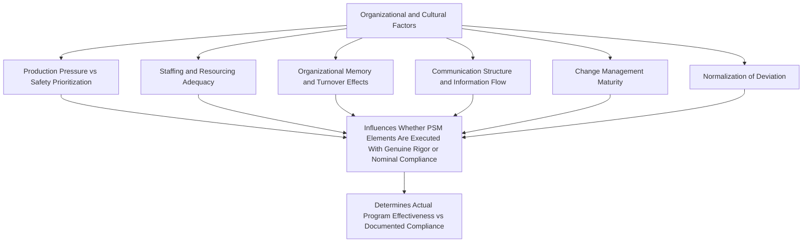
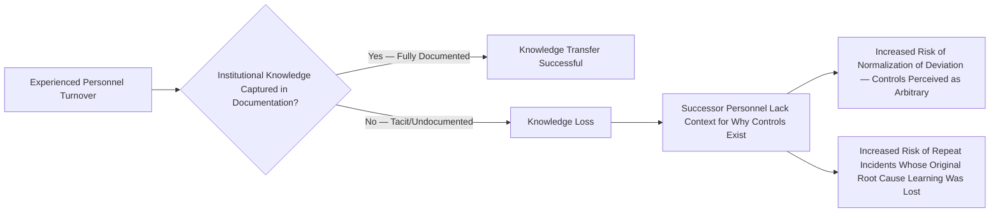
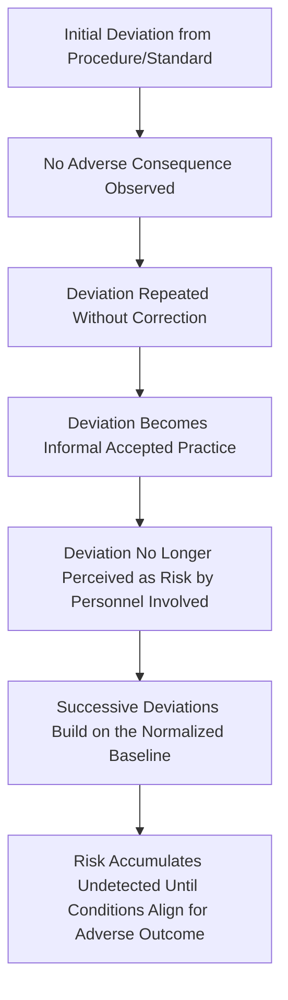
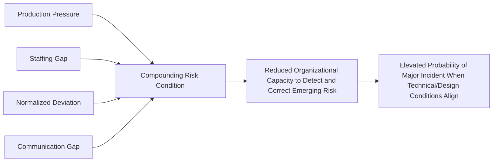

## Organizational and Cultural Influences on Safety Performance

### Overview and Scope

Organizational and cultural influences on safety performance encompasses the broader set of structural, systemic, and human-factors conditions that shape how effectively a PSM program functions in practice, extending beyond the specific culture-building mechanisms (Employee Participation, Just Culture, Leadership Commitment, BBS) already addressed individually. This topic synthesizes how organizational design choices — reporting structures, production pressure, staffing models, change management maturity, and organizational memory — interact with and either reinforce or undermine the PSM elements documented elsewhere in the program.

Where prior topics in this chapter addressed specific mechanisms (participation structures, culture-building practices, Just Culture accountability, felt leadership, behavioral observation), this topic addresses the organizational-level conditions that determine whether those mechanisms can function as designed. CCPS's Risk Based Process Safety framework, ISO 45001, and extensive incident investigation literature (notably CSB case studies) converge on the conclusion that organizational factors — not merely individual worker behavior or isolated technical failures — are consistently identified as root or contributing causes in major process safety incidents.

### The Organizational Factors Model

### Production Pressure Versus Safety Prioritization

The tension between production/schedule objectives and process safety rigor is one of the most consistently identified organizational factors in incident investigation literature. This tension is not itself a failure — some tension is inherent to any operating organization — but becomes a risk factor when the organizational structure lacks reliable mechanisms for safety considerations to prevail when genuinely warranted.

| Organizational Condition | Effect on Safety Performance |
| --- | --- |
| Safety and production functions report through a common chain with no independent safety authority | Safety considerations can be subordinated to production targets without an effective counterbalancing mechanism |
| Metrics and incentive structures weighted heavily toward production/schedule with safety treated as a compliance floor | Reinforces implicit prioritization of production even where stated policy claims equal priority |
| No defined, protected mechanism (e.g., stop-work authority with demonstrated non-retaliation) for safety concerns to halt or delay production | Individual workers bear disproportionate personal risk when raising safety-driven delays |
| History of schedule pressure overriding PHA/PSSR/MOC findings | Establishes an organizational precedent that erodes the credibility of those processes going forward |

The distinction between this factor and Leadership Commitment (addressed separately) is one of structure versus individual behavior: even highly committed individual leaders operate within organizational structures — reporting lines, incentive design, resourcing authority — that can either support or constrain their ability to prioritize safety consistently. A structurally sound organization with weak individual leadership commitment and a structurally unsound organization with strong individual leadership commitment both carry residual risk, for different reasons.

### Staffing and Resourcing Adequacy

Chronic understaffing or under-resourcing relative to actual workload — in operations, maintenance, engineering, or PSM program administration functions (PHA facilitation, MOC review, audit capacity) — is a recurring organizational factor identified across incident investigations, frequently interacting with other factors rather than acting as an isolated cause.

| Resourcing Gap | Downstream Effect |
| --- | --- |
| Insufficient operations staffing | Increased reliance on overtime, fatigue risk, reduced capacity for thorough shift handover and procedure adherence |
| Insufficient maintenance staffing | Mechanical integrity inspection/repair backlog growth, increased pressure to defer maintenance |
| Insufficient PHA/MOC review capacity | Review quality degradation under volume pressure, or backlog growth signaling the resourcing gap itself (as discussed under Management Review) |
| Insufficient engineering support | Reduced capacity for genuine root cause analysis and system-level corrective action, increasing reliance on administrative/behavioral fixes for engineering-rooted problems |

Resourcing adequacy assessment should be an explicit input to Management Review (addressed separately) rather than an implicit assumption — a PSM program that measures element compliance without examining whether the underlying resourcing is adequate to sustain that compliance over time risks a gradual, hard-to-detect erosion as workload grows against static staffing.

### Organizational Memory and Turnover Effects

Organizational memory — the retained, transferable knowledge of why current procedures, controls, and design decisions exist — degrades through personnel turnover, particularly among experienced operators, engineers, and PSM program administrators who hold institutional knowledge not fully captured in written documentation.

This factor has particular significance for PSM because process safety information, PHA rationale, and MOC history often depend on institutional context beyond what formal documents capture — a documented safeguard whose original justification ("we added this interlock after a 1998 near-miss") is lost to turnover is at elevated risk of being viewed by successor personnel as an unnecessary operational obstacle rather than a hard-won safety control, increasing the likelihood it is eventually bypassed, deprioritized in maintenance, or removed during a future modification without adequate MOC scrutiny.

| Mitigating Practice | Purpose |
| --- | --- |
| Explicit rationale documentation within PSI and PHA records (not just the control itself, but why it was implemented) | Preserves context beyond the tenure of the personnel who originally implemented it |
| Structured knowledge transfer processes ahead of planned departures (retirement, promotion) | Reduces tacit knowledge loss at predictable transition points |
| Historical incident/near-miss database actively referenced during PHA revalidation and MOC review | Institutionalizes lessons learned independent of individual personnel retention |
| New employee onboarding that includes site-specific historical context, not only generic PSM training | Accelerates rebuilding of institutional context after turnover |

### Communication Structure and Information Flow

The formal and informal pathways through which safety-relevant information moves — vertically between shift levels and management, horizontally across shifts and units, and across organizational boundaries (contractor to employer, unit to unit) — significantly influence whether hazard information reaches decision-makers with authority to act on it.

| Communication Failure Pattern | Consequence |
| --- | --- |
| Shift handover relies on informal verbal communication without structured documentation | Safety-relevant conditions or ongoing concerns lost at shift transition |
| Vertical reporting structure filters or summarizes information as it moves upward, losing operationally significant detail | Leadership decisions made on incomplete or overly optimistic information |
| Siloed communication between units/departments with shared or interacting hazards | Hazard interactions (as in SIMOPS scenarios) go unrecognized because no single party holds the complete picture |
| Contractor-employer communication gaps | Contractors operate with incomplete hazard awareness, or employer lacks visibility into contractor-identified hazards |

### Normalization of Deviation

Normalization of deviation — a concept substantially developed in the aftermath of the Space Shuttle Challenger investigation (Diane Vaughan's analysis) and widely applied across high-consequence industries including process safety — describes the gradual organizational process by which a deviation from a standard or procedure, initially recognized as a deviation, becomes accepted as normal practice through repeated instances without adverse consequence, eventually losing its status as a recognized risk.

This pattern connects directly to several previously addressed topics: it is a primary mechanism by which at-risk behavior (in Just Culture terms) becomes widespread rather than isolated; it is a key reason audit field verification must be triangulated against document review (since normalized deviation is, by definition, invisible to a document review alone); and it is a central justification for the chronic unease practice discussed under Safety Culture, since extended periods without adverse consequence are precisely the condition under which normalization of deviation develops undetected.

| Detection Mechanism | How It Surfaces Normalized Deviation |
| --- | --- |
| Fresh-eyes audit/PHA team rotation | Personnel unaccustomed to the normalized practice are more likely to recognize it as a deviation |
| Field verification triangulated against documented procedure (per audit methodology) | Direct comparison surfaces gaps between documented and actual practice |
| Incident/near-miss investigation examining "how long has this been done this way" | Retrospectively reveals the duration and extent of a normalized deviation once a consequence occurs |
| Structured behavioral observation (BBS) identifying widespread, consistent at-risk patterns | Aggregate data pattern (rather than isolated instance) signals normalization rather than individual lapse |

### Change Management Maturity as an Organizational Factor

The rigor and consistency with which an organization applies Management of Change — not merely whether the MOC process exists on paper, but whether it is consistently invoked for all qualifying changes, including informal or incremental changes that individually seem too minor to warrant formal review — is itself an organizational/cultural factor rather than purely a procedural one. Organizations with a culture of treating MOC as a genuine safeguard (rather than administrative friction to be minimized or circumvented) demonstrate materially different risk profiles than organizations where MOC scope is narrowly interpreted to exclude borderline changes.

### Interaction Effects — Why These Factors Compound

A defining characteristic of organizational and cultural factors, as distinct from discrete technical or procedural gaps, is that they frequently compound rather than operate independently. Major incident investigations across the process industries consistently identify multiple interacting organizational factors — production pressure combined with resourcing gaps combined with communication breakdown combined with normalized deviation — rather than a single isolated organizational cause. [Inference — this compounding pattern is a well-established finding across incident investigation literature broadly, though the specific combination and relative weighting of factors is necessarily case-specific and determined through individual investigation rather than a fixed universal formula.]

### Assessment and Monitoring Approaches

| Approach | What It Assesses |
| --- | --- |
| Organizational Factor Audits (distinct from standard PSM element audits) | Explicitly examines resourcing adequacy, communication structure, and production-safety tension rather than only element-by-element procedural compliance |
| Turnover and Experience-Level Trend Tracking | Monitors organizational memory risk as a leading indicator |
| Structured Post-Incident Organizational Factor Analysis | Ensures incident investigation (per 1910.119(m)) explicitly examines organizational contributing causes, not only immediate technical/procedural causes |
| Cross-Referencing Audit Findings, Culture Survey Data, and Turnover/Staffing Metrics | Triangulates multiple data sources to detect compounding risk conditions before they manifest as an incident |

### Integration with the Broader PSM Program

Organizational and cultural factors function as the environmental conditions within which every other PSM element and culture-building mechanism operates. Employee Participation, Just Culture, Leadership Commitment, and BBS each address specific dimensions of this broader environment, but organizational-level factors — staffing adequacy, communication structure, production-safety tension, and organizational memory retention — determine the baseline conditions under which those mechanisms either succeed or struggle regardless of how well each is individually designed. Management Review is the primary governance activity positioned to detect and respond to organizational-factor degradation, provided it explicitly incorporates organizational indicators (staffing trends, turnover, communication effectiveness) alongside the more commonly tracked procedural and incident-based metrics — a management review focused exclusively on element-by-element compliance status, without visibility into these underlying organizational conditions, risks missing the compounding risk patterns that incident investigation literature consistently identifies as precursors to major process safety events.

**Related Topics**

- Building and Sustaining a Positive Safety Culture
- Leadership Commitment and Visible Felt Leadership
- Just Culture and Non-Punitive Reporting
- Management Review of Safety Performance
- Management of Change Program Maturity and Scope Discipline
- Normalization of Deviation — Detection and Prevention
- Chemical Safety Board (CSB) Organizational Factor Case Studies
- Staffing and Resourcing Analysis for Process Safety-Critical Functions