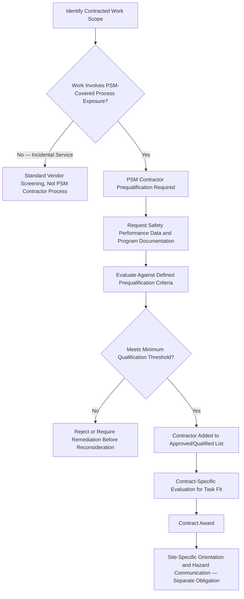

## Contractor Prequalification and Selection

### Overview and Regulatory Basis

Contractor Prequalification and Selection is the front-end screening and evaluation process by which an employer assesses a contractor's process safety and occupational safety capability before engaging that contractor to perform work at a PSM-covered facility. It is the first of the two employer-side obligations established under **29 CFR 1910.119(h)**, the PSM standard's Contractors element, which applies specifically to contractors performing maintenance, repair, turnaround, major renovation, or specialty work on or adjacent to a covered process — it does not apply to contractors providing incidental services (e.g., catering, landscaping) that do not involve exposure to process hazards.

**29 CFR 1910.119(h)(2)** establishes the employer's prequalification obligations specifically:

- **1910.119(h)(2)(i)**: The employer, when selecting a contractor, must obtain and evaluate information regarding the contract employer's safety performance and programs
- **1910.119(h)(2)(ii)**: The employer must inform contract employers of the known potential fire, explosion, or toxic release hazards related to the contractor's work and the process
- **1910.119(h)(2)(iii)**: The employer must explain to contract employers the applicable provisions of the emergency action plan
- **1910.119(h)(2)(iv)**: The employer must develop and implement safe work practices to control the entrance, presence, and exit of contract employees in covered process areas
- **1910.119(h)(2)(v)**: The employer must periodically evaluate the performance of contract employers in fulfilling their obligations

This section addresses primarily (h)(2)(i) — the prequalification/selection evaluation — while related obligations (hazard communication, safe work practices, performance evaluation) are addressed as distinct topics elsewhere in a complete contractor safety management treatment.

### Why Prequalification Is a Distinct Gate

Prequalification exists as a pre-contract screening function specifically because contractor-related incidents have been repeatedly identified in incident investigation literature as a disproportionate contributor to major process safety events relative to contractor labor-hour share — contractors are frequently engaged for exactly the highest-risk activities (turnarounds, hot work, confined space entry, equipment opening) where safety program maturity matters most, and where a contractor's unfamiliarity with site-specific process hazards compounds inherent task risk. Prequalification is the mechanism by which this risk is screened before contract award, rather than discovered during contract execution.

### Prequalification Process Architecture



### Categories of Prequalification Evaluation Data

| Evaluation Category | Specific Data Points |
| --- | --- |
| Injury and Illness Statistics | Total Recordable Incident Rate (TRIR), Days Away Restricted or Transferred (DART) rate, Lost Time Incident Rate (LTIR), typically benchmarked over a 3-5 year trailing period |
| Experience Modification Rate (EMR) | Workers' compensation insurance experience rating, indicating claims history relative to industry baseline |
| OSHA Compliance History | OSHA 300 log data, citation history, particularly any PSM-related or willful/repeat classifications |
| Written Safety Program Documentation | Contractor's own safety management system documentation, including process safety-relevant elements if the contractor regularly performs PSM-adjacent work |
| Training and Certification Records | Evidence of relevant competency certifications (e.g., confined space, hot work, rigging/lifting, HAZWOPER where applicable) |
| References and Prior Performance | Verification with prior clients, particularly for similar scope work (turnaround, specialty process work) |
| Insurance and Bonding Adequacy | Confirmation of adequate general liability, workers' compensation, and any project-specific insurance requirements |
| Substance Abuse Program | Existence and rigor of the contractor's own drug/alcohol testing program, particularly for safety-sensitive roles |
| Incident Reporting and Investigation Practices | Evaluation of whether the contractor has a functioning incident investigation and corrective action process, as a proxy for organizational safety maturity beyond raw statistics |

### Quantitative vs. Qualitative Evaluation Balance

A defensible prequalification process combines quantitative safety statistics with qualitative program assessment, since either category alone has significant limitations:

| Evaluation Type | Strength | Limitation if Used Alone |
| --- | --- | --- |
| Quantitative (TRIR, EMR, DART) | Objective, comparable across contractors, industry-benchmarkable | Trailing/lagging indicators; small contractors may have statistically unstable rates due to low labor-hour denominators; rates alone don't reveal program design quality |
| Qualitative (program documentation, interview, reference checks) | Captures program design maturity and organizational safety commitment, including leading-indicator-adjacent evidence | Subject to evaluator judgment variability; documentation quality doesn't guarantee field execution matches documentation |

Reliance on TRIR alone as a prequalification gate is a commonly cited limitation — a contractor with a favorable TRIR due to small crew size and limited labor hours (producing high statistical variance) may not be meaningfully safer than a larger contractor with a slightly elevated but more statistically stable rate. Mature prequalification frameworks typically apply minimum labor-hour thresholds before treating a contractor's rate as a reliable input, and weight qualitative program assessment more heavily for smaller or newer contractors where quantitative history is limited.

### Prequalification Scoring and Threshold Framework

**Example**

**Illustrative Prequalification Scoring Structure:**

| Criterion | Weight | Scoring Basis |
| --- | --- | --- |
| TRIR vs. industry benchmark | 25% | Below industry average = full points; above = scaled reduction |
| EMR | 15% | EMR ≤ 1.0 = full points; above 1.0 = scaled reduction |
| OSHA citation history (PSM-related, willful/repeat) | 20% | Any PSM-related willful/repeat citation in trailing period = significant point reduction or automatic disqualification |
| Written safety program completeness | 15% | Scored against a defined checklist of expected program elements |
| Relevant training/certification currency | 15% | Percentage of proposed crew with current, verifiable certifications for the specific task type |
| Reference check outcomes | 10% | Qualitative scoring from structured reference interview |

A defined minimum threshold (e.g., a composite score floor, combined with specific automatic-disqualification triggers such as a recent willful PSM-related citation) should be established before evaluation begins, rather than determined retroactively based on the pool of contractors who respond to a bid — retroactive threshold-setting risks lowering standards to accommodate a preferred or lowest-cost bidder rather than maintaining a consistent safety floor.

### Task-Specific Fit Beyond General Prequalification

General prequalification (establishing a contractor as acceptable for site work broadly) is distinct from task-specific evaluation for a particular contract scope. A contractor generally qualified for routine mechanical work may not be appropriately qualified for a specific high-hazard task (e.g., vessel entry, hot work in a classified area) without additional task-specific verification:

| General Prequalification Confirms | Task-Specific Evaluation Additionally Confirms |
| --- | --- |
| Overall safety program maturity and historical performance | Crew-specific competency certifications current for the specific task type |
| General acceptability to perform work at the site | Equipment/tooling appropriate and inspected for the specific task |
| Baseline insurance and compliance standing | Site-specific hazard familiarity for the specific process area involved |
| Organizational safety commitment | Contractor's specific experience with this task type at comparable facilities |

### Prequalification for Specialty and High-Hazard Work

Certain categories of contracted work warrant elevated prequalification rigor beyond the standard framework, given disproportionate consequence potential:

| Work Category | Elevated Prequalification Focus |
| --- | --- |
| Turnaround/Shutdown Contractors | Crew scalability and supervision ratio under high-tempo, multi-crew, compressed-schedule conditions; historical performance specifically during turnaround-type engagements |
| Confined Space Entry Contractors | Specific confined space program documentation, atmospheric monitoring equipment calibration records, rescue capability (in-house vs. reliance on site rescue team) |
| Hot Work / Specialty Welding Contractors | Certification currency, fire watch program, specific experience in classified/hazardous area hot work |
| Crane and Rigging Contractors | Equipment inspection/certification records, operator certification, critical lift planning experience |
| Engineering/Design Contractors (indirect process safety influence) | While not performing hands-on field work, design contractors influencing PSI, PHA input, or MOC-related engineering warrant qualification review focused on technical competency and quality assurance practices, since design deficiencies can introduce latent process safety risk |

### Maintaining an Approved Contractor List

Many organizations maintain a standing qualified/approved contractor list or pool, re-evaluated on a defined cycle rather than requiring full prequalification for every individual contract award:

```mermaid
flowchart LR
    A[Initial Prequalification] --> B[Added to Approved Contractor List]
    B --> C[Periodic Re-Evaluation — Typically Annual]
    C --> D{Performance/Statistics Still Meet Threshold?}
    D -->|Yes| E[Remains on Approved List]
    D -->|No| F[Removed or Placed on Probationary Status]
    B --> G[Ongoing Performance Evaluation During Active Contracts — Separate 1910.119(h)(2)(v) Obligation]
    G -.-> C
```

Periodic re-evaluation is necessary because prequalification is a point-in-time assessment — a contractor's safety performance can degrade after initial qualification, and an approved list that is never refreshed risks becoming stale relative to current contractor performance. Ongoing performance evaluation during active engagement (a related but distinct obligation under 1910.119(h)(2)(v)) should feed back into the periodic re-qualification cycle rather than existing as an entirely separate, disconnected process.

### Common Prequalification Program Weaknesses

- **Documentation-only verification**: Accepting contractor-submitted safety statistics and program documents without independent verification (e.g., cross-checking OSHA citation history against public OSHA databases rather than relying solely on contractor self-report)
- **Static thresholds never revisited**: Prequalification criteria set once and never updated to reflect evolving industry benchmarks or the organization's own risk tolerance evolution
- **Uniform rigor regardless of task risk**: Applying identical prequalification depth to a low-hazard incidental contractor and a high-hazard turnaround contractor, rather than scaling evaluation rigor to task risk
- **Cost pressure overriding qualification threshold**: Lowest-bid selection pressure resulting in exceptions granted to contractors who marginally fail defined thresholds, without documented risk-based justification and compensating measures
- **No linkage between prequalification and on-site performance data**: Contractors who perform poorly during actual site engagement (safety violations, near-misses) not systematically feeding back into re-qualification scoring, allowing repeat engagement of demonstrably underperforming contractors

### Integration with Broader Contractor Safety Management

Prequalification is the entry gate to a broader contractor safety management lifecycle that continues through hazard communication (informing contractors of site-specific process hazards per 1910.119(h)(2)(ii)), safe work practice control of contractor site access (1910.119(h)(2)(iv)), and ongoing performance evaluation (1910.119(h)(2)(v)) — each addressed as related but distinct program components. A rigorous prequalification process establishes the necessary but not sufficient foundation for contractor safety: even a well-qualified contractor requires effective site-specific hazard communication and active performance oversight during the actual engagement, since prequalification reflects historical and organizational capability rather than guaranteeing safe execution of the specific contracted work.

**Related Topics**

- Contractor Hazard Communication and Site-Specific Orientation
- Contractor Performance Evaluation and Ongoing Oversight
- Contractor Employee Training and Competency Verification
- Safe Work Practices for Contractor Site Access Control
- Turnaround and Shutdown Contractor Management
- Confined Space Entry Program Requirements for Contracted Work
- Hot Work Permit Programs Involving Contractor Personnel
- Incident Investigation Involving Contractor Personnel