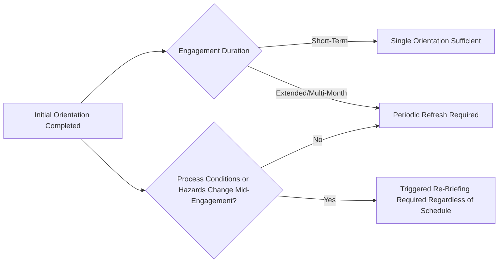

## Contractor Orientation and Site Specific Training

### Overview and Regulatory Basis

Contractor Orientation and Site-Specific Training is the mechanism by which an employer fulfills its hazard communication obligations to contract employers under **29 CFR 1910.119(h)(2)(ii)** and **1910.119(h)(2)(iii)**, converting a prequalified contractor's general safety program capability into working knowledge of the specific process hazards, emergency procedures, and site conditions at the facility where they will perform work. It functions as the bridge between Contractor Prequalification (verifying a contractor's organizational safety capability before contract award) and actual field execution — a contractor can be well-qualified in general terms and still operate unsafely if not adequately informed of the specific process hazards, emergency response protocols, and safe work practices unique to the host facility.

The regulatory text establishes two distinct host-employer obligations addressed by orientation and site-specific training:

- **1910.119(h)(2)(ii)**: The employer must inform contract employers of the known potential fire, explosion, or toxic release hazards related to the contractor's work and the process
- **1910.119(h)(2)(iii)**: The employer must explain to contract employers the applicable provisions of the emergency action plan

A third, related obligation — **1910.119(h)(3)(i)**, which falls on the *contract employer* — requires that the contract employer assure that each contract employee is trained in the work practices necessary to safely perform their job. Orientation and site-specific training therefore sits at the intersection of host-employer and contract-employer responsibility, and a well-designed program makes the division of responsibility between the two parties explicit rather than assuming either party will independently cover the full scope.

### Division of Responsibility — Host Employer vs. Contract Employer

| Responsibility | Party | Regulatory Basis |
| --- | --- | --- |
| Communicate known process-specific fire, explosion, toxic release hazards | Host Employer | 1910.119(h)(2)(ii) |
| Explain applicable emergency action plan provisions | Host Employer | 1910.119(h)(2)(iii) |
| Develop/implement safe work practices controlling contractor entrance, presence, exit in covered process areas | Host Employer | 1910.119(h)(2)(iv) |
| Ensure contract employees are trained in job-specific safe work practices | Contract Employer | 1910.119(h)(3)(i) |
| Ensure contract employees understand the hazards related to their job and the process | Contract Employer | 1910.119(h)(3)(ii) |
| Document that each contract employee has received and understood the required training | Contract Employer | 1910.119(h)(3)(iii) |

A common source of program gaps is ambiguity about which party is responsible for which specific content — if both parties assume the other is covering general task-specific safety training, or both assume the other is covering site-specific process hazard communication, a genuine gap results despite both parties technically believing they are compliant. A well-designed orientation program explicitly documents this division and confirms, rather than assumes, that each side's obligations are being met.

### Orientation Program Architecture

```plaintext
===npipe MERMAID_DIAGRAM===
flowchart TD
    A[Contractor Prequalified and Contract Awarded] --> B[Pre-Mobilization Orientation Scheduling]
    B --> C[General Site Orientation — All Contractor Personnel]
    C --> D[Process-Specific Hazard Communication]
    D --> E[Emergency Action Plan Briefing]
    E --> F[Site-Specific Safe Work Practices — Access Control, Permit Systems]
    F --> G{Task Involves Elevated-Risk Activity?}
    G -->|Yes| H[Task-Specific Briefing — e.g., Confined Space, Hot Work, LOTO]
    G -->|No| I[Standard Access Credentialing]
    H --> I
    I --> J[Orientation Completion Verification and Documentation]
    J --> K[Badge/Access Issuance]
    K --> L[Contractor Begins Work Under Active Site Oversight]
```

Note: the diagram marker above contains a typographical artifact ("npipe") that should be disregarded — treat the fenced block as a standard mermaid diagram beginning with the required marker on its own line as specified in the formatting instructions.

### General Site Orientation Content

| Content Area | Typical Coverage |
| --- | --- |
| Site Access and Credentialing | Badge/ID procedures, restricted area boundaries, vehicle access rules |
| General Site Safety Rules | PPE requirements by area, speed limits, housekeeping standards, smoking restrictions |
| Emergency Notification and Response | Alarm types and meanings, evacuation routes and assembly points, muster procedures, emergency contact protocol |
| Incident and Near-Miss Reporting | How and to whom contractors report incidents, injuries, and near-misses occurring during their work |
| General Permit-to-Work System Overview | Introduction to the site's PTW system structure, even if task-specific permit training occurs separately |
| Environmental and Regulatory Site-Specific Requirements | Any facility-specific environmental compliance obligations relevant to contractor activity |

### Process-Specific Hazard Communication — Core PSM Obligation

The process-specific hazard communication required under 1910.119(h)(2)(ii) is the element most directly tied to PSM (as distinct from general occupational safety orientation content) and warrants the most rigorous content development, since it requires translating process safety information into a form meaningful to contractor personnel who lack the host employer's operational familiarity with the process.

| Hazard Category | Communication Content |
| --- | --- |
| Highly Hazardous Chemicals (HHCs) present in the work area | Identity, quantity, physical/health hazard characteristics relevant to the contractor's task location |
| Process conditions | Operating pressures, temperatures, or other conditions relevant to equipment the contractor will work on or near |
| Known process-specific ignition sources and flammable atmosphere zones | Area classification, restrictions on ignition sources (relevant to hot work permitting) |
| Toxic release scenarios and specific area vulnerability | Which work areas carry elevated toxic exposure risk under upset conditions, and associated monitoring/response expectations |
| Simultaneous operations (SIMOPS) considerations | Other concurrent activities in or near the contractor's work area that may introduce interacting hazards |

Effective communication of this content requires more than a generic handout — mature programs use area-specific hazard maps, process-specific safety data summaries tailored to the contractor's actual work zone, and verbal briefing by personnel with direct process knowledge (rather than solely administrative EHS staff unfamiliar with current process conditions) to ensure the communication is substantively understood rather than merely delivered.

### Emergency Action Plan Briefing

1910.119(h)(2)(iii) requires explaining applicable emergency action plan provisions specifically to contract employers — this is distinct from, and in addition to, general site emergency notification content covered in general orientation, and should address:

- Contractor-specific roles during an emergency (e.g., whether contractors muster separately from site personnel, and where)
- How contractors will be accounted for during an emergency headcount, particularly for transient or high-turnover contractor crews where standard site personnel tracking systems may not apply
- Specific emergency response expectations for contractors performing elevated-risk work (e.g., confined space entry) at the moment an emergency is declared
- Any contractor-specific responsibilities during emergency response (e.g., a contractor crane operator's obligation to secure equipment before evacuating)

### Task-Specific Briefing for Elevated-Risk Activities

Beyond general and process-specific orientation, contractors performing specific high-hazard task categories require targeted briefing tied to the applicable permit or procedure system:

| Task Category | Task-Specific Briefing Focus |
| --- | --- |
| Confined Space Entry | Site-specific confined space inventory, atmospheric testing requirements, attendant/entrant roles under the site's program, rescue plan integration |
| Hot Work | Site-specific hot work permit process, fire watch requirements, area classification awareness for the specific work location |
| Lockout/Tagout | Site-specific energy isolation procedures, integration with site LOTO devices and verification requirements, particularly where contractor equipment/locks must integrate with site systems |
| Excavation | Site-specific underground utility locating procedures and buried hazard awareness |
| Crane/Rigging/Lifting | Site-specific lift planning requirements, exclusion zone procedures, overhead hazard awareness (e.g., power lines, elevated piping) |

### Verification of Understanding — Beyond Attendance

A recurring quality gap in contractor orientation programs is treating orientation completion as equivalent to sign-in sheet attendance, rather than verifying actual comprehension — the same distinction addressed for employee training under PSSR confirmation elsewhere in this curriculum applies with particular force to contractors, who typically have less pre-existing familiarity with the specific facility than site employees.

| Verification Method | Rigor Level |
| --- | --- |
| Sign-in sheet only | Minimal — confirms attendance, not comprehension |
| Written or verbal knowledge check following orientation content | Moderate — confirms basic recall of key content |
| Task-specific competency demonstration for elevated-risk activities (e.g., supervised walkthrough of a permit process) | High — confirms practical application ability, not just recall |
| Documented sign-off by both contractor supervisor and host employer representative | Establishes shared accountability for verification adequacy |

### Documentation Requirements

| Documentation Element | Purpose |
| --- | --- |
| Individual contractor employee orientation completion record | Supports the (h)(3)(iii) contract-employer documentation obligation and provides host-employer evidence of hazard communication delivery |
| Content version and date of orientation material delivered | Ensures traceability if process conditions or hazards change between the orientation and actual work performance |
| Verification method used and outcome | Distinguishes attendance-only from comprehension-verified orientation |
| Renewal/refresh cycle tracking for long-duration or recurring contractor engagements | Ensures orientation currency is not treated as a one-time, indefinitely valid event |

### Orientation Currency and Refresh Requirements

Orientation delivered at initial mobilization can become stale over the course of a long-duration engagement (e.g., an extended turnaround or multi-month project), particularly if process conditions, area hazards, or emergency procedures change during that period. Programs should define explicit refresh triggers:



A common gap in turnaround-scale contractor engagements specifically is that orientation is delivered once at mobilization for what may be a several-week engagement, without a mechanism to communicate hazard changes that emerge during the turnaround itself (e.g., an unexpected finding during equipment opening that changes the hazard profile of adjacent work areas) — a strong orientation program includes a defined process for triggered communication updates, not solely a fixed initial briefing.

### Common Program Weaknesses

- **Generic content not tailored to actual work location**: Orientation material covering the facility broadly without translating hazards to the contractor's specific assigned work area, reducing practical relevance
- **Attendance-only verification for elevated-risk task briefings**: Applying the same low-rigor verification (sign-in sheet) to confined space or hot work task-specific briefings as to general site orientation, despite the substantially higher consequence potential
- **No mid-engagement refresh mechanism**: Treating orientation as a single event at mobilization regardless of engagement duration or changing process conditions
- **Ambiguous division of responsibility**: Host employer and contract employer each assuming the other is covering specific content, resulting in an actual gap neither party is aware of
- **Orientation delivered by personnel without current process knowledge**: Administrative or generic EHS staff delivering process-specific hazard content without direct operational familiarity, reducing the quality and specificity of the communication
- **Language and literacy barriers not addressed**: Orientation content and verification methods not adapted for contractor workforces with limited English proficiency or literacy, undermining genuine comprehension despite formal completion

### Integration with Broader Contractor Safety Management

Orientation and site-specific training converts the organizational capability verified during Contractor Prequalification into task-ready field knowledge, and in turn establishes the baseline understanding that Contractor Performance Evaluation (an ongoing, separate obligation under 1910.119(h)(2)(v)) subsequently monitors for adherence. A contractor who is well-qualified organizationally but receives superficial or attendance-only orientation enters the work environment without the process-specific hazard awareness the regulation specifically intends to ensure — this is why orientation quality, not merely its formal completion, is a frequent focus of both internal audit and regulatory inspection scrutiny of the Contractors PSM element.

**Related Topics**

- Contractor Prequalification and Selection
- Contractor Performance Evaluation and Ongoing Oversight
- Emergency Action Plan Development and Communication
- Permit-to-Work System Design and Governance
- Confined Space Entry Program Requirements for Contracted Work
- Hot Work Permit Programs Involving Contractor Personnel
- Simultaneous Operations (SIMOPS) Risk Management
- Turnaround and Shutdown Contractor Management