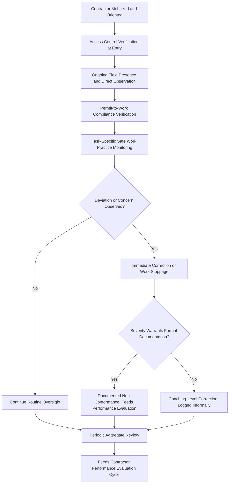
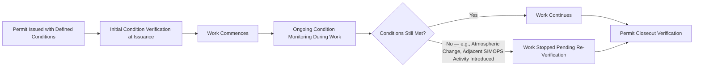

## Oversight of Contractor Work Activities

### Overview and Regulatory Basis

Oversight of Contractor Work Activities is the active, ongoing monitoring function by which a host employer verifies that contractor personnel are performing work safely and in accordance with site requirements throughout the actual execution of contracted work — as distinct from the pre-engagement functions of Prequalification (screening before contract award) and Orientation (initial hazard communication and training before work begins). Oversight is the real-time and periodic verification layer that confirms the capability established through prequalification and the knowledge communicated through orientation are actually being applied correctly once work is underway.

This function is addressed primarily under **29 CFR 1910.119(h)(2)(v)**, which requires the host employer to periodically evaluate the performance of contract employers in fulfilling their obligations, and **1910.119(h)(2)(iv)**, which requires the employer to develop and implement safe work practices to control the entrance, presence, and exit of contract employees in covered process areas — oversight is the mechanism through which these safe work practices are actually enforced during active work, not merely documented as a program element.

### Distinguishing Oversight from Prior Contractor Safety Functions

| Function | Timing | Primary Question |
| --- | --- | --- |
| Prequalification | Pre-contract award | Is this contractor organizationally capable of working safely? |
| Orientation / Site-Specific Training | Pre-mobilization / before work begins | Does this contractor's personnel understand the site-specific hazards and requirements? |
| Oversight of Work Activities | Continuous, throughout the engagement | Is the contractor actually performing work safely, in practice, right now? |
| Performance Evaluation (post-engagement or periodic) | Ongoing/periodic, feeding back into prequalification renewal | How has this contractor performed over the engagement or evaluation period, in aggregate? |

Oversight and Performance Evaluation are closely related but distinct in granularity and purpose: oversight is the day-to-day, task-level monitoring activity generating the observations that periodic performance evaluation subsequently aggregates and formalizes.

### Oversight Program Architecture

### Access Control as a Foundational Oversight Layer

Safe work practices controlling contractor entrance, presence, and exit (1910.119(h)(2)(iv)) function as the baseline oversight mechanism, establishing structural control over who is present in covered process areas and under what conditions:

| Access Control Element | Purpose |
| --- | --- |
| Credential/badge verification tied to completed orientation status | Prevents personnel who have not completed required orientation from entering covered process areas |
| Sign-in/sign-out or electronic access tracking for process area entry | Enables accurate personnel accounting, particularly critical during emergency muster |
| Escort requirements for personnel without independent site familiarity | Reduces risk from contractor personnel unfamiliar with area-specific hazards operating unsupervised |
| Defined boundaries for contractor work areas | Limits contractor presence to authorized zones, reducing exposure to hazards outside the scope of their orientation and task briefing |
| Time-bound access (e.g., access expires with the permit or contract period) | Prevents indefinite, unreviewed access accumulation over successive engagements |

### Direct Field Oversight — Presence and Observation

Active field presence by host employer personnel (or designated oversight representatives) during contractor work execution is the primary mechanism for real-time verification that safe work practices are being followed, complementing but not replacing the contractor's own supervisory responsibility for their personnel.

| Oversight Model | Description | Typical Application |
| --- | --- | --- |
| Continuous Direct Supervision | Host employer representative present throughout the specific task | Highest-hazard activities (e.g., confined space entry, hot work in classified areas) |
| Periodic Field Rounds | Host employer personnel conduct scheduled or random checks across active contractor work areas | General contractor activity across a site or turnaround |
| Permit-Linked Verification | Oversight tied specifically to permit issuance points and permit-required conditions (e.g., verifying atmospheric testing before confined space entry) | Any task requiring a permit under the site's PTW system |
| Contractor Self-Verification with Host Audit Sampling | Contractor performs and documents its own verification, with host employer conducting periodic independent sampling checks | Lower-hazard, high-volume routine contractor activity where continuous host presence is impractical |

The appropriate oversight intensity should scale with task risk, consistent with the hierarchy applied elsewhere in PSM risk-based resource allocation — treating a low-hazard routine task and a confined space entry with identical oversight intensity either over-allocates scarce oversight resources to low-risk work or under-allocates them to genuinely high-consequence activity.

### Permit-to-Work Compliance Verification

For contractor work requiring a permit (hot work, confined space, energy isolation, excavation), oversight includes explicit verification that permit conditions are actually being maintained throughout the task duration, not solely confirmed at permit issuance:

A permit verified as satisfactory at issuance can become invalid mid-task due to changing conditions (atmospheric drift in a confined space, introduction of an adjacent hot work activity affecting a previously flammable-free zone) — oversight that treats permit compliance as a single point-in-time check at issuance, rather than a continuously monitored condition, misses this category of risk.

### Simultaneous Operations (SIMOPS) Oversight for Multiple Contractors

Where multiple contractors, or contractor and host employer personnel, perform concurrent work in overlapping or adjacent areas, oversight must extend beyond individual task/permit monitoring to interaction-level hazard awareness:

| SIMOPS Oversight Focus | Example |
| --- | --- |
| Cross-contractor hazard communication | Hot work contractor and confined space entry contractor in adjacent areas each aware of the other's activity and associated hazard interaction |
| Consolidated work area scheduling/coordination | Host employer maintains visibility into all active permits/work areas concurrently, not solely per-contractor oversight in isolation |
| Escalation authority for interaction conflicts | Clear host employer authority to halt or reschedule one activity where it creates unacceptable risk to a concurrent adjacent activity |

This oversight dimension connects directly to SIMOPS considerations addressed elsewhere in the curriculum — multi-contractor turnaround environments are the setting where SIMOPS interaction risk is most acute, and where oversight resourcing is often most strained relative to the volume of concurrent activity.

### Stop-Work Authority Applied to Contractor Oversight

A functioning contractor oversight program requires clear, exercised authority — for both host employer personnel and contractor personnel themselves — to halt contractor work immediately upon observing an unsafe condition or practice, consistent with the broader stop-work authority and Just Culture principles addressed under Safety Culture.

| Stop-Work Authority Scope | Application to Contractor Oversight |
| --- | --- |
| Host employer representative authority | Explicit authority to halt any contractor activity presenting an immediate hazard, independent of contractor supervisory chain-of-command |
| Contractor employee authority | Contractor personnel empowered to stop their own work if conditions appear unsafe, without adverse consequence from either their own employer or the host |
| Cross-contractor authority | Any contractor or host personnel authorized to raise a concern about another contractor's activity presenting risk to them, particularly in SIMOPS conditions |

Consistent with the Just Culture principles discussed elsewhere, stop-work events involving contractor personnel should be evaluated without automatic adverse consequence to the individual or the contracting relationship for the specific act of stopping work — a contractor workforce that perceives stop-work exercise as risking the contract relationship will underreport safety concerns, undermining the oversight function's core purpose.

### Documentation of Oversight Activity

| Documentation Element | Purpose |
| --- | --- |
| Field round/inspection logs with date, area, and observations | Establishes an auditable record of oversight activity frequency and findings |
| Non-conformance records with severity classification | Feeds directly into periodic contractor performance evaluation |
| Stop-work event logs, including resolution and any systemic finding | Tracks both individual events and any recurring pattern warranting broader corrective action |
| Permit compliance verification records | Demonstrates ongoing (not solely point-in-time) permit condition monitoring |

### Oversight Resourcing Considerations

Oversight function effectiveness depends substantially on adequate host employer resourcing relative to contractor activity volume — a recurring theme connecting to the organizational and cultural factors addressed elsewhere in this chapter. Turnaround and shutdown periods, characterized by high contractor headcount and compressed schedules, place particular strain on oversight resourcing and are correspondingly associated with elevated risk if oversight capacity does not scale proportionally with contractor activity volume.

| Resourcing Factor | Oversight Effectiveness Impact |
| --- | --- |
| Oversight personnel-to-contractor-crew ratio | Insufficient ratio reduces achievable field presence and observation frequency |
| Oversight personnel process/task-specific competency | Oversight by personnel unfamiliar with the specific task or hazard type reduces observation quality regardless of frequency |
| Schedule pressure on oversight personnel themselves | Oversight personnel under the same schedule pressure as the contractors they monitor may deprioritize thorough verification in favor of throughput |
| Turnaround-specific temporary oversight staffing | Additional oversight personnel brought in for high-volume periods require their own orientation/competency verification to be effective |

[Inference — the specific oversight-personnel-to-contractor ratio considered adequate varies substantially by task risk profile, site complexity, and organizational risk tolerance, and is not standardized by a single universal regulatory or industry benchmark.]

### Common Failure Modes

- **Front-loaded oversight only**: Rigorous access control and initial verification at mobilization, with oversight intensity declining over the course of an extended engagement as familiarity (and complacency) increases
- **Permit issuance-only verification**: Confirming permit conditions at issuance without ongoing monitoring for condition changes during task execution
- **Uniform oversight intensity regardless of task risk**: Applying the same oversight frequency to routine and high-hazard contractor activities, misallocating limited oversight resources
- **Contractor self-policing without independent sampling**: Relying entirely on contractor self-reported compliance without host employer independent verification, particularly for elevated-risk activities
- **Stop-work exercise perceived as contract-jeopardizing**: Contractor personnel reluctant to exercise stop-work authority due to concern over commercial relationship consequences, undermining the intended safety function
- **Oversight resourcing not scaled for turnaround/high-volume periods**: Standard oversight staffing maintained during periods of significantly elevated contractor headcount and activity, reducing effective oversight coverage precisely when risk is elevated

### Integration with Broader Contractor Safety Management

Oversight of Contractor Work Activities is the operational verification layer connecting Prequalification and Orientation (which establish contractor capability and knowledge before work begins) to Performance Evaluation (which formalizes accumulated oversight observations into a structured, periodic assessment feeding back into contractor requalification). A program strong in prequalification and orientation but weak in ongoing oversight risks a gap between documented contractor capability and actual field execution — the oversight function exists specifically to detect and correct that gap in real time, rather than discovering it only after an incident or during a delayed periodic review.

**Related Topics**

- Contractor Prequalification and Selection
- Contractor Orientation and Site-Specific Training
- Contractor Performance Evaluation and Ongoing Oversight
- Permit-to-Work System Design and Governance
- Simultaneous Operations (SIMOPS) Risk Management
- Stop Work Authority Program Design
- Turnaround and Shutdown Contractor Management
- Just Culture and Non-Punitive Reporting