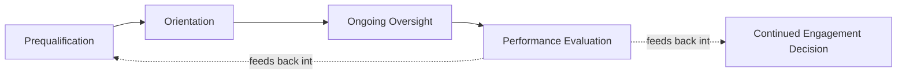
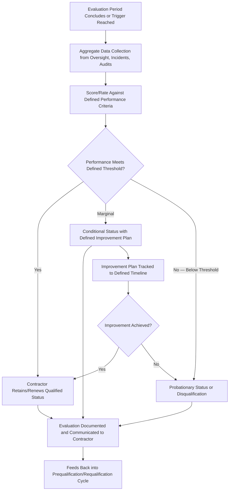

## Evaluating Contractor Safety Performance

### Overview and Regulatory Basis

Evaluating Contractor Safety Performance is the periodic, aggregate assessment function through which a host employer formally reviews a contractor's safety performance across an engagement or evaluation period, converting the ongoing field-level observations generated through Oversight of Contractor Work Activities into structured, documented performance determinations. It is the explicit obligation established under **29 CFR 1910.119(h)(2)(v)**, which requires the employer to periodically evaluate the performance of contract employers in fulfilling their obligations under the Contractors element.

This function closes the loop on the contractor safety management lifecycle: Prequalification screens capability before contract award, Orientation communicates site-specific hazard knowledge before work begins, Oversight monitors real-time execution, and Performance Evaluation formalizes the accumulated record into a periodic determination that feeds back into future contracting decisions — including continued engagement, requalification standing, and corrective action requirements.

### Distinguishing Performance Evaluation from Oversight

| Dimension | Oversight | Performance Evaluation |
| --- | --- | --- |
| Timing | Continuous, real-time during work execution | Periodic — end of engagement, defined interval (e.g., quarterly for long-duration contracts), or annual for standing contractor relationships |
| Unit of Analysis | Individual task, shift, or observation | Aggregate performance across an evaluation period |
| Primary Output | Immediate correction, stop-work if warranted | Formal documented rating/determination, feeding into requalification and contracting decisions |
| Data Source | Direct field observation | Aggregated oversight records, incident/near-miss data, permit compliance history, audit findings |

### Performance Evaluation Data Sources

A defensible performance evaluation triangulates across multiple data sources accumulated during the evaluation period, rather than relying on any single input:

| Data Source | Contribution to Evaluation |
| --- | --- |
| Field oversight non-conformance records | Frequency and severity of observed safe work practice deviations |
| Incident and near-miss reports involving contractor personnel | Direct safety outcome data specific to this contractor's work |
| Stop-work event history | Frequency, resolution, and any recurring pattern associated with this contractor |
| Permit-to-work compliance history | Rate of permit condition adherence, any permit violations or unauthorized deviations |
| Host employer audit findings specific to contractor-performed work | Independent verification distinct from routine oversight |
| Contractor's own incident/near-miss reporting and investigation quality | Indicator of the contractor's internal safety program functioning, not solely outcome data |
| Schedule/quality performance (as context, not a safety substitute) | Provides operational context but should not be weighted as a safety indicator itself |
| Site personnel feedback on contractor safety conduct | Qualitative input from personnel who worked alongside or supervised the contractor |

### Performance Evaluation Process

### Performance Evaluation Criteria and Scoring

**Example**

**Illustrative Contractor Performance Evaluation Scorecard:**

| Criterion | Weight | Data Source |
| --- | --- | --- |
| Incident/injury rate during engagement (this site, this period) | 25% | Incident reporting system |
| Near-miss reporting rate and quality | 15% | Near-miss reporting system — evaluates both frequency (an engagement-positive leading indicator, not a negative) and investigation quality |
| Safe work practice/permit compliance (oversight non-conformance frequency and severity) | 25% | Field oversight records |
| Stop-work event frequency and resolution pattern | 10% | Stop-work event log |
| Responsiveness to corrective action requests | 15% | Corrective action tracking |
| Site personnel qualitative feedback | 10% | Structured feedback collection |

A notable and frequently counterintuitive design element is the treatment of near-miss reporting rate: unlike incident rate (where lower is better), near-miss reporting rate is generally scored as a positive indicator when higher, reflecting genuine engagement with safety reporting culture rather than suppression — a contractor with zero reported near-misses across an extended, high-activity engagement is not necessarily safer than one with active near-miss reporting; it may instead indicate underreporting, which the evaluation framework should not inadvertently reward.

### Avoiding Purely Outcome-Based (Lagging) Evaluation

A significant limitation in many contractor performance evaluation frameworks is over-reliance on lagging outcome data (incident/injury counts) as the primary or sole evaluation criterion, which carries the same statistical instability limitation discussed under Prequalification — particularly for shorter-duration engagements or smaller contractor crews, where low incident counts may reflect limited exposure hours rather than genuinely superior safety performance, and conversely a single incident can disproportionately affect a short-engagement contractor's aggregate score relative to its actual behavior pattern.

| Evaluation Approach | Strength | Limitation |
| --- | --- | --- |
| Lagging-only (incident/injury rate) | Objective, directly outcome-relevant | Statistically unstable for short engagements/small crews; doesn't capture near-miss or process-level safety practice quality |
| Leading-inclusive (permit compliance, near-miss reporting quality, stop-work engagement) | Captures safety practice quality independent of whether an adverse outcome happened to occur | Requires more sophisticated data collection and somewhat more subjective scoring elements |

A balanced framework, consistent with the leading/lagging indicator principles applied elsewhere in PSM performance measurement (per API RP 754), incorporates both categories rather than treating incident rate alone as a sufficient performance proxy.

### Performance Rating Categories and Consequences

| Rating Category | Typical Criteria | Consequence |
| --- | --- | --- |
| Satisfactory/Qualified | Meets or exceeds defined performance thresholds across weighted criteria | Continued qualified status; eligible for future contract award consideration |
| Conditional/Watch Status | Marginal performance, or a specific significant finding requiring correction | Continued engagement contingent on documented improvement plan with defined timeline and follow-up evaluation |
| Probationary | Performance below threshold, or a serious safety violation | Restricted scope of future work, enhanced oversight requirement, or suspension pending demonstrated correction |
| Disqualified | Severe violation (e.g., willful safety violation, pattern of repeated serious non-conformance, contractor-caused significant incident with evidence of systemic organizational failure) | Removal from approved contractor list; typically requires a defined re-application and re-prequalification process, if re-engagement is considered at all |

### Timing and Trigger Structures

Performance evaluation cadence should be matched to engagement characteristics rather than applying a single fixed schedule universally:

| Engagement Type | Typical Evaluation Cadence |
| --- | --- |
| Short-duration, discrete scope contract | Single evaluation at contract completion |
| Extended/multi-month engagement | Periodic evaluation at defined intervals during the engagement (e.g., monthly or quarterly), not solely at conclusion |
| Standing/recurring contractor relationship (e.g., routine maintenance contractor engaged repeatedly) | Formal annual evaluation aggregating performance across the full period, supplementing per-engagement observations |
| Triggered evaluation | Immediate evaluation triggered by a significant incident, serious non-conformance, or stop-work event, independent of the standard cycle |

The triggered evaluation pathway is particularly important for high-consequence events — waiting for a scheduled periodic evaluation to formally assess a contractor following a serious incident or safety violation introduces unacceptable delay in a decision that may warrant immediate action (probationary status, enhanced oversight, or work suspension).

### Feedback and Improvement Plan Structure

Where evaluation identifies a performance gap without warranting immediate disqualification, a structured improvement plan process is generally preferable to either silent tolerance or immediate severe consequence, provided the gap does not reflect willful or reckless conduct (consistent with Just Culture principles applied at the organizational/contractor level):

**Example**

**Contractor Improvement Plan Structure:**

1. Specific finding(s) documented with supporting evidence (oversight records, incident data)
2. Root cause discussion with contractor management — distinguishing systemic contractor program gaps from isolated crew-level issues
3. Defined corrective actions with contractor-assigned ownership and timeline
4. Defined host-employer verification method and follow-up evaluation date
5. Explicit consequence stated if improvement is not demonstrated by the follow-up date (e.g., probationary status, scope restriction)

### Feedback to Contractors — Bidirectional Communication

Effective performance evaluation includes formal communication of results back to the contractor, not solely internal host-employer documentation — this serves both an accountability function and a genuine improvement function, since a contractor unaware of specific performance concerns cannot be expected to address them.

| Communication Practice | Purpose |
| --- | --- |
| Formal evaluation results shared with contractor management, not only field supervision | Ensures organizational-level awareness and accountability, not solely crew-level |
| Specific, evidence-based findings rather than generic ratings | Enables the contractor to take genuinely targeted corrective action |
| Opportunity for contractor response/context prior to finalizing rating, particularly for Conditional/Probationary determinations | Supports fairness and may surface relevant context (e.g., a host-employer-caused condition contributing to a contractor non-conformance) |
| Positive performance recognition, not solely deficiency-focused communication | Reinforces and encourages continuation of strong safety performance, consistent with positive reinforcement principles applied elsewhere in behavior-based safety practice |

### Feeding Evaluation Results into Organizational Decisions

Performance evaluation data has value beyond the individual contractor relationship when aggregated across the contractor pool and fed into broader organizational processes:

| Downstream Use | Application |
| --- | --- |
| Requalification cycle | Performance evaluation results directly inform whether a contractor remains on the approved list, as discussed under Prequalification |
| Contract award decisions | Historical performance evaluation data should weigh in future bid selection, not solely price/schedule factors |
| Lessons learned sharing | Systemic findings across multiple contractors (e.g., a recurring gap type across several evaluated contractors) may indicate a host-employer-side communication or oversight design gap warranting review, not solely a contractor-side deficiency |
| Management review input | Aggregate contractor performance trends across the contractor pool serve as a leading indicator input to broader PSM management review, per the governance function addressed elsewhere in this curriculum |

### Common Failure Modes

- **Evaluation conducted but not acted upon**: Formal ratings produced and filed without genuinely influencing future contracting decisions, undermining the evaluation's practical purpose
- **Purely lagging, outcome-based scoring**: Incident rate treated as the dominant or sole criterion, missing leading-indicator-relevant safety practice quality
- **No triggered evaluation pathway**: Waiting for scheduled periodic evaluation even following a significant incident or serious violation, delaying appropriate response
- **One-directional evaluation without contractor feedback**: Results retained internally without communication to the contractor, foreclosing the improvement function the evaluation is intended to support
- **Inconsistent criteria application across contractors**: Evaluation criteria applied with varying rigor depending on contractor relationship, cost pressure, or schedule criticality, undermining the framework's defensibility and fairness
- **No aggregation across the contractor pool**: Individual evaluations conducted without cross-contractor trend analysis, missing systemic host-employer-side gaps that manifest across multiple contractor relationships

### Integration with the Complete Contractor Safety Management Lifecycle

Performance Evaluation is the closing and feedback-generating stage of the contractor safety management cycle addressed across this chapter: it depends on data generated through Oversight of Contractor Work Activities, assesses performance against the capability screened during Prequalification, and evaluates whether the knowledge communicated during Orientation was effectively applied in practice. Its results, in turn, directly inform future prequalification and contracting decisions, closing the loop. A contractor safety management program strong in the front-end functions (prequalification, orientation) but lacking rigorous, consequential performance evaluation risks repeatedly re-engaging underperforming contractors, since without a functioning evaluation and feedback mechanism, historical safety performance has no structured pathway to influence future contracting decisions.

**Related Topics**

- Contractor Prequalification and Selection
- Contractor Orientation and Site-Specific Training
- Oversight of Contractor Work Activities
- Just Culture and Non-Punitive Reporting
- Management Review of Safety Performance
- Process Safety Performance Indicators per API RP 754
- Sharing Lessons Learned Across an Organization
- Turnaround and Shutdown Contractor Management