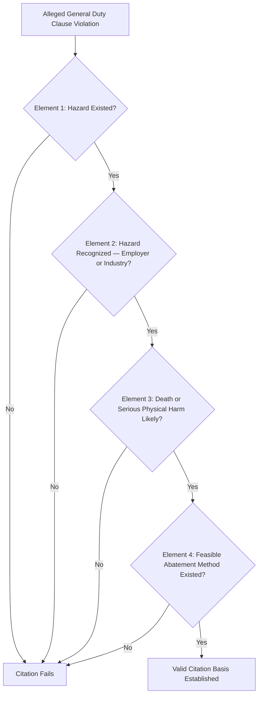

## The OSHA General Duty Clause

### Overview and Statutory Basis

The General Duty Clause is a provision of the Occupational Safety and Health Act of 1970 codified at **Section 5(a)(1)**, which establishes a baseline employer obligation to provide a workplace free from recognized hazards likely to cause death or serious physical harm — functioning as a statutory catch-all that applies even where no specific OSHA standard directly addresses a given hazard. Unlike the PSM standard (29 CFR 1910.119) and other specific OSHA regulations that prescribe detailed, enumerated requirements, the General Duty Clause operates as a broader, less specific obligation invoked primarily when a recognized hazard exists but falls outside the scope of any applicable specific standard.

The statutory text of Section 5(a)(1) states that each employer shall furnish to each of their employees employment and a place of employment which are free from recognized hazards that are causing or are likely to cause death or serious physical harm to their employees.

### Purpose and Function Within the OSH Act Framework

The General Duty Clause exists to close regulatory gaps — OSHA's specific standards (including 1910.119 PSM) cannot anticipate every hazard across every industry and process configuration, and rulemaking to add new specific standards is a lengthy process. The General Duty Clause provides OSHA enforcement authority for recognized hazards that have not yet been, or may never be, addressed through a specific standard.

```mermaid
flowchart TD
    A[Workplace Hazard Identified] --> B{Specific OSHA Standard Applies?}
    B -->|Yes| C[Enforcement Under Specific Standard — e.g., 1910.119 PSM]
    B -->|No| D{Hazard is Recognized and Likely to Cause Death/Serious Harm?}
    D -->|Yes| E[General Duty Clause Citation Potentially Applicable]
    D -->|No| F[No Direct OSHA Enforcement Basis Under 5(a)(1)]
    E --> G[OSHA Must Establish Four-Part Test for Valid Citation]
```

### Relationship to Specific Standards — Including PSM

A foundational principle of General Duty Clause enforcement is that it functions as a **residual authority**, generally invoked only where no specific standard applies to the hazard in question. Where a specific standard — such as 29 CFR 1910.119 for PSM-covered processes — does apply, OSHA typically cites the specific standard rather than the General Duty Clause, since the specific standard provides more precisely defined compliance obligations and is generally considered the stronger basis for citation.

| Scenario | Typical Enforcement Basis |
| --- | --- |
| Hazard involving a PSM-covered highly hazardous chemical, within the scope of 1910.119 | Specific PSM standard provisions (e.g., PHA, MI, operating procedures elements) |
| Hazard involving a chemical or process not meeting PSM threshold quantities, but presenting recognized serious hazard | General Duty Clause, since no specific standard directly applies |
| Hazard type not contemplated by any existing specific standard (e.g., an emerging process technology or novel hazard) | General Duty Clause, as the only available enforcement basis |
| Hazard partially addressed by a specific standard, with residual risk outside that standard's specific scope | Potentially both — specific standard for the addressed portion, General Duty Clause for the gap, though this combined approach is less common and more legally complex |

This relationship is particularly relevant to process safety practitioners because facilities operating processes with chemicals below PSM threshold quantities, or with process hazards not specifically enumerated in 1910.119, are not thereby exempt from OSHA safety obligations generally — the General Duty Clause remains available as an enforcement mechanism for recognized serious hazards outside the specific PSM scope.

### The Four-Element Test for a Valid General Duty Clause Citation

OSHA enforcement and subsequent case law (developed through OSHRC and federal court review of contested citations) have established that a valid General Duty Clause citation requires OSHA to demonstrate four elements:

| Element | Requirement |
| --- | --- |
| 1. Hazard Existed | A condition or activity in the workplace presented a hazard to employees |
| 2. Hazard Was Recognized | The hazard was recognized either by the employer specifically, or by the employer's industry generally (industry recognition can be established even without evidence of this specific employer's actual knowledge) |
| 3. Hazard Was Causing or Likely to Cause Death or Serious Physical Harm | The hazard's potential consequence meets the statutory severity threshold |
| 4. Feasible and Useful Means to Correct the Hazard Existed | A feasible abatement method existed that would have materially reduced or eliminated the hazard |



All four elements must be satisfied; failure to establish any single element is grounds for a contested citation to be vacated. This four-part structure is the primary legal battleground in contested General Duty Clause cases, and OSHA's burden to establish each element — particularly "recognition" and "feasible means of abatement" — is often the focus of litigation before the Occupational Safety and Health Review Commission (OSHRC).

### The "Recognized Hazard" Element in Depth

Hazard recognition can be established through several evidentiary pathways, and understanding these is important for both compliance and citation-response purposes:

| Recognition Pathway | Evidentiary Basis |
| --- | --- |
| Employer Actual Knowledge | Direct evidence the specific employer was aware of the hazard (e.g., prior internal incident reports, safety committee minutes, employee complaints on record) |
| Industry Recognition | Evidence the hazard is generally recognized across the relevant industry, established through industry consensus standards, trade association guidance, or common industry practice addressing the hazard |
| Common Sense / Obviousness | In some cases, a hazard so evidently dangerous that its recognition can be inferred without specific industry documentation |

Industry consensus standards — including those published by organizations such as NFPA, API, ASME, and ANSI — are frequently cited as evidence of industry recognition in General Duty Clause enforcement actions, even though these consensus standards are not themselves independently enforceable OSHA regulations. This makes voluntary industry standards practically significant for compliance purposes: an employer's failure to follow a well-established industry consensus standard addressing a specific hazard can support a General Duty Clause citation, even in the complete absence of any specific OSHA regulation addressing that hazard directly.

### Feasibility of Abatement

OSHA must additionally demonstrate that a feasible and useful abatement method existed at the time of the alleged violation — this element requires more than showing the hazard existed; it requires showing a practical, available corrective measure that would have materially addressed it. Abatement feasibility is often evidenced through:

- Industry-standard engineering controls already in common use for comparable hazards
- The employer's own subsequent corrective action following the citation (which can itself become evidence, in litigation, that abatement was feasible)
- Expert testimony establishing technical and economic feasibility of a proposed control

### General Duty Clause and Process Safety — Practical Intersection

While PSM-covered facilities are primarily governed by the specific requirements of 1910.119, the General Duty Clause retains practical relevance in several process-safety-adjacent scenarios:

| Scenario | General Duty Clause Relevance |
| --- | --- |
| Chemical quantities below PSM threshold, but presenting recognized serious process hazard | Primary enforcement mechanism, since 1910.119 doesn't apply below threshold quantities |
| Reactive chemical hazards not fully captured by the specific PSM chemical list (historically a recognized gap area, addressed to varying degrees through subsequent OSHA guidance and enforcement emphasis) | General Duty Clause has historically been used to address reactive hazard scenarios not clearly enumerated |
| Combustible dust hazards | Historically addressed substantially through General Duty Clause enforcement in the absence of a finalized specific OSHA combustible dust standard |
| Novel or emerging process technologies without a directly applicable specific standard | General Duty Clause as the available enforcement mechanism pending any future specific rulemaking |

[Inference — the specific regulatory landscape for combustible dust and reactive chemical hazards has evolved over time through OSHA guidance, enforcement emphasis programs, and ongoing rulemaking discussion; practitioners should verify current status through OSHA's published guidance rather than relying on historical General Duty Clause enforcement patterns as a static description of present coverage.]

### Citation and Contest Process

General Duty Clause citations follow the same general procedural pathway as citations under specific standards — classification (other-than-serious, serious, willful, repeat), penalty determination, and the employer's right to contest through OSHRC — as addressed in the broader regulatory audit and inspection content elsewhere in this curriculum. The distinguishing practical difference is the heightened evidentiary burden on OSHA specific to the four-element test, which General Duty Clause citations face more acutely than citations under specific, clearly-defined standard requirements (where the compliance obligation itself is less subject to interpretive dispute).

### Limitations and Criticisms

The General Duty Clause's breadth is both its primary utility and a recurring source of legal and practical challenge:

| Consideration | Implication |
| --- | --- |
| Absence of specific, enumerated compliance requirements | Provides employers less concrete guidance on what specific measures satisfy the obligation, compared to a detailed specific standard |
| Reliance on litigated case law to define practical scope | The clause's practical boundaries are shaped substantially by accumulated OSHRC and federal court decisions rather than a single authoritative regulatory text |
| Evidentiary burden on OSHA | The four-element test, particularly recognition and feasible abatement, creates a meaningfully higher litigation bar than citation under a specific standard with clearly defined requirements |
| Employer uncertainty | Employers operating hazards not addressed by any specific standard face inherent uncertainty about what "recognized hazard" and "feasible abatement" will be found to require in their specific circumstances |

### Practical Compliance Implications

Given the General Duty Clause's residual, gap-filling function, a practical risk management approach for hazards not clearly addressed by a specific standard (including 1910.119 for below-threshold or non-enumerated process hazards) typically involves:

- Monitoring and adopting relevant industry consensus standards (NFPA, API, ASME, ANSI, and comparable bodies) even where not independently OSHA-mandated, given their evidentiary role in establishing industry recognition
- Documenting hazard assessment and control decisions for hazards outside specific standard coverage, supporting a defensible position on both recognition awareness and abatement feasibility consideration
- Treating General Duty Clause exposure as a genuine compliance consideration for process hazards falling outside PSM threshold quantities or specific standard scope, rather than assuming the absence of a specific standard equates to absence of enforceable obligation

**Related Topics**

- Process Safety Management Threshold Quantities and Scope (29 CFR 1910.119)
- Combustible Dust Hazard Recognition and Control
- Reactive Chemical Hazard Management
- Industry Consensus Standards (NFPA, API, ASME, ANSI) and Their Regulatory Role
- OSHA Citation Classification and Contest Process (OSHRC)
- Third Party and Regulatory Audits
- Job Hazard Analysis and Task Risk Assessment
- Hierarchy of Controls and Feasibility of Abatement