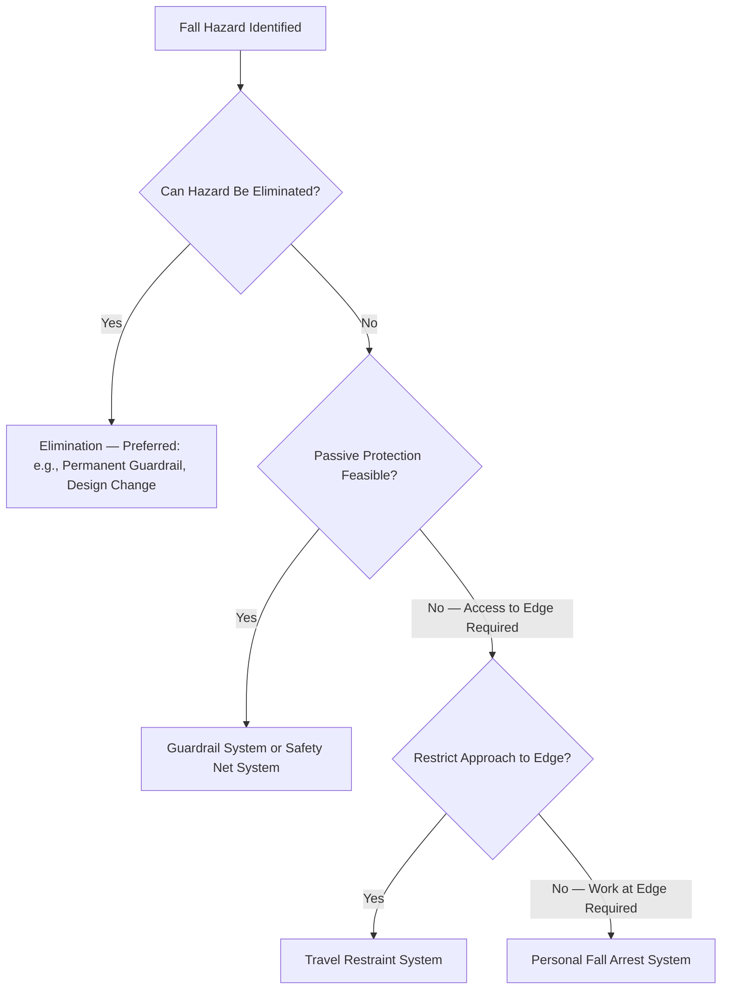

## Walking and Working Surfaces

### Overview and Regulatory Basis

Walking and Working Surfaces is a foundational occupational safety topic governed primarily by **29 CFR 1910 Subpart D** (General Industry) and, for construction-related activity, **29 CFR 1926 Subpart M** (Fall Protection). Unlike the PSM-specific content addressed elsewhere in this curriculum, Walking and Working Surfaces requirements apply broadly across virtually all workplaces regardless of whether the facility is PSM-covered, addressing the hazards of slips, trips, and falls — among the most consistently significant contributors to workplace injury and fatality across general industry, including at PSM-covered facilities where process-specific hazards can overshadow attention to these more common occupational hazards.

OSHA substantially revised Subpart D in 2016 (effective January 2017), updating requirements that had been largely unchanged since 1971, to reflect modern fall protection technology and to align more closely with construction industry fall protection provisions. Practitioners should be aware that walking-working-surfaces requirements reflect this modernized standard rather than older, less rigorous provisions that may still be referenced in outdated training materials.

### Scope and Key Definitions

| Term | Definition |
| --- | --- |
| Walking-Working Surface | Any horizontal or vertical surface on or through which an employee walks, works, or gains access to a work area or workplace location |
| Unprotected Sides and Edges | A side or edge of a walking-working surface where there is no wall or guardrail system at least 39 inches high |
| Low-Slope Roof | A roof with a slope less than or equal to 4 in 12 (vertical to horizontal) |
| Leading Edge | The edge of a floor, roof, or formwork that changes location as additional floor, roof, or formwork sections are placed, formed, or constructed |
| Fall Hazard | Any condition on a walking-working surface that exposes an employee to a risk of harm from a fall on the same level or to a lower level |
| Fall Protection | Any equipment, device, or system that prevents a worker from falling or mitigates the effect of a fall |

### General Requirements for All Walking-Working Surfaces

| Requirement Category | Specific Provisions |
| --- | --- |
| Surface Condition | Surfaces must be maintained free of hazards such as sharp/protruding objects, loose boards, corrosion, spills, and other recognized hazards; surfaces must be kept clean and, to the extent feasible, dry |
| Load Capacity | Each walking-working surface must be able to support the maximum intended load for that surface |
| Inspection | Employers must inspect surfaces regularly and as necessary to ensure they are maintained in a safe condition |
| Drainage | Surfaces subject to accumulation of water or other liquids must be constructed with sufficient slope or drainage to prevent accumulation |

### Fall Protection Requirements by Height and Hazard Type

Fall protection requirements are structured around trigger heights and specific hazard scenarios, with general industry thresholds generally set at 4 feet, distinct from the construction industry's 6-foot general threshold:

| Scenario | Fall Protection Trigger Height (General Industry) | Required Protection Type |
| --- | --- | --- |
| Unprotected sides/edges, general walking-working surface | 4 feet or more above a lower level | Guardrail system, safety net system, travel restraint system, or personal fall arrest system |
| Hoist areas | Any height with a fall hazard | Guardrail system, or personal fall arrest/travel restraint system if guardrail removal is necessary for hoisting operations |
| Holes (including skylights) | 4 feet or more | Cover, guardrail system, or personal fall arrest/travel restraint system |
| Runways and similar walkways | 4 feet or more | Guardrail system (or equivalent) on all open sides |
| Dangerous equipment areas (regardless of height) | Any height with fall hazard where fall would land on dangerous equipment | Guardrail system or travel restraint system, regardless of the 4-foot general threshold |
| Walking-working surfaces not otherwise addressed, including low-slope roofs | 4 feet or more | Guardrail, safety net, travel restraint, or personal fall arrest system |
| Outdoor advertising | 4 feet or more | Personal fall protection system |

The "dangerous equipment" provision is a notable exception to the general height threshold — fall protection is required regardless of fall distance where a fall would result in contact with dangerous equipment, reflecting that consequence severity, not solely fall distance, drives the protection requirement in that specific scenario.

### Fall Protection System Types

| System Type | Description | Hierarchy Position |
| --- | --- | --- |
| Guardrail System | Passive barrier (top rail, mid rail, toeboard where applicable) preventing approach to an unprotected edge | Preferred — passive, does not depend on worker action |
| Safety Net System | Net positioned to catch a falling worker, arresting the fall | Passive, used where guardrails are impractical |
| Travel Restraint System | Body harness/lanyard system configured to physically prevent the worker from reaching the fall hazard zone | Prevents the fall from being possible, rather than arresting an occurring fall |
| Personal Fall Arrest System (PFAS) | Full body harness, connecting device (lanyard/lifeline), and anchorage designed to stop a fall in progress and limit arrest forces | Last resort within this hierarchy — depends on correct worker use and does not prevent the fall itself, only arrests it |
| Positioning System | Body harness system allowing a worker to be supported on an elevated surface while working with hands free | Used for specific work positioning scenarios (e.g., work on a vertical surface), not a substitute for fall arrest where a free fall hazard exists |

This ordering reflects the same hierarchy-of-controls logic applied elsewhere in occupational safety and process safety practice (as addressed under Job Hazard Analysis): passive, engineering-level controls (guardrails, elimination through design) are preferred over controls dependent on correct individual worker equipment use and behavior (personal fall arrest).

### Personal Fall Arrest System Components and Requirements

| Component | Key Requirements |
| --- | --- |
| Full Body Harness | Must be used (body belts alone are prohibited as fall arrest equipment under current standards) |
| Connecting Device | Lanyard, self-retracting lifeline, or vertical/horizontal lifeline appropriate to the specific work scenario |
| Anchorage | Must be capable of supporting the required load per system design, independent of any anchorage used for other purposes (e.g., not shared with a hoisting system without specific engineering justification) |
| Maximum Arresting Force | System design must limit arresting forces on the worker's body to specified maximum values to prevent arrest-induced injury |
| Free Fall Distance | System must be configured to limit free fall distance before arrest engages |
| Swing Fall Hazard | Anchorage positioning must account for and minimize pendulum/swing fall hazard during an arrest event |

### Ladders

Subpart D includes specific provisions for fixed and portable ladders, a common walking-working-surface hazard category warranting distinct attention:

| Ladder Type | Key Requirements |
| --- | --- |
| Portable Ladders | Proper angle/pitch (typically expressed per manufacturer specification, commonly around a 4:1 ratio for extension ladders), secure footing, extension above the landing surface where used for access, load capacity rating appropriate to intended use and user weight including equipment/tools |
| Fixed Ladders | Ladders over 24 feet require fall protection (a change from prior cage-based requirements, with the 2016 revision phasing out cages/wells as an acceptable stand-alone fall protection method in favor of personal fall arrest or ladder safety systems, subject to a compliance phase-in schedule established at the time of the rule change) |
| Ladder Inspection | Regular inspection for structural damage, defects, and general condition prior to use |

[Inference — specific ladder safety system phase-in deadlines and any subsequent regulatory updates should be verified against current OSHA guidance, as compliance transition schedules established at the time of the 2016 rule revision may affect current applicability depending on the specific facility's ladder inventory and installation dates.]

### Floor and Wall Openings, Holes

| Hazard Type | Required Protection |
| --- | --- |
| Floor Holes (where a person could fall through) | Cover capable of supporting maximum intended load, or guardrail system, or personal fall arrest/travel restraint system |
| Wall Openings | Guardrail, gate, or other barrier where a fall hazard to a lower level exists |
| Skylights | Treated as holes requiring cover or guardrail protection, given historical incident frequency associated with unprotected or inadequately marked skylights |

### Designated Areas and Alternative Compliance for Low-Slope Roof Work

For infrequent, short-duration work on low-slope roofs, the standard permits use of a designated area (a defined, marked area away from unprotected edges) in combination with a warning line system as an alternative to conventional fall protection, subject to specific conditions on work frequency, duration, and distance from the unprotected edge — this reflects a risk-based accommodation for specific, limited-exposure scenarios rather than a general exception to fall protection requirements.

### Training Requirements

| Training Requirement | Scope |
| --- | --- |
| Fall Hazard Recognition | Employees must be trained to recognize fall hazards in their work area |
| Fall Protection System Use | Employees required to use personal fall protection equipment must be trained in proper selection, inspection, use, and maintenance of that equipment |
| Retraining Triggers | Changes in the workplace, fall protection systems, or evidence that an employee's knowledge/skill is inadequate trigger retraining requirements |
| Ladder and Stairway-Specific Training | Employees using ladders and stairways must receive training on associated hazards |

### Intersection with Process Safety Practice

While Walking and Working Surfaces is a general occupational safety topic rather than a PSM-specific element, its intersection with process safety practice is significant at PSM-covered facilities, where elevated platforms, structural steel, piping racks, and vessel access commonly present walking-working-surface hazards concurrent with process hazards:

| Intersection Point | Consideration |
| --- | --- |
| Job Hazard Analysis for elevated process work | JHA/TRA for tasks performed on elevated platforms or structures should explicitly address fall hazards alongside process-specific hazards, rather than treating fall protection as a separate, unrelated compliance category |
| Permit-to-Work integration | Work at height in process areas often requires coordination between fall protection requirements and process-specific permits (e.g., hot work at height, confined space access via elevated entry points) |
| Contractor oversight | Fall protection compliance is a common focus of contractor field oversight, given the frequency of elevated work during turnarounds and maintenance activity |
| Emergency egress from elevated process areas | Walking-working-surface design and maintenance affects emergency evacuation capability from elevated process structures, connecting to emergency action plan considerations addressed elsewhere in this curriculum |

### Common Compliance Gaps

- **Outdated fall protection system reliance**: Continued reliance on cage-based fixed ladder protection or body-belt-based systems that do not meet current standard requirements following the 2016 revision
- **Housekeeping-related slip/trip hazards treated as lower priority than fall-from-height hazards**: Same-level slip and trip hazards (spills, clutter, uneven surfaces) statistically contribute significantly to injury incidence yet often receive less programmatic attention than elevated fall protection
- **Designated area/warning line system misapplication**: Using the low-slope roof designated area exception for work that does not meet the specific frequency/duration/distance conditions permitting this alternative compliance approach
- **Inadequate anchorage verification**: Personal fall arrest system anchorage points not verified for adequate load capacity independent of other equipment use, or improvised anchorage not engineered for fall arrest loading
- **Training not scenario-specific**: General fall protection training that does not address the facility's actual specific walking-working-surface configurations and equipment

**Related Topics**

- Job Hazard Analysis and Task Risk Assessment
- Personal Protective Equipment Selection and Use
- Permit-to-Work System Design and Governance
- Confined Space Entry Program Requirements
- Emergency Action Plan Development and Communication
- Contractor Orientation and Site-Specific Training
- Hierarchy of Controls in Occupational Safety Practice
- Ladder and Scaffold Safety Programs