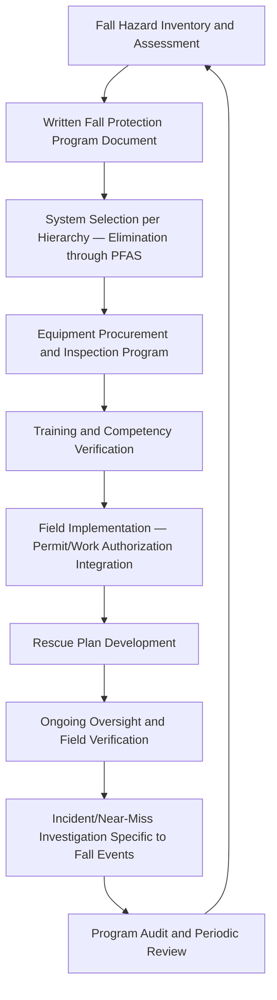
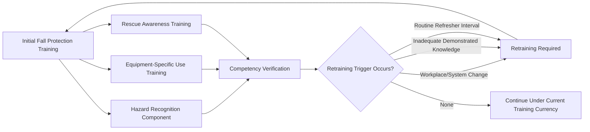

## Fall Protection Programs

### Overview and Distinction from Walking-Working Surfaces Requirements

A Fall Protection Program is the organizational management system through which an employer implements, sustains, and continuously verifies compliance with fall protection requirements across the facility — as distinct from Walking and Working Surfaces (29 CFR 1910 Subpart D), which establishes the specific technical and regulatory requirements the program is designed to satisfy. Where the prior topic addressed *what* the regulation requires (trigger heights, system types, specific provisions), this topic addresses *how* an organization builds and sustains a functioning program that reliably achieves that compliance across a facility's full range of elevated work scenarios, personnel, and equipment over time.

This distinction mirrors a pattern seen elsewhere in this curriculum — for example, the relationship between Walking-Working Surfaces requirements and a Fall Protection Program parallels the relationship between JHA/TRA technical methodology and the organizational processes (training, oversight, audit) that sustain it in practice. A facility can have technically correct fall protection equipment and documented procedures while still carrying significant residual risk if the program lacks the organizational infrastructure — training currency, equipment inspection discipline, hazard identification processes, and management oversight — to ensure those requirements are consistently met across every relevant work scenario, shift, and individual.

### Program Architecture

### Fall Hazard Inventory and Assessment

The foundation of an effective program is a comprehensive, facility-specific inventory of fall hazard locations and scenarios, developed rather than assumed generic — since the specific configuration of platforms, roof access points, vessel manways, piping racks, and other elevated work areas varies substantially by facility.

| Inventory Component | Purpose |
| --- | --- |
| Physical location mapping of all fall hazard areas (unprotected edges, holes, skylights, leading edges) | Establishes the complete scope the program must address, rather than relying on ad hoc identification during individual work planning |
| Task-based fall hazard assessment | Identifies fall hazards associated with specific recurring tasks (e.g., vessel top access, structural steel inspection), complementing location-based inventory |
| Frequency and duration of exposure by location/task | Informs system selection — infrequent, short-duration exposure may warrant different control selection than frequent, extended exposure at the same location |
| Cross-reference with JHA/TRA program | Ensures fall hazards identified during task-specific JHA development feed into the facility-wide fall hazard inventory, rather than existing as isolated, task-specific findings |

### Written Program Documentation

A written fall protection program is standard practice (and often an explicit audit expectation, even where not always a literal per-provision regulatory text requirement) documenting the facility's specific approach:

**Example**

**Fall Protection Program Document — Typical Sections:**

1. **Purpose and Scope** — Facility areas and personnel covered
2. **Roles and Responsibilities** — Program administrator, supervisors, competent person designation, employee responsibilities
3. **Fall Hazard Identification and Assessment Methodology**
4. **Fall Protection System Selection Criteria** — Hierarchy application specific to facility hazard types
5. **Equipment Specifications and Approved Equipment List**
6. **Inspection Requirements and Schedule** — Pre-use, periodic, and post-incident inspection criteria
7. **Training Requirements** — Initial, refresher, and retraining triggers
8. **Rescue Plan** — Procedures for prompt rescue following a fall arrest event
9. **Incident Reporting and Investigation Procedures Specific to Fall Events**
10. **Program Review and Audit Schedule**

### The "Competent Person" Designation

Fall protection regulatory framework (particularly as it intersects with construction-adjacent activity under 1926 Subpart M, and as a widely adopted general industry best practice under Subpart D as well) relies substantially on a designated **competent person** — an individual capable of identifying existing and predictable fall hazards and who has authority to take prompt corrective measures to eliminate them.

| Competent Person Responsibility | Application |
| --- | --- |
| Fall hazard identification at specific work locations prior to task commencement | Confirms site-specific conditions match the assumptions underlying the pre-selected fall protection system |
| Authority to halt work if conditions present unaddressed fall hazard | Functions as a specific application of the broader stop-work authority principle addressed under Safety Culture |
| Inspection of fall protection equipment and systems | May overlap with, but is distinct from, general equipment inspection requirements applicable to all users |
| Training and evaluation qualification | Competent person designation itself requires documented training/experience sufficient to support the designation, and should not be assumed based on general seniority alone |

A program that names a competent person without documenting the specific training and experience basis for that designation, or that assigns the role without corresponding authority to actually halt work, satisfies the designation nominally without the substantive function the designation is intended to provide.

### Equipment Program — Selection, Inspection, and Maintenance

| Program Element | Requirements |
| --- | --- |
| Approved Equipment List | Facility-specific list of approved harnesses, lanyards, anchorage connectors, and related equipment, reducing risk of incompatible or non-conforming equipment entering use |
| Pre-Use Inspection | Documented pre-use inspection requirement for each use, distinct from periodic formal inspection |
| Periodic Formal Inspection | Scheduled, more thorough inspection (frequency per manufacturer specification and facility program requirement) with documented records |
| Post-Fall-Event Inspection and Removal from Service | Any equipment involved in an actual fall arrest event must be immediately removed from service pending inspection/replacement — arrest forces can compromise equipment integrity even without visible damage |
| Storage and Environmental Protection | Proper storage protecting equipment from UV exposure, chemical exposure, and physical damage that could degrade material integrity over time |
| Manufacturer Specification Compliance | Equipment use, inspection intervals, and service life limits per manufacturer specification, since fall protection equipment carries specific engineered performance characteristics not universally interchangeable across products |

### Training Program Structure

| Training Component | Content |
| --- | --- |
| Hazard Recognition | Facility-specific fall hazard locations and scenarios, connecting to the fall hazard inventory |
| Equipment-Specific Use | Correct donning, inspection, and use of the specific harness, lanyard, and anchorage systems approved for facility use |
| System Selection Understanding | Why specific systems (guardrail vs. travel restraint vs. PFAS) are used in specific locations, supporting genuine comprehension rather than rote equipment operation |
| Rescue Awareness | Employee understanding of the facility rescue plan and their role in it, distinct from formal rescue team training for designated rescue personnel |
| Anchorage Point Identification | Training on approved anchorage point identification/use, given that improvised or unengineered anchorage selection is a recurring fall protection program failure point |

Consistent with the competency-versus-completion distinction addressed under PSSR training confirmation elsewhere in this curriculum, fall protection training verification should extend beyond attendance to demonstrated competency — particularly given that incorrect equipment use (e.g., improper anchorage point selection, incorrect harness fit) can render a technically compliant fall arrest system ineffective in an actual fall event.

### Rescue Planning — A Frequently Underdeveloped Program Element

A fall protection program addressing prevention and arrest without a corresponding rescue plan is incomplete: a worker suspended in a harness following a fall arrest faces a distinct and time-sensitive hazard — **suspension trauma** (orthostatic intolerance resulting from prolonged harness suspension) — that requires prompt rescue, not merely eventual rescue.

| Rescue Plan Element | Consideration |
| --- | --- |
| Rescue Method Selection | Self-rescue capability, assisted rescue by trained on-site personnel, or reliance on external emergency response, selected based on realistic response time assessment |
| Response Time Adequacy | Rescue plan must account for the time-critical nature of suspension trauma risk; reliance on external emergency response alone may not meet necessary response time in all facility configurations |
| Rescue Equipment Pre-Positioning | Equipment (e.g., descent devices, rescue kits) located and accessible at or near locations with elevated fall risk, rather than centrally stored at a distance |
| Rescue Personnel Training and Drill Practice | Designated rescue-capable personnel trained specifically in rescue technique, with periodic practical drills rather than training reliant solely on initial certification |

A program that specifies fall arrest equipment and procedures without a correspondingly developed and drilled rescue capability satisfies the prevention/arrest dimension of fall protection while leaving a significant gap in the post-arrest response dimension — a gap that is frequently under-assessed relative to its consequence potential.

### Program Oversight and Verification

Consistent with the broader oversight and audit principles addressed elsewhere in this curriculum (contractor oversight, internal audit methodology), a fall protection program requires active field verification, not solely documentation review:

| Verification Method | What It Confirms |
| --- | --- |
| Field observation of actual fall protection use during elevated work | Confirms equipment is correctly selected, worn, and anchored in practice, not solely available |
| Equipment inspection record audit | Confirms pre-use and periodic inspection discipline is actually being followed |
| Competent person designation and activity verification | Confirms the competent person role is substantively functioning, not merely nominally assigned |
| Incident/near-miss trend review specific to fall-related events | Identifies recurring location, task, or equipment patterns warranting program-level correction |
| Cross-check against JHA and permit-to-work records for elevated work | Confirms fall protection planning is genuinely integrated into task planning, not treated as a separate, disconnected compliance category |

### Integration with Contractor Management

Given the frequency of elevated work performed by contractors — particularly during turnarounds involving structural, piping, and vessel access work — fall protection program requirements should be explicitly integrated into the contractor safety management lifecycle addressed elsewhere in this curriculum:

| Contractor Lifecycle Stage | Fall Protection Integration |
| --- | --- |
| Prequalification | Verification of contractor's own fall protection program and relevant training/certification currency |
| Orientation | Site-specific fall hazard communication and approved anchorage point/equipment briefing |
| Oversight | Field verification of contractor fall protection compliance during active work, with defined stop-work authority for observed non-compliance |
| Performance Evaluation | Fall protection compliance history as an input to contractor performance scoring |

### Common Program Failure Modes

- **Equipment-focused program without hazard inventory foundation**: Procuring and training on fall protection equipment without a systematic facility-wide hazard inventory driving where and how that equipment is actually deployed
- **Rescue plan absent or undrilled**: Fall arrest capability addressed without corresponding, practically drilled rescue capability, leaving significant time-critical post-arrest risk
- **Competent person designation without substantive authority or documented qualification basis**: Nominal designation that does not correspond to genuine hazard-identification capability or stop-work authority
- **Training completion without competency verification**: Attendance-based training sign-off without confirming actual correct equipment use understanding, particularly for anchorage point selection
- **Improvised anchorage use**: Field personnel using convenient but unengineered anchorage points (piping, structural members not rated for fall arrest loading) due to inadequate approved anchorage point availability or communication
- **Contractor fall protection oversight gap**: General contractor safety oversight without specific, elevated attention to fall protection compliance during high-frequency elevated work periods (e.g., turnarounds)

### Integration with the Broader Occupational Safety and PSM Program

Fall Protection Programs function as a specific application of the broader risk management, training, and oversight principles addressed throughout this curriculum — hazard inventory methodology parallels JHA/TRA practice, training verification parallels PSSR competency confirmation principles, and program audit/oversight parallels the internal audit and contractor oversight functions addressed in their respective chapters. At PSM-covered facilities specifically, fall protection risk frequently intersects directly with process safety risk (elevated work near process equipment, vessel top access, structural work during turnarounds), making integration between the fall protection program and process safety management functions — rather than parallel, disconnected program tracks — an important design consideration for comprehensive facility risk management.

**Related Topics**

- Walking and Working Surfaces
- Job Hazard Analysis and Task Risk Assessment
- Contractor Prequalification and Selection
- Oversight of Contractor Work Activities
- Emergency Action Plan Development and Communication
- Permit-to-Work System Design and Governance
- Stop Work Authority Program Design
- Turnaround and Shutdown Contractor Management