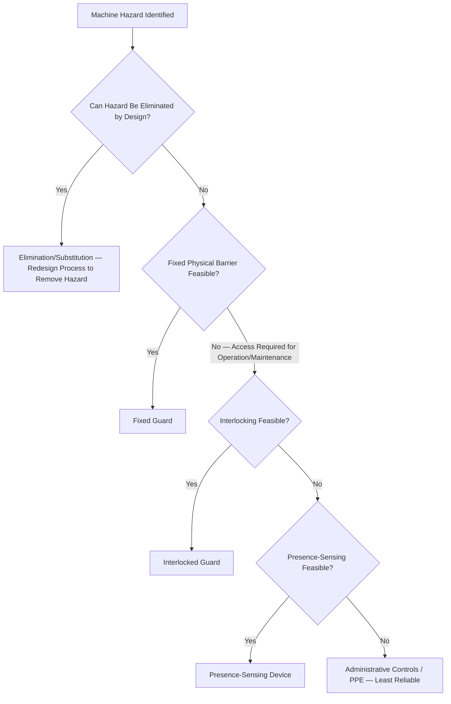
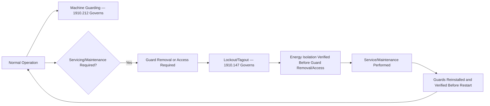

## Machine Guarding

### Overview and Regulatory Basis

Machine Guarding is a foundational occupational safety topic governed primarily by **29 CFR 1910 Subpart O** (Machinery and Machine Guarding), addressing the hazards presented by mechanical motion — rotating, reciprocating, transversing, and cutting/shearing action — at the point of operation and along power transmission apparatus. The core general requirement is codified at **29 CFR 1910.212**, which establishes that one or more methods of machine guarding must be provided to protect operators and other employees from hazards created by point of operation, ingoing nip points, rotating parts, flying chips, and sparks.

Like Walking and Working Surfaces, Machine Guarding applies broadly across general industry regardless of PSM coverage status, and is among the most frequently cited OSHA general industry standards, reflecting both the prevalence of mechanical equipment across virtually all industrial workplaces and the severity of injuries (amputation, crushing, laceration) that inadequate guarding can produce.

### Core Regulatory Requirement — 1910.212

**29 CFR 1910.212(a)(1)** establishes the general performance requirement: machine guards must be affixed to the machine where possible and secured elsewhere if for any reason attachment to the machine is not possible. The guard must prevent the operator from having any part of their body in the danger zone during the operating cycle.

| Sub-Provision | Requirement |
| --- | --- |
| 1910.212(a)(2) | Guards must not create additional hazards (e.g., a guard with sharp edges, pinch points, or splinters) |
| 1910.212(a)(3) | Guards must not create an interference hazard (obstructing the operator's view or creating awkward operating conditions that themselves introduce risk) |
| 1910.212(a)(3)(ii) | Point of operation guarding — specifically requires that the point of operation of machines whose operation exposes an employee to injury be guarded |
| 1910.212(a)(4) | Revolving barrels, containers, and drums must be effectively guarded by an enclosure interlocked with the drive mechanism |
| 1910.212(a)(5) | Guards must, where possible, be designed so as not to interfere with lubrication of points requiring regular service |

### Hazard Categories Addressed by Machine Guarding

Machine guarding addresses distinct mechanical hazard types, each requiring guarding approaches suited to the specific motion or action involved:

| Hazard Type | Description | Example Equipment |
| --- | --- | --- |
| Point of Operation | The specific location where work is performed on material (cutting, shaping, boring, forming) | Press brakes, saws, shears, punch presses |
| Power Transmission Apparatus | Components transmitting energy between the power source and the point of operation | Flywheels, pulleys, belts, chains, gears, couplings, cams |
| Ingoing Nip Points | Points where two parts move toward each other, or one part moves toward a stationary part, creating a pinch/crush hazard | Rollers, belt drives, conveyor systems |
| Rotating Parts | Hazards from rotating shafts, spindles, or similar components, including entanglement risk from loose clothing or hair | Rotating shafts, couplings, spindles |
| Flying Debris | Chips, sparks, or ejected material generated during the machining or cutting process | Grinding wheels, machining operations |

### The Hierarchy of Machine Guarding Methods

Consistent with the broader hierarchy of controls principle applied throughout occupational and process safety practice, machine guarding methods can be organized by their inherent reliability, from passive/engineered protection toward methods more dependent on correct implementation and use:

| Guard Type | Description | Reliability Characteristics |
| --- | --- | --- |
| Fixed Guard | A permanent, physical barrier providing enclosure at the point of operation or hazard area | Highest reliability — no dependence on operator action; used wherever feasible given the operation's access requirements |
| Interlocked Guard | A guard connected to the machine's control system such that the machine cannot operate unless the guard is in place/closed | High reliability — engineered dependency prevents operation without guard closure, though depends on interlock system integrity and cannot be defeated |
| Adjustable Guard | A guard that can be adjusted to accommodate various sizes of stock or material while still providing protection | Moderate reliability — depends on correct adjustment for the specific operation |
| Self-Adjusting Guard | A guard that automatically adjusts to the passage of material through the point of operation, returning to protective position | Moderate reliability — mechanical self-adjustment reduces (but does not eliminate) dependence on operator action |
| Presence-Sensing Device | Devices (e.g., light curtains, presence-sensing mats) that stop the machine or prevent cycle initiation when a body part is detected in the hazard zone | Relies on correctly functioning sensing technology and proper zone configuration |
| Two-Hand Control/Trip Devices | Requires simultaneous use of both hands (positioned away from the hazard zone) to initiate machine cycle | Depends on correct device engineering to prevent defeat (e.g., tie-down of one control) and does not protect other personnel in the area |
| Administrative Controls/PPE | Procedures, training, and PPE as a supplementary or last-resort layer | Lowest reliability within this hierarchy — most dependent on consistent human behavior |

Fixed and interlocked guards are strongly preferred wherever operationally feasible, consistent with the broader hierarchy-of-controls principle that engineering controls not dependent on correct human action or behavior provide more reliable protection than controls requiring consistent correct use.

### Point of Operation Guarding — Specific Requirements

Point of operation guarding receives particular regulatory emphasis given that this is where the actual work (and therefore actual injury exposure) occurs. **1910.212(a)(3)(ii)** specifically requires guarding methods that:

- Prevent the operator's hands from entering the danger zone during the operating cycle
- Are constructed to withstand normal operating stresses and the hazards of the specific operation
- Do not offer an accident hazard themselves

Certain machine types have historically received additional specific point-of-operation guarding standards beyond the general 1910.212 requirement, reflecting particularly high injury severity or frequency associated with those machine types:

| Machine Type | Specific Standard |
| --- | --- |
| Mechanical Power Presses | 29 CFR 1910.217 |
| Power Press Brakes | Addressed within 1910.212 general requirements, with industry consensus standards (ANSI B11 series) commonly referenced for specific guarding configuration |
| Woodworking Machinery | 29 CFR 1910.213 |
| Abrasive Wheel Machinery (Grinders) | 29 CFR 1910.215 |
| Mills and Calenders in the Rubber and Plastics Industries | 29 CFR 1910.216 |

### Lockout/Tagout Interface — Servicing and Maintenance

Machine guarding addresses hazards during normal operation; servicing and maintenance activities requiring guard removal or machine access introduce a distinct hazard category governed by **29 CFR 1910.147** (Control of Hazardous Energy — Lockout/Tagout). The interface between these two standards is a frequent point of both regulatory citation and actual injury:

A recurring and consequential failure pattern is performing minor adjustment, clearing, or troubleshooting activity with a guard removed or bypassed without corresponding energy isolation — treating the activity as "too brief" or "too minor" to warrant full LOTO procedure. OSHA's minor servicing exception under 1910.147 is narrowly defined and does not broadly exempt guard-removed operation; practitioners should verify the specific, limited conditions under which this exception applies rather than assuming routine guard bypass for brief tasks is categorically permitted.

### Guard Defeat and Bypass — A Recurring Compliance Failure Pattern

A machine guard that is technically compliant as installed but subsequently defeated, removed, or bypassed during actual operation provides no protective value despite formal compliance at installation. This failure pattern warrants specific programmatic attention distinct from initial guard design and installation:

| Defeat/Bypass Driver | Underlying Cause |
| --- | --- |
| Production rate pressure | Guard perceived as slowing cycle time, creating incentive to defeat or work around it |
| Guard design creates operational difficulty | Poorly designed guards that genuinely interfere with efficient, correct operation increase defeat likelihood — reinforcing the 1910.212(a)(3) prohibition on guards creating interference hazards |
| Inadequate maintenance of guard/interlock function | A guard or interlock that has degraded over time (e.g., an interlock switch that no longer functions correctly) may be worked around rather than repaired if the underlying maintenance gap is not identified |
| Normalization of deviation | Consistent with the broader normalization of deviation pattern addressed under organizational factors, an initially recognized guard bypass can become accepted informal practice over time if not corrected |

| Detection and Prevention Mechanism | Application |
| --- | --- |
| Field observation specifically checking guard presence and function during operation | Distinct from documentation review confirming guards were installed as designed |
| Interlock function testing as part of preventive maintenance | Ensures interlocks remain functionally effective, not merely physically present |
| Incident/near-miss investigation explicitly examining guard status at time of event | Determines whether an incident involved a guard defeat/bypass, informing whether the root cause is guard design, maintenance, or behavioral/cultural |
| BBS or equivalent structured observation programs including guard-status checklist items | Provides systematic, aggregated data on guard compliance rather than relying solely on incident-triggered discovery |

### Machine Guarding Training

| Training Element | Content |
| --- | --- |
| Hazard Recognition | Specific mechanical hazards associated with the machinery an employee operates or works near |
| Guard Function and Purpose | Understanding of why specific guards exist, supporting genuine compliance rather than perceived arbitrary obstruction (connecting to the organizational memory/rationale documentation principle addressed under organizational factors) |
| Prohibition on Guard Removal/Defeat | Explicit training that guard removal or defeat is prohibited outside authorized, energy-isolated servicing per LOTO procedure |
| Reporting of Damaged or Malfunctioning Guards | Clear expectation and non-punitive pathway (consistent with Just Culture principles) for reporting guard damage or malfunction rather than continuing operation with a known deficient guard |

### Integration with Broader Safety and PSM Program

While Machine Guarding is a general occupational safety topic applicable regardless of PSM coverage, it intersects meaningfully with process safety practice at PSM-covered facilities where mechanical equipment (pumps, compressors, mixers, conveyors) operates in or adjacent to process areas:

| Intersection Point | Consideration |
| --- | --- |
| Job Hazard Analysis for mechanical equipment tasks | JHA/TRA for tasks involving mechanical equipment should explicitly address mechanical hazards (guarding status, nip points, rotating parts) alongside any process-specific hazards present |
| Mechanical Integrity program overlap | Equipment inspection under MI programs may extend to guard condition and interlock function verification for mechanical equipment integrated with or adjacent to covered processes |
| Contractor oversight | Machine guarding compliance is a common field oversight focus for contractors performing mechanical maintenance, given the immediate and severe injury potential of guarding deficiencies |
| Management of Change | Equipment modifications affecting guarding configuration should be routed through MOC review to confirm continued adequate guarding following the change |

### Common Compliance Gaps

- **Guards present at installation but degraded or defeated over time**: Initial compliance not sustained through ongoing verification, particularly for interlock systems whose functional degradation may not be visually apparent
- **Guard-removal treated as acceptable for "quick" adjustments or troubleshooting**: Bypassing proper LOTO procedure for brief guard-removed access based on perceived task brevity rather than documented minor servicing exception criteria
- **Guard design creating operational interference, incentivizing defeat**: Guards that technically satisfy point-of-operation protection requirements while genuinely impeding efficient correct operation, increasing the likelihood of eventual bypass
- **Training focused on general awareness rather than machine-specific hazard and guard function understanding**: Generic machine guarding training not tied to the specific equipment and guard configurations an employee actually operates near
- **No systematic field verification of guard status**: Reliance on installation-time documentation without ongoing, systematic field observation confirming guards remain in place and functional during actual operation

**Related Topics**

- Job Hazard Analysis and Task Risk Assessment
- Lockout/Tagout — Control of Hazardous Energy (1910.147)
- Mechanical Integrity Program Requirements (1910.119(j))
- Management of Change Procedures
- Behavior Based Safety Programs
- Just Culture and Non-Punitive Reporting
- Normalization of Deviation — Detection and Prevention
- Contractor Oversight for Mechanical Maintenance Activities