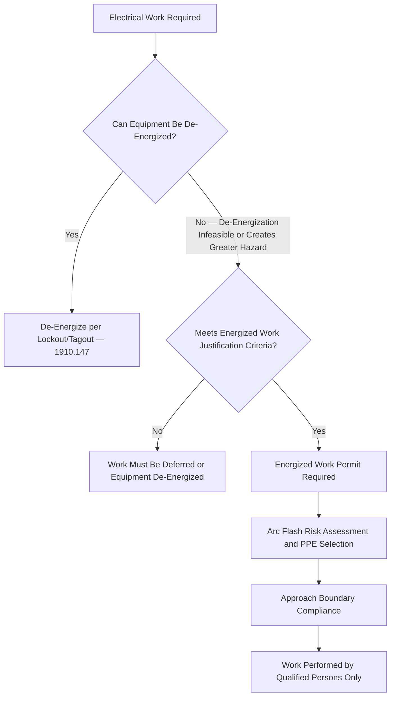

## Electrical Safety and NFPA 70E

### Overview and Regulatory/Standards Basis

Electrical Safety is a foundational occupational safety topic governed by a combination of OSHA regulatory requirements — principally **29 CFR 1910 Subpart S** (Electrical), covering both design safety standards (1910.302–1910.308) and safety-related work practices (1910.331–1910.335) — and the industry consensus standard **NFPA 70E, Standard for Electrical Safety in the Workplace**. This dual-basis structure is important to understand: OSHA's electrical regulations establish enforceable legal requirements, while NFPA 70E provides the detailed, technically specific methodology (arc flash calculation, PPE selection tables, energized work permit criteria) that OSHA compliance officers and industry practitioners widely rely upon as the recognized means of achieving compliance with OSHA's more general performance-based electrical safety provisions — functioning analogously to the role industry consensus standards play in General Duty Clause enforcement discussed elsewhere in this curriculum.

### OSHA Electrical Standards Structure

| Standard Category | Regulatory Citation | Scope |
| --- | --- | --- |
| Design Safety Standards | 1910.302–1910.308 | Requirements for electrical equipment and installations (wiring methods, equipment for general use, hazardous locations, special systems) |
| Safety-Related Work Practices | 1910.331–1910.335 | Requirements governing work performed on or near electrical equipment, including qualified/unqualified person distinctions, energized work limitations, and PPE |
| Safety-Related Maintenance Requirements | 1910.334 (within work practices) | Requirements for maintaining electrical equipment and installations in a safe condition |

The Safety-Related Work Practices subpart (1910.331–1910.335) is the section most directly relevant to day-to-day electrical safety program design, as it governs how work is actually performed around electrical hazards rather than solely how equipment must be designed and installed.

### Core Hazard Categories

| Hazard Type | Description |
| --- | --- |
| Electric Shock | Current passing through the body, with severity dependent on current magnitude, path, and duration; can cause burns, cardiac arrest, and death even at relatively low current levels |
| Arc Flash | A rapid release of energy caused by an electrical arc, producing extreme heat (temperatures that can exceed the surface of the sun), intense light, and pressure wave effects, capable of causing severe burns and other trauma even without direct contact with energized parts |
| Arc Blast | The explosive pressure wave and molten metal expulsion accompanying a significant arc flash event, capable of causing physical trauma, hearing damage, and projectile injury |
| Electrocution | Death resulting from electric shock |

Arc flash hazard, in particular, has received substantially increased regulatory and industry attention over recent decades as understanding of its severity — independent of direct electrical contact — has developed, making NFPA 70E's arc flash risk assessment methodology a central component of modern electrical safety programs.

### Qualified vs. Unqualified Persons — A Foundational Distinction

OSHA's electrical work practice standards, and NFPA 70E correspondingly, establish a foundational distinction determining what electrical work an individual may perform:

| Classification | Definition | Permitted Activity |
| --- | --- | --- |
| Qualified Person | An individual who has demonstrated skills and knowledge related to the construction and operation of electrical equipment and installations, and has received safety training on the hazards involved | May perform work on or near exposed energized parts, subject to additional specific requirements (PPE, energized work justification, etc.) |
| Unqualified Person | An individual who does not meet the qualified person criteria | Prohibited from working on or near exposed energized electrical parts; must maintain defined approach boundaries |

Qualification is task and equipment-specific, not a blanket organizational designation — an individual qualified to perform work on one class or voltage of electrical equipment is not automatically qualified for other equipment types without corresponding training and demonstrated competency for that specific equipment.

### The Energized Work Prohibition and Justification Requirement

A central principle of both OSHA electrical work practice requirements and NFPA 70E is a strong presumption against working on energized electrical equipment — **de-energization is the required default**, with energized work permitted only where specific justification criteria are met:

Recognized justifications for energized work generally fall into narrow categories such as: de-energization introducing additional or increased hazard (e.g., shutting down ventilation or life-safety systems), or infeasibility due to equipment design or operational constraints (e.g., diagnostic testing that can only be performed with the circuit energized). Energized work is not justified merely by production inconvenience, schedule pressure, or the cost of de-energization and re-energization — a common and significant compliance failure pattern involves energized work performed for reasons of convenience or schedule that do not meet the genuine justification threshold.

### Energized Work Permit

Where energized work is justified, both OSHA guidance and NFPA 70E methodology call for a formal energized work permit process — conceptually parallel to other permit-to-work systems addressed elsewhere in this curriculum (hot work, confined space), applying a structured authorization and risk-control process specifically to energized electrical work:

**Example**

**Energized Work Permit — Typical Content:**

1. Specific justification for why the work must be performed energized (de-energization infeasibility or increased hazard rationale)
2. Description of the specific work to be performed
3. Results of the arc flash and shock risk assessment for the specific equipment and task
4. Required PPE, tools, and equipment specified based on the risk assessment
5. Boundary requirements (limited approach, restricted approach, arc flash boundary) and how they will be maintained
6. Qualified person(s) authorized to perform the work
7. Authorizing signature confirming justification review and approval prior to work commencement

### Shock Protection Boundaries

NFPA 70E establishes defined approach boundaries around exposed energized electrical conductors or circuit parts, calibrated to voltage level, within which specific protective requirements apply:

| Boundary | General Concept |
| --- | --- |
| Limited Approach Boundary | The distance from an exposed energized part within which a shock hazard exists; unqualified persons may not cross this boundary without being escorted by a qualified person |
| Restricted Approach Boundary | A closer distance to the energized part within which there is an increased risk of shock due to electrical arc-over combined with inadvertent movement; only qualified persons using appropriate PPE and following a defined plan may cross |
| Arc Flash Boundary | The distance at which a person could receive a second-degree burn if an arc flash event were to occur; determined through arc flash risk assessment specific to the equipment and available fault current/clearing time characteristics |

[Inference — specific boundary distances vary by voltage class and equipment configuration per NFPA 70E tables and incident energy calculation methodology, and should be determined through facility-specific arc flash risk assessment rather than treated as fixed universal distances.]

### Arc Flash Risk Assessment and PPE Selection

NFPA 70E requires an arc flash risk assessment to determine the likelihood of occurrence of an arc flash event and the potential severity of injury, informing both engineering control consideration and required PPE selection when energized work is justified.

| Assessment Method | Description |
| --- | --- |
| Incident Energy Analysis Method | Detailed engineering calculation of available incident energy at a specific working distance, based on fault current, clearing time, and equipment configuration, producing a facility- and equipment-specific incident energy value |
| PPE Category (Table) Method | Use of NFPA 70E's standardized tables to select PPE category based on defined equipment types and parameters, without requiring individual incident energy calculation, subject to the specific conditions and limitations the tables specify |

PPE selected per either method must be rated appropriately for the determined hazard level, typically expressed in terms of arc rating (measured in cal/cm²), and must cover the full range of body exposure relevant to the specific task and equipment configuration (face/head protection, clothing, gloves rated for both shock and arc hazard as applicable).

### Equipment Labeling

NFPA 70E and associated OSHA guidance support equipment labeling conveying arc flash and shock hazard information at the point of use, enabling qualified persons to identify required PPE and boundaries without needing to separately consult full facility risk assessment documentation at the moment of work:

| Label Element | Purpose |
| --- | --- |
| Nominal system voltage | Basic hazard magnitude identification |
| Arc flash boundary | Defines the distance requiring arc-rated PPE |
| Available incident energy or PPE category | Directs specific PPE selection for work at that equipment |
| Limited/restricted approach boundaries | Supports shock protection boundary compliance |

Label information requires periodic review and update as facility electrical system configuration changes (e.g., following equipment modification affecting available fault current), connecting to Management of Change practice — an electrical system modification that alters fault current characteristics without corresponding label/risk assessment update leaves personnel working from inaccurate hazard information.

### Lockout/Tagout Interface

Consistent with the interface addressed under Machine Guarding, electrical safety work practices intersect directly with **29 CFR 1910.147** (Lockout/Tagout) for de-energization procedures — LOTO is the mechanism through which the default de-energization requirement is actually implemented and verified, including voltage testing to confirm absence of voltage following lockout, a specific and critical verification step distinguishing genuine de-energization confirmation from mere procedural lockout application without direct verification.

### Training Requirements

| Training Element | Application |
| --- | --- |
| Qualified Person Training | Demonstrated skills/knowledge specific to the electrical equipment and voltage class the individual will work on, per the qualified person definition |
| Unqualified Person Awareness Training | General awareness of electrical hazards and approach boundary requirements, sufficient to maintain safe distance from energized equipment |
| Arc Flash PPE Use and Limitations Training | Correct selection, use, inspection, and limitations of arc-rated PPE for qualified persons performing energized work |
| Emergency Response Training | Response to electrical shock or arc flash injury, including any facility-specific emergency procedures for electrical incidents |

### Common Compliance Gaps

- **Energized work performed for convenience rather than genuine justification**: Energized work permits issued or work performed energized based on schedule or production pressure rather than the narrow de-energization-infeasibility or increased-hazard criteria that genuinely justify the practice
- **Arc flash risk assessment not maintained current with facility modifications**: Electrical system changes (affecting available fault current or protective device settings) not triggering reassessment and label updates
- **Qualified person designation not equipment/voltage-specific**: Treating qualification as a general, blanket status rather than confirming task and equipment-specific competency
- **PPE selected from outdated or superseded risk assessment data**: Reliance on prior incident energy calculations or category determinations that have not been revalidated against current system configuration
- **Voltage testing/verification step omitted following lockout**: Procedural lockout application treated as sufficient without direct voltage-absence verification, missing a critical LOTO-electrical interface step

### Integration with Broader PSM and Occupational Safety Program

Electrical safety, like machine guarding and fall protection, applies broadly across general industry independent of PSM coverage, but intersects meaningfully with process safety practice at PSM-covered facilities where electrical equipment (motor control centers, switchgear, instrumentation) operates within or adjacent to classified hazardous areas — introducing an additional dimension where electrical safety requirements interact with area classification and ignition source control considerations relevant to flammable atmosphere hazards. Job Hazard Analysis for tasks involving electrical equipment in or near process areas should address both standard electrical hazards (shock, arc flash) and any area-classification-specific ignition source considerations, and Management of Change review should extend to electrical system modifications given their potential to affect both electrical safety risk assessment validity and area classification compliance.

**Related Topics**

- Lockout/Tagout — Control of Hazardous Energy (1910.147)
- Job Hazard Analysis and Task Risk Assessment
- Permit-to-Work System Design and Governance
- Machine Guarding
- Management of Change Procedures
- Hazardous Area Classification and Ignition Source Control
- Contractor Oversight for Electrical Maintenance Activities
- Personal Protective Equipment Selection and Use