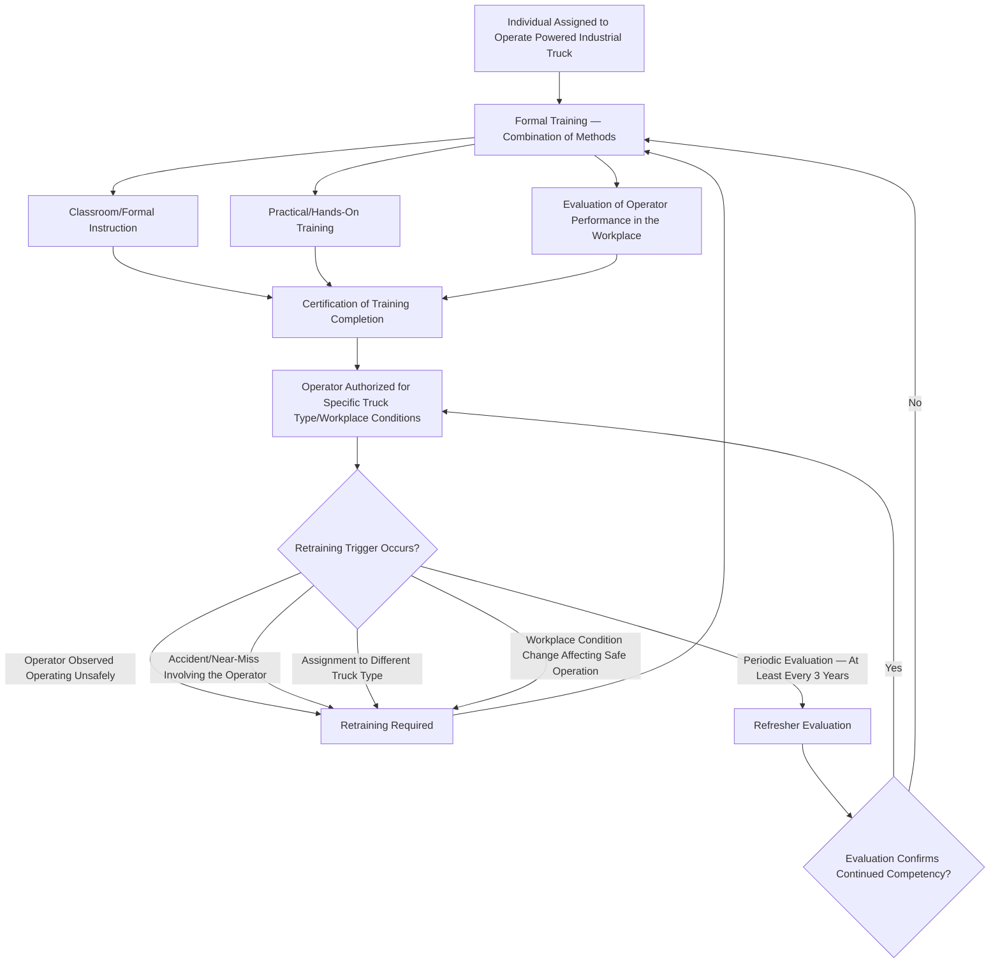

## Powered Industrial Trucks and Material Handling

### Overview and Regulatory Basis

Powered Industrial Trucks and Material Handling is a foundational occupational safety topic governed primarily by **29 CFR 1910.178** (Powered Industrial Trucks), covering forklifts, tractors, platform lift trucks, motorized hand trucks, and other specialized industrial vehicles powered by electric motors or internal combustion engines used to move, raise, lower, or stack material. Related material handling requirements addressing manual handling, storage, and rigging appear across other Subpart N provisions and, where crane/hoist equipment is involved, intersect with additional equipment-specific standards. Like the other occupational safety fundamentals addressed in this chapter, powered industrial truck requirements apply broadly across general industry regardless of PSM coverage status, though the intersection with process safety at PSM-covered facilities — particularly regarding ignition source control in classified areas and traffic management around process equipment — warrants specific attention.

### Scope of 1910.178

1910.178 applies to powered industrial trucks used in industry, excluding vehicles designed primarily for earth moving or over-the-road hauling (which fall under separate standards), and covers the full operational lifecycle from design/construction requirements through operational safe practices and operator training.

| Truck Type Category | Examples |
| --- | --- |
| Class I — Electric Motor Rider Trucks | Counterbalanced rider forklifts, electric powered |
| Class II — Electric Motor Narrow Aisle Trucks | Order pickers, reach trucks designed for narrow aisle operation |
| Class III — Electric Motor Hand Trucks/Hand-Rider Trucks | Pallet jacks and similar walk-behind or hand-rider equipment |
| Class IV — Internal Combustion Engine Trucks (Solid/Cushion Tire) | Typically indoor use, cushion tire configuration |
| Class V — Internal Combustion Engine Trucks (Pneumatic Tire) | Typically outdoor use, pneumatic tire configuration for rougher surfaces |
| Class VI — Electric and Internal Combustion Engine Tractors | Tow tractors and similar towing-configured equipment |
| Class VII — Rough Terrain Forklift Trucks | Designed for rough, unimproved terrain, often construction-adjacent use |

### Design and Fire Safety Classification

A distinguishing feature of 1910.178 relevant to PSM-covered and other hazardous-atmosphere facilities is its classification of powered industrial trucks by fire safety design characteristics, determining which truck types are approved for use in specific hazardous location classifications:

| Truck Fire-Safety Designation | General Characteristics | Typical Approved Use Context |
| --- | --- | --- |
| Type D | Diesel-powered, general purpose | Standard non-hazardous location use |
| Type DS | Diesel-powered, additional safeguards against fire hazard | Locations with somewhat elevated fire risk |
| Type E | Electric-powered, minimum acceptable safeguards against fire hazard | Standard non-hazardous location use |
| Type ES | Electric-powered, additional safeguards, with electrical fittings enclosed/protected | Locations with somewhat elevated fire risk |
| Type EE | Electric-powered, all electrical equipment completely enclosed | Locations with more significant fire/ignition-source-sensitivity |
| Type EX | Electric-powered, explosion-proof, specifically constructed for use in hazardous (classified) atmospheres | Approved for use in specifically classified hazardous locations per area classification |
| Type G/GS | Gasoline-powered, general purpose / with additional safeguards | Standard / elevated fire risk non-hazardous location use |
| Type LP/LPS | Liquefied petroleum gas-powered, general purpose / with additional safeguards | Standard / elevated fire risk non-hazardous location use |

The direct relevance to PSM-covered facilities is significant: use of a truck type not rated for the applicable area classification within a hazardous (classified) location constitutes both a 1910.178 design/use compliance violation and a direct ignition source introduction risk within areas where flammable atmosphere hazards may be present — connecting powered industrial truck selection directly to the area classification and ignition source control principles addressed under Electrical Safety and broader process safety hazard management.

### Operator Training Requirements

1910.178(l) establishes specific, structured training requirements distinguishing powered industrial truck operator training from general workplace safety training — reflecting the standard's recognition that forklift and similar equipment operation carries injury and fatality risk warranting formal certification rather than informal on-the-job instruction alone.

| Training Component | Requirement |
| --- | --- |
| Formal Instruction | Lecture, discussion, interactive computer learning, video, written material, or other formal presentation methods covering truck-related topics and workplace-related topics |
| Practical Training | Demonstrations performed by the trainer and practical exercises performed by the trainee |
| Evaluation | Evaluation of the operator's performance in the actual workplace, confirming safe operation under real workplace conditions |
| Certification | Documented certification including operator name, training date, evaluation date, and identity of the person(s) performing training/evaluation |
| Refresher Training Triggers | Operation observed to be unsafe, involvement in an accident or near-miss, evaluation revealing operation not in accordance with training, assignment to a different truck type, or a workplace condition change that could affect safe operation |
| Minimum Periodic Evaluation | At least once every three years, an evaluation of each operator's performance must be conducted, independent of whether a specific retraining trigger has occurred |

Training content must be specific to both the truck type(s) the operator will use and the specific workplace conditions where operation will occur — a training program that certifies operators generically without addressing site-specific conditions (e.g., ramp grades, narrow aisle configurations, specific load types, pedestrian traffic patterns) does not satisfy the workplace-related training component the standard requires.

### Pre-Operation and Operational Safe Practices

| Practice Category | Requirement Summary |
| --- | --- |
| Pre-Shift/Pre-Use Inspection | Trucks must be examined before being placed in service and not placed in service if the examination shows a condition adversely affecting safety; typically documented via a pre-shift checklist |
| Load Capacity and Stability | Trucks must not be operated in excess of rated load capacity; load must be handled in a manner maintaining stability (e.g., properly positioned, tilted appropriately for travel) |
| Traveling and Maneuvering | Speed appropriate to conditions, maintaining safe clearance, sounding horn at intersections/blind corners, avoiding travel with elevated loads that obstruct view |
| Grades and Ramps | Specific requirements for ascending/descending grades, including load orientation (typically upgrade when loaded on a grade exceeding a defined threshold) |
| Elevated Personnel Platforms | Additional specific requirements apply where a powered industrial truck is used to elevate personnel, given the substantially elevated fall/injury risk relative to standard material handling use |
| Refueling/Recharging | Specific safe practice requirements for battery charging areas (ventilation, fire protection) and fuel handling for combustion-engine trucks, given fire/explosion hazard potential in these specific operations |

### Pedestrian and Traffic Management

A significant and frequently underemphasized dimension of powered industrial truck safety is pedestrian interaction management, since a substantial proportion of serious powered industrial truck incidents involve pedestrian contact rather than solely operator-only hazards:

| Traffic Management Element | Purpose |
| --- | --- |
| Designated Travel Paths and Pedestrian Walkways | Physical or marked separation between powered industrial truck traffic and pedestrian foot traffic where feasible |
| Intersection and Blind Corner Controls | Mirrors, warning signals, or defined right-of-way protocols at points where truck and pedestrian paths intersect with limited visibility |
| High-Visibility Requirements | PPE or equipment features (e.g., strobe lights, backup alarms) increasing pedestrian awareness of truck presence and movement |
| Facility Layout Consideration | Warehouse and process area layout design minimizing unnecessary truck-pedestrian path overlap, connecting to broader facility design safety principles |

### Intersection with Process Safety at PSM-Covered Facilities

Powered industrial truck operation at PSM-covered facilities introduces specific process-safety-relevant considerations beyond the general 1910.178 requirements:

| Intersection Point | Consideration |
| --- | --- |
| Hazardous Area Classification Compliance | Truck type (per the fire-safety designation table above) must match the area classification of any zone where the truck will operate, directly connecting to ignition source control for flammable atmosphere hazards |
| Proximity to Process Equipment | Truck traffic near piping, vessels, or other process equipment introduces mechanical impact risk to process containment — a JHA/TRA for material handling operations near process equipment should explicitly address this interaction hazard |
| SIMOPS Considerations | Material handling/truck traffic occurring concurrently with other site activities (turnaround work, hot work, crane operations) requires the same SIMOPS coordination principles addressed elsewhere in this curriculum |
| Contractor-Operated Equipment | Contractor personnel operating powered industrial trucks on-site are subject to the same training/certification verification expectations addressed under Contractor Prequalification and Orientation, including confirmation that contractor operator certification meets the facility's specific requirements rather than assuming generic prior certification is sufficient for site-specific conditions |

### Incident Investigation Considerations Specific to Powered Industrial Trucks

Given the pattern of pedestrian-involved incidents and the potential for process equipment contact incidents, investigation of powered industrial truck-related events should specifically examine:

- Whether the operator held current, workplace-specific training/certification at the time of the incident
- Whether pre-shift inspection had been completed and documented for the specific truck involved
- Truck type/area classification compatibility if the incident occurred in or near a classified hazardous location
- Traffic management control adequacy at the specific location (marked paths, visibility, right-of-way protocol) if the incident involved pedestrian contact
- Any process equipment contact and resulting containment integrity implications, requiring coordination with Mechanical Integrity assessment if process equipment was struck

### Common Compliance Gaps

- **Generic certification without workplace-specific evaluation**: Operators certified through formal/practical training components without a genuine workplace-specific performance evaluation reflecting actual site conditions
- **Refresher evaluation cycle not tracked systematically**: The three-year minimum periodic evaluation requirement not tracked as a defined recurring compliance obligation, resulting in lapsed evaluation currency
- **Truck type/area classification mismatch**: Use of standard (non-explosion-proof) truck types in classified hazardous locations, particularly where classification boundaries are not clearly marked or well understood by operators
- **Pre-shift inspection treated as a formality**: Documented pre-shift checklists completed without genuine inspection, missing developing mechanical or safety-relevant defects
- **Pedestrian traffic management underdeveloped relative to truck operation controls**: Programs emphasizing operator training and truck maintenance while underinvesting in the physical and procedural controls separating truck and pedestrian traffic
- **Contractor operator certification not verified against site-specific requirements**: Assuming a contractor's general powered industrial truck certification satisfies workplace-specific training requirements without confirming site-specific evaluation has occurred

**Related Topics**

- Job Hazard Analysis and Task Risk Assessment
- Hazardous Area Classification and Ignition Source Control
- Simultaneous Operations (SIMOPS) Risk Management
- Contractor Orientation and Site-Specific Training
- Oversight of Contractor Work Activities
- Mechanical Integrity Program Requirements (1910.119(j))
- Incident Investigation Methodology
- Machine Guarding