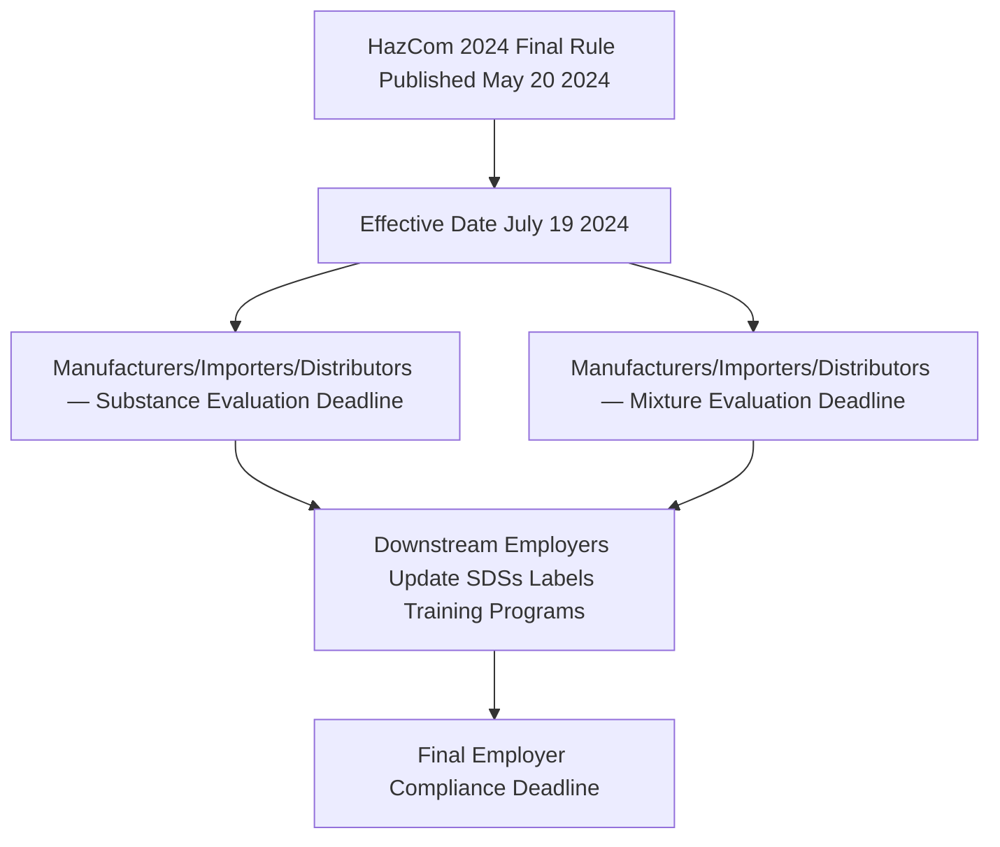

## Globally Harmonized System of Classification and Labelling

### Overview and Regulatory Status

The Globally Harmonized System of Classification and Labelling of Chemicals (GHS) is an internationally developed framework, maintained by the United Nations, establishing standardized criteria for classifying chemical hazards and standardized formats for communicating those hazards through labels and safety data sheets. GHS itself is not directly enforceable law — it is not a law or regulation that can be enforced, functioning instead as a set of recommendations and best practices — and becomes legally binding within a jurisdiction only when that jurisdiction's regulatory authority formally aligns its own regulations with a specific GHS edition through rulemaking. In the United States, this alignment occurs through OSHA's Hazard Communication Standard, codified at **29 CFR 1910.1200**. [ehs](https://ehs.com/?p=31845)

This is an area with a significant, relatively recent regulatory update relevant to current practice: the UN publishes revised GHS editions periodically, with the most recent being Revision 10, published in 2023, but as noted above, a new UN edition does not itself change U.S. legal requirements until OSHA specifically adopts it. [ehs](https://www.ehs.com/?p=4294)

### OSHA HazCom Alignment History

| GHS Alignment Event | Date | Significance |
| --- | --- | --- |
| Original HCS Adoption | 1983 | First OSHA Hazard Communication Standard, predating GHS, initially applying only to manufacturing workplaces before later broadening to all OSHA-covered workplaces |
| HazCom 2012 (GHS Revision 3 Alignment) | Final rule March 26, 2012 | OSHA officially aligned the HazCom Standard with GHS Revision 3, replacing the Material Safety Data Sheet (MSDS) with the standardized 16-section Safety Data Sheet and introducing standardized label elements, via a phased-in transition timeline that ended in 2016, with extensions into 2017 for end-users affected by upstream delays |
| HazCom 2024 (GHS Revision 7 Alignment) | Final rule published May 20, 2024 | OSHA published a final rule aligning the HazCom Standard with GHS Revision 7, and select elements of Revision 8, replacing the prior HCS-2012 standard |

**This second alignment — HazCom 2024 — is the current, actively-transitioning regulatory framework as of this writing, and practitioners should treat it as the operative standard rather than referencing the older HazCom 2012 framework as current.**

### HazCom 2024 Compliance Timeline

The HazCom 2024 rule established staggered compliance dates by regulated party type, which were subsequently extended:

| Compliance Milestone | Original Deadline | Extended Deadline (per January 2026 four-month extension) |
| --- | --- | --- |
| Substance evaluation — manufacturers/importers/distributors | January 19, 2026 | Extended to May 19, 2026 |
| Substance-related labeling/SDS distribution | July 20, 2026 | Extended to November 20, 2026 |
| Mixture evaluation — manufacturers/importers/distributors | (per original 3-year timeline from effective date) | Manufacturers, suppliers, or importers of mixtures have 3 years to comply from the effective date, i.e., a deadline around November 19, 2027 per the extended framework |
| Employer program/training/labeling updates | — | No later than January 19, 2028 |

On January 15, 2026, OSHA extended the key compliance deadlines by four months via direct final rule, citing the need for additional time to publish necessary guidance materials and for the regulated community to review those materials before the revised provisions take effect. [Unverified — given the pace of OSHA guidance publication activity in this area, practitioners should verify current deadline status directly against OSHA's Hazard Communication topic page at osha.gov rather than treating any single source's stated dates as necessarily final, since further technical corrections or extensions remain plausible.] [wiley](https://www.wiley.law/alert-OSHA-Labels-and-Safety-Data-Sheets-Important-Deadlines-Ahead)[reach24h](https://en.reach24h.com/news/industry-news/chemical/hcs-2024-hazard-communication-standard-hazcom-four-months)

### Enforcement Significance

HazCom compliance carries substantial current enforcement weight: preliminary FY2025 enforcement data placed HazCom second on OSHA's Top 10 list of most frequently cited standards, with 1,737 inspections and 3,107 citations issued, totaling $4,838,954 in penalties. The most frequently cited specific provisions were written program requirements (1910.1200(e)(1)), training (1910.1200(h)(1)), maintenance of SDSs and employee accessibility (1910.1200(g)(8)), development/maintenance of SDSs (1910.1200(g)(1)), and workplace labeling (1910.1200(f)(6)(ii)). This citation pattern indicates that program administration and documentation gaps, not solely classification errors, are the dominant practical compliance risk. [jjkellercompliancenetwork](https://jjkellercompliancenetwork.com/news/hazcom-by-the-numbers-whats-new-and-whats-next-id-72d9fe05-1bb2-48f2-c4d1-f09a24699022)[jjkellercompliancenetwork](https://jjkellercompliancenetwork.com/news/hazcom-by-the-numbers-whats-new-and-whats-next-id-72d9fe05-1bb2-48f2-c4d1-f09a24699022)

### Core GHS Classification Framework

GHS classification organizes chemical hazards into three overarching categories, each with defined hazard classes and severity categories:

| Hazard Category | Hazard Classes (Examples) |
| --- | --- |
| Physical Hazards | Flammable liquids/gases/solids, oxidizers, explosives, corrosive to metals, gases under pressure, self-reactive substances |
| Health Hazards | Acute toxicity, skin corrosion/irritation, serious eye damage/irritation, respiratory/skin sensitization, germ cell mutagenicity, carcinogenicity, reproductive toxicity, specific target organ toxicity (STOT), aspiration hazard |
| Environmental Hazards | Hazardous to the aquatic environment (acute and chronic) |

### Label Elements

GHS-aligned labels under HazCom require standardized elements enabling rapid hazard recognition regardless of language or manufacturer:

| Label Element | Function |
| --- | --- |
| Product Identifier | Chemical name/identifier matching the SDS |
| Signal Word | "Danger" (more severe) or "Warning" (less severe), with only one signal word used even where multiple hazard classifications apply |
| Hazard Pictogram(s) | Standardized graphic symbols (red diamond border) representing specific hazard classes — e.g., flame for flammability, corrosion symbol for corrosive hazards, skull and crossbones for acute toxicity |
| Hazard Statement(s) | Standardized text describing the nature and, where applicable, degree of the hazard |
| Precautionary Statement(s) | Standardized text describing recommended measures to minimize or prevent adverse effects |
| Supplier Identification | Name, address, and telephone number of the manufacturer, importer, or responsible party |

### Safety Data Sheet — 16-Section Structure

The GHS-standardized SDS format, adopted in the U.S. through HazCom 2012 and retained under HazCom 2024, organizes chemical hazard information into a fixed 16-section structure:

| Section | Content |
| --- | --- |
| 1 | Identification |
| 2 | Hazard(s) Identification |
| 3 | Composition/Information on Ingredients |
| 4 | First-Aid Measures |
| 5 | Fire-Fighting Measures |
| 6 | Accidental Release Measures |
| 7 | Handling and Storage |
| 8 | Exposure Controls/Personal Protection |
| 9 | Physical and Chemical Properties |
| 10 | Stability and Reactivity |
| 11 | Toxicological Information |
| 12 | Ecological Information (non-mandatory under OSHA, though standardized in format) |
| 13 | Disposal Considerations (non-mandatory under OSHA) |
| 14 | Transport Information (non-mandatory under OSHA) |
| 15 | Regulatory Information (non-mandatory under OSHA) |
| 16 | Other Information |

Sections 12–15 are included in the standardized format for international consistency but are not independently enforced by OSHA under the HazCom Standard, which instead focuses primarily enforcement attention on Sections 1–11 and 16.

### Key Substantive Changes Under HazCom 2024 (GHS Revision 7/8 Alignment)

Several specific classification and hazard communication changes were introduced under this revision, including new or refined hazard categories:

| Change Area | Description |
| --- | --- |
| Corrosive to Respiratory Tract | A new distinct classification where acute toxicity testing shows a chemical is corrosive to the respiratory tract but not fatally so — classified separately from general acute toxicity, requiring the specific hazard statement "Corrosive to the respiratory tract if inhaled" and a corresponding corrosion pictogram. Chemicals classified for skin corrosion/irritation or serious eye damage/irritation must additionally be assessed for respiratory corrosive potential, reflecting a more granular approach to inhalation hazard communication intended to better enable workers and others to prevent accidents involving gas, vapor, or mist leaks |
| Germ Cell Mutagenicity | Refinements to classification criteria and category structure (specific technical detail should be verified against the finalized rule text for the precise scope of change) |
| Small Container Labeling | HazCom 2024 introduced provisions addressing labeling of small containers, an area that historically presented practical labeling challenges given standard label element space requirements |
| Concentration Range Disclosure on SDSs | Revisions affecting how ingredient concentration ranges may be disclosed on Safety Data Sheets |

[Inference — the full technical scope of classification changes under HazCom 2024 is extensive and detailed at the level of specific hazard class boundary criteria; this reference summarizes representative examples of the revision's direction rather than an exhaustive change catalog, and practitioners implementing specific reclassification decisions should consult the finalized regulatory text and OSHA's published guidance directly.]

### Practical Implementation Considerations for PSM-Covered Facilities

| Implementation Area | PSM-Relevant Consideration |
| --- | --- |
| Process Safety Information (PSI) Cross-Reference | PSI under 1910.119(d) relies on accurate chemical hazard information; SDS updates under HazCom 2024 transition should trigger corresponding PSI review to ensure consistency between hazard communication documentation and process safety information |
| Employee Training Program Updates | HazCom training (1910.1200(h)) must be updated to reflect any newly identified physical or health hazards emerging from reclassification under the revised criteria, distinct from but complementary to PSM-specific operator training |
| Workplace Label Transition Management | Facilities must manage a transition period where both legacy (GHS Revision 3-aligned) and updated (GHS Revision 7/8-aligned) labels may coexist on-site as inventory turns over, requiring clear tracking of which labeling standard applies to which specific containers |
| Contractor and Supplier Coordination | Facilities should confirm supplier SDS updates are being tracked and incorporated, since downstream employer compliance depends on receiving updated SDS information from upstream manufacturers/importers per the staggered compliance timeline |

### Written Hazard Communication Program Requirements

Given its position as the most frequently cited HazCom provision, the written program requirement under 1910.1200(e)(1) warrants specific attention. A compliant written program must address:

- A list of hazardous chemicals present in the workplace (cross-referenced with available SDSs)
- Methods for informing employees of hazards associated with non-routine tasks
- Methods for informing employees of hazards associated with unlabeled pipes (relevant intersection with PSM operating procedures for piping systems)
- Methods used to inform contractor employers of hazards their employees may be exposed to (connecting directly to Contractor Orientation and hazard communication obligations addressed elsewhere in this curriculum)

### Common Compliance Gaps

- **SDS accessibility failures**: SDSs not maintained in a readily accessible location/format for all shifts and work areas, a frequently cited specific provision
- **Training not updated for newly identified hazards**: Employee training not refreshed to reflect reclassifications emerging from the HazCom 2024 transition as supplier SDSs update
- **Written program treated as a static document**: Program not revised to reflect actual current chemical inventory or updated hazard classifications
- **Workplace labeling inconsistent with current SDS information**: Container labels not updated in step with underlying SDS revisions during the multi-year transition period
- **PSI-HazCom disconnect at PSM-covered facilities**: Process Safety Information not cross-checked against updated SDS hazard classifications, risking inconsistency between the two documentation sets

**Related Topics**

- Process Safety Information Development and Maintenance (1910.119(d))
- Contractor Orientation and Site-Specific Training
- Hazardous Area Classification and Ignition Source Control
- Personal Protective Equipment Selection Based on Chemical Hazard Data
- Employee Participation Requirements Under PSM
- Job Hazard Analysis and Task Risk Assessment
- Emergency Action Plan Development and Communication
- Reactive Chemical Hazard Management