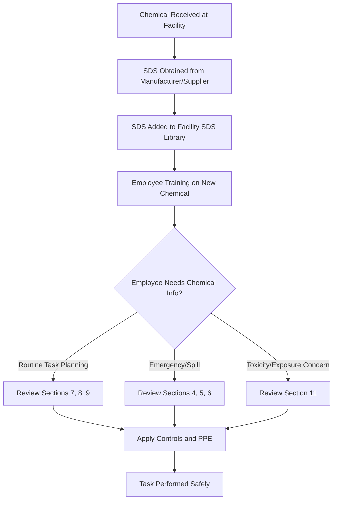

## Safety Data Sheet Structure and Use

### Overview

A Safety Data Sheet (SDS) is a standardized document that communicates the hazards of a chemical substance or mixture, along with guidance on safe handling, storage, use, and emergency response. Under the Globally Harmonized System (GHS) and OSHA's Hazard Communication Standard (HCS), 29 CFR 1910.1200, every hazardous chemical produced, imported, or used in the workplace must be accompanied by an SDS prepared by the manufacturer, importer, or distributor. SDSs replaced the older, non-standardized Material Safety Data Sheets (MSDS) that existed prior to the 2012 HCS alignment with GHS.

The SDS is a foundational element of hazard communication programs, providing workers, emergency responders, and safety professionals with consistent, structured access to critical chemical safety information.

### Regulatory Framework

- **OSHA HCS (29 CFR 1910.1200)**: Requires chemical manufacturers and importers to classify hazards and prepare SDSs for each hazardous chemical.
- **GHS (Globally Harmonized System)**: Provides the international basis for classification and the standardized 16-section format.
- **ANSI Z400.1/Z129.1**: American National Standards Institute guidance historically informed SDS content and was harmonized with GHS.
- Employers are required to maintain SDSs for every hazardous chemical in the workplace and ensure they are readily accessible to employees during each work shift.

### The 16-Section SDS Format

The GHS-aligned SDS format is mandatory and sections must appear in this fixed order, even if some content is not applicable (in which case "Not applicable" or "No data available" should be indicated rather than omitting the section).

**Section 1: Identification**

- Product identifier (matches label)
- Recommended use and restrictions on use
- Manufacturer/supplier name, address, phone number
- Emergency phone number

**Section 2: Hazard(s) Identification**

- GHS classification of the chemical (health, physical, environmental hazards)
- Signal word (Danger or Warning)
- Hazard statements
- Precautionary statements
- Pictograms (described or referenced)
- Any hazards not otherwise classified (HNOC)

**Section 3: Composition/Information on Ingredients**

- Chemical identity and common names/synonyms
- CAS number and other unique identifiers
- Concentration or concentration ranges (trade secret claims permitted under specific conditions)

**Section 4: First-Aid Measures**

- Necessary first-aid instructions by exposure route (inhalation, skin, eye, ingestion)
- Most important symptoms/effects, acute and delayed
- Indication of immediate medical attention and special treatment needed

**Section 5: Fire-Fighting Measures**

- Suitable (and unsuitable) extinguishing media
- Specific hazards arising from the chemical (e.g., hazardous combustion products)
- Special protective equipment and precautions for firefighters

**Section 6: Accidental Release Measures**

- Personal precautions, protective equipment, emergency procedures
- Environmental precautions
- Methods and materials for containment and cleanup

**Section 7: Handling and Storage**

- Precautions for safe handling
- Conditions for safe storage, including incompatibilities

**Section 8: Exposure Controls/Personal Protection**

- Occupational exposure limits (OSHA PELs, ACGIH TLVs, other applicable limits)
- Appropriate engineering controls
- Individual protection measures (PPE)

**Section 9: Physical and Chemical Properties**

- Appearance, odor, pH, melting/freezing point, boiling point, flash point, flammability, vapor pressure, density, solubility, and other relevant properties

**Section 10: Stability and Reactivity**

- Reactivity
- Chemical stability
- Possibility of hazardous reactions
- Conditions to avoid, incompatible materials, hazardous decomposition products

**Section 11: Toxicological Information**

- Routes of exposure
- Symptoms related to physical, chemical, and toxicological characteristics
- Delayed and immediate effects, chronic effects
- Numerical measures of toxicity (e.g., LD50, LC50)

**Section 12: Ecological Information** *(non-mandatory under OSHA but part of GHS format)*

- Ecotoxicity, persistence/degradability, bioaccumulative potential, mobility in soil

**Section 13: Disposal Considerations** *(non-mandatory under OSHA)*

- Description of waste residues and disposal information

**Section 14: Transport Information** *(non-mandatory under OSHA)*

- UN number, proper shipping name, transport hazard class, packing group

**Section 15: Regulatory Information** *(non-mandatory under OSHA)*

- Safety, health, and environmental regulations specific to the product

**Section 16: Other Information**

- Date of preparation or last revision
- Other useful information not captured elsewhere

[Inference] Sections 12–15 are labeled non-mandatory under OSHA's HCS because OSHA's jurisdiction covers occupational safety rather than environmental or transport regulation, though most manufacturers include them for GHS completeness and international consistency.

### SDS Structure (svg_diagram)

<svg viewBox="0 0 800 480" xmlns="[http://www.w3.org/2000/svg">](http://www.w3.org/2000/svg%22%3E)

<text x="400" y="30" font-size="18" font-weight="bold" text-anchor="middle" fill="#1a1a1a">SDS 16-Section Structure (svg_diagram)</text>

<rect x="20" y="55" width="230" height="400" rx="6" fill="#e8f0fe" stroke="#4a6fa5" stroke-width="1.5"/>

<text x="135" y="75" font-size="13" font-weight="bold" text-anchor="middle" fill="#1a1a1a">Identification & Hazards</text>

<text x="35" y="100" font-size="12" fill="#333">1. Identification</text>

<text x="35" y="120" font-size="12" fill="#333">2. Hazard(s) Identification</text>

<text x="35" y="140" font-size="12" fill="#333">3. Composition/Ingredients</text>

<text x="35" y="165" font-size="11" fill="#555">Purpose: Identify the</text>

<text x="35" y="180" font-size="11" fill="#555">product and its dangers</text>

<text x="35" y="195" font-size="11" fill="#555">before handling begins.</text>

<rect x="285" y="55" width="230" height="400" rx="6" fill="#fdeee8" stroke="#c0654a" stroke-width="1.5"/>

<text x="400" y="75" font-size="13" font-weight="bold" text-anchor="middle" fill="#1a1a1a">Emergency & Handling</text>

<text x="300" y="100" font-size="12" fill="#333">4. First-Aid Measures</text>

<text x="300" y="120" font-size="12" fill="#333">5. Fire-Fighting Measures</text>

<text x="300" y="140" font-size="12" fill="#333">6. Accidental Release</text>

<text x="300" y="160" font-size="12" fill="#333">7. Handling and Storage</text>

<text x="300" y="185" font-size="11" fill="#555">Purpose: Guide response</text>

<text x="300" y="200" font-size="11" fill="#555">to spills, fires, exposure,</text>

<text x="300" y="215" font-size="11" fill="#555">and everyday handling.</text>

<rect x="550" y="55" width="230" height="400" rx="6" fill="#eaf7ea" stroke="#4a9a5a" stroke-width="1.5"/>

<text x="665" y="75" font-size="13" font-weight="bold" text-anchor="middle" fill="#1a1a1a">Technical & Regulatory</text>

<text x="565" y="100" font-size="12" fill="#333">8. Exposure Controls/PPE</text>

<text x="565" y="120" font-size="12" fill="#333">9. Physical/Chemical Props</text>

<text x="565" y="140" font-size="12" fill="#333">10. Stability and Reactivity</text>

<text x="565" y="160" font-size="12" fill="#333">11. Toxicological Info</text>

<text x="565" y="180" font-size="12" fill="#333">12. Ecological Info*</text>

<text x="565" y="200" font-size="12" fill="#333">13. Disposal*</text>

<text x="565" y="220" font-size="12" fill="#333">14. Transport*</text>

<text x="565" y="240" font-size="12" fill="#333">15. Regulatory Info*</text>

<text x="565" y="260" font-size="12" fill="#333">16. Other Information</text>

<text x="565" y="285" font-size="11" fill="#555">*Non-mandatory under</text>

<text x="565" y="300" font-size="11" fill="#555">OSHA HCS, but standard</text>

<text x="565" y="315" font-size="11" fill="#555">under full GHS format.</text>

<text x="400" y="470" font-size="11" text-anchor="middle" fill="#666">Order is fixed regardless of applicability; "No data available" used where sections do not apply.</text>

</svg>

### Practical Use in the Workplace

**Key Points**

- SDSs must be readily accessible to employees without barriers (e.g., not locked away or requiring supervisor approval to access) during every work shift.
- Employers must maintain a complete SDS library covering all hazardous chemicals present in the facility, whether in paper binders, electronic databases, or a combination.
- Workers must be trained to read and interpret SDSs as part of the Hazard Communication training program.
- SDSs inform selection of engineering controls, PPE, ventilation requirements, and emergency response planning.
- SDSs are a primary reference during incident investigation, exposure assessment, and industrial hygiene monitoring program design.

**Example**

A maintenance technician is assigned to clean a parts washer using a solvent-based degreaser. Before beginning the task, the technician:

1. Locates the SDS for the specific product (matching the exact product identifier on the container label).
2. Reviews Section 2 for hazard classification (e.g., flammable liquid, skin irritant) and required pictograms.
3. Reviews Section 8 for required PPE (e.g., nitrile gloves, safety glasses, and local exhaust ventilation).
4. Reviews Section 7 for storage/handling precautions (e.g., keep away from ignition sources).
5. Reviews Section 4 in case of accidental skin or eye contact during the task.

This workflow demonstrates how the SDS functions as an operational reference, not merely a compliance document.

### SDS Access Workflow

### Common Deficiencies and Compliance Pitfalls

- **Outdated SDSs**: Using superseded versions after a manufacturer reformulates a product or reclassifies hazards.
- **Inaccessible SDSs**: Storing SDSs only in a locked office or on a computer employees cannot access during their shift.
- **Missing product-specific SDSs**: Relying on a "generic" SDS for a class of chemicals rather than the exact product/formulation in use.
- **Untrained personnel**: Employees unable to locate or interpret an SDS during an emergency.
- **Trade secret over-reliance**: Withholding specific chemical identities beyond what is legally permitted under trade secret provisions, impeding emergency response or medical treatment.

[Unverified] Specific enforcement statistics on SDS-related citation frequency vary by year and jurisdiction and should be checked against current OSHA enforcement data if precise figures are required.

### SDS vs. Label Comparison

| Aspect | Label | SDS |
| --- | --- | --- |
| Purpose | Immediate, at-a-glance hazard alert | Comprehensive technical reference |
| Location | Affixed to container | Central library/binder/database |
| Content depth | Summary (signal word, pictograms, hazard/precautionary statements) | Full 16-section detail |
| Audience | Anyone handling the container | Workers, EHS staff, emergency responders, medical personnel |
| Update trigger | Reformulation or reclassification | Same triggers; SDS typically more detailed on changes |

### Integration with Broader PSM Programs

Within Process Safety Management, SDSs feed directly into:

- **Process Hazard Analysis (PHA)**: Chemical hazard data informs hazard identification methodologies (e.g., HAZOP, What-If).
- **Emergency Response Planning**: Sections 4–6 inform emergency action plans and responder briefings.
- **Industrial Hygiene Monitoring**: Section 8 exposure limits guide air monitoring and exposure assessment programs.
- **Management of Change (MOC)**: Introduction of a new chemical triggers SDS review as part of the MOC process.
- **Process Safety Information (PSI)**: Under OSHA PSM (29 CFR 1910.119), SDSs are often a component of the required PSI documentation for highly hazardous chemicals.

**Next Steps**

- Globally Harmonized System (GHS) Classification and Labeling
- Hazard Communication Training Requirements
- Chemical Hazard Pictograms and Signal Words
- Exposure Limits: PELs, TLVs, and RELs
- Emergency Action Plans and Chemical Spill Response
- Management of Change (MOC) Procedures
- Process Safety Information (PSI) under OSHA PSM Standard