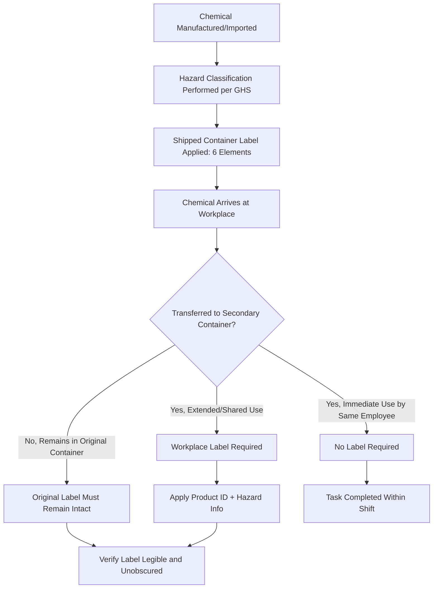

## Chemical Labeling Requirements

### Overview

Chemical labeling is the primary, immediate hazard communication mechanism at the point of chemical use. Under OSHA's Hazard Communication Standard (HCS), 29 CFR 1910.1200, aligned with the Globally Harmonized System (GHS), labels on shipped containers and workplace containers must convey standardized hazard information using consistent pictograms, signal words, and hazard/precautionary statements so that any worker, regardless of language or training background, can quickly recognize a chemical's hazards.

Labeling requirements apply at two distinct levels: **shipped container labels** (from manufacturers, importers, and distributors) and **workplace labels** (for secondary containers into which chemicals are transferred).

### Regulatory Basis

- **OSHA HCS (29 CFR 1910.1200(f))**: Establishes labeling requirements for both shipped and workplace containers.
- **GHS Revision (UN)**: Provides the international basis for classification criteria, pictograms, and standardized phrases.
- **DOT Hazmat Labeling (49 CFR Part 172)**: Governs transport labeling, which is distinct from workplace HCS labeling and applies during shipping.
- **NFPA 704 and HMIS**: Voluntary/supplementary rating systems sometimes used alongside GHS labels for fire and emergency response purposes, but these do not replace GHS-required label elements.

### Six Required Label Elements (Shipped Containers)

**1. Product Identifier**

- The exact chemical name or code matching the SDS.
- Must allow cross-referencing to the correct SDS.

**2. Signal Word**

- "Danger" for more severe hazard categories.
- "Warning" for less severe hazard categories.
- Only one signal word appears per label, even if multiple hazard classes apply (the more severe governs).

**3. Hazard Statement(s)**

- Standardized statements describing the nature of the hazard (e.g., "Highly flammable liquid and vapor," "Causes skin irritation").
- Assigned based on GHS hazard classification; multiple statements may be combined.

**4. Precautionary Statement(s)**

- Standardized phrases covering prevention, response, storage, and disposal (e.g., "Wear protective gloves," "Store in a well-ventilated place").

**5. Pictogram(s)**

- Red diamond-bordered symbols on a white background, each representing a hazard class.
- Up to nine pictograms exist; a label displays only those applicable to the classified hazards.

**6. Supplier Identification**

- Name, address, and telephone number of the manufacturer, importer, or responsible party.

### GHS Pictograms Reference

| Pictogram | Hazard Represented |
| --- | --- |
| Flame | Flammables, self-reactives, pyrophorics, organic peroxides |
| Flame Over Circle | Oxidizers |
| Exploding Bomb | Explosives, self-reactives, organic peroxides |
| Corrosion | Skin/eye corrosion, metal corrosion |
| Gas Cylinder | Gases under pressure |
| Skull and Crossbones | Acute toxicity (severe) |
| Health Hazard | Carcinogen, respiratory sensitizer, reproductive toxicity, target organ toxicity |
| Exclamation Mark | Irritant, skin sensitizer, narcotic effects, acute toxicity (lower severity) |
| Environment (non-mandatory under OSHA) | Aquatic toxicity |

[Inference] The Environment pictogram is listed as non-mandatory under OSHA because OSHA's HCS regulates occupational exposure rather than environmental hazards, though it remains part of the full GHS pictogram set used internationally.

### GHS Label Layout (svg_diagram)

<svg xmlns="http://www.w3.org/2000/svg" viewBox="0 0 600 420">
<text x="300" y="25" font-size="16" font-weight="bold" text-anchor="middle" fill="#1a1a1a">GHS Label Elements (svg_diagram)</text>
<rect x="50" y="45" width="500" height="345" rx="8" fill="#ffffff" stroke="#333" stroke-width="2" />

<text x="70" y="75" font-size="13" font-weight="bold" fill="`#1a1a1a`">Product Identifier: Acetone (99%)</text>

<rect x="70" y="90" width="55" height="55" fill="none" stroke="#c0392b" stroke-width="3" transform="rotate(45 97.5 117.5)" />
<text x="97" y="122" font-size="20" text-anchor="middle" fill="#c0392b">🔥</text>
<text x="97" y="160" font-size="9" text-anchor="middle" fill="#555">Flame</text>
<rect x="150" y="90" width="55" height="55" fill="none" stroke="#c0392b" stroke-width="3" transform="rotate(45 177.5 117.5)" />
<text x="177" y="122" font-size="20" text-anchor="middle" fill="#c0392b">❗</text>
<text x="177" y="160" font-size="9" text-anchor="middle" fill="#555">Exclamation Mark</text>
<rect x="70" y="185" width="460" height="35" fill="#f8d7da" stroke="#c0392b" stroke-width="1" />
<text x="80" y="207" font-size="14" font-weight="bold" fill="#721c24">Signal Word: DANGER</text>

<text x="80" y="245" font-size="12" font-weight="bold" fill="`#1a1a1a`">Hazard Statements:</text>

<text x="90" y="263" font-size="11" fill="#333">H225: Highly flammable liquid and vapor</text>

<text x="90" y="279" font-size="11" fill="#333">H319: Causes serious eye irritation</text>

<text x="80" y="305" font-size="12" font-weight="bold" fill="`#1a1a1a`">Precautionary Statements:</text>

<text x="90" y="323" font-size="11" fill="#333">P210: Keep away from heat, sparks, open flames</text>

<text x="90" y="339" font-size="11" fill="#333">P280: Wear protective gloves/eye protection</text>

<text x="80" y="365" font-size="11" font-style="italic" fill="#555">Supplier: XYZ Chemical Co., 123 Industrial Way, City, ST | (555) 123-4567</text>

</svg>

### Workplace (Secondary) Container Labeling

When a chemical is transferred from its original shipped container into a secondary container (e.g., a spray bottle, smaller vessel), OSHA HCS 1910.1200(f)(6) permits alternative labeling under specific conditions:

**Immediate-use exception**: No label required if the container is used entirely by the employee who transferred the chemical, within the same work shift, and remains under that employee's control throughout use.

**Standard workplace label requirements** (when the immediate-use exception does not apply):

- Product identifier
- Words, pictures, symbols, or a combination that provide general information regarding hazards
- May use full GHS elements (signal word, hazard statements, pictograms) or an alternative system such as NFPA 704 or a company-specific system, provided workers are trained on that system

**Key Points**

- Workplace labels are not required to replicate the shipped-container label verbatim but must convey equivalent hazard information.
- Any alternative labeling system must be consistent across the facility and covered in HazCom training.
- Labels must never be removed or defaced while the chemical remains in use unless immediately replaced with updated information.

### Label Update and Reclassification Triggers

Labels must be updated when:

- New and significant information regarding hazards becomes available.
- The chemical formulation changes such that hazard classification changes.
- The manufacturer revises the SDS or hazard classification.

Manufacturers/importers must update labels within six months of becoming aware of new hazard information; distributors must ship updated labels within specific timeframes following notification.

### Labeling Compliance Workflow

### Common Compliance Pitfalls

- **Illegible or damaged labels**: Faded, torn, or chemically degraded labels not replaced promptly.
- **Unlabeled secondary containers**: Failing to apply workplace labels when the immediate-use exception does not apply (e.g., a labeled squeeze bottle left overnight).
- **Mixing hazard communication systems inconsistently**: Using NFPA 704 diamonds without also training employees on how those ratings correspond to GHS hazard categories, if both systems are present in the facility.
- **Obsolete labels**: Retaining old MSDS-era or non-GHS labels on legacy containers after the 2015/2016 HCS transition deadlines.
- **Foreign language labels without translation**: Imported chemicals arriving with labels not in a language understood by the workforce, without supplementary workplace labeling.

[Unverified] Specific transition deadline dates (e.g., June 2015 for manufacturers, June 2016 for distributors) were established during the original HCS 2012 GHS alignment; current applicability to any given facility should be verified against present OSHA guidance, as these were transitional compliance dates.

### NFPA 704 vs. GHS Comparison

| Aspect | GHS Labeling | NFPA 704 |
| --- | --- | --- |
| Primary audience | Workers handling the chemical | Emergency responders |
| Format | Pictograms, signal word, hazard/precautionary statements | Color-coded diamond with numeric ratings (0–4) |
| Regulatory status | Mandatory under OSHA HCS | Voluntary; used as supplementary system |
| Information type | Qualitative hazard description | Quantitative severity ranking (Health, Flammability, Instability, Special) |
| Use case | Container labels, SDS cross-reference | Facility placarding, fire department reference |

### Integration with PSM and Broader Safety Programs

- **Hazard Communication Training**: Labels are a core training topic; employees must be able to interpret all elements before working with hazardous chemicals.
- **Process Safety Information**: Accurate labeling supports chemical inventory accuracy required under PSM.
- **Emergency Response**: First responders rely on labels (and supplementary NFPA placards) for rapid hazard identification during incidents.
- **Inventory Management**: Labels support proper segregation and storage compatibility decisions (e.g., separating oxidizers from flammables).

**Next Steps**

- Globally Harmonized System (GHS) Hazard Classification Criteria
- Safety Data Sheet Structure and Use
- Hazard Communication Training Program Design
- Chemical Segregation and Compatible Storage
- NFPA 704 Placarding for Facility Hazard Communication
- DOT Hazardous Materials Transport Labeling