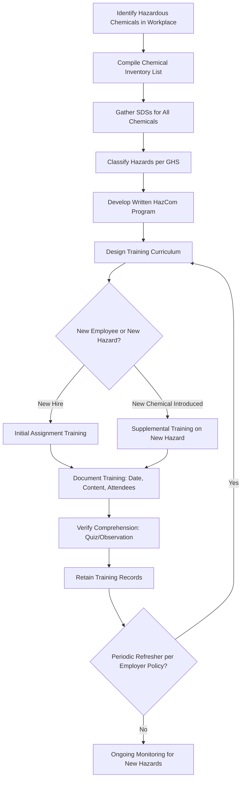

## Employee Right to Know Training

### Overview

Employee Right to Know (RTK) Training refers to the training obligations under OSHA's Hazard Communication Standard (HCS), 29 CFR 1910.1200, which codifies workers' fundamental right to be informed about the hazardous chemicals they may be exposed to in the workplace. The "Right to Know" concept originated from state-level legislation in the late 1970s and early 1980s before being federally codified through OSHA's HCS in 1983, later revised in 2012 to align with the Globally Harmonized System (GHS).

The core principle is that employees cannot protect themselves from hazards they do not understand, so employers must proactively provide training rather than merely making information passively available.

### Regulatory Basis

- **OSHA HCS (29 CFR 1910.1200(h))**: Establishes information and training requirements.
- **State Right-to-Know Laws**: Some states (e.g., New Jersey, California) maintain their own RTK statutes that may impose additional requirements beyond federal OSHA, particularly for public sector employees not covered by federal OSHA jurisdiction.
- **OSHA General Duty Clause**: Reinforces the broader employer obligation to maintain a workplace free from recognized hazards, which training supports.

### When Training Is Required

Employers must provide HazCom training to employees:

1. **At the time of initial assignment** to a work area with hazardous chemicals.
2. **Whenever a new hazard is introduced** into the work area (new chemical, new hazard classification).
3. [Inference] Refresher training is not explicitly mandated on a fixed schedule by federal OSHA HCS, but many employers implement periodic refreshers as a best practice and some state programs or collective bargaining agreements may require it.

### Required Training Content

**Information Component** (what employees must be told exists)

- Requirements of the HCS standard itself
- Operations in the work area where hazardous chemicals are present
- Location and availability of the written Hazard Communication Program
- Location and availability of the SDS library

**Training Component** (what employees must be able to do)

- Methods to detect the presence or release of a hazardous chemical (monitoring devices, visual/odor cues)
- Physical and health hazards of chemicals in the work area
- Measures employees can take to protect themselves (work practices, PPE, emergency procedures)
- Details of the employer's written HazCom program, including:
  - How to read and interpret labels
  - How to read and interpret Safety Data Sheets
  - How label information and SDS information relate to each other

### Core Curriculum Topics

**Key Points**

- GHS label elements: pictograms, signal words, hazard statements, precautionary statements
- SDS structure: the 16-section format and how to navigate to relevant sections quickly
- Chemical-specific hazards present in the employee's actual work area (not generic/theoretical training alone)
- Physical hazard categories (flammable, corrosive, reactive, explosive, oxidizing)
- Health hazard categories (acute toxicity, carcinogenicity, sensitization, target organ toxicity)
- Routes of exposure (inhalation, skin/eye contact, ingestion, injection)
- Proper use, limitations, and maintenance of required PPE
- Emergency procedures: spill response, first aid, evacuation triggers
- Location of eyewash stations, safety showers, spill kits, and fire suppression equipment relevant to the chemicals present

### Training Program Development Workflow

### Effective Training Delivery Methods

| Method | Advantages | Limitations |
| --- | --- | --- |
| Classroom/instructor-led | Allows Q&A, hands-on demonstration | Resource-intensive, scheduling challenges |
| Computer-based/e-learning | Scalable, trackable completion, consistent content | Limited hands-on practice, potential disengagement |
| On-the-job/task-specific | Directly relevant to actual work area chemicals | May miss broader hazard communication concepts |
| Toolbox talks/refreshers | Reinforces key points, low time investment | Not sufficient as sole initial training method |

[Unverified] Comparative effectiveness data between these delivery methods varies by industry, workforce literacy levels, and language considerations, and should be evaluated against the specific workplace population.

### Training Documentation Requirements

While OSHA HCS does not prescribe a specific record-retention period for training records (distinct from exposure/medical records under 1910.1020), sound practice includes documenting:

- Employee name and date of training
- Topics covered and materials used
- Trainer/instructor identity
- Method of comprehension verification (test, demonstration, sign-off)
- Duration of training session

**Example**

A new employee is hired into a facility's paint mixing area, where isocyanate-based coatings and flammable solvents are used. Before beginning work, the employee's Right to Know training includes:

1. Overview of the HCS standard and the employee's rights under it.
2. Review of the specific SDSs for isocyanate coatings and solvents used in that area.
3. Instruction on interpreting the GHS labels on containers in that work area (signal word "Danger," health hazard and flame pictograms).
4. Hands-on demonstration of required respiratory protection and its limitations.
5. Walkthrough of the spill response procedure and location of the eyewash station.
6. A comprehension check (written quiz or supervisor verification) before the employee is permitted to work unsupervised.
7. Documentation of the training session retained in the employee's training file.

### Special Populations and Considerations

- **Multilingual workforces**: Training must be provided in a manner and language employees can understand; SDSs and labels may need supplementary translation or verbal explanation.
- **Temporary and contract workers**: Host employers and staffing agencies share responsibility for ensuring HazCom training is provided before hazardous chemical exposure.
- **Low literacy considerations**: Visual/pictogram-based training reinforcement may be necessary in addition to written materials.
- **Non-routine tasks**: Employees performing infrequent tasks (e.g., annual tank cleaning) still require task-specific hazard training before that specific exposure occurs.

### Common Compliance Pitfalls

- Providing only generic, off-the-shelf training videos without site-specific chemical hazard content.
- Failing to retrain when a new chemical or reformulated product is introduced to a work area.
- No documented verification that employees actually comprehended the material (attendance alone is not comprehension).
- Contract/temporary workers exposed to hazardous chemicals without confirmation that HazCom training occurred.
- Training materials not updated to reflect GHS-aligned SDS/label formats after older MSDS-based training content is retired.

### Integration with Broader Safety Management

- **Written Hazard Communication Program**: Training is one of the core required elements alongside labeling and SDS maintenance.
- **New Employee Orientation**: HazCom training is typically integrated into broader onboarding safety orientation.
- **Process Safety Management**: For facilities covered under PSM (1910.119), HazCom training intersects with process-specific training requirements for highly hazardous chemicals.
- **Emergency Action Plans**: Trained recognition of chemical hazards supports appropriate emergency response decision-making.

**Next Steps**

- Written Hazard Communication Program Development
- Safety Data Sheet Structure and Use
- Chemical Labeling Requirements
- Personal Protective Equipment Selection and Use
- Emergency Action Plans and Chemical Spill Response
- Training Records Management and Retention Requirements