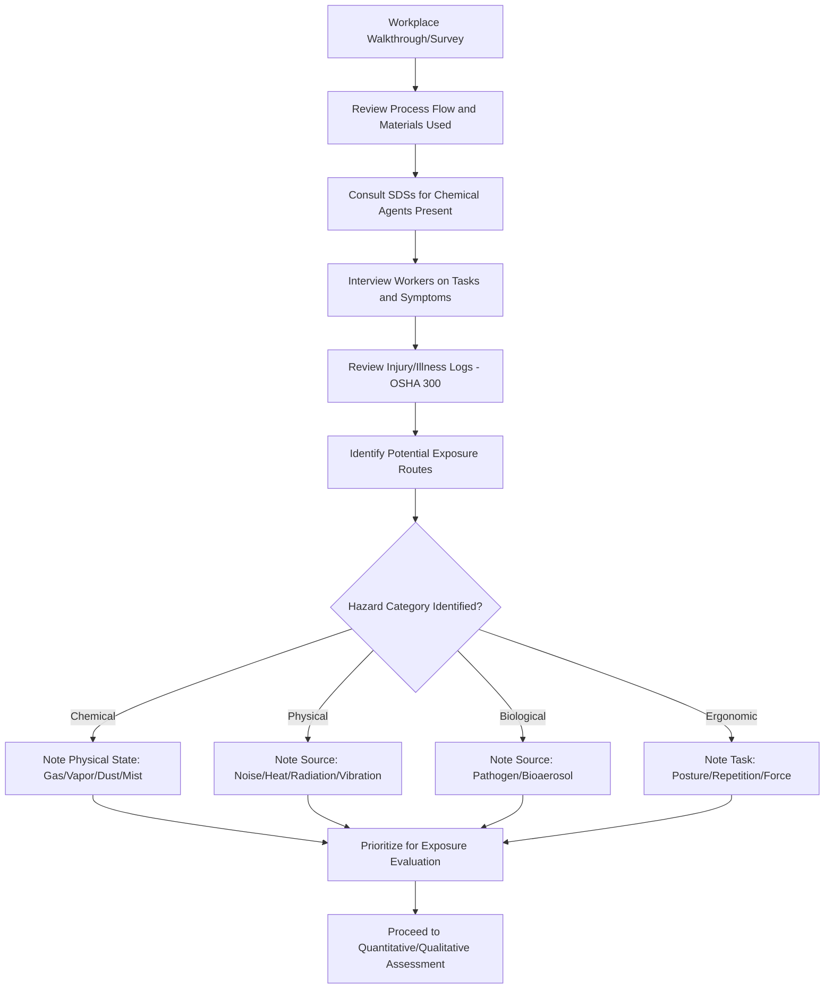

## Recognizing Health Hazards in the Workplace

### Overview

Hazard recognition is the foundational discipline of industrial hygiene, comprising the systematic identification of agents and conditions in the workplace capable of causing illness, impairment, or disease. It is the first of the four classical industrial hygiene functions: **Anticipation, Recognition, Evaluation, and Control (AREC)**. Without accurate recognition, subsequent exposure evaluation and control measures cannot be properly targeted.

Health hazards differ from safety hazards in that their effects are often insidious—developing gradually through repeated or prolonged exposure rather than through a single acute traumatic event—which makes systematic recognition methodologies essential rather than optional.

### Categories of Workplace Health Hazards

**1. Chemical Hazards**

- Gases, vapors, dusts, fumes, mists, and liquids
- Routes of entry: inhalation, dermal absorption, ingestion, injection
- Examples: solvents, heavy metals, respirable silica, isocyanates

**2. Physical Hazards**

- Noise (occupational hearing loss)
- Vibration (hand-arm vibration syndrome, whole-body vibration)
- Thermal stress (heat stress, cold stress)
- Ionizing radiation (X-rays, gamma radiation)
- Non-ionizing radiation (UV, laser, radiofrequency, microwave)
- Barometric pressure extremes (diving, hyperbaric work)

**3. Biological Hazards**

- Bacteria, viruses, fungi, molds
- Bloodborne pathogens
- Bioaerosols in agricultural, healthcare, or waste management settings

**4. Ergonomic Hazards**

- Repetitive motion, awkward postures, forceful exertion
- Manual material handling
- Vibration combined with force (compounding musculoskeletal risk)

**5. Psychosocial Hazards**

- Work-related stress, shift work, workplace violence potential
- [Inference] Psychosocial hazards are increasingly recognized within industrial hygiene scope, though their evaluation methodologies differ substantially from traditional exposure monitoring techniques used for chemical/physical agents.

### Hazard Recognition Methodology

### Recognition Tools and Techniques

**Key Points**

- **Walkthrough surveys**: Systematic visual inspection of work areas, processes, and tasks to identify potential hazard sources.
- **Material and process review**: Analysis of raw materials, intermediates, byproducts, and chemical inventories (SDS review is central here).
- **Worker interviews**: Frontline workers often possess critical knowledge of actual (versus assumed) task conditions and symptom patterns.
- **Review of injury/illness records**: OSHA 300 logs, workers' compensation claims, and near-miss reports can reveal patterns suggesting unrecognized hazards.
- **Job hazard analysis (JHA)**: Task-by-task breakdown to identify hazard exposure points within a specific job.
- **Similar exposure group (SEG) analysis**: Grouping workers with similar tasks/exposures to identify representative hazard profiles.
- **Odor and sensory cues**: While unreliable as a sole method (many hazardous substances lack detectable odor at harmful concentrations, and olfactory fatigue can occur), sensory observations can prompt further investigation.

### Routes of Entry for Chemical Health Hazards

| Route | Description | Example Agents |
| --- | --- | --- |
| Inhalation | Most common route in occupational settings; absorption via respiratory tract | Solvent vapors, welding fumes, respirable dust |
| Dermal (skin) absorption | Direct contact leading to systemic absorption or local irritation | Organic solvents, pesticides, phenol |
| Ingestion | Typically via contaminated hands, food, or surfaces (often preventable via hygiene practices) | Lead dust, other heavy metal particulates |
| Injection | Puncture wounds introducing substances directly into tissue/bloodstream | Needlestick injuries, high-pressure injection injuries |

### Acute vs. Chronic Health Effects

**Acute effects**: Occur rapidly following short-term, often high-level exposure (e.g., chemical burns, acute respiratory irritation, carbon monoxide poisoning).

**Chronic effects**: Develop over prolonged exposure periods, often with long latency before symptom onset (e.g., silicosis, noise-induced hearing loss, occupational cancers, chronic solvent-induced neurotoxicity).

[Inference] Chronic effects are generally more challenging to recognize in the field because the causal link between exposure and effect may not be apparent for years or decades, making historical exposure records and epidemiological surveillance particularly important for chronic hazard recognition.

### Dose-Response Relationship

$$\text{Response} = f(\text{Dose}, \text{Duration}, \text{Route}, \text{Individual Susceptibility})$$

Understanding that toxicity is generally dose-dependent (per the foundational toxicological principle attributed to Paracelsus—"the dose makes the poison") is central to hazard recognition: even substances generally regarded as benign can pose hazards at sufficient concentration or duration, while highly toxic substances may pose negligible risk at very low, well-controlled exposure levels.

### Example: Recognition in a Metal Fabrication Shop

A walkthrough survey of a metal fabrication facility identifies the following potential health hazards through systematic recognition:

1. **Chemical**: Welding fume containing manganese and hexavalent chromium (from stainless steel welding) — inhalation route.
2. **Physical**: Noise from grinding and cutting operations exceeding conversational levels — potential hearing hazard.
3. **Physical**: Non-ionizing radiation (UV) from arc welding processes — eye and skin hazard.
4. **Ergonomic**: Repetitive overhead work during pipe fitting — musculoskeletal strain risk.
5. **Chemical**: Solvent-based degreasers used in parts cleaning — dermal and inhalation hazard.

Each identified hazard is then documented for prioritization in the subsequent exposure evaluation phase (quantitative air monitoring, noise dosimetry, ergonomic assessment).

### Recognition Resources and Reference Sources

- **Safety Data Sheets (SDS)**: Primary source for chemical-specific hazard information.
- **NIOSH Pocket Guide to Chemical Hazards**: Reference for exposure limits and health effects.
- **ACGIH Threshold Limit Values (TLVs) documentation**: Includes hazard basis rationale.
- **OSHA Substance-Specific Standards**: For regulated substances (e.g., lead, asbestos, silica, benzene) with dedicated recognition and monitoring requirements.
- **Industry-specific hazard alerts**: OSHA Hazard Alerts, NIOSH Health Hazard Evaluations (HHEs).

### Common Recognition Pitfalls

- Relying solely on odor or visible symptoms, missing hazards from odorless or delayed-effect agents (e.g., carbon monoxide, many solvent vapors above safe limits).
- Overlooking hazards from byproducts or reaction intermediates not present in raw material inventories.
- Failing to consider combined/synergistic effects of multiple simultaneous exposures (e.g., noise plus ototoxic chemical exposure).
- Under-recognizing ergonomic and psychosocial hazards due to their less visible, cumulative nature compared to acute chemical/physical hazards.
- Assuming historical "normal" conditions are safe without verification, particularly when processes or materials have changed over time.

### Integration with the Industrial Hygiene Process

Recognition feeds directly into the subsequent AREC stages:

- **Anticipation**: Often occurs before recognition, using process knowledge to predict hazards before they materialize (e.g., anticipating silica exposure before a concrete cutting process begins).
- **Evaluation**: Quantitative/qualitative assessment (air sampling, noise dosimetry) targets the specific hazards identified during recognition.
- **Control**: The hierarchy of controls (elimination, substitution, engineering, administrative, PPE) is applied to hazards confirmed through recognition and evaluation.

**Next Steps**

- Exposure Evaluation Methods and Air Sampling Strategies
- Occupational Exposure Limits: PELs, TLVs, and RELs
- Hierarchy of Controls for Health Hazard Mitigation
- Industrial Hygiene Monitoring Program Design
- Job Hazard Analysis (JHA) Methodology
- Occupational Noise Exposure and Hearing Conservation Programs