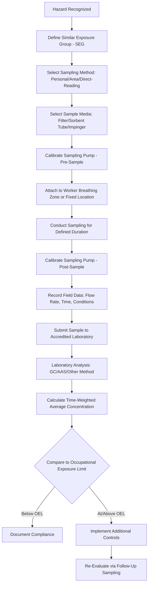

## Exposure Monitoring and Sampling Methods

### Overview

Exposure monitoring and sampling constitute the **Evaluation** function within the industrial hygiene AREC framework (Anticipation, Recognition, Evaluation, Control). Once a health hazard has been recognized, exposure monitoring quantifies or qualifies the degree of worker exposure, enabling comparison against occupational exposure limits (OELs) and informing the selection of appropriate controls. Monitoring may address chemical, physical (noise, heat, radiation), or biological agents, using methods ranging from direct-reading instruments to laboratory-analyzed sample media.

### Purposes of Exposure Monitoring

- Determine compliance with regulatory exposure limits (e.g., OSHA PELs)
- Characterize baseline exposure profiles for similar exposure groups (SEGs)
- Evaluate the effectiveness of implemented controls (before/after comparisons)
- Support medical surveillance program triggers
- Investigate worker complaints or suspected overexposure incidents
- Provide documentation for regulatory compliance and litigation defense

### Types of Chemical Exposure Sampling

**1. Personal Sampling**

- Sampling device worn by the worker (typically in the breathing zone, within approximately a 10-inch radius of the nose/mouth)
- Represents the most accurate estimate of an individual's actual inhalation exposure
- Required for compliance determinations under most OSHA substance-specific standards

**2. Area Sampling**

- Fixed-location sampling, not attached to an individual worker
- Used to characterize general workplace air quality, identify emission sources, or evaluate engineering control effectiveness
- Not typically used alone for regulatory compliance determinations since it does not represent individual exposure

**3. Direct-Reading Instruments**

- Provide real-time or near-real-time concentration readings (e.g., photoionization detectors (PIDs), combustible gas indicators, colorimetric tubes)
- Useful for immediate hazard assessment, leak detection, and confined space entry evaluation
- [Inference] Generally less precise than laboratory analytical methods for compliance-level accuracy, though modern direct-reading technology has narrowed this gap for many applications.

**4. Integrated Sampling**

- Air drawn through a collection medium (filter, sorbent tube, impinger) over a defined sampling period using a calibrated pump
- Sample subsequently analyzed in an accredited laboratory (e.g., via gas chromatography, atomic absorption spectroscopy)
- Provides time-weighted average (TWA) concentration data suitable for compliance comparison

### Sampling Strategy Workflow

### Common Sampling Media by Contaminant Type

| Contaminant Type | Typical Sampling Media | Analytical Method |
| --- | --- | --- |
| Organic vapors (solvents) | Charcoal sorbent tubes | Gas chromatography (GC) |
| Particulates/dusts (total or respirable) | Mixed cellulose ester (MCE) or PVC filters | Gravimetric analysis |
| Metals (e.g., lead, chromium) | MCE filters | Atomic absorption spectroscopy (AAS) or ICP |
| Respirable crystalline silica | PVC filters with cyclone pre-selector | X-ray diffraction or infrared spectroscopy |
| Aldehydes (e.g., formaldehyde) | Impregnated sorbent tubes or impingers | High-performance liquid chromatography (HPLC) |
| Asbestos fibers | MCE filters | Phase contrast microscopy (PCM) or TEM |

### Time-Weighted Average (TWA) Calculation

For exposures involving multiple sampling periods at different concentrations across a work shift, the 8-hour TWA is calculated as:

$$TWA = \frac{C_1T_1 + C_2T_2 + \cdots + C_nT_n}{8}$$

Where $C_n$ represents the concentration measured during period $n$, and $T_n$ represents the duration in hours of that period. This calculated TWA is then compared against the applicable 8-hour OEL (e.g., OSHA PEL, ACGIH TLV-TWA).

**Example**

A worker's personal air sampling during an 8-hour shift yields the following results for a solvent vapor:

- Period 1: 2 hours at 150 ppm
- Period 2: 4 hours at 80 ppm
- Period 3: 2 hours at 40 ppm

$$TWA = \frac{(150)(2) + (80)(4) + (40)(2)}{8} = \frac{300 + 320 + 80}{8} = \frac{700}{8} = 87.5 \text{ ppm}$$

If the applicable PEL is 100 ppm TWA, this result of 87.5 ppm would indicate compliance, though it remains close enough to the limit to warrant continued monitoring and consideration of exposure reduction measures.

### Physical Agent Monitoring Methods

**Noise Monitoring**

- **Sound level meters**: Instantaneous measurements at fixed points
- **Noise dosimeters**: Worn by workers to capture cumulative dose over a shift, expressed as a percentage of allowable daily noise dose
- **Octave band analysis**: Frequency-specific measurement to inform engineering control design (e.g., identifying dominant frequency for hearing protector selection)

**Heat Stress Monitoring**

- **Wet Bulb Globe Temperature (WBGT)**: Composite index accounting for temperature, humidity, radiant heat, and air movement
- Compared against ACGIH TLV-based screening criteria adjusted for workload and clothing

**Ionizing Radiation Monitoring**

- **Dosimeters** (film badges, TLDs, electronic personal dosimeters): Worn to measure cumulative radiation dose
- **Survey meters/Geiger counters**: Area-based real-time detection

### Sampling Duration Strategies

- **Full-shift sampling**: Captures the entire work shift for direct TWA comparison against 8-hour OELs.
- **Task-based/short-term sampling**: Captures discrete high-exposure tasks, useful for identifying peak exposure periods and evaluating Short-Term Exposure Limits (STELs).
- **Ceiling measurements**: Instantaneous or very short-duration sampling for substances with ceiling limits that must never be exceeded, even momentarily.

### Statistical Considerations in Exposure Assessment

Because exposure measurements exhibit natural variability, a single sample is generally insufficient to characterize an SEG's exposure profile with confidence. Industrial hygiene practice (per AIHA methodology) typically involves:

- Collecting multiple samples across different days/workers within an SEG
- Applying statistical analysis (e.g., calculating the 95th percentile exposure estimate) rather than relying on a single measurement
- Using a lognormal distribution model, as occupational exposure data commonly follows this pattern rather than a normal distribution

[Unverified] The specific statistical thresholds and number of samples recommended for high confidence exposure characterization vary by AIHA guidance version and specific application; current AIHA Exposure Assessment Strategies guidance should be consulted for precise sampling number recommendations.

### Quality Assurance in Sampling

**Key Points**

- Calibrate sampling pumps before and after each sampling event using a calibrated flow standard.
- Use field blanks and laboratory blanks to detect contamination unrelated to actual workplace exposure.
- Maintain proper chain-of-custody documentation from field collection through laboratory analysis.
- Use NIOSH, OSHA, or equivalent validated analytical methods appropriate to the specific contaminant.
- Ensure laboratory accreditation (e.g., AIHA-LAP accredited laboratories) for defensible compliance data.

### Common Sampling Pitfalls

- Sampling during atypical conditions (e.g., low production days) that do not represent worst-case or typical exposure.
- Failing to properly calibrate pumps, leading to inaccurate flow rate and therefore inaccurate concentration calculations.
- Placing area samples in locations that do not represent actual worker breathing zones and using this data inappropriately for compliance determinations.
- Insufficient sample duration for the analytical method's limit of detection, producing non-detectable but inconclusive results.
- Ignoring short-term peak exposures when only full-shift TWA sampling is conducted, missing STEL or ceiling limit exceedances.

### Integration with Broader Industrial Hygiene Program

- **Occupational Exposure Limits**: Sampling results are only meaningful when compared against validated OELs (OSHA PELs, ACGIH TLVs, NIOSH RELs).
- **Medical Surveillance**: Exposure monitoring results often trigger or inform medical surveillance program requirements under substance-specific OSHA standards.
- **Hierarchy of Controls**: Monitoring data drives decisions on which control level (elimination through PPE) is necessary and evaluates control effectiveness after implementation.
- **Respiratory Protection Program**: Exposure data determines required respirator assigned protection factors (APFs) when engineering/administrative controls alone are insufficient.

**Next Steps**

- Occupational Exposure Limits: PELs, TLVs, and RELs
- Hierarchy of Controls for Health Hazard Mitigation
- Respiratory Protection Program Requirements
- Medical Surveillance Program Design
- Similar Exposure Group (SEG) Determination Methodology
- Noise Exposure Assessment and Hearing Conservation Programs