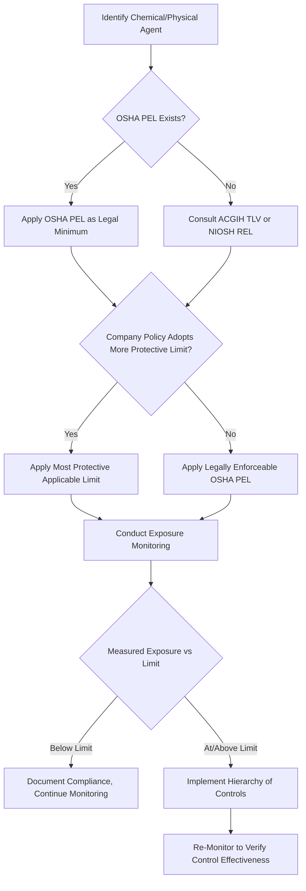

## Permissible Exposure Limits and Threshold Limit Values

### Overview

Occupational Exposure Limits (OELs) are quantitative benchmarks representing airborne concentrations of chemical substances or physical agents to which most workers may be exposed without experiencing adverse health effects. The two most prominent OEL systems in U.S. industrial hygiene practice are OSHA's **Permissible Exposure Limits (PELs)**, which carry legal regulatory force, and the American Conference of Governmental Industrial Hygienists' (ACGIH) **Threshold Limit Values (TLVs)**, which are voluntary guidelines updated more frequently based on evolving toxicological science.

Understanding the distinction between these systems—and additional limits such as NIOSH Recommended Exposure Limits (RELs)—is essential because they often diverge in numerical value, reflecting differences in scientific basis, update frequency, and legal authority.

### Regulatory and Advisory Bodies

**OSHA PELs**

- Legally enforceable limits established under 29 CFR 1910.1000 (Subpart Z) and substance-specific standards
- Many PELs originated from 1968 ACGIH TLVs adopted during OSHA's 1971 rulemaking and have not been comprehensively updated since, despite subsequent toxicological advances
- [Inference] This vintage basis means many current OSHA PELs are considered outdated relative to modern scientific understanding, though they remain the legally enforceable minimum standard.

**ACGIH TLVs**

- Voluntary, science-based guidelines developed and updated annually by ACGIH, a professional association (not a government regulatory body)
- Not legally enforceable in themselves, but frequently adopted as best-practice benchmarks and sometimes incorporated by reference into state regulations or company internal standards
- Generally more current and often more conservative (protective) than OSHA PELs

**NIOSH RELs**

- Recommended by the National Institute for Occupational Safety and Health, a research agency (not a regulatory enforcement body)
- Often the most conservative of the three systems, based purely on health protection research without the economic/feasibility considerations that can factor into OSHA rulemaking

### Comparison of OEL Systems

| Aspect | OSHA PEL | ACGIH TLV | NIOSH REL |
| --- | --- | --- | --- |
| Legal status | Legally enforceable | Voluntary guideline | Recommendation, non-enforceable |
| Issuing body | Federal regulatory agency | Professional association | Federal research agency |
| Update frequency | Infrequent (many unchanged since 1971) | Annual review | Periodic, science-driven |
| Basis | Regulatory/legal rulemaking process (includes feasibility considerations) | Toxicological/epidemiological science | Health-protective research basis |
| General relative stringency | Often least protective (oldest basis) | Frequently more protective | Frequently most protective |

### Types of Exposure Limits

**1. Time-Weighted Average (TWA)**

- The average airborne concentration over a normal 8-hour workday, typically a 40-hour workweek
- Most common limit type; allows for fluctuation above and below the limit provided the time-weighted average does not exceed it

**2. Short-Term Exposure Limit (STEL)**

- A 15-minute TWA that should not be exceeded at any time during the workday, even if the 8-hour TWA remains within limits
- Applies to substances with acute effects from brief high-level exposure

**3. Ceiling Limit (C)**

- A concentration that must never be exceeded, even momentarily, during any part of the working exposure
- Applied to substances with severe acute effects at high concentrations (e.g., certain irritants)

**4. Excursion Limits**

- ACGIH guidance for TLV-TWA substances lacking a specific STEL, generally limiting short-term excursions to a defined multiple of the TWA

### Exposure Limit Types Illustrated (svg_diagram)

<svg xmlns="http://www.w3.org/2000/svg" viewBox="0 0 700 380">
<text x="350" y="25" font-size="16" font-weight="bold" text-anchor="middle" fill="#1a1a1a">Exposure Limit Types Over an 8-Hour Shift (svg_diagram)</text>
<line x1="60" y1="320" x2="660" y2="320" stroke="#333" stroke-width="2" />
<line x1="60" y1="320" x2="60" y2="60" stroke="#333" stroke-width="2" />
<text x="30" y="325" font-size="11" fill="#333">0</text>
<text x="20" y="70" font-size="11" fill="#333">Conc.</text>
<text x="360" y="355" font-size="12" fill="#333" text-anchor="middle">Time (hours) →</text>
<line x1="60" y1="230" x2="660" y2="230" stroke="#4a6fa5" stroke-width="2" stroke-dasharray="6,3" />
<text x="665" y="234" font-size="11" fill="#4a6fa5">TWA Limit</text>
<line x1="60" y1="140" x2="660" y2="140" stroke="#c0654a" stroke-width="2" stroke-dasharray="6,3" />
<text x="665" y="144" font-size="11" fill="#c0654a">STEL</text>
<line x1="60" y1="80" x2="660" y2="80" stroke="#a02020" stroke-width="2" />
<text x="665" y="84" font-size="11" fill="#a02020">Ceiling</text>
<polyline points="60,290 120,285 180,260 240,150 280,150 320,270 380,275 440,190 480,120 520,190 580,280 660,290" fill="none" stroke="#2a2a2a" stroke-width="2.5" />
<circle cx="480" cy="120" r="4" fill="#a02020" />
<text x="480" y="105" font-size="10" text-anchor="middle" fill="#a02020">Peak task exposure</text>

<text x="360" y="370" font-size="10" text-anchor="middle" fill="#666">Actual exposure (solid) may exceed STEL briefly but must never exceed Ceiling; 8-hr average must stay below TWA line.</text>

</svg>

### TWA Compliance Determination

For a measured 8-hour TWA to be considered compliant, it must satisfy:

$$TWA_{measured} \leq OEL_{TWA}$$

However, compliance additionally requires that no 15-minute period exceeds the applicable STEL (if established) and that instantaneous concentrations never exceed a Ceiling limit (if established). A substance may show a compliant 8-hour TWA while still violating a STEL during a specific high-exposure task, which is why full-shift TWA data alone is insufficient for complete compliance assessment.

### Exposure Limit Selection Workflow

### Additional OEL Concepts

**Immediately Dangerous to Life or Health (IDLH)**

- NIOSH-established concentration representing an exposure level likely to cause death or immediate/delayed permanent adverse health effects, or that would impair the ability to escape from a dangerous atmosphere
- Used primarily for respirator selection and confined space entry decisions, not for routine TWA compliance

**Action Level**

- A concentration (typically half the PEL for many OSHA substance-specific standards) that triggers specific program requirements (e.g., increased monitoring, medical surveillance) even before the full PEL is reached
- Intended to prompt proactive management before exposure approaches the enforceable limit

**Biological Exposure Indices (BEIs)**

- ACGIH-established reference values for biological monitoring (e.g., blood, urine metabolite levels) reflecting the biological uptake of a substance, complementing air-based OELs
- [Inference] BEIs are particularly useful for substances with significant dermal absorption routes, where air monitoring alone may underestimate total body burden.

### Example: Applying Multiple Limit Types

A worker in a printing operation is exposed to toluene throughout an 8-hour shift, with a brief high-intensity task (cleaning rollers with toluene-soaked rags) lasting 20 minutes.

- **OSHA PEL (TWA)**: 200 ppm
- **ACGIH TLV-TWA**: 20 ppm [Unverified — specific current-year TLV values should be verified against the current ACGIH publication, as these are updated annually]
- **ACGIH STEL**: applicable short-term value should be checked against current ACGIH documentation

If the facility has adopted ACGIH TLVs as an internal standard (more protective than the legally enforceable OSHA PEL), both the 8-hour TWA and any 15-minute STEL during the roller-cleaning task must be evaluated against the ACGIH values, not merely the older OSHA PEL, to meet the company's internal safety commitment.

[Unverified] Exact current numerical exposure limit values for specific substances change periodically and should always be verified against the current-year ACGIH TLV booklet or the current OSHA 1910.1000 Table Z, as this content should not be relied upon for precise regulatory compliance figures.

### Common Misapplication Pitfalls

- Assuming compliance with a PEL automatically means the exposure is safe by modern scientific standards, given the outdated basis of many OSHA PELs.
- Applying only a TWA comparison while ignoring applicable STEL or Ceiling limits for the same substance.
- Confusing NIOSH RELs or ACGIH TLVs with legally enforceable limits in a regulatory compliance context (only OSHA PELs, and applicable state-plan equivalents, carry direct OSHA enforcement authority).
- Failing to account for combined exposure to multiple substances with additive toxicological effects (mixture exposure formulas may be required under some OSHA standards).
- Using outdated reference tables instead of the current-year ACGIH TLV booklet, given annual revisions.

### Mixture Exposure Considerations

When workers are exposed to multiple hazardous substances with similar toxicological target organs/effects, OSHA guidance (per 1910.1000(d)(2)(i)) provides an additive formula:

$$E_m = \frac{C_1}{L_1} + \frac{C_2}{L_2} + \cdots + \frac{C_n}{L_n}$$

Where $C_n$ is the measured concentration of substance $n$ and $L_n$ is its respective exposure limit. If $E_m$ exceeds 1, the mixture exposure is considered to exceed the combined permissible limit, even if no individual substance exceeds its own limit.

### Integration with Broader Industrial Hygiene Program

- **Exposure Monitoring**: OELs provide the comparison benchmark against which sampling results are evaluated.
- **Hierarchy of Controls**: Exceedance of an OEL triggers the control selection process.
- **Medical Surveillance**: Action levels and specific substance PELs often trigger mandatory medical surveillance program enrollment.
- **Respiratory Protection**: IDLH values and PEL exceedances inform respirator selection and assigned protection factor requirements.

**Next Steps**

- Exposure Monitoring and Sampling Methods
- Hierarchy of Controls for Health Hazard Mitigation
- Respiratory Protection Program Requirements
- Medical Surveillance Program Design
- Substance-Specific OSHA Standards (Lead, Silica, Benzene, Asbestos)
- Biological Monitoring and Biological Exposure Indices