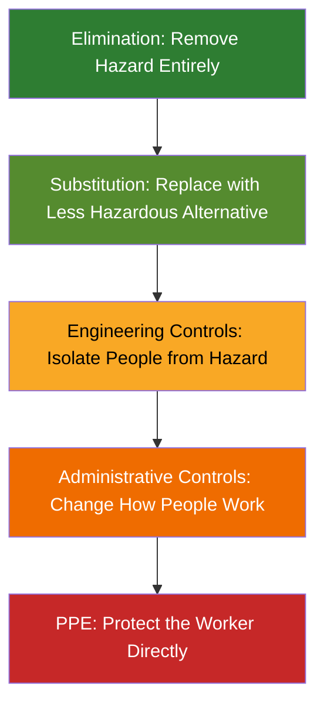
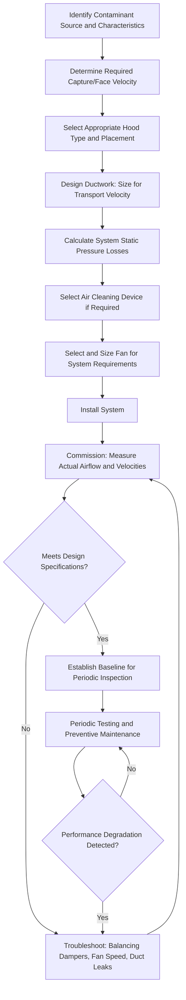

## Ventilation and Engineering Controls for Exposure

### Overview

Engineering controls represent the third tier of the hierarchy of controls, positioned above administrative controls and PPE, and below elimination and substitution. Engineering controls physically modify the workplace, process, or equipment to reduce or eliminate hazardous exposure at its source, rather than relying on worker behavior or protective equipment. Ventilation—both general (dilution) and local exhaust—constitutes the most common engineering control category for airborne chemical and particulate hazards in industrial hygiene practice.

The fundamental principle underlying engineering controls is that they act independently of worker behavior once properly designed, installed, and maintained, making them inherently more reliable than controls dependent on consistent human compliance.

### Hierarchy of Controls Context

Engineering controls sit in the middle of this hierarchy: more reliable and protective than administrative measures or PPE, but generally requiring greater capital investment than eliminating or substituting the hazard.

### Categories of Ventilation Engineering Controls

**1. Local Exhaust Ventilation (LEV)**

- Captures contaminants at or near the point of generation before they disperse into the general work area
- Consists of a hood, ductwork, air cleaning device (if required), and fan/air mover
- Generally more effective and energy-efficient than general ventilation for point-source contaminant control

**2. General (Dilution) Ventilation**

- Introduces and removes large volumes of air to dilute contaminant concentration throughout a space
- Appropriate for low-toxicity contaminants, uniformly distributed sources, or as a supplement to LEV
- Not suitable as a sole control for highly toxic substances or point sources of significant contamination

**3. Displacement Ventilation**

- Introduces clean air at low velocity, typically at floor level, displacing contaminated air upward and out through ceiling-level exhaust
- Common in cleanrooms and specific industrial applications requiring directional airflow control

**4. Push-Pull Ventilation**

- Combines a push (supply air jet) directing contaminants toward a pull (exhaust) system
- Used for large open-surface sources such as plating tanks or degreasing operations

### Local Exhaust Ventilation System Components

**Key Points**

- **Hood**: The capture device at the contaminant source; hood design (enclosing, capturing, or receiving) significantly affects capture efficiency
- **Ductwork**: Transports contaminated air from the hood to the air cleaning device and/or discharge point
- **Air cleaning device**: Removes contaminants before discharge (e.g., baghouse filters, cyclones, scrubbers, HEPA filtration) when required by environmental regulation or contaminant recirculation policy
- **Fan/air mover**: Provides the motive force to move air through the system, sized to overcome system resistance (static pressure losses)
- **Exhaust stack/discharge**: Releases cleaned or diluted air, positioned to prevent re-entrainment into building air intakes

### LEV System Diagram (svg_diagram)

<svg xmlns="http://www.w3.org/2000/svg" viewBox="0 0 700 350">
<text x="350" y="25" font-size="16" font-weight="bold" text-anchor="middle" fill="#1a1a1a">Local Exhaust Ventilation System (svg_diagram)</text>
<rect x="40" y="230" width="120" height="60" fill="#d6c9a8" stroke="#5a4a2a" stroke-width="1.5" />
<text x="100" y="265" font-size="11" text-anchor="middle" fill="#333">Process/Source</text>
<path d="M 100 230 L 100 190 Q 100 170 130 170 L 180 170" fill="none" stroke="#333" stroke-width="2" />
<polygon points="90,200 110,200 100,180" fill="#4a6fa5" />
<ellipse cx="150" cy="170" rx="30" ry="12" fill="#c8d8ec" stroke="#4a6fa5" stroke-width="1.5" />
<text x="150" y="150" font-size="10" text-anchor="middle" fill="#333">Hood</text>
<rect x="180" y="160" width="220" height="20" fill="none" stroke="#333" stroke-width="2" />
<text x="290" y="150" font-size="10" text-anchor="middle" fill="#333">Ductwork</text>
<polygon points="380,160 380,180 400,170" fill="#666" />
<rect x="420" y="130" width="90" height="80" fill="#e8e8e8" stroke="#333" stroke-width="1.5" />
<text x="465" y="170" font-size="10" text-anchor="middle" fill="#333">Air Cleaning</text>
<text x="465" y="184" font-size="10" text-anchor="middle" fill="#333">Device</text>
<circle cx="580" cy="170" r="35" fill="#f5e6c8" stroke="#8a6a2a" stroke-width="2" />
<text x="580" y="174" font-size="10" text-anchor="middle" fill="#333">Fan</text>
<polygon points="565,160 565,180 590,170" fill="#8a6a2a" />
<line x1="615" y1="170" x2="660" y2="170" stroke="#333" stroke-width="2" />
<line x1="660" y1="170" x2="660" y2="90" stroke="#333" stroke-width="2" />
<path d="M 645 90 L 660 60 L 675 90" fill="none" stroke="#333" stroke-width="2" />
<text x="660" y="50" font-size="10" text-anchor="middle" fill="#333">Discharge Stack</text>

<text x="350" y="330" font-size="10" text-anchor="middle" fill="#666">Airflow: Source → Hood → Ductwork → Air Cleaning → Fan → Discharge</text>

</svg>

### Key Ventilation Design Parameters

**Capture Velocity**

- The air velocity at a given point in front of the hood necessary to overcome opposing air currents and capture contaminants, drawing them into the hood
- Required capture velocity varies by contaminant release condition (e.g., released with little velocity into quiet air requires lower capture velocity than high-velocity spray operations)

**Face Velocity**

- The average air velocity across the face (opening) of an enclosing hood, such as a laboratory fume hood
- Typically specified as a design range (e.g., commonly cited target ranges exist for fume hood sash openings, though specific values depend on hood design and applicable consensus standards)

**Duct Velocity (Transport Velocity)**

- Minimum air velocity within ductwork necessary to keep particulates entrained in the airstream and prevent settling, which could cause duct blockages or fire hazards from accumulated combustible dust
- Required transport velocity varies significantly by contaminant type (e.g., light dusts require lower velocities than heavy metal dusts or moist materials)

**Static Pressure**

- The resistance to airflow throughout the ventilation system (hood entry loss, duct friction loss, air cleaning device pressure drop)
- Fan selection must account for total system static pressure to achieve design airflow volume

[Unverified] Specific numerical design values for capture velocity ranges, duct transport velocities, and face velocities vary by contaminant, industry consensus standard (e.g., ACGIH Industrial Ventilation Manual), and specific application; current edition design guidance should be consulted rather than relying on generalized figures for actual system design.

### Ventilation System Design and Evaluation Workflow

### Non-Ventilation Engineering Controls

Engineering controls extend beyond ventilation and include:

- **Process enclosure/isolation**: Physically separating the hazardous process from workers (e.g., glove boxes, remote operation booths)
- **Automation/robotics**: Removing the worker from direct proximity to the hazard entirely
- **Wet methods**: Suppressing dust generation through water application (e.g., wet cutting/drilling for silica dust control)
- **Vibration damping/isolation**: Reducing transmitted vibration from equipment to operator
- **Noise engineering controls**: Equipment enclosures, acoustic barriers, mufflers, and vibration isolation to reduce noise at the source
- **Machine guarding**: While primarily a safety (not health) control, guarding is a core engineering control category

### Example: Engineering Controls for a Welding Operation

A facility identifies excessive welding fume exposure during stainless steel welding (hexavalent chromium and manganese). The engineering control solution includes:

1. **Source capture LEV**: A flexible fume extraction arm positioned near the welding arc to capture fume at the point of generation, rather than relying on general room ventilation alone.
2. **Portable fume extractors**: For mobile welding tasks where fixed LEV is impractical.
3. **Downdraft welding tables**: For fabrication of smaller components, drawing fume downward away from the welder's breathing zone.
4. **HEPA filtration**: On the extraction system exhaust, given the carcinogenic classification of hexavalent chromium, to prevent recirculation of captured contaminant if air is returned to the workspace.

Post-installation air sampling confirms exposure reduction, with continued periodic monitoring to verify sustained control effectiveness as ductwork, filters, and fan performance degrade over time.

### Effectiveness Comparison: LEV vs. General Ventilation

| Factor | Local Exhaust Ventilation | General/Dilution Ventilation |
| --- | --- | --- |
| Contaminant control point | At the source | Throughout the room |
| Effectiveness for high-toxicity substances | High (recommended) | Generally insufficient alone |
| Energy efficiency | Higher (smaller air volumes exhausted) | Lower (large volumes of conditioned air often exhausted) |
| Applicability to point sources | Well-suited | Poorly suited |
| Applicability to widely dispersed, low-toxicity sources | Less practical | Well-suited |
| Capital cost | Generally higher (hood/duct design specificity) | Generally lower for simple applications |

### Maintenance and Performance Verification

**Key Points**

- Ventilation systems degrade over time due to duct leaks, filter loading, damper drift, and fan wear—performance must be periodically re-verified, not assumed to remain constant after initial installation.
- Static pressure gauges and airflow indicators should be installed and monitored to detect performance degradation before it results in exposure exceedance.
- Hood static pressure or face velocity checks should be part of a routine preventive maintenance schedule.
- Air cleaning devices (filters, scrubbers) require scheduled replacement/regeneration per manufacturer specifications and observed loading conditions.

### Common Engineering Control Pitfalls

- Relying on general dilution ventilation for high-toxicity or point-source contaminants where LEV is required for adequate control.
- Positioning hoods too far from the contaminant source, since capture velocity diminishes rapidly (following an inverse relationship) with distance from the hood opening.
- Neglecting ongoing maintenance, allowing gradual performance degradation to go undetected until exposure monitoring reveals a compliance issue.
- Recirculating exhaust air containing hazardous contaminants without adequate air cleaning, particularly for carcinogens or other substances where recirculation policy is restricted.
- Failing to account for cross-drafts, open doors, or competing airflow sources that can defeat hood capture effectiveness.

### Integration with Broader Industrial Hygiene Program

- **Hierarchy of Controls**: Engineering controls are prioritized above administrative controls and PPE per OSHA's hierarchy.
- **Exposure Monitoring**: Pre- and post-installation sampling verifies engineering control effectiveness.
- **Respiratory Protection**: Effective engineering controls can reduce or eliminate the need for respiratory protection, per the hierarchy's preference for controls over PPE.
- **Process Safety Management**: For PSM-covered processes, engineering controls often intersect with process design and Process Hazard Analysis (PHA) recommendations.

**Next Steps**

- Hierarchy of Controls for Health Hazard Mitigation
- Administrative Controls and Work Practice Controls
- Respiratory Protection Program Requirements
- Combustible Dust Hazards and Ductwork Design Considerations
- Permissible Exposure Limits and Threshold Limit Values
- Preventive Maintenance Programs for Safety-Critical Equipment