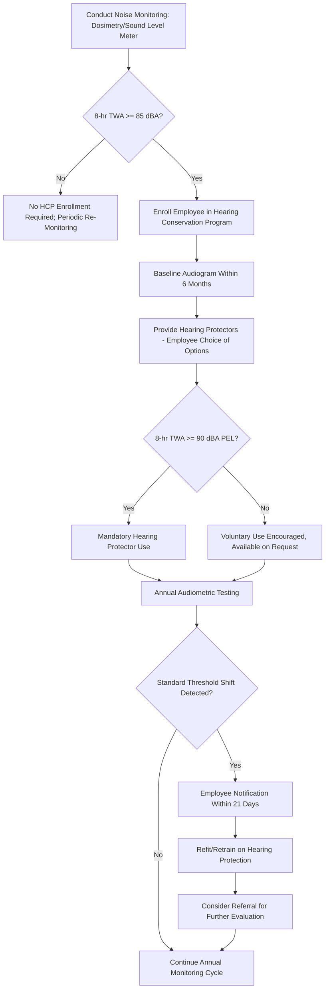

## Noise Exposure and Hearing Conservation

### Overview

Occupational noise exposure is one of the most prevalent physical health hazards across industrial sectors, and noise-induced hearing loss (NIHL) remains among the most common recognized occupational illnesses. Because NIHL develops gradually, is painless, and is irreversible once it occurs, a structured **Hearing Conservation Program (HCP)** is required under OSHA's Occupational Noise Exposure Standard, 29 CFR 1910.95, whenever employee noise exposure reaches specified action levels.

Unlike many chemical hazards, noise exposure control relies heavily on an integrated combination of engineering controls, administrative controls, monitoring, and personal protective equipment, since complete elimination of noise sources is frequently technically or economically impractical in many industrial settings.

### Regulatory Basis

- **OSHA 29 CFR 1910.95**: Occupational Noise Exposure standard, establishing the Permissible Exposure Limit (PEL), Action Level, and Hearing Conservation Program requirements.
- **OSHA PEL**: 90 dBA as an 8-hour TWA, using a 5 dB exchange rate (doubling/halving of allowable exposure time for each 5 dB change).
- **Action Level**: 85 dBA as an 8-hour TWA, which triggers mandatory Hearing Conservation Program enrollment even though it is below the enforceable PEL.
- **NIOSH REL**: 85 dBA using a more conservative 3 dB exchange rate, reflecting NIOSH's more protective, non-regulatory recommendation.

### Understanding the Decibel Scale and Exchange Rate

The decibel (dB) scale is logarithmic, meaning equal increments represent multiplicative increases in sound energy, not additive ones. Under OSHA's 5 dB exchange rate, permissible exposure duration is calculated as:

$$T = \frac{8}{2^{(L-90)/5}}$$

Where $T$ is the permitted exposure duration in hours and $L$ is the measured sound level in dBA. This reflects that for every 5 dB increase above 90 dBA, the permissible exposure duration is halved.

**Example**: At 95 dBA, permissible exposure duration is:

$$T = \frac{8}{2^{(95-90)/5}} = \frac{8}{2^1} = 4 \text{ hours}$$

At 100 dBA:

$$T = \frac{8}{2^{(100-90)/5}} = \frac{8}{2^2} = 2 \text{ hours}$$

### OSHA Permissible Noise Exposure Table (5 dB Exchange Rate)

| Duration per Day (hours) | Sound Level (dBA, slow response) |
| --- | --- |
| 8 | 90 |
| 6 | 92 |
| 4 | 95 |
| 3 | 97 |
| 2 | 100 |
| 1.5 | 102 |
| 1 | 105 |
| 0.5 | 110 |
| 0.25 or less | 115 |

[Inference] This table reflects the OSHA 5 dB exchange rate specifically; the more conservative NIOSH 3 dB exchange rate would yield substantially shorter permissible durations at the same sound levels, illustrating the significant divergence between regulatory and best-practice recommendations.

### Hearing Conservation Program Required Elements

**Key Points**

- **Noise monitoring**: Identifying employees exposed at or above the 85 dBA action level, using sound level meters or noise dosimeters.
- **Audiometric testing**: Baseline audiogram within 6 months of first exposure at or above the action level, followed by annual audiograms to monitor for Standard Threshold Shift (STS).
- **Hearing protection**: Made available to all employees exposed at or above the action level; mandatory for employees exposed at or above the PEL (90 dBA TWA) or for those who have experienced an STS.
- **Training**: Annual training on the effects of noise, purpose and selection of hearing protectors, and audiometric testing procedures.
- **Recordkeeping**: Noise exposure measurements and audiometric test records must be retained per specified OSHA timeframes.

### Hearing Conservation Program Workflow

### Standard Threshold Shift (STS)

A Standard Threshold Shift is defined as an average shift of 10 dB or more at 2000, 3000, and 4000 Hz in either ear, compared to the baseline audiogram. Age correction may be applied to account for presbycusis (age-related hearing loss) when determining whether an STS has occurred. Upon confirmation of an STS:

- The employee must be notified in writing within 21 days of the determination
- Employees not already using hearing protectors must be fitted and trained
- Employees already using hearing protectors may need refitting, retraining, or provision of protectors with a higher noise reduction rating
- [Inference] A confirmed STS may also serve as a recordable illness under OSHA recordkeeping requirements (29 CFR 1904) if specific severity criteria are met, though determination of recordability involves additional criteria beyond STS alone.

### Hearing Protection Device Selection

**Noise Reduction Rating (NRR)**

- A laboratory-derived rating (in dB) indicating the theoretical noise attenuation provided by a hearing protector under ideal test conditions
- Real-world attenuation is typically substantially lower than the labeled NRR due to imperfect fit, wear compliance, and other factors

**OSHA De-Rating Approach** (for estimating real-world protection)

A commonly referenced approach applies a derating factor to the labeled NRR before calculating estimated worker exposure, reflecting the gap between laboratory and field performance:

$$\text{Estimated Exposure (dBA)} = \text{Measured Noise Level (dBA)} - \left[(\text{NRR} - 7) \times 0.5\right]$$

**Example**: For a measured noise level of 100 dBA and hearing protector labeled NRR of 25:

$$\text{Estimated Exposure} = 100 - [(25-7) \times 0.5] = 100 - 9 = 91 \text{ dBA}$$

[Unverified] Specific derating methodologies and factors have been the subject of OSHA guidance evolution over time; current OSHA guidance on hearing protector derating calculations should be consulted for precise compliance calculations, as approaches and recommended derating percentages have varied.

### Types of Hearing Protection

| Type | NRR Range (typical) | Advantages | Limitations |
| --- | --- | --- | --- |
| Foam earplugs (disposable) | Moderate to high | Low cost, disposable, widely available | Requires proper insertion technique for effectiveness |
| Pre-molded/reusable earplugs | Moderate | Reusable, faster insertion once fitted | Fit varies by ear canal size |
| Earmuffs | Moderate to high | Easy to fit, visible compliance verification | Less comfortable in heat, may interfere with other PPE |
| Custom-molded earplugs | Moderate to high | Individualized fit, often improved comfort/compliance | Higher cost, requires professional fitting |
| Dual protection (plugs + muffs) | Combined, not simply additive | Used for extremely high noise environments | Combined attenuation is not equal to the sum of individual NRRs |

### Engineering and Administrative Controls for Noise

Per the hierarchy of controls, engineering and administrative measures are preferred over reliance on hearing protection alone:

**Engineering Controls**

- Equipment enclosures and acoustic barriers/curtains
- Vibration isolation and damping to reduce structure-borne noise transmission
- Mufflers and silencers on pneumatic exhausts and engine equipment
- Equipment substitution with quieter alternative machinery
- Increased distance between noise source and worker (noise intensity diminishes with distance)

**Administrative Controls**

- Job rotation to limit individual daily noise dose
- Scheduling noisy operations during periods with fewer exposed workers
- Establishing quiet zones/break areas for auditory recovery periods

### Example: Hearing Conservation in a Stamping Plant

A metal stamping facility's noise monitoring reveals press operators experience an 8-hour TWA of 93 dBA. The facility response includes:

1. **Enrollment in HCP**: Since exposure exceeds both the 85 dBA action level and 90 dBA PEL.
2. **Baseline audiograms**: Conducted for all newly enrolled operators within 6 months.
3. **Mandatory hearing protection**: Since exposure exceeds the PEL, dual protection (earplugs plus earmuffs) is provided for operators working closest to the press dies.
4. **Engineering investigation**: Evaluation of press die acoustic enclosures and vibration damping mounts to reduce source noise.
5. **Annual audiometric testing and training**: Scheduled and documented per program requirements.
6. Follow-up monitoring after enclosure installation to verify noise reduction and potential reclassification of exposure levels.

### Common Hearing Conservation Program Pitfalls

- Relying solely on hearing protection without pursuing feasible engineering controls, contrary to the hierarchy of controls' preference.
- Improper hearing protector fit/insertion, substantially reducing real-world attenuation below labeled NRR.
- Failing to identify and enroll employees exposed at or above the 85 dBA action level, incorrectly focusing only on the 90 dBA PEL.
- Inadequate audiometric testing follow-up when an STS is identified (no retraining, refitting, or further evaluation).
- Using outdated or improperly calibrated dosimeters/sound level meters, producing inaccurate exposure classification.

### Integration with Broader Industrial Hygiene Program

- **Exposure Monitoring**: Noise dosimetry is a specialized application of the broader exposure evaluation function.
- **Hierarchy of Controls**: Engineering and administrative noise controls are prioritized above reliance on hearing protectors.
- **Medical Surveillance**: Audiometric testing functions as a medical surveillance component specific to noise exposure.
- **PPE Program**: Hearing protector selection, fitting, and training intersect with the broader personal protective equipment program.

**Next Steps**

- Exposure Monitoring and Sampling Methods
- Hierarchy of Controls for Health Hazard Mitigation
- Medical Surveillance Program Design
- Personal Protective Equipment Selection and Use
- Vibration Hazards and Hand-Arm Vibration Syndrome
- OSHA Recordkeeping Requirements for Occupational Illnesses