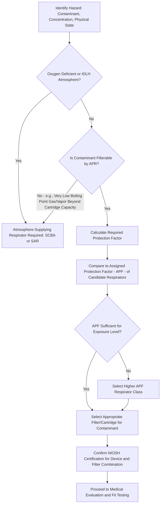

## Respiratory Protection Programs

### Overview

A Respiratory Protection Program (RPP) is the comprehensive administrative framework required whenever respirators are used in the workplace to protect employees from inhalation hazards, governed in the United States by OSHA's Respiratory Protection Standard, 29 CFR 1910.134. Respirators occupy the lowest tier of the hierarchy of controls, meaning they should be used only when engineering and administrative controls are infeasible or insufficient to reduce exposure below applicable limits, or during the interim period while such controls are being implemented.

Because respirator effectiveness depends heavily on proper selection, fit, use, and maintenance, OSHA requires a written program with a designated administrator whenever respirator use is not purely voluntary for particulate-free dust masks.

### Regulatory Basis

- **OSHA 29 CFR 1910.134**: Establishes comprehensive respiratory protection program requirements.
- **NIOSH (42 CFR Part 84)**: Certifies respirators and establishes device performance/testing standards (e.g., N95, P100 filter classifications).
- Substance-specific OSHA standards (e.g., lead, asbestos, silica) often contain additional respirator selection requirements specific to that substance.

### Required Written Program Elements

**Key Points**

- Procedures for selecting respirators for various workplace hazards
- Medical evaluations for employees required to use respirators
- Fit testing procedures for tight-fitting respirators
- Procedures for proper use in routine and emergency situations
- Procedures and schedules for cleaning, disinfecting, storing, inspecting, repairing, discarding, and maintaining respirators
- Procedures to ensure adequate air quality for supplied-air respirators
- Employee training on respiratory hazards and proper respirator use
- Procedures for regularly evaluating program effectiveness
- A designated **Program Administrator** qualified to administer the program

### Respirator Classification Overview

**Air-Purifying Respirators (APR)**

- Remove contaminants from ambient air by passing it through a filtering/purifying element
- Include filtering facepiece respirators (e.g., N95), elastomeric half-mask and full-facepiece respirators with replaceable cartridges/filters
- Not suitable for oxygen-deficient atmospheres or IDLH conditions

**Atmosphere-Supplying Respirators**

- Provide breathing air from a source independent of the ambient atmosphere
- **Supplied-Air Respirators (SAR)**: Air delivered via hose from a stationary source (compressor or cylinder bank)
- **Self-Contained Breathing Apparatus (SCBA)**: Wearer carries their own air supply, providing mobility and independence from a fixed air line; required for IDLH atmospheres and firefighting

### Respirator Selection Decision Workflow

### Assigned Protection Factors (APF)

The Assigned Protection Factor represents the workplace level of respiratory protection a respirator class is expected to provide when used correctly by a properly fitted and trained user, per OSHA's APF table in 1910.134.

| Respirator Type | Typical APF (illustrative) |
| --- | --- |
| Filtering facepiece (e.g., N95) | 10 |
| Half-mask elastomeric APR | 10 |
| Full-facepiece elastomeric APR | 50 |
| Powered Air-Purifying Respirator (PAPR), loose-fitting | 25 |
| PAPR, tight-fitting full facepiece | 1,000 |
| Full-facepiece SAR (demand mode) | 50 |
| Full-facepiece SAR (pressure-demand mode) | 1,000 |
| SCBA, full-facepiece (pressure-demand) | 10,000 |

[Unverified] These APF values are illustrative of the general OSHA APF table structure; exact current APF values for each specific respirator configuration should be verified against the current 1910.134 Table for precise compliance and selection decisions.

### Required Respirator Protection Factor (Selection Calculation)

To determine the minimum required APF, the measured or estimated exposure concentration is compared to the applicable OEL:

$$\text{Required APF} = \frac{\text{Measured/Estimated Exposure Concentration}}{\text{Occupational Exposure Limit}}$$

The selected respirator's APF must equal or exceed this calculated value.

**Example**: If measured exposure to a contaminant is 500 ppm and the applicable PEL is 50 ppm:

$$\text{Required APF} = \frac{500}{50} = 10$$

A respirator class with an APF of at least 10 (e.g., a properly fitted half-mask APR) would satisfy this requirement, assuming the appropriate cartridge/filter for the specific contaminant is used and the atmosphere is not IDLH or oxygen-deficient.

### Medical Evaluation Requirements

Before an employee is fit tested or required to use a respirator, a medical evaluation must be conducted to determine the employee's fitness to wear the device, typically using the OSHA-mandated questionnaire (Appendix C of 1910.134) or an equivalent medical examination. This evaluation assesses factors such as cardiovascular and pulmonary function, since respirator use imposes physiological burden (breathing resistance, added weight, potential heat stress) that some individuals may not safely tolerate.

- Medical evaluations must be conducted by a Physician or Other Licensed Health Care Professional (PLHCP)
- Follow-up evaluations may be required based on questionnaire responses, changes in workplace conditions, or employee-reported symptoms during use

### Fit Testing

Fit testing is required for all tight-fitting respirators (both APR and atmosphere-supplying) before initial use, at least annually thereafter, and whenever facial changes or respirator model changes occur that could affect fit.

**Qualitative Fit Testing (QLFT)**

- Relies on the wearer's subjective sensory detection of a test agent (e.g., saccharin, Bitrex, or irritant smoke) to verify a pass/fail seal
- Limited to respirators with an APF of 10 or less

**Quantitative Fit Testing (QNFT)**

- Uses instrumentation to measure the actual fit factor by comparing contaminant concentration inside versus outside the facepiece
- Required for higher APF respirators; provides a numerical fit factor result

### Fit Factor Calculation (Quantitative)

$$\text{Fit Factor} = \frac{C_{outside}}{C_{inside}}$$

Where $C_{outside}$ is the ambient concentration of the test challenge agent and $C_{inside}$ is the concentration measured inside the respirator facepiece. A minimum fit factor (commonly a value such as 100 for half-mask respirators, per applicable OSHA fit testing protocols) must be achieved for the fit test to pass.

[Unverified] Specific minimum passing fit factor thresholds vary by respirator type and OSHA fit test protocol (as detailed in 1910.134 Appendix A); current appendix guidance should be consulted for the precise applicable threshold for a given respirator class.

### Voluntary Use Provisions

When respirator use is voluntary (employee elects to use a respirator even though exposure is below levels requiring mandatory use), OSHA still requires:

- Determination that voluntary use itself does not create a hazard
- Provision of the information contained in Appendix D of 1910.134 to the voluntary user
- For filtering facepiece respirators used voluntarily, a written program is generally not required beyond providing Appendix D information; other respirator types used voluntarily require additional program elements including medical evaluation

### Example: Respirator Program for a Foundry Operation

A foundry identifies silica dust exposure during sand mold breakdown operations exceeding the applicable PEL after engineering controls (LEV, wet suppression) have been implemented but exposure remains elevated during specific tasks.

1. **Hazard assessment**: Exposure monitoring confirms task-specific exposure requiring an APF of at least 10.
2. **Respirator selection**: Half-mask elastomeric APR with N100 particulate filters selected (appropriate for particulate hazard, non-IDLH atmosphere).
3. **Medical evaluation**: Each affected employee completes the OSHA respirator medical questionnaire, reviewed by a PLHCP.
4. **Fit testing**: Quantitative fit testing conducted for the specific make/model/size assigned to each employee.
5. **Training**: Employees trained on donning/doffing, seal checks, filter change-out schedule, and limitations of the respirator.
6. **Program evaluation**: Periodic review of program effectiveness, including verification that facial hair policies (which prevent adequate seal) are enforced.

### Common Respiratory Protection Program Pitfalls

- Allowing facial hair that interferes with the respirator-to-face seal for tight-fitting respirator wearers.
- Using an APR in an oxygen-deficient or IDLH atmosphere where an atmosphere-supplying respirator is required.
- Skipping annual fit testing or failing to retest after significant facial changes (e.g., substantial weight change, dental work, facial scarring).
- Providing respirators without conducting the required medical evaluation beforehand.
- Improper cartridge/filter selection for the specific contaminant (e.g., using a particulate filter alone against an organic vapor hazard).
- Treating voluntary filtering facepiece use as fully exempt from all program obligations, overlooking the Appendix D information requirement.

### Integration with Broader Industrial Hygiene Program

- **Hierarchy of Controls**: Respirators are the last line of defense, used when engineering/administrative controls are infeasible or as an interim measure.
- **Exposure Monitoring**: Monitoring data drives the required APF calculation central to respirator selection.
- **Medical Surveillance**: Respirator medical evaluations intersect with broader occupational medical surveillance programs.
- **Substance-Specific Standards**: Many OSHA substance-specific standards (lead, asbestos, silica, cadmium) impose additional or more stringent respirator requirements beyond the general industry standard.

**Next Steps**

- Hierarchy of Controls for Health Hazard Mitigation
- Exposure Monitoring and Sampling Methods
- Permissible Exposure Limits and Threshold Limit Values
- Medical Surveillance Program Design
- Substance-Specific OSHA Standards (Silica, Lead, Asbestos)
- Confined Space Entry and Atmospheric Monitoring