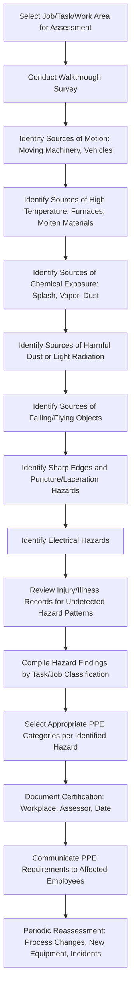

## PPE Hazard Assessment

### Overview

A PPE Hazard Assessment is the systematic, documented process required under OSHA's Personal Protective Equipment standard, 29 CFR 1910.132(d), by which an employer evaluates the workplace to identify hazards that necessitate the use of personal protective equipment. The assessment forms the foundational analytical step that precedes PPE selection, ensuring that protective equipment is matched to actual hazards present rather than selected arbitrarily or based on convention alone.

The hazard assessment must be conducted before PPE is assigned, and OSHA requires that the employer verify the assessment has been performed through a written certification, distinguishing it from informal or undocumented hazard observations.

### Regulatory Basis

- **OSHA 29 CFR 1910.132(d)**: General requirement for hazard assessment and equipment selection applicable across general industry.
- **OSHA 29 CFR 1926.95**: Parallel requirement for the construction industry.
- Substance- and hazard-specific standards (e.g., eye/face protection 1910.133, hand protection 1910.138, head protection 1910.135, foot protection 1910.136) provide additional selection criteria once a hazard assessment identifies relevant exposures.

### Required Elements of a Written Certification

OSHA requires the hazard assessment be documented via a written certification that includes:

1. Identification of the workplace evaluated
2. Name of the person certifying that the evaluation was performed
3. Date(s) of the hazard assessment
4. Identification of the document as a certification of hazard assessment

[Inference] This certification requirement exists specifically to create accountability and a verifiable compliance record, distinguishing a genuine systematic assessment from an employer's general assertion that hazards were considered.

### Hazard Assessment Process



### Hazard Categories to Evaluate

**Key Points**

- **Impact hazards**: Sources of flying objects, falling objects, or moving machinery parts that could strike the head, eyes, or body
- **Penetration hazards**: Sharp objects capable of puncturing skin or footwear (nails, glass, metal shavings)
- **Compression hazards**: Rolling or pinching objects that could crush extremities
- **Chemical hazards**: Splash, spray, or vapor exposure to skin, eyes, or respiratory system
- **Heat/cold hazards**: Sources of thermal burns, cold stress, or hot/cold surface contact
- **Harmful dust**: Airborne particulates posing inhalation or eye contact hazards
- **Light radiation**: Welding arc flash, laser, intense visible light, ultraviolet, or infrared sources
- **Electrical hazards**: Exposed energized parts, arc flash potential, static discharge risk
- **Biological hazards**: Bloodborne pathogens, infectious materials in healthcare or laboratory settings

### Assessment Methodology Techniques

**1. Walkthrough Survey**

- Physical inspection of the work area, observing tasks, equipment, and materials in use
- Should be conducted for each distinct job classification or task, since hazard exposure often varies significantly by role

**2. Review of Injury and Illness Records**

- OSHA 300 logs, near-miss reports, and workers' compensation claims can reveal hazard patterns not evident through observation alone
- May identify hazards that occur infrequently but with significant severity

**3. Task/Job Analysis**

- Breaking down specific job functions into component tasks to identify hazard exposure points unique to each task, rather than assessing only at the general job title level

**4. Employee Input and Interviews**

- Frontline workers often identify hazards that a walkthrough alone may miss, particularly for non-routine or intermittent tasks
- [Inference] Employee interviews can be particularly valuable for identifying near-miss patterns that were never formally documented but represent real hazard exposure

**5. Review of Equipment and Process Documentation**

- Equipment manuals, Safety Data Sheets for materials handled, and process descriptions can reveal hazards not immediately visually apparent

### PPE Hazard-to-Equipment Mapping

| Identified Hazard | Body Region at Risk | Applicable PPE Category |
| --- | --- | --- |
| Flying particles, dust, splash | Eyes/face | Safety glasses, goggles, face shields |
| Falling/overhead objects | Head | Hard hats (Type I/II per ANSI classification) |
| Chemical splash/contact | Skin, hands | Chemical-resistant gloves, aprons, suits |
| Sharp objects, cuts, abrasions | Hands | Cut-resistant or puncture-resistant gloves |
| Compression, falling objects, punctures | Feet | Safety-toe footwear, puncture-resistant soles |
| Electrical arc flash | Full body, face, hands | Arc-rated clothing, insulated gloves, face shields |
| Excessive noise | Hearing | Earplugs, earmuffs |
| Airborne contaminants | Respiratory system | Appropriate respirator class per hazard assessment |
| Falls from height | Whole body | Fall arrest/restraint systems (harness, lanyard) |

### Example: Hazard Assessment for a Machine Shop

A walkthrough survey and task analysis of a CNC machining department identifies the following hazards by task:

1. **Lathe/mill operation**: Flying metal chips and coolant splash — eye/face protection required (safety glasses with side shields or face shield during specific high-speed operations).
2. **Material handling**: Manual lifting of stock and finished parts with sharp edges/burrs — cut-resistant gloves and safety-toe footwear required.
3. **Grinding operations**: Elevated noise levels and airborne particulate — hearing protection and, pending exposure monitoring results, potential respiratory protection.
4. **Overhead crane operations near the work area**: Falling object potential — hard hat zones designated near crane travel paths.
5. **Electrical panel maintenance**: Arc flash potential during energized work — arc-rated PPE per an electrical hazard-specific assessment (arc flash risk assessment, often a distinct specialized analysis).

Each finding is documented in the written hazard assessment certification, specifying the task, hazard identified, and PPE category selected, with the assessment signed and dated by the qualified assessor.

### Reassessment Triggers

A hazard assessment is not a one-time event; reassessment should occur when:

- New equipment, processes, or materials are introduced
- A workplace incident or near-miss reveals an unaddressed hazard
- Employee feedback identifies a hazard not previously captured
- Regulatory standards affecting the hazard category are updated
- Significant changes occur to the physical layout or workflow of the area

### Assessment Documentation Template Structure

**Example structure for a hazard assessment worksheet:**

```plaintext
Workplace/Area: [Specific location or department]
Job Title/Task: [Specific role or task evaluated]
Hazard Identified: [Category and specific source]
Body Part(s) at Risk: [Eyes, hands, feet, head, etc.]
Recommended PPE: [Specific equipment category and standard]
Assessor Name: [Qualified individual conducting assessment]
Date of Assessment: [Date]
Certification Statement: [Confirms assessment was conducted per 1910.132(d)]
```

### Common Hazard Assessment Pitfalls

- Conducting a generic, facility-wide assessment without task-specific granularity, missing hazards unique to particular job functions.
- Failing to produce the required written certification, relying instead on informal or undocumented hazard observations.
- Not reassessing after process changes, new equipment installation, or incidents that reveal previously unaddressed hazards.
- Overlooking intermittent or non-routine tasks (e.g., annual equipment cleaning, maintenance shutdowns) that carry distinct hazard profiles from routine operations.
- Selecting PPE based on convention or employee preference rather than the documented hazard assessment findings.
- Failing to involve employees who perform the actual tasks, missing practical hazard knowledge that a walkthrough alone may not reveal.

### Integration with Broader PPE and Safety Program

- **PPE Selection**: The hazard assessment directly informs which specific PPE categories and performance ratings (e.g., ANSI Z87.1 for eyewear) are required.
- **Training Program**: Identified hazards and selected PPE must be communicated through required PPE training (proper use, limitations, care, and maintenance).
- **Hierarchy of Controls**: PPE selection following hazard assessment represents the last-resort control tier; the assessment process should also prompt consideration of whether engineering or administrative controls could eliminate or reduce the hazard instead.
- **Job Hazard Analysis (JHA)**: PPE hazard assessment often overlaps with or is integrated into broader JHA documentation for a given task.

**Next Steps**

- Personal Protective Equipment Selection and Use
- Job Hazard Analysis Methodology
- Hierarchy of Controls for Health Hazard Mitigation
- Eye and Face Protection Standards (ANSI Z87.1)
- Hand Protection Selection Criteria
- Fall Protection and Fall Arrest Systems